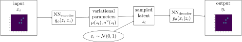
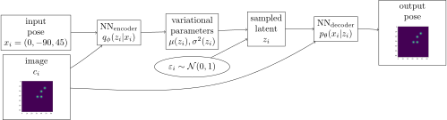

<!DOCTYPE html>
<html>
<head><meta charset="utf-8" />

<title>deepLVM_pose_condtioned_on_images</title>

<style type="text/css">
    /*!
*
* Twitter Bootstrap
*
*/
/*!
 * Bootstrap v3.3.7 (http://getbootstrap.com)
 * Copyright 2011-2016 Twitter, Inc.
 * Licensed under MIT (https://github.com/twbs/bootstrap/blob/master/LICENSE)
 */
/*! normalize.css v3.0.3 | MIT License | github.com/necolas/normalize.css */
html {
  font-family: sans-serif;
  -ms-text-size-adjust: 100%;
  -webkit-text-size-adjust: 100%;
}
body {
  margin: 0;
}
article,
aside,
details,
figcaption,
figure,
footer,
header,
hgroup,
main,
menu,
nav,
section,
summary {
  display: block;
}
audio,
canvas,
progress,
video {
  display: inline-block;
  vertical-align: baseline;
}
audio:not([controls]) {
  display: none;
  height: 0;
}
[hidden],
template {
  display: none;
}
a {
  background-color: transparent;
}
a:active,
a:hover {
  outline: 0;
}
abbr[title] {
  border-bottom: 1px dotted;
}
b,
strong {
  font-weight: bold;
}
dfn {
  font-style: italic;
}
h1 {
  font-size: 2em;
  margin: 0.67em 0;
}
mark {
  background: #ff0;
  color: #000;
}
small {
  font-size: 80%;
}
sub,
sup {
  font-size: 75%;
  line-height: 0;
  position: relative;
  vertical-align: baseline;
}
sup {
  top: -0.5em;
}
sub {
  bottom: -0.25em;
}
img {
  border: 0;
}
svg:not(:root) {
  overflow: hidden;
}
figure {
  margin: 1em 40px;
}
hr {
  box-sizing: content-box;
  height: 0;
}
pre {
  overflow: auto;
}
code,
kbd,
pre,
samp {
  font-family: monospace, monospace;
  font-size: 1em;
}
button,
input,
optgroup,
select,
textarea {
  color: inherit;
  font: inherit;
  margin: 0;
}
button {
  overflow: visible;
}
button,
select {
  text-transform: none;
}
button,
html input[type="button"],
input[type="reset"],
input[type="submit"] {
  -webkit-appearance: button;
  cursor: pointer;
}
button[disabled],
html input[disabled] {
  cursor: default;
}
button::-moz-focus-inner,
input::-moz-focus-inner {
  border: 0;
  padding: 0;
}
input {
  line-height: normal;
}
input[type="checkbox"],
input[type="radio"] {
  box-sizing: border-box;
  padding: 0;
}
input[type="number"]::-webkit-inner-spin-button,
input[type="number"]::-webkit-outer-spin-button {
  height: auto;
}
input[type="search"] {
  -webkit-appearance: textfield;
  box-sizing: content-box;
}
input[type="search"]::-webkit-search-cancel-button,
input[type="search"]::-webkit-search-decoration {
  -webkit-appearance: none;
}
fieldset {
  border: 1px solid #c0c0c0;
  margin: 0 2px;
  padding: 0.35em 0.625em 0.75em;
}
legend {
  border: 0;
  padding: 0;
}
textarea {
  overflow: auto;
}
optgroup {
  font-weight: bold;
}
table {
  border-collapse: collapse;
  border-spacing: 0;
}
td,
th {
  padding: 0;
}
/*! Source: https://github.com/h5bp/html5-boilerplate/blob/master/src/css/main.css */
@media print {
  *,
  *:before,
  *:after {
    background: transparent !important;
    box-shadow: none !important;
    text-shadow: none !important;
  }
  a,
  a:visited {
    text-decoration: underline;
  }
  a[href]:after {
    content: " (" attr(href) ")";
  }
  abbr[title]:after {
    content: " (" attr(title) ")";
  }
  a[href^="#"]:after,
  a[href^="javascript:"]:after {
    content: "";
  }
  pre,
  blockquote {
    border: 1px solid #999;
    page-break-inside: avoid;
  }
  thead {
    display: table-header-group;
  }
  tr,
  img {
    page-break-inside: avoid;
  }
  img {
    max-width: 100% !important;
  }
  p,
  h2,
  h3 {
    orphans: 3;
    widows: 3;
  }
  h2,
  h3 {
    page-break-after: avoid;
  }
  .navbar {
    display: none;
  }
  .btn > .caret,
  .dropup > .btn > .caret {
    border-top-color: #000 !important;
  }
  .label {
    border: 1px solid #000;
  }
  .table {
    border-collapse: collapse !important;
  }
  .table td,
  .table th {
    background-color: #fff !important;
  }
  .table-bordered th,
  .table-bordered td {
    border: 1px solid #ddd !important;
  }
}
@font-face {
  font-family: 'Glyphicons Halflings';
  src: url('../components/bootstrap/fonts/glyphicons-halflings-regular.eot');
  src: url('../components/bootstrap/fonts/glyphicons-halflings-regular.eot?#iefix') format('embedded-opentype'), url('../components/bootstrap/fonts/glyphicons-halflings-regular.woff2') format('woff2'), url('../components/bootstrap/fonts/glyphicons-halflings-regular.woff') format('woff'), url('../components/bootstrap/fonts/glyphicons-halflings-regular.ttf') format('truetype'), url('../components/bootstrap/fonts/glyphicons-halflings-regular.svg#glyphicons_halflingsregular') format('svg');
}
.glyphicon {
  position: relative;
  top: 1px;
  display: inline-block;
  font-family: 'Glyphicons Halflings';
  font-style: normal;
  font-weight: normal;
  line-height: 1;
  -webkit-font-smoothing: antialiased;
  -moz-osx-font-smoothing: grayscale;
}
.glyphicon-asterisk:before {
  content: "\002a";
}
.glyphicon-plus:before {
  content: "\002b";
}
.glyphicon-euro:before,
.glyphicon-eur:before {
  content: "\20ac";
}
.glyphicon-minus:before {
  content: "\2212";
}
.glyphicon-cloud:before {
  content: "\2601";
}
.glyphicon-envelope:before {
  content: "\2709";
}
.glyphicon-pencil:before {
  content: "\270f";
}
.glyphicon-glass:before {
  content: "\e001";
}
.glyphicon-music:before {
  content: "\e002";
}
.glyphicon-search:before {
  content: "\e003";
}
.glyphicon-heart:before {
  content: "\e005";
}
.glyphicon-star:before {
  content: "\e006";
}
.glyphicon-star-empty:before {
  content: "\e007";
}
.glyphicon-user:before {
  content: "\e008";
}
.glyphicon-film:before {
  content: "\e009";
}
.glyphicon-th-large:before {
  content: "\e010";
}
.glyphicon-th:before {
  content: "\e011";
}
.glyphicon-th-list:before {
  content: "\e012";
}
.glyphicon-ok:before {
  content: "\e013";
}
.glyphicon-remove:before {
  content: "\e014";
}
.glyphicon-zoom-in:before {
  content: "\e015";
}
.glyphicon-zoom-out:before {
  content: "\e016";
}
.glyphicon-off:before {
  content: "\e017";
}
.glyphicon-signal:before {
  content: "\e018";
}
.glyphicon-cog:before {
  content: "\e019";
}
.glyphicon-trash:before {
  content: "\e020";
}
.glyphicon-home:before {
  content: "\e021";
}
.glyphicon-file:before {
  content: "\e022";
}
.glyphicon-time:before {
  content: "\e023";
}
.glyphicon-road:before {
  content: "\e024";
}
.glyphicon-download-alt:before {
  content: "\e025";
}
.glyphicon-download:before {
  content: "\e026";
}
.glyphicon-upload:before {
  content: "\e027";
}
.glyphicon-inbox:before {
  content: "\e028";
}
.glyphicon-play-circle:before {
  content: "\e029";
}
.glyphicon-repeat:before {
  content: "\e030";
}
.glyphicon-refresh:before {
  content: "\e031";
}
.glyphicon-list-alt:before {
  content: "\e032";
}
.glyphicon-lock:before {
  content: "\e033";
}
.glyphicon-flag:before {
  content: "\e034";
}
.glyphicon-headphones:before {
  content: "\e035";
}
.glyphicon-volume-off:before {
  content: "\e036";
}
.glyphicon-volume-down:before {
  content: "\e037";
}
.glyphicon-volume-up:before {
  content: "\e038";
}
.glyphicon-qrcode:before {
  content: "\e039";
}
.glyphicon-barcode:before {
  content: "\e040";
}
.glyphicon-tag:before {
  content: "\e041";
}
.glyphicon-tags:before {
  content: "\e042";
}
.glyphicon-book:before {
  content: "\e043";
}
.glyphicon-bookmark:before {
  content: "\e044";
}
.glyphicon-print:before {
  content: "\e045";
}
.glyphicon-camera:before {
  content: "\e046";
}
.glyphicon-font:before {
  content: "\e047";
}
.glyphicon-bold:before {
  content: "\e048";
}
.glyphicon-italic:before {
  content: "\e049";
}
.glyphicon-text-height:before {
  content: "\e050";
}
.glyphicon-text-width:before {
  content: "\e051";
}
.glyphicon-align-left:before {
  content: "\e052";
}
.glyphicon-align-center:before {
  content: "\e053";
}
.glyphicon-align-right:before {
  content: "\e054";
}
.glyphicon-align-justify:before {
  content: "\e055";
}
.glyphicon-list:before {
  content: "\e056";
}
.glyphicon-indent-left:before {
  content: "\e057";
}
.glyphicon-indent-right:before {
  content: "\e058";
}
.glyphicon-facetime-video:before {
  content: "\e059";
}
.glyphicon-picture:before {
  content: "\e060";
}
.glyphicon-map-marker:before {
  content: "\e062";
}
.glyphicon-adjust:before {
  content: "\e063";
}
.glyphicon-tint:before {
  content: "\e064";
}
.glyphicon-edit:before {
  content: "\e065";
}
.glyphicon-share:before {
  content: "\e066";
}
.glyphicon-check:before {
  content: "\e067";
}
.glyphicon-move:before {
  content: "\e068";
}
.glyphicon-step-backward:before {
  content: "\e069";
}
.glyphicon-fast-backward:before {
  content: "\e070";
}
.glyphicon-backward:before {
  content: "\e071";
}
.glyphicon-play:before {
  content: "\e072";
}
.glyphicon-pause:before {
  content: "\e073";
}
.glyphicon-stop:before {
  content: "\e074";
}
.glyphicon-forward:before {
  content: "\e075";
}
.glyphicon-fast-forward:before {
  content: "\e076";
}
.glyphicon-step-forward:before {
  content: "\e077";
}
.glyphicon-eject:before {
  content: "\e078";
}
.glyphicon-chevron-left:before {
  content: "\e079";
}
.glyphicon-chevron-right:before {
  content: "\e080";
}
.glyphicon-plus-sign:before {
  content: "\e081";
}
.glyphicon-minus-sign:before {
  content: "\e082";
}
.glyphicon-remove-sign:before {
  content: "\e083";
}
.glyphicon-ok-sign:before {
  content: "\e084";
}
.glyphicon-question-sign:before {
  content: "\e085";
}
.glyphicon-info-sign:before {
  content: "\e086";
}
.glyphicon-screenshot:before {
  content: "\e087";
}
.glyphicon-remove-circle:before {
  content: "\e088";
}
.glyphicon-ok-circle:before {
  content: "\e089";
}
.glyphicon-ban-circle:before {
  content: "\e090";
}
.glyphicon-arrow-left:before {
  content: "\e091";
}
.glyphicon-arrow-right:before {
  content: "\e092";
}
.glyphicon-arrow-up:before {
  content: "\e093";
}
.glyphicon-arrow-down:before {
  content: "\e094";
}
.glyphicon-share-alt:before {
  content: "\e095";
}
.glyphicon-resize-full:before {
  content: "\e096";
}
.glyphicon-resize-small:before {
  content: "\e097";
}
.glyphicon-exclamation-sign:before {
  content: "\e101";
}
.glyphicon-gift:before {
  content: "\e102";
}
.glyphicon-leaf:before {
  content: "\e103";
}
.glyphicon-fire:before {
  content: "\e104";
}
.glyphicon-eye-open:before {
  content: "\e105";
}
.glyphicon-eye-close:before {
  content: "\e106";
}
.glyphicon-warning-sign:before {
  content: "\e107";
}
.glyphicon-plane:before {
  content: "\e108";
}
.glyphicon-calendar:before {
  content: "\e109";
}
.glyphicon-random:before {
  content: "\e110";
}
.glyphicon-comment:before {
  content: "\e111";
}
.glyphicon-magnet:before {
  content: "\e112";
}
.glyphicon-chevron-up:before {
  content: "\e113";
}
.glyphicon-chevron-down:before {
  content: "\e114";
}
.glyphicon-retweet:before {
  content: "\e115";
}
.glyphicon-shopping-cart:before {
  content: "\e116";
}
.glyphicon-folder-close:before {
  content: "\e117";
}
.glyphicon-folder-open:before {
  content: "\e118";
}
.glyphicon-resize-vertical:before {
  content: "\e119";
}
.glyphicon-resize-horizontal:before {
  content: "\e120";
}
.glyphicon-hdd:before {
  content: "\e121";
}
.glyphicon-bullhorn:before {
  content: "\e122";
}
.glyphicon-bell:before {
  content: "\e123";
}
.glyphicon-certificate:before {
  content: "\e124";
}
.glyphicon-thumbs-up:before {
  content: "\e125";
}
.glyphicon-thumbs-down:before {
  content: "\e126";
}
.glyphicon-hand-right:before {
  content: "\e127";
}
.glyphicon-hand-left:before {
  content: "\e128";
}
.glyphicon-hand-up:before {
  content: "\e129";
}
.glyphicon-hand-down:before {
  content: "\e130";
}
.glyphicon-circle-arrow-right:before {
  content: "\e131";
}
.glyphicon-circle-arrow-left:before {
  content: "\e132";
}
.glyphicon-circle-arrow-up:before {
  content: "\e133";
}
.glyphicon-circle-arrow-down:before {
  content: "\e134";
}
.glyphicon-globe:before {
  content: "\e135";
}
.glyphicon-wrench:before {
  content: "\e136";
}
.glyphicon-tasks:before {
  content: "\e137";
}
.glyphicon-filter:before {
  content: "\e138";
}
.glyphicon-briefcase:before {
  content: "\e139";
}
.glyphicon-fullscreen:before {
  content: "\e140";
}
.glyphicon-dashboard:before {
  content: "\e141";
}
.glyphicon-paperclip:before {
  content: "\e142";
}
.glyphicon-heart-empty:before {
  content: "\e143";
}
.glyphicon-link:before {
  content: "\e144";
}
.glyphicon-phone:before {
  content: "\e145";
}
.glyphicon-pushpin:before {
  content: "\e146";
}
.glyphicon-usd:before {
  content: "\e148";
}
.glyphicon-gbp:before {
  content: "\e149";
}
.glyphicon-sort:before {
  content: "\e150";
}
.glyphicon-sort-by-alphabet:before {
  content: "\e151";
}
.glyphicon-sort-by-alphabet-alt:before {
  content: "\e152";
}
.glyphicon-sort-by-order:before {
  content: "\e153";
}
.glyphicon-sort-by-order-alt:before {
  content: "\e154";
}
.glyphicon-sort-by-attributes:before {
  content: "\e155";
}
.glyphicon-sort-by-attributes-alt:before {
  content: "\e156";
}
.glyphicon-unchecked:before {
  content: "\e157";
}
.glyphicon-expand:before {
  content: "\e158";
}
.glyphicon-collapse-down:before {
  content: "\e159";
}
.glyphicon-collapse-up:before {
  content: "\e160";
}
.glyphicon-log-in:before {
  content: "\e161";
}
.glyphicon-flash:before {
  content: "\e162";
}
.glyphicon-log-out:before {
  content: "\e163";
}
.glyphicon-new-window:before {
  content: "\e164";
}
.glyphicon-record:before {
  content: "\e165";
}
.glyphicon-save:before {
  content: "\e166";
}
.glyphicon-open:before {
  content: "\e167";
}
.glyphicon-saved:before {
  content: "\e168";
}
.glyphicon-import:before {
  content: "\e169";
}
.glyphicon-export:before {
  content: "\e170";
}
.glyphicon-send:before {
  content: "\e171";
}
.glyphicon-floppy-disk:before {
  content: "\e172";
}
.glyphicon-floppy-saved:before {
  content: "\e173";
}
.glyphicon-floppy-remove:before {
  content: "\e174";
}
.glyphicon-floppy-save:before {
  content: "\e175";
}
.glyphicon-floppy-open:before {
  content: "\e176";
}
.glyphicon-credit-card:before {
  content: "\e177";
}
.glyphicon-transfer:before {
  content: "\e178";
}
.glyphicon-cutlery:before {
  content: "\e179";
}
.glyphicon-header:before {
  content: "\e180";
}
.glyphicon-compressed:before {
  content: "\e181";
}
.glyphicon-earphone:before {
  content: "\e182";
}
.glyphicon-phone-alt:before {
  content: "\e183";
}
.glyphicon-tower:before {
  content: "\e184";
}
.glyphicon-stats:before {
  content: "\e185";
}
.glyphicon-sd-video:before {
  content: "\e186";
}
.glyphicon-hd-video:before {
  content: "\e187";
}
.glyphicon-subtitles:before {
  content: "\e188";
}
.glyphicon-sound-stereo:before {
  content: "\e189";
}
.glyphicon-sound-dolby:before {
  content: "\e190";
}
.glyphicon-sound-5-1:before {
  content: "\e191";
}
.glyphicon-sound-6-1:before {
  content: "\e192";
}
.glyphicon-sound-7-1:before {
  content: "\e193";
}
.glyphicon-copyright-mark:before {
  content: "\e194";
}
.glyphicon-registration-mark:before {
  content: "\e195";
}
.glyphicon-cloud-download:before {
  content: "\e197";
}
.glyphicon-cloud-upload:before {
  content: "\e198";
}
.glyphicon-tree-conifer:before {
  content: "\e199";
}
.glyphicon-tree-deciduous:before {
  content: "\e200";
}
.glyphicon-cd:before {
  content: "\e201";
}
.glyphicon-save-file:before {
  content: "\e202";
}
.glyphicon-open-file:before {
  content: "\e203";
}
.glyphicon-level-up:before {
  content: "\e204";
}
.glyphicon-copy:before {
  content: "\e205";
}
.glyphicon-paste:before {
  content: "\e206";
}
.glyphicon-alert:before {
  content: "\e209";
}
.glyphicon-equalizer:before {
  content: "\e210";
}
.glyphicon-king:before {
  content: "\e211";
}
.glyphicon-queen:before {
  content: "\e212";
}
.glyphicon-pawn:before {
  content: "\e213";
}
.glyphicon-bishop:before {
  content: "\e214";
}
.glyphicon-knight:before {
  content: "\e215";
}
.glyphicon-baby-formula:before {
  content: "\e216";
}
.glyphicon-tent:before {
  content: "\26fa";
}
.glyphicon-blackboard:before {
  content: "\e218";
}
.glyphicon-bed:before {
  content: "\e219";
}
.glyphicon-apple:before {
  content: "\f8ff";
}
.glyphicon-erase:before {
  content: "\e221";
}
.glyphicon-hourglass:before {
  content: "\231b";
}
.glyphicon-lamp:before {
  content: "\e223";
}
.glyphicon-duplicate:before {
  content: "\e224";
}
.glyphicon-piggy-bank:before {
  content: "\e225";
}
.glyphicon-scissors:before {
  content: "\e226";
}
.glyphicon-bitcoin:before {
  content: "\e227";
}
.glyphicon-btc:before {
  content: "\e227";
}
.glyphicon-xbt:before {
  content: "\e227";
}
.glyphicon-yen:before {
  content: "\00a5";
}
.glyphicon-jpy:before {
  content: "\00a5";
}
.glyphicon-ruble:before {
  content: "\20bd";
}
.glyphicon-rub:before {
  content: "\20bd";
}
.glyphicon-scale:before {
  content: "\e230";
}
.glyphicon-ice-lolly:before {
  content: "\e231";
}
.glyphicon-ice-lolly-tasted:before {
  content: "\e232";
}
.glyphicon-education:before {
  content: "\e233";
}
.glyphicon-option-horizontal:before {
  content: "\e234";
}
.glyphicon-option-vertical:before {
  content: "\e235";
}
.glyphicon-menu-hamburger:before {
  content: "\e236";
}
.glyphicon-modal-window:before {
  content: "\e237";
}
.glyphicon-oil:before {
  content: "\e238";
}
.glyphicon-grain:before {
  content: "\e239";
}
.glyphicon-sunglasses:before {
  content: "\e240";
}
.glyphicon-text-size:before {
  content: "\e241";
}
.glyphicon-text-color:before {
  content: "\e242";
}
.glyphicon-text-background:before {
  content: "\e243";
}
.glyphicon-object-align-top:before {
  content: "\e244";
}
.glyphicon-object-align-bottom:before {
  content: "\e245";
}
.glyphicon-object-align-horizontal:before {
  content: "\e246";
}
.glyphicon-object-align-left:before {
  content: "\e247";
}
.glyphicon-object-align-vertical:before {
  content: "\e248";
}
.glyphicon-object-align-right:before {
  content: "\e249";
}
.glyphicon-triangle-right:before {
  content: "\e250";
}
.glyphicon-triangle-left:before {
  content: "\e251";
}
.glyphicon-triangle-bottom:before {
  content: "\e252";
}
.glyphicon-triangle-top:before {
  content: "\e253";
}
.glyphicon-console:before {
  content: "\e254";
}
.glyphicon-superscript:before {
  content: "\e255";
}
.glyphicon-subscript:before {
  content: "\e256";
}
.glyphicon-menu-left:before {
  content: "\e257";
}
.glyphicon-menu-right:before {
  content: "\e258";
}
.glyphicon-menu-down:before {
  content: "\e259";
}
.glyphicon-menu-up:before {
  content: "\e260";
}
* {
  -webkit-box-sizing: border-box;
  -moz-box-sizing: border-box;
  box-sizing: border-box;
}
*:before,
*:after {
  -webkit-box-sizing: border-box;
  -moz-box-sizing: border-box;
  box-sizing: border-box;
}
html {
  font-size: 10px;
  -webkit-tap-highlight-color: rgba(0, 0, 0, 0);
}
body {
  font-family: "Helvetica Neue", Helvetica, Arial, sans-serif;
  font-size: 13px;
  line-height: 1.42857143;
  color: #000;
  background-color: #fff;
}
input,
button,
select,
textarea {
  font-family: inherit;
  font-size: inherit;
  line-height: inherit;
}
a {
  color: #337ab7;
  text-decoration: none;
}
a:hover,
a:focus {
  color: #23527c;
  text-decoration: underline;
}
a:focus {
  outline: 5px auto -webkit-focus-ring-color;
  outline-offset: -2px;
}
figure {
  margin: 0;
}
img {
  vertical-align: middle;
}
.img-responsive,
.thumbnail > img,
.thumbnail a > img,
.carousel-inner > .item > img,
.carousel-inner > .item > a > img {
  display: block;
  max-width: 100%;
  height: auto;
}
.img-rounded {
  border-radius: 3px;
}
.img-thumbnail {
  padding: 4px;
  line-height: 1.42857143;
  background-color: #fff;
  border: 1px solid #ddd;
  border-radius: 2px;
  -webkit-transition: all 0.2s ease-in-out;
  -o-transition: all 0.2s ease-in-out;
  transition: all 0.2s ease-in-out;
  display: inline-block;
  max-width: 100%;
  height: auto;
}
.img-circle {
  border-radius: 50%;
}
hr {
  margin-top: 18px;
  margin-bottom: 18px;
  border: 0;
  border-top: 1px solid #eeeeee;
}
.sr-only {
  position: absolute;
  width: 1px;
  height: 1px;
  margin: -1px;
  padding: 0;
  overflow: hidden;
  clip: rect(0, 0, 0, 0);
  border: 0;
}
.sr-only-focusable:active,
.sr-only-focusable:focus {
  position: static;
  width: auto;
  height: auto;
  margin: 0;
  overflow: visible;
  clip: auto;
}
[role="button"] {
  cursor: pointer;
}
h1,
h2,
h3,
h4,
h5,
h6,
.h1,
.h2,
.h3,
.h4,
.h5,
.h6 {
  font-family: inherit;
  font-weight: 500;
  line-height: 1.1;
  color: inherit;
}
h1 small,
h2 small,
h3 small,
h4 small,
h5 small,
h6 small,
.h1 small,
.h2 small,
.h3 small,
.h4 small,
.h5 small,
.h6 small,
h1 .small,
h2 .small,
h3 .small,
h4 .small,
h5 .small,
h6 .small,
.h1 .small,
.h2 .small,
.h3 .small,
.h4 .small,
.h5 .small,
.h6 .small {
  font-weight: normal;
  line-height: 1;
  color: #777777;
}
h1,
.h1,
h2,
.h2,
h3,
.h3 {
  margin-top: 18px;
  margin-bottom: 9px;
}
h1 small,
.h1 small,
h2 small,
.h2 small,
h3 small,
.h3 small,
h1 .small,
.h1 .small,
h2 .small,
.h2 .small,
h3 .small,
.h3 .small {
  font-size: 65%;
}
h4,
.h4,
h5,
.h5,
h6,
.h6 {
  margin-top: 9px;
  margin-bottom: 9px;
}
h4 small,
.h4 small,
h5 small,
.h5 small,
h6 small,
.h6 small,
h4 .small,
.h4 .small,
h5 .small,
.h5 .small,
h6 .small,
.h6 .small {
  font-size: 75%;
}
h1,
.h1 {
  font-size: 33px;
}
h2,
.h2 {
  font-size: 27px;
}
h3,
.h3 {
  font-size: 23px;
}
h4,
.h4 {
  font-size: 17px;
}
h5,
.h5 {
  font-size: 13px;
}
h6,
.h6 {
  font-size: 12px;
}
p {
  margin: 0 0 9px;
}
.lead {
  margin-bottom: 18px;
  font-size: 14px;
  font-weight: 300;
  line-height: 1.4;
}
@media (min-width: 768px) {
  .lead {
    font-size: 19.5px;
  }
}
small,
.small {
  font-size: 92%;
}
mark,
.mark {
  background-color: #fcf8e3;
  padding: .2em;
}
.text-left {
  text-align: left;
}
.text-right {
  text-align: right;
}
.text-center {
  text-align: center;
}
.text-justify {
  text-align: justify;
}
.text-nowrap {
  white-space: nowrap;
}
.text-lowercase {
  text-transform: lowercase;
}
.text-uppercase {
  text-transform: uppercase;
}
.text-capitalize {
  text-transform: capitalize;
}
.text-muted {
  color: #777777;
}
.text-primary {
  color: #337ab7;
}
a.text-primary:hover,
a.text-primary:focus {
  color: #286090;
}
.text-success {
  color: #3c763d;
}
a.text-success:hover,
a.text-success:focus {
  color: #2b542c;
}
.text-info {
  color: #31708f;
}
a.text-info:hover,
a.text-info:focus {
  color: #245269;
}
.text-warning {
  color: #8a6d3b;
}
a.text-warning:hover,
a.text-warning:focus {
  color: #66512c;
}
.text-danger {
  color: #a94442;
}
a.text-danger:hover,
a.text-danger:focus {
  color: #843534;
}
.bg-primary {
  color: #fff;
  background-color: #337ab7;
}
a.bg-primary:hover,
a.bg-primary:focus {
  background-color: #286090;
}
.bg-success {
  background-color: #dff0d8;
}
a.bg-success:hover,
a.bg-success:focus {
  background-color: #c1e2b3;
}
.bg-info {
  background-color: #d9edf7;
}
a.bg-info:hover,
a.bg-info:focus {
  background-color: #afd9ee;
}
.bg-warning {
  background-color: #fcf8e3;
}
a.bg-warning:hover,
a.bg-warning:focus {
  background-color: #f7ecb5;
}
.bg-danger {
  background-color: #f2dede;
}
a.bg-danger:hover,
a.bg-danger:focus {
  background-color: #e4b9b9;
}
.page-header {
  padding-bottom: 8px;
  margin: 36px 0 18px;
  border-bottom: 1px solid #eeeeee;
}
ul,
ol {
  margin-top: 0;
  margin-bottom: 9px;
}
ul ul,
ol ul,
ul ol,
ol ol {
  margin-bottom: 0;
}
.list-unstyled {
  padding-left: 0;
  list-style: none;
}
.list-inline {
  padding-left: 0;
  list-style: none;
  margin-left: -5px;
}
.list-inline > li {
  display: inline-block;
  padding-left: 5px;
  padding-right: 5px;
}
dl {
  margin-top: 0;
  margin-bottom: 18px;
}
dt,
dd {
  line-height: 1.42857143;
}
dt {
  font-weight: bold;
}
dd {
  margin-left: 0;
}
@media (min-width: 541px) {
  .dl-horizontal dt {
    float: left;
    width: 160px;
    clear: left;
    text-align: right;
    overflow: hidden;
    text-overflow: ellipsis;
    white-space: nowrap;
  }
  .dl-horizontal dd {
    margin-left: 180px;
  }
}
abbr[title],
abbr[data-original-title] {
  cursor: help;
  border-bottom: 1px dotted #777777;
}
.initialism {
  font-size: 90%;
  text-transform: uppercase;
}
blockquote {
  padding: 9px 18px;
  margin: 0 0 18px;
  font-size: inherit;
  border-left: 5px solid #eeeeee;
}
blockquote p:last-child,
blockquote ul:last-child,
blockquote ol:last-child {
  margin-bottom: 0;
}
blockquote footer,
blockquote small,
blockquote .small {
  display: block;
  font-size: 80%;
  line-height: 1.42857143;
  color: #777777;
}
blockquote footer:before,
blockquote small:before,
blockquote .small:before {
  content: '\2014 \00A0';
}
.blockquote-reverse,
blockquote.pull-right {
  padding-right: 15px;
  padding-left: 0;
  border-right: 5px solid #eeeeee;
  border-left: 0;
  text-align: right;
}
.blockquote-reverse footer:before,
blockquote.pull-right footer:before,
.blockquote-reverse small:before,
blockquote.pull-right small:before,
.blockquote-reverse .small:before,
blockquote.pull-right .small:before {
  content: '';
}
.blockquote-reverse footer:after,
blockquote.pull-right footer:after,
.blockquote-reverse small:after,
blockquote.pull-right small:after,
.blockquote-reverse .small:after,
blockquote.pull-right .small:after {
  content: '\00A0 \2014';
}
address {
  margin-bottom: 18px;
  font-style: normal;
  line-height: 1.42857143;
}
code,
kbd,
pre,
samp {
  font-family: monospace;
}
code {
  padding: 2px 4px;
  font-size: 90%;
  color: #c7254e;
  background-color: #f9f2f4;
  border-radius: 2px;
}
kbd {
  padding: 2px 4px;
  font-size: 90%;
  color: #888;
  background-color: transparent;
  border-radius: 1px;
  box-shadow: inset 0 -1px 0 rgba(0, 0, 0, 0.25);
}
kbd kbd {
  padding: 0;
  font-size: 100%;
  font-weight: bold;
  box-shadow: none;
}
pre {
  display: block;
  padding: 8.5px;
  margin: 0 0 9px;
  font-size: 12px;
  line-height: 1.42857143;
  word-break: break-all;
  word-wrap: break-word;
  color: #333333;
  background-color: #f5f5f5;
  border: 1px solid #ccc;
  border-radius: 2px;
}
pre code {
  padding: 0;
  font-size: inherit;
  color: inherit;
  white-space: pre-wrap;
  background-color: transparent;
  border-radius: 0;
}
.pre-scrollable {
  max-height: 340px;
  overflow-y: scroll;
}
.container {
  margin-right: auto;
  margin-left: auto;
  padding-left: 0px;
  padding-right: 0px;
}
@media (min-width: 768px) {
  .container {
    width: 768px;
  }
}
@media (min-width: 992px) {
  .container {
    width: 940px;
  }
}
@media (min-width: 1200px) {
  .container {
    width: 1140px;
  }
}
.container-fluid {
  margin-right: auto;
  margin-left: auto;
  padding-left: 0px;
  padding-right: 0px;
}
.row {
  margin-left: 0px;
  margin-right: 0px;
}
.col-xs-1, .col-sm-1, .col-md-1, .col-lg-1, .col-xs-2, .col-sm-2, .col-md-2, .col-lg-2, .col-xs-3, .col-sm-3, .col-md-3, .col-lg-3, .col-xs-4, .col-sm-4, .col-md-4, .col-lg-4, .col-xs-5, .col-sm-5, .col-md-5, .col-lg-5, .col-xs-6, .col-sm-6, .col-md-6, .col-lg-6, .col-xs-7, .col-sm-7, .col-md-7, .col-lg-7, .col-xs-8, .col-sm-8, .col-md-8, .col-lg-8, .col-xs-9, .col-sm-9, .col-md-9, .col-lg-9, .col-xs-10, .col-sm-10, .col-md-10, .col-lg-10, .col-xs-11, .col-sm-11, .col-md-11, .col-lg-11, .col-xs-12, .col-sm-12, .col-md-12, .col-lg-12 {
  position: relative;
  min-height: 1px;
  padding-left: 0px;
  padding-right: 0px;
}
.col-xs-1, .col-xs-2, .col-xs-3, .col-xs-4, .col-xs-5, .col-xs-6, .col-xs-7, .col-xs-8, .col-xs-9, .col-xs-10, .col-xs-11, .col-xs-12 {
  float: left;
}
.col-xs-12 {
  width: 100%;
}
.col-xs-11 {
  width: 91.66666667%;
}
.col-xs-10 {
  width: 83.33333333%;
}
.col-xs-9 {
  width: 75%;
}
.col-xs-8 {
  width: 66.66666667%;
}
.col-xs-7 {
  width: 58.33333333%;
}
.col-xs-6 {
  width: 50%;
}
.col-xs-5 {
  width: 41.66666667%;
}
.col-xs-4 {
  width: 33.33333333%;
}
.col-xs-3 {
  width: 25%;
}
.col-xs-2 {
  width: 16.66666667%;
}
.col-xs-1 {
  width: 8.33333333%;
}
.col-xs-pull-12 {
  right: 100%;
}
.col-xs-pull-11 {
  right: 91.66666667%;
}
.col-xs-pull-10 {
  right: 83.33333333%;
}
.col-xs-pull-9 {
  right: 75%;
}
.col-xs-pull-8 {
  right: 66.66666667%;
}
.col-xs-pull-7 {
  right: 58.33333333%;
}
.col-xs-pull-6 {
  right: 50%;
}
.col-xs-pull-5 {
  right: 41.66666667%;
}
.col-xs-pull-4 {
  right: 33.33333333%;
}
.col-xs-pull-3 {
  right: 25%;
}
.col-xs-pull-2 {
  right: 16.66666667%;
}
.col-xs-pull-1 {
  right: 8.33333333%;
}
.col-xs-pull-0 {
  right: auto;
}
.col-xs-push-12 {
  left: 100%;
}
.col-xs-push-11 {
  left: 91.66666667%;
}
.col-xs-push-10 {
  left: 83.33333333%;
}
.col-xs-push-9 {
  left: 75%;
}
.col-xs-push-8 {
  left: 66.66666667%;
}
.col-xs-push-7 {
  left: 58.33333333%;
}
.col-xs-push-6 {
  left: 50%;
}
.col-xs-push-5 {
  left: 41.66666667%;
}
.col-xs-push-4 {
  left: 33.33333333%;
}
.col-xs-push-3 {
  left: 25%;
}
.col-xs-push-2 {
  left: 16.66666667%;
}
.col-xs-push-1 {
  left: 8.33333333%;
}
.col-xs-push-0 {
  left: auto;
}
.col-xs-offset-12 {
  margin-left: 100%;
}
.col-xs-offset-11 {
  margin-left: 91.66666667%;
}
.col-xs-offset-10 {
  margin-left: 83.33333333%;
}
.col-xs-offset-9 {
  margin-left: 75%;
}
.col-xs-offset-8 {
  margin-left: 66.66666667%;
}
.col-xs-offset-7 {
  margin-left: 58.33333333%;
}
.col-xs-offset-6 {
  margin-left: 50%;
}
.col-xs-offset-5 {
  margin-left: 41.66666667%;
}
.col-xs-offset-4 {
  margin-left: 33.33333333%;
}
.col-xs-offset-3 {
  margin-left: 25%;
}
.col-xs-offset-2 {
  margin-left: 16.66666667%;
}
.col-xs-offset-1 {
  margin-left: 8.33333333%;
}
.col-xs-offset-0 {
  margin-left: 0%;
}
@media (min-width: 768px) {
  .col-sm-1, .col-sm-2, .col-sm-3, .col-sm-4, .col-sm-5, .col-sm-6, .col-sm-7, .col-sm-8, .col-sm-9, .col-sm-10, .col-sm-11, .col-sm-12 {
    float: left;
  }
  .col-sm-12 {
    width: 100%;
  }
  .col-sm-11 {
    width: 91.66666667%;
  }
  .col-sm-10 {
    width: 83.33333333%;
  }
  .col-sm-9 {
    width: 75%;
  }
  .col-sm-8 {
    width: 66.66666667%;
  }
  .col-sm-7 {
    width: 58.33333333%;
  }
  .col-sm-6 {
    width: 50%;
  }
  .col-sm-5 {
    width: 41.66666667%;
  }
  .col-sm-4 {
    width: 33.33333333%;
  }
  .col-sm-3 {
    width: 25%;
  }
  .col-sm-2 {
    width: 16.66666667%;
  }
  .col-sm-1 {
    width: 8.33333333%;
  }
  .col-sm-pull-12 {
    right: 100%;
  }
  .col-sm-pull-11 {
    right: 91.66666667%;
  }
  .col-sm-pull-10 {
    right: 83.33333333%;
  }
  .col-sm-pull-9 {
    right: 75%;
  }
  .col-sm-pull-8 {
    right: 66.66666667%;
  }
  .col-sm-pull-7 {
    right: 58.33333333%;
  }
  .col-sm-pull-6 {
    right: 50%;
  }
  .col-sm-pull-5 {
    right: 41.66666667%;
  }
  .col-sm-pull-4 {
    right: 33.33333333%;
  }
  .col-sm-pull-3 {
    right: 25%;
  }
  .col-sm-pull-2 {
    right: 16.66666667%;
  }
  .col-sm-pull-1 {
    right: 8.33333333%;
  }
  .col-sm-pull-0 {
    right: auto;
  }
  .col-sm-push-12 {
    left: 100%;
  }
  .col-sm-push-11 {
    left: 91.66666667%;
  }
  .col-sm-push-10 {
    left: 83.33333333%;
  }
  .col-sm-push-9 {
    left: 75%;
  }
  .col-sm-push-8 {
    left: 66.66666667%;
  }
  .col-sm-push-7 {
    left: 58.33333333%;
  }
  .col-sm-push-6 {
    left: 50%;
  }
  .col-sm-push-5 {
    left: 41.66666667%;
  }
  .col-sm-push-4 {
    left: 33.33333333%;
  }
  .col-sm-push-3 {
    left: 25%;
  }
  .col-sm-push-2 {
    left: 16.66666667%;
  }
  .col-sm-push-1 {
    left: 8.33333333%;
  }
  .col-sm-push-0 {
    left: auto;
  }
  .col-sm-offset-12 {
    margin-left: 100%;
  }
  .col-sm-offset-11 {
    margin-left: 91.66666667%;
  }
  .col-sm-offset-10 {
    margin-left: 83.33333333%;
  }
  .col-sm-offset-9 {
    margin-left: 75%;
  }
  .col-sm-offset-8 {
    margin-left: 66.66666667%;
  }
  .col-sm-offset-7 {
    margin-left: 58.33333333%;
  }
  .col-sm-offset-6 {
    margin-left: 50%;
  }
  .col-sm-offset-5 {
    margin-left: 41.66666667%;
  }
  .col-sm-offset-4 {
    margin-left: 33.33333333%;
  }
  .col-sm-offset-3 {
    margin-left: 25%;
  }
  .col-sm-offset-2 {
    margin-left: 16.66666667%;
  }
  .col-sm-offset-1 {
    margin-left: 8.33333333%;
  }
  .col-sm-offset-0 {
    margin-left: 0%;
  }
}
@media (min-width: 992px) {
  .col-md-1, .col-md-2, .col-md-3, .col-md-4, .col-md-5, .col-md-6, .col-md-7, .col-md-8, .col-md-9, .col-md-10, .col-md-11, .col-md-12 {
    float: left;
  }
  .col-md-12 {
    width: 100%;
  }
  .col-md-11 {
    width: 91.66666667%;
  }
  .col-md-10 {
    width: 83.33333333%;
  }
  .col-md-9 {
    width: 75%;
  }
  .col-md-8 {
    width: 66.66666667%;
  }
  .col-md-7 {
    width: 58.33333333%;
  }
  .col-md-6 {
    width: 50%;
  }
  .col-md-5 {
    width: 41.66666667%;
  }
  .col-md-4 {
    width: 33.33333333%;
  }
  .col-md-3 {
    width: 25%;
  }
  .col-md-2 {
    width: 16.66666667%;
  }
  .col-md-1 {
    width: 8.33333333%;
  }
  .col-md-pull-12 {
    right: 100%;
  }
  .col-md-pull-11 {
    right: 91.66666667%;
  }
  .col-md-pull-10 {
    right: 83.33333333%;
  }
  .col-md-pull-9 {
    right: 75%;
  }
  .col-md-pull-8 {
    right: 66.66666667%;
  }
  .col-md-pull-7 {
    right: 58.33333333%;
  }
  .col-md-pull-6 {
    right: 50%;
  }
  .col-md-pull-5 {
    right: 41.66666667%;
  }
  .col-md-pull-4 {
    right: 33.33333333%;
  }
  .col-md-pull-3 {
    right: 25%;
  }
  .col-md-pull-2 {
    right: 16.66666667%;
  }
  .col-md-pull-1 {
    right: 8.33333333%;
  }
  .col-md-pull-0 {
    right: auto;
  }
  .col-md-push-12 {
    left: 100%;
  }
  .col-md-push-11 {
    left: 91.66666667%;
  }
  .col-md-push-10 {
    left: 83.33333333%;
  }
  .col-md-push-9 {
    left: 75%;
  }
  .col-md-push-8 {
    left: 66.66666667%;
  }
  .col-md-push-7 {
    left: 58.33333333%;
  }
  .col-md-push-6 {
    left: 50%;
  }
  .col-md-push-5 {
    left: 41.66666667%;
  }
  .col-md-push-4 {
    left: 33.33333333%;
  }
  .col-md-push-3 {
    left: 25%;
  }
  .col-md-push-2 {
    left: 16.66666667%;
  }
  .col-md-push-1 {
    left: 8.33333333%;
  }
  .col-md-push-0 {
    left: auto;
  }
  .col-md-offset-12 {
    margin-left: 100%;
  }
  .col-md-offset-11 {
    margin-left: 91.66666667%;
  }
  .col-md-offset-10 {
    margin-left: 83.33333333%;
  }
  .col-md-offset-9 {
    margin-left: 75%;
  }
  .col-md-offset-8 {
    margin-left: 66.66666667%;
  }
  .col-md-offset-7 {
    margin-left: 58.33333333%;
  }
  .col-md-offset-6 {
    margin-left: 50%;
  }
  .col-md-offset-5 {
    margin-left: 41.66666667%;
  }
  .col-md-offset-4 {
    margin-left: 33.33333333%;
  }
  .col-md-offset-3 {
    margin-left: 25%;
  }
  .col-md-offset-2 {
    margin-left: 16.66666667%;
  }
  .col-md-offset-1 {
    margin-left: 8.33333333%;
  }
  .col-md-offset-0 {
    margin-left: 0%;
  }
}
@media (min-width: 1200px) {
  .col-lg-1, .col-lg-2, .col-lg-3, .col-lg-4, .col-lg-5, .col-lg-6, .col-lg-7, .col-lg-8, .col-lg-9, .col-lg-10, .col-lg-11, .col-lg-12 {
    float: left;
  }
  .col-lg-12 {
    width: 100%;
  }
  .col-lg-11 {
    width: 91.66666667%;
  }
  .col-lg-10 {
    width: 83.33333333%;
  }
  .col-lg-9 {
    width: 75%;
  }
  .col-lg-8 {
    width: 66.66666667%;
  }
  .col-lg-7 {
    width: 58.33333333%;
  }
  .col-lg-6 {
    width: 50%;
  }
  .col-lg-5 {
    width: 41.66666667%;
  }
  .col-lg-4 {
    width: 33.33333333%;
  }
  .col-lg-3 {
    width: 25%;
  }
  .col-lg-2 {
    width: 16.66666667%;
  }
  .col-lg-1 {
    width: 8.33333333%;
  }
  .col-lg-pull-12 {
    right: 100%;
  }
  .col-lg-pull-11 {
    right: 91.66666667%;
  }
  .col-lg-pull-10 {
    right: 83.33333333%;
  }
  .col-lg-pull-9 {
    right: 75%;
  }
  .col-lg-pull-8 {
    right: 66.66666667%;
  }
  .col-lg-pull-7 {
    right: 58.33333333%;
  }
  .col-lg-pull-6 {
    right: 50%;
  }
  .col-lg-pull-5 {
    right: 41.66666667%;
  }
  .col-lg-pull-4 {
    right: 33.33333333%;
  }
  .col-lg-pull-3 {
    right: 25%;
  }
  .col-lg-pull-2 {
    right: 16.66666667%;
  }
  .col-lg-pull-1 {
    right: 8.33333333%;
  }
  .col-lg-pull-0 {
    right: auto;
  }
  .col-lg-push-12 {
    left: 100%;
  }
  .col-lg-push-11 {
    left: 91.66666667%;
  }
  .col-lg-push-10 {
    left: 83.33333333%;
  }
  .col-lg-push-9 {
    left: 75%;
  }
  .col-lg-push-8 {
    left: 66.66666667%;
  }
  .col-lg-push-7 {
    left: 58.33333333%;
  }
  .col-lg-push-6 {
    left: 50%;
  }
  .col-lg-push-5 {
    left: 41.66666667%;
  }
  .col-lg-push-4 {
    left: 33.33333333%;
  }
  .col-lg-push-3 {
    left: 25%;
  }
  .col-lg-push-2 {
    left: 16.66666667%;
  }
  .col-lg-push-1 {
    left: 8.33333333%;
  }
  .col-lg-push-0 {
    left: auto;
  }
  .col-lg-offset-12 {
    margin-left: 100%;
  }
  .col-lg-offset-11 {
    margin-left: 91.66666667%;
  }
  .col-lg-offset-10 {
    margin-left: 83.33333333%;
  }
  .col-lg-offset-9 {
    margin-left: 75%;
  }
  .col-lg-offset-8 {
    margin-left: 66.66666667%;
  }
  .col-lg-offset-7 {
    margin-left: 58.33333333%;
  }
  .col-lg-offset-6 {
    margin-left: 50%;
  }
  .col-lg-offset-5 {
    margin-left: 41.66666667%;
  }
  .col-lg-offset-4 {
    margin-left: 33.33333333%;
  }
  .col-lg-offset-3 {
    margin-left: 25%;
  }
  .col-lg-offset-2 {
    margin-left: 16.66666667%;
  }
  .col-lg-offset-1 {
    margin-left: 8.33333333%;
  }
  .col-lg-offset-0 {
    margin-left: 0%;
  }
}
table {
  background-color: transparent;
}
caption {
  padding-top: 8px;
  padding-bottom: 8px;
  color: #777777;
  text-align: left;
}
th {
  text-align: left;
}
.table {
  width: 100%;
  max-width: 100%;
  margin-bottom: 18px;
}
.table > thead > tr > th,
.table > tbody > tr > th,
.table > tfoot > tr > th,
.table > thead > tr > td,
.table > tbody > tr > td,
.table > tfoot > tr > td {
  padding: 8px;
  line-height: 1.42857143;
  vertical-align: top;
  border-top: 1px solid #ddd;
}
.table > thead > tr > th {
  vertical-align: bottom;
  border-bottom: 2px solid #ddd;
}
.table > caption + thead > tr:first-child > th,
.table > colgroup + thead > tr:first-child > th,
.table > thead:first-child > tr:first-child > th,
.table > caption + thead > tr:first-child > td,
.table > colgroup + thead > tr:first-child > td,
.table > thead:first-child > tr:first-child > td {
  border-top: 0;
}
.table > tbody + tbody {
  border-top: 2px solid #ddd;
}
.table .table {
  background-color: #fff;
}
.table-condensed > thead > tr > th,
.table-condensed > tbody > tr > th,
.table-condensed > tfoot > tr > th,
.table-condensed > thead > tr > td,
.table-condensed > tbody > tr > td,
.table-condensed > tfoot > tr > td {
  padding: 5px;
}
.table-bordered {
  border: 1px solid #ddd;
}
.table-bordered > thead > tr > th,
.table-bordered > tbody > tr > th,
.table-bordered > tfoot > tr > th,
.table-bordered > thead > tr > td,
.table-bordered > tbody > tr > td,
.table-bordered > tfoot > tr > td {
  border: 1px solid #ddd;
}
.table-bordered > thead > tr > th,
.table-bordered > thead > tr > td {
  border-bottom-width: 2px;
}
.table-striped > tbody > tr:nth-of-type(odd) {
  background-color: #f9f9f9;
}
.table-hover > tbody > tr:hover {
  background-color: #f5f5f5;
}
table col[class*="col-"] {
  position: static;
  float: none;
  display: table-column;
}
table td[class*="col-"],
table th[class*="col-"] {
  position: static;
  float: none;
  display: table-cell;
}
.table > thead > tr > td.active,
.table > tbody > tr > td.active,
.table > tfoot > tr > td.active,
.table > thead > tr > th.active,
.table > tbody > tr > th.active,
.table > tfoot > tr > th.active,
.table > thead > tr.active > td,
.table > tbody > tr.active > td,
.table > tfoot > tr.active > td,
.table > thead > tr.active > th,
.table > tbody > tr.active > th,
.table > tfoot > tr.active > th {
  background-color: #f5f5f5;
}
.table-hover > tbody > tr > td.active:hover,
.table-hover > tbody > tr > th.active:hover,
.table-hover > tbody > tr.active:hover > td,
.table-hover > tbody > tr:hover > .active,
.table-hover > tbody > tr.active:hover > th {
  background-color: #e8e8e8;
}
.table > thead > tr > td.success,
.table > tbody > tr > td.success,
.table > tfoot > tr > td.success,
.table > thead > tr > th.success,
.table > tbody > tr > th.success,
.table > tfoot > tr > th.success,
.table > thead > tr.success > td,
.table > tbody > tr.success > td,
.table > tfoot > tr.success > td,
.table > thead > tr.success > th,
.table > tbody > tr.success > th,
.table > tfoot > tr.success > th {
  background-color: #dff0d8;
}
.table-hover > tbody > tr > td.success:hover,
.table-hover > tbody > tr > th.success:hover,
.table-hover > tbody > tr.success:hover > td,
.table-hover > tbody > tr:hover > .success,
.table-hover > tbody > tr.success:hover > th {
  background-color: #d0e9c6;
}
.table > thead > tr > td.info,
.table > tbody > tr > td.info,
.table > tfoot > tr > td.info,
.table > thead > tr > th.info,
.table > tbody > tr > th.info,
.table > tfoot > tr > th.info,
.table > thead > tr.info > td,
.table > tbody > tr.info > td,
.table > tfoot > tr.info > td,
.table > thead > tr.info > th,
.table > tbody > tr.info > th,
.table > tfoot > tr.info > th {
  background-color: #d9edf7;
}
.table-hover > tbody > tr > td.info:hover,
.table-hover > tbody > tr > th.info:hover,
.table-hover > tbody > tr.info:hover > td,
.table-hover > tbody > tr:hover > .info,
.table-hover > tbody > tr.info:hover > th {
  background-color: #c4e3f3;
}
.table > thead > tr > td.warning,
.table > tbody > tr > td.warning,
.table > tfoot > tr > td.warning,
.table > thead > tr > th.warning,
.table > tbody > tr > th.warning,
.table > tfoot > tr > th.warning,
.table > thead > tr.warning > td,
.table > tbody > tr.warning > td,
.table > tfoot > tr.warning > td,
.table > thead > tr.warning > th,
.table > tbody > tr.warning > th,
.table > tfoot > tr.warning > th {
  background-color: #fcf8e3;
}
.table-hover > tbody > tr > td.warning:hover,
.table-hover > tbody > tr > th.warning:hover,
.table-hover > tbody > tr.warning:hover > td,
.table-hover > tbody > tr:hover > .warning,
.table-hover > tbody > tr.warning:hover > th {
  background-color: #faf2cc;
}
.table > thead > tr > td.danger,
.table > tbody > tr > td.danger,
.table > tfoot > tr > td.danger,
.table > thead > tr > th.danger,
.table > tbody > tr > th.danger,
.table > tfoot > tr > th.danger,
.table > thead > tr.danger > td,
.table > tbody > tr.danger > td,
.table > tfoot > tr.danger > td,
.table > thead > tr.danger > th,
.table > tbody > tr.danger > th,
.table > tfoot > tr.danger > th {
  background-color: #f2dede;
}
.table-hover > tbody > tr > td.danger:hover,
.table-hover > tbody > tr > th.danger:hover,
.table-hover > tbody > tr.danger:hover > td,
.table-hover > tbody > tr:hover > .danger,
.table-hover > tbody > tr.danger:hover > th {
  background-color: #ebcccc;
}
.table-responsive {
  overflow-x: auto;
  min-height: 0.01%;
}
@media screen and (max-width: 767px) {
  .table-responsive {
    width: 100%;
    margin-bottom: 13.5px;
    overflow-y: hidden;
    -ms-overflow-style: -ms-autohiding-scrollbar;
    border: 1px solid #ddd;
  }
  .table-responsive > .table {
    margin-bottom: 0;
  }
  .table-responsive > .table > thead > tr > th,
  .table-responsive > .table > tbody > tr > th,
  .table-responsive > .table > tfoot > tr > th,
  .table-responsive > .table > thead > tr > td,
  .table-responsive > .table > tbody > tr > td,
  .table-responsive > .table > tfoot > tr > td {
    white-space: nowrap;
  }
  .table-responsive > .table-bordered {
    border: 0;
  }
  .table-responsive > .table-bordered > thead > tr > th:first-child,
  .table-responsive > .table-bordered > tbody > tr > th:first-child,
  .table-responsive > .table-bordered > tfoot > tr > th:first-child,
  .table-responsive > .table-bordered > thead > tr > td:first-child,
  .table-responsive > .table-bordered > tbody > tr > td:first-child,
  .table-responsive > .table-bordered > tfoot > tr > td:first-child {
    border-left: 0;
  }
  .table-responsive > .table-bordered > thead > tr > th:last-child,
  .table-responsive > .table-bordered > tbody > tr > th:last-child,
  .table-responsive > .table-bordered > tfoot > tr > th:last-child,
  .table-responsive > .table-bordered > thead > tr > td:last-child,
  .table-responsive > .table-bordered > tbody > tr > td:last-child,
  .table-responsive > .table-bordered > tfoot > tr > td:last-child {
    border-right: 0;
  }
  .table-responsive > .table-bordered > tbody > tr:last-child > th,
  .table-responsive > .table-bordered > tfoot > tr:last-child > th,
  .table-responsive > .table-bordered > tbody > tr:last-child > td,
  .table-responsive > .table-bordered > tfoot > tr:last-child > td {
    border-bottom: 0;
  }
}
fieldset {
  padding: 0;
  margin: 0;
  border: 0;
  min-width: 0;
}
legend {
  display: block;
  width: 100%;
  padding: 0;
  margin-bottom: 18px;
  font-size: 19.5px;
  line-height: inherit;
  color: #333333;
  border: 0;
  border-bottom: 1px solid #e5e5e5;
}
label {
  display: inline-block;
  max-width: 100%;
  margin-bottom: 5px;
  font-weight: bold;
}
input[type="search"] {
  -webkit-box-sizing: border-box;
  -moz-box-sizing: border-box;
  box-sizing: border-box;
}
input[type="radio"],
input[type="checkbox"] {
  margin: 4px 0 0;
  margin-top: 1px \9;
  line-height: normal;
}
input[type="file"] {
  display: block;
}
input[type="range"] {
  display: block;
  width: 100%;
}
select[multiple],
select[size] {
  height: auto;
}
input[type="file"]:focus,
input[type="radio"]:focus,
input[type="checkbox"]:focus {
  outline: 5px auto -webkit-focus-ring-color;
  outline-offset: -2px;
}
output {
  display: block;
  padding-top: 7px;
  font-size: 13px;
  line-height: 1.42857143;
  color: #555555;
}
.form-control {
  display: block;
  width: 100%;
  height: 32px;
  padding: 6px 12px;
  font-size: 13px;
  line-height: 1.42857143;
  color: #555555;
  background-color: #fff;
  background-image: none;
  border: 1px solid #ccc;
  border-radius: 2px;
  -webkit-box-shadow: inset 0 1px 1px rgba(0, 0, 0, 0.075);
  box-shadow: inset 0 1px 1px rgba(0, 0, 0, 0.075);
  -webkit-transition: border-color ease-in-out .15s, box-shadow ease-in-out .15s;
  -o-transition: border-color ease-in-out .15s, box-shadow ease-in-out .15s;
  transition: border-color ease-in-out .15s, box-shadow ease-in-out .15s;
}
.form-control:focus {
  border-color: #66afe9;
  outline: 0;
  -webkit-box-shadow: inset 0 1px 1px rgba(0,0,0,.075), 0 0 8px rgba(102, 175, 233, 0.6);
  box-shadow: inset 0 1px 1px rgba(0,0,0,.075), 0 0 8px rgba(102, 175, 233, 0.6);
}
.form-control::-moz-placeholder {
  color: #999;
  opacity: 1;
}
.form-control:-ms-input-placeholder {
  color: #999;
}
.form-control::-webkit-input-placeholder {
  color: #999;
}
.form-control::-ms-expand {
  border: 0;
  background-color: transparent;
}
.form-control[disabled],
.form-control[readonly],
fieldset[disabled] .form-control {
  background-color: #eeeeee;
  opacity: 1;
}
.form-control[disabled],
fieldset[disabled] .form-control {
  cursor: not-allowed;
}
textarea.form-control {
  height: auto;
}
input[type="search"] {
  -webkit-appearance: none;
}
@media screen and (-webkit-min-device-pixel-ratio: 0) {
  input[type="date"].form-control,
  input[type="time"].form-control,
  input[type="datetime-local"].form-control,
  input[type="month"].form-control {
    line-height: 32px;
  }
  input[type="date"].input-sm,
  input[type="time"].input-sm,
  input[type="datetime-local"].input-sm,
  input[type="month"].input-sm,
  .input-group-sm input[type="date"],
  .input-group-sm input[type="time"],
  .input-group-sm input[type="datetime-local"],
  .input-group-sm input[type="month"] {
    line-height: 30px;
  }
  input[type="date"].input-lg,
  input[type="time"].input-lg,
  input[type="datetime-local"].input-lg,
  input[type="month"].input-lg,
  .input-group-lg input[type="date"],
  .input-group-lg input[type="time"],
  .input-group-lg input[type="datetime-local"],
  .input-group-lg input[type="month"] {
    line-height: 45px;
  }
}
.form-group {
  margin-bottom: 15px;
}
.radio,
.checkbox {
  position: relative;
  display: block;
  margin-top: 10px;
  margin-bottom: 10px;
}
.radio label,
.checkbox label {
  min-height: 18px;
  padding-left: 20px;
  margin-bottom: 0;
  font-weight: normal;
  cursor: pointer;
}
.radio input[type="radio"],
.radio-inline input[type="radio"],
.checkbox input[type="checkbox"],
.checkbox-inline input[type="checkbox"] {
  position: absolute;
  margin-left: -20px;
  margin-top: 4px \9;
}
.radio + .radio,
.checkbox + .checkbox {
  margin-top: -5px;
}
.radio-inline,
.checkbox-inline {
  position: relative;
  display: inline-block;
  padding-left: 20px;
  margin-bottom: 0;
  vertical-align: middle;
  font-weight: normal;
  cursor: pointer;
}
.radio-inline + .radio-inline,
.checkbox-inline + .checkbox-inline {
  margin-top: 0;
  margin-left: 10px;
}
input[type="radio"][disabled],
input[type="checkbox"][disabled],
input[type="radio"].disabled,
input[type="checkbox"].disabled,
fieldset[disabled] input[type="radio"],
fieldset[disabled] input[type="checkbox"] {
  cursor: not-allowed;
}
.radio-inline.disabled,
.checkbox-inline.disabled,
fieldset[disabled] .radio-inline,
fieldset[disabled] .checkbox-inline {
  cursor: not-allowed;
}
.radio.disabled label,
.checkbox.disabled label,
fieldset[disabled] .radio label,
fieldset[disabled] .checkbox label {
  cursor: not-allowed;
}
.form-control-static {
  padding-top: 7px;
  padding-bottom: 7px;
  margin-bottom: 0;
  min-height: 31px;
}
.form-control-static.input-lg,
.form-control-static.input-sm {
  padding-left: 0;
  padding-right: 0;
}
.input-sm {
  height: 30px;
  padding: 5px 10px;
  font-size: 12px;
  line-height: 1.5;
  border-radius: 1px;
}
select.input-sm {
  height: 30px;
  line-height: 30px;
}
textarea.input-sm,
select[multiple].input-sm {
  height: auto;
}
.form-group-sm .form-control {
  height: 30px;
  padding: 5px 10px;
  font-size: 12px;
  line-height: 1.5;
  border-radius: 1px;
}
.form-group-sm select.form-control {
  height: 30px;
  line-height: 30px;
}
.form-group-sm textarea.form-control,
.form-group-sm select[multiple].form-control {
  height: auto;
}
.form-group-sm .form-control-static {
  height: 30px;
  min-height: 30px;
  padding: 6px 10px;
  font-size: 12px;
  line-height: 1.5;
}
.input-lg {
  height: 45px;
  padding: 10px 16px;
  font-size: 17px;
  line-height: 1.3333333;
  border-radius: 3px;
}
select.input-lg {
  height: 45px;
  line-height: 45px;
}
textarea.input-lg,
select[multiple].input-lg {
  height: auto;
}
.form-group-lg .form-control {
  height: 45px;
  padding: 10px 16px;
  font-size: 17px;
  line-height: 1.3333333;
  border-radius: 3px;
}
.form-group-lg select.form-control {
  height: 45px;
  line-height: 45px;
}
.form-group-lg textarea.form-control,
.form-group-lg select[multiple].form-control {
  height: auto;
}
.form-group-lg .form-control-static {
  height: 45px;
  min-height: 35px;
  padding: 11px 16px;
  font-size: 17px;
  line-height: 1.3333333;
}
.has-feedback {
  position: relative;
}
.has-feedback .form-control {
  padding-right: 40px;
}
.form-control-feedback {
  position: absolute;
  top: 0;
  right: 0;
  z-index: 2;
  display: block;
  width: 32px;
  height: 32px;
  line-height: 32px;
  text-align: center;
  pointer-events: none;
}
.input-lg + .form-control-feedback,
.input-group-lg + .form-control-feedback,
.form-group-lg .form-control + .form-control-feedback {
  width: 45px;
  height: 45px;
  line-height: 45px;
}
.input-sm + .form-control-feedback,
.input-group-sm + .form-control-feedback,
.form-group-sm .form-control + .form-control-feedback {
  width: 30px;
  height: 30px;
  line-height: 30px;
}
.has-success .help-block,
.has-success .control-label,
.has-success .radio,
.has-success .checkbox,
.has-success .radio-inline,
.has-success .checkbox-inline,
.has-success.radio label,
.has-success.checkbox label,
.has-success.radio-inline label,
.has-success.checkbox-inline label {
  color: #3c763d;
}
.has-success .form-control {
  border-color: #3c763d;
  -webkit-box-shadow: inset 0 1px 1px rgba(0, 0, 0, 0.075);
  box-shadow: inset 0 1px 1px rgba(0, 0, 0, 0.075);
}
.has-success .form-control:focus {
  border-color: #2b542c;
  -webkit-box-shadow: inset 0 1px 1px rgba(0, 0, 0, 0.075), 0 0 6px #67b168;
  box-shadow: inset 0 1px 1px rgba(0, 0, 0, 0.075), 0 0 6px #67b168;
}
.has-success .input-group-addon {
  color: #3c763d;
  border-color: #3c763d;
  background-color: #dff0d8;
}
.has-success .form-control-feedback {
  color: #3c763d;
}
.has-warning .help-block,
.has-warning .control-label,
.has-warning .radio,
.has-warning .checkbox,
.has-warning .radio-inline,
.has-warning .checkbox-inline,
.has-warning.radio label,
.has-warning.checkbox label,
.has-warning.radio-inline label,
.has-warning.checkbox-inline label {
  color: #8a6d3b;
}
.has-warning .form-control {
  border-color: #8a6d3b;
  -webkit-box-shadow: inset 0 1px 1px rgba(0, 0, 0, 0.075);
  box-shadow: inset 0 1px 1px rgba(0, 0, 0, 0.075);
}
.has-warning .form-control:focus {
  border-color: #66512c;
  -webkit-box-shadow: inset 0 1px 1px rgba(0, 0, 0, 0.075), 0 0 6px #c0a16b;
  box-shadow: inset 0 1px 1px rgba(0, 0, 0, 0.075), 0 0 6px #c0a16b;
}
.has-warning .input-group-addon {
  color: #8a6d3b;
  border-color: #8a6d3b;
  background-color: #fcf8e3;
}
.has-warning .form-control-feedback {
  color: #8a6d3b;
}
.has-error .help-block,
.has-error .control-label,
.has-error .radio,
.has-error .checkbox,
.has-error .radio-inline,
.has-error .checkbox-inline,
.has-error.radio label,
.has-error.checkbox label,
.has-error.radio-inline label,
.has-error.checkbox-inline label {
  color: #a94442;
}
.has-error .form-control {
  border-color: #a94442;
  -webkit-box-shadow: inset 0 1px 1px rgba(0, 0, 0, 0.075);
  box-shadow: inset 0 1px 1px rgba(0, 0, 0, 0.075);
}
.has-error .form-control:focus {
  border-color: #843534;
  -webkit-box-shadow: inset 0 1px 1px rgba(0, 0, 0, 0.075), 0 0 6px #ce8483;
  box-shadow: inset 0 1px 1px rgba(0, 0, 0, 0.075), 0 0 6px #ce8483;
}
.has-error .input-group-addon {
  color: #a94442;
  border-color: #a94442;
  background-color: #f2dede;
}
.has-error .form-control-feedback {
  color: #a94442;
}
.has-feedback label ~ .form-control-feedback {
  top: 23px;
}
.has-feedback label.sr-only ~ .form-control-feedback {
  top: 0;
}
.help-block {
  display: block;
  margin-top: 5px;
  margin-bottom: 10px;
  color: #404040;
}
@media (min-width: 768px) {
  .form-inline .form-group {
    display: inline-block;
    margin-bottom: 0;
    vertical-align: middle;
  }
  .form-inline .form-control {
    display: inline-block;
    width: auto;
    vertical-align: middle;
  }
  .form-inline .form-control-static {
    display: inline-block;
  }
  .form-inline .input-group {
    display: inline-table;
    vertical-align: middle;
  }
  .form-inline .input-group .input-group-addon,
  .form-inline .input-group .input-group-btn,
  .form-inline .input-group .form-control {
    width: auto;
  }
  .form-inline .input-group > .form-control {
    width: 100%;
  }
  .form-inline .control-label {
    margin-bottom: 0;
    vertical-align: middle;
  }
  .form-inline .radio,
  .form-inline .checkbox {
    display: inline-block;
    margin-top: 0;
    margin-bottom: 0;
    vertical-align: middle;
  }
  .form-inline .radio label,
  .form-inline .checkbox label {
    padding-left: 0;
  }
  .form-inline .radio input[type="radio"],
  .form-inline .checkbox input[type="checkbox"] {
    position: relative;
    margin-left: 0;
  }
  .form-inline .has-feedback .form-control-feedback {
    top: 0;
  }
}
.form-horizontal .radio,
.form-horizontal .checkbox,
.form-horizontal .radio-inline,
.form-horizontal .checkbox-inline {
  margin-top: 0;
  margin-bottom: 0;
  padding-top: 7px;
}
.form-horizontal .radio,
.form-horizontal .checkbox {
  min-height: 25px;
}
.form-horizontal .form-group {
  margin-left: 0px;
  margin-right: 0px;
}
@media (min-width: 768px) {
  .form-horizontal .control-label {
    text-align: right;
    margin-bottom: 0;
    padding-top: 7px;
  }
}
.form-horizontal .has-feedback .form-control-feedback {
  right: 0px;
}
@media (min-width: 768px) {
  .form-horizontal .form-group-lg .control-label {
    padding-top: 11px;
    font-size: 17px;
  }
}
@media (min-width: 768px) {
  .form-horizontal .form-group-sm .control-label {
    padding-top: 6px;
    font-size: 12px;
  }
}
.btn {
  display: inline-block;
  margin-bottom: 0;
  font-weight: normal;
  text-align: center;
  vertical-align: middle;
  touch-action: manipulation;
  cursor: pointer;
  background-image: none;
  border: 1px solid transparent;
  white-space: nowrap;
  padding: 6px 12px;
  font-size: 13px;
  line-height: 1.42857143;
  border-radius: 2px;
  -webkit-user-select: none;
  -moz-user-select: none;
  -ms-user-select: none;
  user-select: none;
}
.btn:focus,
.btn:active:focus,
.btn.active:focus,
.btn.focus,
.btn:active.focus,
.btn.active.focus {
  outline: 5px auto -webkit-focus-ring-color;
  outline-offset: -2px;
}
.btn:hover,
.btn:focus,
.btn.focus {
  color: #333;
  text-decoration: none;
}
.btn:active,
.btn.active {
  outline: 0;
  background-image: none;
  -webkit-box-shadow: inset 0 3px 5px rgba(0, 0, 0, 0.125);
  box-shadow: inset 0 3px 5px rgba(0, 0, 0, 0.125);
}
.btn.disabled,
.btn[disabled],
fieldset[disabled] .btn {
  cursor: not-allowed;
  opacity: 0.65;
  filter: alpha(opacity=65);
  -webkit-box-shadow: none;
  box-shadow: none;
}
a.btn.disabled,
fieldset[disabled] a.btn {
  pointer-events: none;
}
.btn-default {
  color: #333;
  background-color: #fff;
  border-color: #ccc;
}
.btn-default:focus,
.btn-default.focus {
  color: #333;
  background-color: #e6e6e6;
  border-color: #8c8c8c;
}
.btn-default:hover {
  color: #333;
  background-color: #e6e6e6;
  border-color: #adadad;
}
.btn-default:active,
.btn-default.active,
.open > .dropdown-toggle.btn-default {
  color: #333;
  background-color: #e6e6e6;
  border-color: #adadad;
}
.btn-default:active:hover,
.btn-default.active:hover,
.open > .dropdown-toggle.btn-default:hover,
.btn-default:active:focus,
.btn-default.active:focus,
.open > .dropdown-toggle.btn-default:focus,
.btn-default:active.focus,
.btn-default.active.focus,
.open > .dropdown-toggle.btn-default.focus {
  color: #333;
  background-color: #d4d4d4;
  border-color: #8c8c8c;
}
.btn-default:active,
.btn-default.active,
.open > .dropdown-toggle.btn-default {
  background-image: none;
}
.btn-default.disabled:hover,
.btn-default[disabled]:hover,
fieldset[disabled] .btn-default:hover,
.btn-default.disabled:focus,
.btn-default[disabled]:focus,
fieldset[disabled] .btn-default:focus,
.btn-default.disabled.focus,
.btn-default[disabled].focus,
fieldset[disabled] .btn-default.focus {
  background-color: #fff;
  border-color: #ccc;
}
.btn-default .badge {
  color: #fff;
  background-color: #333;
}
.btn-primary {
  color: #fff;
  background-color: #337ab7;
  border-color: #2e6da4;
}
.btn-primary:focus,
.btn-primary.focus {
  color: #fff;
  background-color: #286090;
  border-color: #122b40;
}
.btn-primary:hover {
  color: #fff;
  background-color: #286090;
  border-color: #204d74;
}
.btn-primary:active,
.btn-primary.active,
.open > .dropdown-toggle.btn-primary {
  color: #fff;
  background-color: #286090;
  border-color: #204d74;
}
.btn-primary:active:hover,
.btn-primary.active:hover,
.open > .dropdown-toggle.btn-primary:hover,
.btn-primary:active:focus,
.btn-primary.active:focus,
.open > .dropdown-toggle.btn-primary:focus,
.btn-primary:active.focus,
.btn-primary.active.focus,
.open > .dropdown-toggle.btn-primary.focus {
  color: #fff;
  background-color: #204d74;
  border-color: #122b40;
}
.btn-primary:active,
.btn-primary.active,
.open > .dropdown-toggle.btn-primary {
  background-image: none;
}
.btn-primary.disabled:hover,
.btn-primary[disabled]:hover,
fieldset[disabled] .btn-primary:hover,
.btn-primary.disabled:focus,
.btn-primary[disabled]:focus,
fieldset[disabled] .btn-primary:focus,
.btn-primary.disabled.focus,
.btn-primary[disabled].focus,
fieldset[disabled] .btn-primary.focus {
  background-color: #337ab7;
  border-color: #2e6da4;
}
.btn-primary .badge {
  color: #337ab7;
  background-color: #fff;
}
.btn-success {
  color: #fff;
  background-color: #5cb85c;
  border-color: #4cae4c;
}
.btn-success:focus,
.btn-success.focus {
  color: #fff;
  background-color: #449d44;
  border-color: #255625;
}
.btn-success:hover {
  color: #fff;
  background-color: #449d44;
  border-color: #398439;
}
.btn-success:active,
.btn-success.active,
.open > .dropdown-toggle.btn-success {
  color: #fff;
  background-color: #449d44;
  border-color: #398439;
}
.btn-success:active:hover,
.btn-success.active:hover,
.open > .dropdown-toggle.btn-success:hover,
.btn-success:active:focus,
.btn-success.active:focus,
.open > .dropdown-toggle.btn-success:focus,
.btn-success:active.focus,
.btn-success.active.focus,
.open > .dropdown-toggle.btn-success.focus {
  color: #fff;
  background-color: #398439;
  border-color: #255625;
}
.btn-success:active,
.btn-success.active,
.open > .dropdown-toggle.btn-success {
  background-image: none;
}
.btn-success.disabled:hover,
.btn-success[disabled]:hover,
fieldset[disabled] .btn-success:hover,
.btn-success.disabled:focus,
.btn-success[disabled]:focus,
fieldset[disabled] .btn-success:focus,
.btn-success.disabled.focus,
.btn-success[disabled].focus,
fieldset[disabled] .btn-success.focus {
  background-color: #5cb85c;
  border-color: #4cae4c;
}
.btn-success .badge {
  color: #5cb85c;
  background-color: #fff;
}
.btn-info {
  color: #fff;
  background-color: #5bc0de;
  border-color: #46b8da;
}
.btn-info:focus,
.btn-info.focus {
  color: #fff;
  background-color: #31b0d5;
  border-color: #1b6d85;
}
.btn-info:hover {
  color: #fff;
  background-color: #31b0d5;
  border-color: #269abc;
}
.btn-info:active,
.btn-info.active,
.open > .dropdown-toggle.btn-info {
  color: #fff;
  background-color: #31b0d5;
  border-color: #269abc;
}
.btn-info:active:hover,
.btn-info.active:hover,
.open > .dropdown-toggle.btn-info:hover,
.btn-info:active:focus,
.btn-info.active:focus,
.open > .dropdown-toggle.btn-info:focus,
.btn-info:active.focus,
.btn-info.active.focus,
.open > .dropdown-toggle.btn-info.focus {
  color: #fff;
  background-color: #269abc;
  border-color: #1b6d85;
}
.btn-info:active,
.btn-info.active,
.open > .dropdown-toggle.btn-info {
  background-image: none;
}
.btn-info.disabled:hover,
.btn-info[disabled]:hover,
fieldset[disabled] .btn-info:hover,
.btn-info.disabled:focus,
.btn-info[disabled]:focus,
fieldset[disabled] .btn-info:focus,
.btn-info.disabled.focus,
.btn-info[disabled].focus,
fieldset[disabled] .btn-info.focus {
  background-color: #5bc0de;
  border-color: #46b8da;
}
.btn-info .badge {
  color: #5bc0de;
  background-color: #fff;
}
.btn-warning {
  color: #fff;
  background-color: #f0ad4e;
  border-color: #eea236;
}
.btn-warning:focus,
.btn-warning.focus {
  color: #fff;
  background-color: #ec971f;
  border-color: #985f0d;
}
.btn-warning:hover {
  color: #fff;
  background-color: #ec971f;
  border-color: #d58512;
}
.btn-warning:active,
.btn-warning.active,
.open > .dropdown-toggle.btn-warning {
  color: #fff;
  background-color: #ec971f;
  border-color: #d58512;
}
.btn-warning:active:hover,
.btn-warning.active:hover,
.open > .dropdown-toggle.btn-warning:hover,
.btn-warning:active:focus,
.btn-warning.active:focus,
.open > .dropdown-toggle.btn-warning:focus,
.btn-warning:active.focus,
.btn-warning.active.focus,
.open > .dropdown-toggle.btn-warning.focus {
  color: #fff;
  background-color: #d58512;
  border-color: #985f0d;
}
.btn-warning:active,
.btn-warning.active,
.open > .dropdown-toggle.btn-warning {
  background-image: none;
}
.btn-warning.disabled:hover,
.btn-warning[disabled]:hover,
fieldset[disabled] .btn-warning:hover,
.btn-warning.disabled:focus,
.btn-warning[disabled]:focus,
fieldset[disabled] .btn-warning:focus,
.btn-warning.disabled.focus,
.btn-warning[disabled].focus,
fieldset[disabled] .btn-warning.focus {
  background-color: #f0ad4e;
  border-color: #eea236;
}
.btn-warning .badge {
  color: #f0ad4e;
  background-color: #fff;
}
.btn-danger {
  color: #fff;
  background-color: #d9534f;
  border-color: #d43f3a;
}
.btn-danger:focus,
.btn-danger.focus {
  color: #fff;
  background-color: #c9302c;
  border-color: #761c19;
}
.btn-danger:hover {
  color: #fff;
  background-color: #c9302c;
  border-color: #ac2925;
}
.btn-danger:active,
.btn-danger.active,
.open > .dropdown-toggle.btn-danger {
  color: #fff;
  background-color: #c9302c;
  border-color: #ac2925;
}
.btn-danger:active:hover,
.btn-danger.active:hover,
.open > .dropdown-toggle.btn-danger:hover,
.btn-danger:active:focus,
.btn-danger.active:focus,
.open > .dropdown-toggle.btn-danger:focus,
.btn-danger:active.focus,
.btn-danger.active.focus,
.open > .dropdown-toggle.btn-danger.focus {
  color: #fff;
  background-color: #ac2925;
  border-color: #761c19;
}
.btn-danger:active,
.btn-danger.active,
.open > .dropdown-toggle.btn-danger {
  background-image: none;
}
.btn-danger.disabled:hover,
.btn-danger[disabled]:hover,
fieldset[disabled] .btn-danger:hover,
.btn-danger.disabled:focus,
.btn-danger[disabled]:focus,
fieldset[disabled] .btn-danger:focus,
.btn-danger.disabled.focus,
.btn-danger[disabled].focus,
fieldset[disabled] .btn-danger.focus {
  background-color: #d9534f;
  border-color: #d43f3a;
}
.btn-danger .badge {
  color: #d9534f;
  background-color: #fff;
}
.btn-link {
  color: #337ab7;
  font-weight: normal;
  border-radius: 0;
}
.btn-link,
.btn-link:active,
.btn-link.active,
.btn-link[disabled],
fieldset[disabled] .btn-link {
  background-color: transparent;
  -webkit-box-shadow: none;
  box-shadow: none;
}
.btn-link,
.btn-link:hover,
.btn-link:focus,
.btn-link:active {
  border-color: transparent;
}
.btn-link:hover,
.btn-link:focus {
  color: #23527c;
  text-decoration: underline;
  background-color: transparent;
}
.btn-link[disabled]:hover,
fieldset[disabled] .btn-link:hover,
.btn-link[disabled]:focus,
fieldset[disabled] .btn-link:focus {
  color: #777777;
  text-decoration: none;
}
.btn-lg,
.btn-group-lg > .btn {
  padding: 10px 16px;
  font-size: 17px;
  line-height: 1.3333333;
  border-radius: 3px;
}
.btn-sm,
.btn-group-sm > .btn {
  padding: 5px 10px;
  font-size: 12px;
  line-height: 1.5;
  border-radius: 1px;
}
.btn-xs,
.btn-group-xs > .btn {
  padding: 1px 5px;
  font-size: 12px;
  line-height: 1.5;
  border-radius: 1px;
}
.btn-block {
  display: block;
  width: 100%;
}
.btn-block + .btn-block {
  margin-top: 5px;
}
input[type="submit"].btn-block,
input[type="reset"].btn-block,
input[type="button"].btn-block {
  width: 100%;
}
.fade {
  opacity: 0;
  -webkit-transition: opacity 0.15s linear;
  -o-transition: opacity 0.15s linear;
  transition: opacity 0.15s linear;
}
.fade.in {
  opacity: 1;
}
.collapse {
  display: none;
}
.collapse.in {
  display: block;
}
tr.collapse.in {
  display: table-row;
}
tbody.collapse.in {
  display: table-row-group;
}
.collapsing {
  position: relative;
  height: 0;
  overflow: hidden;
  -webkit-transition-property: height, visibility;
  transition-property: height, visibility;
  -webkit-transition-duration: 0.35s;
  transition-duration: 0.35s;
  -webkit-transition-timing-function: ease;
  transition-timing-function: ease;
}
.caret {
  display: inline-block;
  width: 0;
  height: 0;
  margin-left: 2px;
  vertical-align: middle;
  border-top: 4px dashed;
  border-top: 4px solid \9;
  border-right: 4px solid transparent;
  border-left: 4px solid transparent;
}
.dropup,
.dropdown {
  position: relative;
}
.dropdown-toggle:focus {
  outline: 0;
}
.dropdown-menu {
  position: absolute;
  top: 100%;
  left: 0;
  z-index: 1000;
  display: none;
  float: left;
  min-width: 160px;
  padding: 5px 0;
  margin: 2px 0 0;
  list-style: none;
  font-size: 13px;
  text-align: left;
  background-color: #fff;
  border: 1px solid #ccc;
  border: 1px solid rgba(0, 0, 0, 0.15);
  border-radius: 2px;
  -webkit-box-shadow: 0 6px 12px rgba(0, 0, 0, 0.175);
  box-shadow: 0 6px 12px rgba(0, 0, 0, 0.175);
  background-clip: padding-box;
}
.dropdown-menu.pull-right {
  right: 0;
  left: auto;
}
.dropdown-menu .divider {
  height: 1px;
  margin: 8px 0;
  overflow: hidden;
  background-color: #e5e5e5;
}
.dropdown-menu > li > a {
  display: block;
  padding: 3px 20px;
  clear: both;
  font-weight: normal;
  line-height: 1.42857143;
  color: #333333;
  white-space: nowrap;
}
.dropdown-menu > li > a:hover,
.dropdown-menu > li > a:focus {
  text-decoration: none;
  color: #262626;
  background-color: #f5f5f5;
}
.dropdown-menu > .active > a,
.dropdown-menu > .active > a:hover,
.dropdown-menu > .active > a:focus {
  color: #fff;
  text-decoration: none;
  outline: 0;
  background-color: #337ab7;
}
.dropdown-menu > .disabled > a,
.dropdown-menu > .disabled > a:hover,
.dropdown-menu > .disabled > a:focus {
  color: #777777;
}
.dropdown-menu > .disabled > a:hover,
.dropdown-menu > .disabled > a:focus {
  text-decoration: none;
  background-color: transparent;
  background-image: none;
  filter: progid:DXImageTransform.Microsoft.gradient(enabled = false);
  cursor: not-allowed;
}
.open > .dropdown-menu {
  display: block;
}
.open > a {
  outline: 0;
}
.dropdown-menu-right {
  left: auto;
  right: 0;
}
.dropdown-menu-left {
  left: 0;
  right: auto;
}
.dropdown-header {
  display: block;
  padding: 3px 20px;
  font-size: 12px;
  line-height: 1.42857143;
  color: #777777;
  white-space: nowrap;
}
.dropdown-backdrop {
  position: fixed;
  left: 0;
  right: 0;
  bottom: 0;
  top: 0;
  z-index: 990;
}
.pull-right > .dropdown-menu {
  right: 0;
  left: auto;
}
.dropup .caret,
.navbar-fixed-bottom .dropdown .caret {
  border-top: 0;
  border-bottom: 4px dashed;
  border-bottom: 4px solid \9;
  content: "";
}
.dropup .dropdown-menu,
.navbar-fixed-bottom .dropdown .dropdown-menu {
  top: auto;
  bottom: 100%;
  margin-bottom: 2px;
}
@media (min-width: 541px) {
  .navbar-right .dropdown-menu {
    left: auto;
    right: 0;
  }
  .navbar-right .dropdown-menu-left {
    left: 0;
    right: auto;
  }
}
.btn-group,
.btn-group-vertical {
  position: relative;
  display: inline-block;
  vertical-align: middle;
}
.btn-group > .btn,
.btn-group-vertical > .btn {
  position: relative;
  float: left;
}
.btn-group > .btn:hover,
.btn-group-vertical > .btn:hover,
.btn-group > .btn:focus,
.btn-group-vertical > .btn:focus,
.btn-group > .btn:active,
.btn-group-vertical > .btn:active,
.btn-group > .btn.active,
.btn-group-vertical > .btn.active {
  z-index: 2;
}
.btn-group .btn + .btn,
.btn-group .btn + .btn-group,
.btn-group .btn-group + .btn,
.btn-group .btn-group + .btn-group {
  margin-left: -1px;
}
.btn-toolbar {
  margin-left: -5px;
}
.btn-toolbar .btn,
.btn-toolbar .btn-group,
.btn-toolbar .input-group {
  float: left;
}
.btn-toolbar > .btn,
.btn-toolbar > .btn-group,
.btn-toolbar > .input-group {
  margin-left: 5px;
}
.btn-group > .btn:not(:first-child):not(:last-child):not(.dropdown-toggle) {
  border-radius: 0;
}
.btn-group > .btn:first-child {
  margin-left: 0;
}
.btn-group > .btn:first-child:not(:last-child):not(.dropdown-toggle) {
  border-bottom-right-radius: 0;
  border-top-right-radius: 0;
}
.btn-group > .btn:last-child:not(:first-child),
.btn-group > .dropdown-toggle:not(:first-child) {
  border-bottom-left-radius: 0;
  border-top-left-radius: 0;
}
.btn-group > .btn-group {
  float: left;
}
.btn-group > .btn-group:not(:first-child):not(:last-child) > .btn {
  border-radius: 0;
}
.btn-group > .btn-group:first-child:not(:last-child) > .btn:last-child,
.btn-group > .btn-group:first-child:not(:last-child) > .dropdown-toggle {
  border-bottom-right-radius: 0;
  border-top-right-radius: 0;
}
.btn-group > .btn-group:last-child:not(:first-child) > .btn:first-child {
  border-bottom-left-radius: 0;
  border-top-left-radius: 0;
}
.btn-group .dropdown-toggle:active,
.btn-group.open .dropdown-toggle {
  outline: 0;
}
.btn-group > .btn + .dropdown-toggle {
  padding-left: 8px;
  padding-right: 8px;
}
.btn-group > .btn-lg + .dropdown-toggle {
  padding-left: 12px;
  padding-right: 12px;
}
.btn-group.open .dropdown-toggle {
  -webkit-box-shadow: inset 0 3px 5px rgba(0, 0, 0, 0.125);
  box-shadow: inset 0 3px 5px rgba(0, 0, 0, 0.125);
}
.btn-group.open .dropdown-toggle.btn-link {
  -webkit-box-shadow: none;
  box-shadow: none;
}
.btn .caret {
  margin-left: 0;
}
.btn-lg .caret {
  border-width: 5px 5px 0;
  border-bottom-width: 0;
}
.dropup .btn-lg .caret {
  border-width: 0 5px 5px;
}
.btn-group-vertical > .btn,
.btn-group-vertical > .btn-group,
.btn-group-vertical > .btn-group > .btn {
  display: block;
  float: none;
  width: 100%;
  max-width: 100%;
}
.btn-group-vertical > .btn-group > .btn {
  float: none;
}
.btn-group-vertical > .btn + .btn,
.btn-group-vertical > .btn + .btn-group,
.btn-group-vertical > .btn-group + .btn,
.btn-group-vertical > .btn-group + .btn-group {
  margin-top: -1px;
  margin-left: 0;
}
.btn-group-vertical > .btn:not(:first-child):not(:last-child) {
  border-radius: 0;
}
.btn-group-vertical > .btn:first-child:not(:last-child) {
  border-top-right-radius: 2px;
  border-top-left-radius: 2px;
  border-bottom-right-radius: 0;
  border-bottom-left-radius: 0;
}
.btn-group-vertical > .btn:last-child:not(:first-child) {
  border-top-right-radius: 0;
  border-top-left-radius: 0;
  border-bottom-right-radius: 2px;
  border-bottom-left-radius: 2px;
}
.btn-group-vertical > .btn-group:not(:first-child):not(:last-child) > .btn {
  border-radius: 0;
}
.btn-group-vertical > .btn-group:first-child:not(:last-child) > .btn:last-child,
.btn-group-vertical > .btn-group:first-child:not(:last-child) > .dropdown-toggle {
  border-bottom-right-radius: 0;
  border-bottom-left-radius: 0;
}
.btn-group-vertical > .btn-group:last-child:not(:first-child) > .btn:first-child {
  border-top-right-radius: 0;
  border-top-left-radius: 0;
}
.btn-group-justified {
  display: table;
  width: 100%;
  table-layout: fixed;
  border-collapse: separate;
}
.btn-group-justified > .btn,
.btn-group-justified > .btn-group {
  float: none;
  display: table-cell;
  width: 1%;
}
.btn-group-justified > .btn-group .btn {
  width: 100%;
}
.btn-group-justified > .btn-group .dropdown-menu {
  left: auto;
}
[data-toggle="buttons"] > .btn input[type="radio"],
[data-toggle="buttons"] > .btn-group > .btn input[type="radio"],
[data-toggle="buttons"] > .btn input[type="checkbox"],
[data-toggle="buttons"] > .btn-group > .btn input[type="checkbox"] {
  position: absolute;
  clip: rect(0, 0, 0, 0);
  pointer-events: none;
}
.input-group {
  position: relative;
  display: table;
  border-collapse: separate;
}
.input-group[class*="col-"] {
  float: none;
  padding-left: 0;
  padding-right: 0;
}
.input-group .form-control {
  position: relative;
  z-index: 2;
  float: left;
  width: 100%;
  margin-bottom: 0;
}
.input-group .form-control:focus {
  z-index: 3;
}
.input-group-lg > .form-control,
.input-group-lg > .input-group-addon,
.input-group-lg > .input-group-btn > .btn {
  height: 45px;
  padding: 10px 16px;
  font-size: 17px;
  line-height: 1.3333333;
  border-radius: 3px;
}
select.input-group-lg > .form-control,
select.input-group-lg > .input-group-addon,
select.input-group-lg > .input-group-btn > .btn {
  height: 45px;
  line-height: 45px;
}
textarea.input-group-lg > .form-control,
textarea.input-group-lg > .input-group-addon,
textarea.input-group-lg > .input-group-btn > .btn,
select[multiple].input-group-lg > .form-control,
select[multiple].input-group-lg > .input-group-addon,
select[multiple].input-group-lg > .input-group-btn > .btn {
  height: auto;
}
.input-group-sm > .form-control,
.input-group-sm > .input-group-addon,
.input-group-sm > .input-group-btn > .btn {
  height: 30px;
  padding: 5px 10px;
  font-size: 12px;
  line-height: 1.5;
  border-radius: 1px;
}
select.input-group-sm > .form-control,
select.input-group-sm > .input-group-addon,
select.input-group-sm > .input-group-btn > .btn {
  height: 30px;
  line-height: 30px;
}
textarea.input-group-sm > .form-control,
textarea.input-group-sm > .input-group-addon,
textarea.input-group-sm > .input-group-btn > .btn,
select[multiple].input-group-sm > .form-control,
select[multiple].input-group-sm > .input-group-addon,
select[multiple].input-group-sm > .input-group-btn > .btn {
  height: auto;
}
.input-group-addon,
.input-group-btn,
.input-group .form-control {
  display: table-cell;
}
.input-group-addon:not(:first-child):not(:last-child),
.input-group-btn:not(:first-child):not(:last-child),
.input-group .form-control:not(:first-child):not(:last-child) {
  border-radius: 0;
}
.input-group-addon,
.input-group-btn {
  width: 1%;
  white-space: nowrap;
  vertical-align: middle;
}
.input-group-addon {
  padding: 6px 12px;
  font-size: 13px;
  font-weight: normal;
  line-height: 1;
  color: #555555;
  text-align: center;
  background-color: #eeeeee;
  border: 1px solid #ccc;
  border-radius: 2px;
}
.input-group-addon.input-sm {
  padding: 5px 10px;
  font-size: 12px;
  border-radius: 1px;
}
.input-group-addon.input-lg {
  padding: 10px 16px;
  font-size: 17px;
  border-radius: 3px;
}
.input-group-addon input[type="radio"],
.input-group-addon input[type="checkbox"] {
  margin-top: 0;
}
.input-group .form-control:first-child,
.input-group-addon:first-child,
.input-group-btn:first-child > .btn,
.input-group-btn:first-child > .btn-group > .btn,
.input-group-btn:first-child > .dropdown-toggle,
.input-group-btn:last-child > .btn:not(:last-child):not(.dropdown-toggle),
.input-group-btn:last-child > .btn-group:not(:last-child) > .btn {
  border-bottom-right-radius: 0;
  border-top-right-radius: 0;
}
.input-group-addon:first-child {
  border-right: 0;
}
.input-group .form-control:last-child,
.input-group-addon:last-child,
.input-group-btn:last-child > .btn,
.input-group-btn:last-child > .btn-group > .btn,
.input-group-btn:last-child > .dropdown-toggle,
.input-group-btn:first-child > .btn:not(:first-child),
.input-group-btn:first-child > .btn-group:not(:first-child) > .btn {
  border-bottom-left-radius: 0;
  border-top-left-radius: 0;
}
.input-group-addon:last-child {
  border-left: 0;
}
.input-group-btn {
  position: relative;
  font-size: 0;
  white-space: nowrap;
}
.input-group-btn > .btn {
  position: relative;
}
.input-group-btn > .btn + .btn {
  margin-left: -1px;
}
.input-group-btn > .btn:hover,
.input-group-btn > .btn:focus,
.input-group-btn > .btn:active {
  z-index: 2;
}
.input-group-btn:first-child > .btn,
.input-group-btn:first-child > .btn-group {
  margin-right: -1px;
}
.input-group-btn:last-child > .btn,
.input-group-btn:last-child > .btn-group {
  z-index: 2;
  margin-left: -1px;
}
.nav {
  margin-bottom: 0;
  padding-left: 0;
  list-style: none;
}
.nav > li {
  position: relative;
  display: block;
}
.nav > li > a {
  position: relative;
  display: block;
  padding: 10px 15px;
}
.nav > li > a:hover,
.nav > li > a:focus {
  text-decoration: none;
  background-color: #eeeeee;
}
.nav > li.disabled > a {
  color: #777777;
}
.nav > li.disabled > a:hover,
.nav > li.disabled > a:focus {
  color: #777777;
  text-decoration: none;
  background-color: transparent;
  cursor: not-allowed;
}
.nav .open > a,
.nav .open > a:hover,
.nav .open > a:focus {
  background-color: #eeeeee;
  border-color: #337ab7;
}
.nav .nav-divider {
  height: 1px;
  margin: 8px 0;
  overflow: hidden;
  background-color: #e5e5e5;
}
.nav > li > a > img {
  max-width: none;
}
.nav-tabs {
  border-bottom: 1px solid #ddd;
}
.nav-tabs > li {
  float: left;
  margin-bottom: -1px;
}
.nav-tabs > li > a {
  margin-right: 2px;
  line-height: 1.42857143;
  border: 1px solid transparent;
  border-radius: 2px 2px 0 0;
}
.nav-tabs > li > a:hover {
  border-color: #eeeeee #eeeeee #ddd;
}
.nav-tabs > li.active > a,
.nav-tabs > li.active > a:hover,
.nav-tabs > li.active > a:focus {
  color: #555555;
  background-color: #fff;
  border: 1px solid #ddd;
  border-bottom-color: transparent;
  cursor: default;
}
.nav-tabs.nav-justified {
  width: 100%;
  border-bottom: 0;
}
.nav-tabs.nav-justified > li {
  float: none;
}
.nav-tabs.nav-justified > li > a {
  text-align: center;
  margin-bottom: 5px;
}
.nav-tabs.nav-justified > .dropdown .dropdown-menu {
  top: auto;
  left: auto;
}
@media (min-width: 768px) {
  .nav-tabs.nav-justified > li {
    display: table-cell;
    width: 1%;
  }
  .nav-tabs.nav-justified > li > a {
    margin-bottom: 0;
  }
}
.nav-tabs.nav-justified > li > a {
  margin-right: 0;
  border-radius: 2px;
}
.nav-tabs.nav-justified > .active > a,
.nav-tabs.nav-justified > .active > a:hover,
.nav-tabs.nav-justified > .active > a:focus {
  border: 1px solid #ddd;
}
@media (min-width: 768px) {
  .nav-tabs.nav-justified > li > a {
    border-bottom: 1px solid #ddd;
    border-radius: 2px 2px 0 0;
  }
  .nav-tabs.nav-justified > .active > a,
  .nav-tabs.nav-justified > .active > a:hover,
  .nav-tabs.nav-justified > .active > a:focus {
    border-bottom-color: #fff;
  }
}
.nav-pills > li {
  float: left;
}
.nav-pills > li > a {
  border-radius: 2px;
}
.nav-pills > li + li {
  margin-left: 2px;
}
.nav-pills > li.active > a,
.nav-pills > li.active > a:hover,
.nav-pills > li.active > a:focus {
  color: #fff;
  background-color: #337ab7;
}
.nav-stacked > li {
  float: none;
}
.nav-stacked > li + li {
  margin-top: 2px;
  margin-left: 0;
}
.nav-justified {
  width: 100%;
}
.nav-justified > li {
  float: none;
}
.nav-justified > li > a {
  text-align: center;
  margin-bottom: 5px;
}
.nav-justified > .dropdown .dropdown-menu {
  top: auto;
  left: auto;
}
@media (min-width: 768px) {
  .nav-justified > li {
    display: table-cell;
    width: 1%;
  }
  .nav-justified > li > a {
    margin-bottom: 0;
  }
}
.nav-tabs-justified {
  border-bottom: 0;
}
.nav-tabs-justified > li > a {
  margin-right: 0;
  border-radius: 2px;
}
.nav-tabs-justified > .active > a,
.nav-tabs-justified > .active > a:hover,
.nav-tabs-justified > .active > a:focus {
  border: 1px solid #ddd;
}
@media (min-width: 768px) {
  .nav-tabs-justified > li > a {
    border-bottom: 1px solid #ddd;
    border-radius: 2px 2px 0 0;
  }
  .nav-tabs-justified > .active > a,
  .nav-tabs-justified > .active > a:hover,
  .nav-tabs-justified > .active > a:focus {
    border-bottom-color: #fff;
  }
}
.tab-content > .tab-pane {
  display: none;
}
.tab-content > .active {
  display: block;
}
.nav-tabs .dropdown-menu {
  margin-top: -1px;
  border-top-right-radius: 0;
  border-top-left-radius: 0;
}
.navbar {
  position: relative;
  min-height: 30px;
  margin-bottom: 18px;
  border: 1px solid transparent;
}
@media (min-width: 541px) {
  .navbar {
    border-radius: 2px;
  }
}
@media (min-width: 541px) {
  .navbar-header {
    float: left;
  }
}
.navbar-collapse {
  overflow-x: visible;
  padding-right: 0px;
  padding-left: 0px;
  border-top: 1px solid transparent;
  box-shadow: inset 0 1px 0 rgba(255, 255, 255, 0.1);
  -webkit-overflow-scrolling: touch;
}
.navbar-collapse.in {
  overflow-y: auto;
}
@media (min-width: 541px) {
  .navbar-collapse {
    width: auto;
    border-top: 0;
    box-shadow: none;
  }
  .navbar-collapse.collapse {
    display: block !important;
    height: auto !important;
    padding-bottom: 0;
    overflow: visible !important;
  }
  .navbar-collapse.in {
    overflow-y: visible;
  }
  .navbar-fixed-top .navbar-collapse,
  .navbar-static-top .navbar-collapse,
  .navbar-fixed-bottom .navbar-collapse {
    padding-left: 0;
    padding-right: 0;
  }
}
.navbar-fixed-top .navbar-collapse,
.navbar-fixed-bottom .navbar-collapse {
  max-height: 340px;
}
@media (max-device-width: 540px) and (orientation: landscape) {
  .navbar-fixed-top .navbar-collapse,
  .navbar-fixed-bottom .navbar-collapse {
    max-height: 200px;
  }
}
.container > .navbar-header,
.container-fluid > .navbar-header,
.container > .navbar-collapse,
.container-fluid > .navbar-collapse {
  margin-right: 0px;
  margin-left: 0px;
}
@media (min-width: 541px) {
  .container > .navbar-header,
  .container-fluid > .navbar-header,
  .container > .navbar-collapse,
  .container-fluid > .navbar-collapse {
    margin-right: 0;
    margin-left: 0;
  }
}
.navbar-static-top {
  z-index: 1000;
  border-width: 0 0 1px;
}
@media (min-width: 541px) {
  .navbar-static-top {
    border-radius: 0;
  }
}
.navbar-fixed-top,
.navbar-fixed-bottom {
  position: fixed;
  right: 0;
  left: 0;
  z-index: 1030;
}
@media (min-width: 541px) {
  .navbar-fixed-top,
  .navbar-fixed-bottom {
    border-radius: 0;
  }
}
.navbar-fixed-top {
  top: 0;
  border-width: 0 0 1px;
}
.navbar-fixed-bottom {
  bottom: 0;
  margin-bottom: 0;
  border-width: 1px 0 0;
}
.navbar-brand {
  float: left;
  padding: 6px 0px;
  font-size: 17px;
  line-height: 18px;
  height: 30px;
}
.navbar-brand:hover,
.navbar-brand:focus {
  text-decoration: none;
}
.navbar-brand > img {
  display: block;
}
@media (min-width: 541px) {
  .navbar > .container .navbar-brand,
  .navbar > .container-fluid .navbar-brand {
    margin-left: 0px;
  }
}
.navbar-toggle {
  position: relative;
  float: right;
  margin-right: 0px;
  padding: 9px 10px;
  margin-top: -2px;
  margin-bottom: -2px;
  background-color: transparent;
  background-image: none;
  border: 1px solid transparent;
  border-radius: 2px;
}
.navbar-toggle:focus {
  outline: 0;
}
.navbar-toggle .icon-bar {
  display: block;
  width: 22px;
  height: 2px;
  border-radius: 1px;
}
.navbar-toggle .icon-bar + .icon-bar {
  margin-top: 4px;
}
@media (min-width: 541px) {
  .navbar-toggle {
    display: none;
  }
}
.navbar-nav {
  margin: 3px 0px;
}
.navbar-nav > li > a {
  padding-top: 10px;
  padding-bottom: 10px;
  line-height: 18px;
}
@media (max-width: 540px) {
  .navbar-nav .open .dropdown-menu {
    position: static;
    float: none;
    width: auto;
    margin-top: 0;
    background-color: transparent;
    border: 0;
    box-shadow: none;
  }
  .navbar-nav .open .dropdown-menu > li > a,
  .navbar-nav .open .dropdown-menu .dropdown-header {
    padding: 5px 15px 5px 25px;
  }
  .navbar-nav .open .dropdown-menu > li > a {
    line-height: 18px;
  }
  .navbar-nav .open .dropdown-menu > li > a:hover,
  .navbar-nav .open .dropdown-menu > li > a:focus {
    background-image: none;
  }
}
@media (min-width: 541px) {
  .navbar-nav {
    float: left;
    margin: 0;
  }
  .navbar-nav > li {
    float: left;
  }
  .navbar-nav > li > a {
    padding-top: 6px;
    padding-bottom: 6px;
  }
}
.navbar-form {
  margin-left: 0px;
  margin-right: 0px;
  padding: 10px 0px;
  border-top: 1px solid transparent;
  border-bottom: 1px solid transparent;
  -webkit-box-shadow: inset 0 1px 0 rgba(255, 255, 255, 0.1), 0 1px 0 rgba(255, 255, 255, 0.1);
  box-shadow: inset 0 1px 0 rgba(255, 255, 255, 0.1), 0 1px 0 rgba(255, 255, 255, 0.1);
  margin-top: -1px;
  margin-bottom: -1px;
}
@media (min-width: 768px) {
  .navbar-form .form-group {
    display: inline-block;
    margin-bottom: 0;
    vertical-align: middle;
  }
  .navbar-form .form-control {
    display: inline-block;
    width: auto;
    vertical-align: middle;
  }
  .navbar-form .form-control-static {
    display: inline-block;
  }
  .navbar-form .input-group {
    display: inline-table;
    vertical-align: middle;
  }
  .navbar-form .input-group .input-group-addon,
  .navbar-form .input-group .input-group-btn,
  .navbar-form .input-group .form-control {
    width: auto;
  }
  .navbar-form .input-group > .form-control {
    width: 100%;
  }
  .navbar-form .control-label {
    margin-bottom: 0;
    vertical-align: middle;
  }
  .navbar-form .radio,
  .navbar-form .checkbox {
    display: inline-block;
    margin-top: 0;
    margin-bottom: 0;
    vertical-align: middle;
  }
  .navbar-form .radio label,
  .navbar-form .checkbox label {
    padding-left: 0;
  }
  .navbar-form .radio input[type="radio"],
  .navbar-form .checkbox input[type="checkbox"] {
    position: relative;
    margin-left: 0;
  }
  .navbar-form .has-feedback .form-control-feedback {
    top: 0;
  }
}
@media (max-width: 540px) {
  .navbar-form .form-group {
    margin-bottom: 5px;
  }
  .navbar-form .form-group:last-child {
    margin-bottom: 0;
  }
}
@media (min-width: 541px) {
  .navbar-form {
    width: auto;
    border: 0;
    margin-left: 0;
    margin-right: 0;
    padding-top: 0;
    padding-bottom: 0;
    -webkit-box-shadow: none;
    box-shadow: none;
  }
}
.navbar-nav > li > .dropdown-menu {
  margin-top: 0;
  border-top-right-radius: 0;
  border-top-left-radius: 0;
}
.navbar-fixed-bottom .navbar-nav > li > .dropdown-menu {
  margin-bottom: 0;
  border-top-right-radius: 2px;
  border-top-left-radius: 2px;
  border-bottom-right-radius: 0;
  border-bottom-left-radius: 0;
}
.navbar-btn {
  margin-top: -1px;
  margin-bottom: -1px;
}
.navbar-btn.btn-sm {
  margin-top: 0px;
  margin-bottom: 0px;
}
.navbar-btn.btn-xs {
  margin-top: 4px;
  margin-bottom: 4px;
}
.navbar-text {
  margin-top: 6px;
  margin-bottom: 6px;
}
@media (min-width: 541px) {
  .navbar-text {
    float: left;
    margin-left: 0px;
    margin-right: 0px;
  }
}
@media (min-width: 541px) {
  .navbar-left {
    float: left !important;
    float: left;
  }
  .navbar-right {
    float: right !important;
    float: right;
    margin-right: 0px;
  }
  .navbar-right ~ .navbar-right {
    margin-right: 0;
  }
}
.navbar-default {
  background-color: #f8f8f8;
  border-color: #e7e7e7;
}
.navbar-default .navbar-brand {
  color: #777;
}
.navbar-default .navbar-brand:hover,
.navbar-default .navbar-brand:focus {
  color: #5e5e5e;
  background-color: transparent;
}
.navbar-default .navbar-text {
  color: #777;
}
.navbar-default .navbar-nav > li > a {
  color: #777;
}
.navbar-default .navbar-nav > li > a:hover,
.navbar-default .navbar-nav > li > a:focus {
  color: #333;
  background-color: transparent;
}
.navbar-default .navbar-nav > .active > a,
.navbar-default .navbar-nav > .active > a:hover,
.navbar-default .navbar-nav > .active > a:focus {
  color: #555;
  background-color: #e7e7e7;
}
.navbar-default .navbar-nav > .disabled > a,
.navbar-default .navbar-nav > .disabled > a:hover,
.navbar-default .navbar-nav > .disabled > a:focus {
  color: #ccc;
  background-color: transparent;
}
.navbar-default .navbar-toggle {
  border-color: #ddd;
}
.navbar-default .navbar-toggle:hover,
.navbar-default .navbar-toggle:focus {
  background-color: #ddd;
}
.navbar-default .navbar-toggle .icon-bar {
  background-color: #888;
}
.navbar-default .navbar-collapse,
.navbar-default .navbar-form {
  border-color: #e7e7e7;
}
.navbar-default .navbar-nav > .open > a,
.navbar-default .navbar-nav > .open > a:hover,
.navbar-default .navbar-nav > .open > a:focus {
  background-color: #e7e7e7;
  color: #555;
}
@media (max-width: 540px) {
  .navbar-default .navbar-nav .open .dropdown-menu > li > a {
    color: #777;
  }
  .navbar-default .navbar-nav .open .dropdown-menu > li > a:hover,
  .navbar-default .navbar-nav .open .dropdown-menu > li > a:focus {
    color: #333;
    background-color: transparent;
  }
  .navbar-default .navbar-nav .open .dropdown-menu > .active > a,
  .navbar-default .navbar-nav .open .dropdown-menu > .active > a:hover,
  .navbar-default .navbar-nav .open .dropdown-menu > .active > a:focus {
    color: #555;
    background-color: #e7e7e7;
  }
  .navbar-default .navbar-nav .open .dropdown-menu > .disabled > a,
  .navbar-default .navbar-nav .open .dropdown-menu > .disabled > a:hover,
  .navbar-default .navbar-nav .open .dropdown-menu > .disabled > a:focus {
    color: #ccc;
    background-color: transparent;
  }
}
.navbar-default .navbar-link {
  color: #777;
}
.navbar-default .navbar-link:hover {
  color: #333;
}
.navbar-default .btn-link {
  color: #777;
}
.navbar-default .btn-link:hover,
.navbar-default .btn-link:focus {
  color: #333;
}
.navbar-default .btn-link[disabled]:hover,
fieldset[disabled] .navbar-default .btn-link:hover,
.navbar-default .btn-link[disabled]:focus,
fieldset[disabled] .navbar-default .btn-link:focus {
  color: #ccc;
}
.navbar-inverse {
  background-color: #222;
  border-color: #080808;
}
.navbar-inverse .navbar-brand {
  color: #9d9d9d;
}
.navbar-inverse .navbar-brand:hover,
.navbar-inverse .navbar-brand:focus {
  color: #fff;
  background-color: transparent;
}
.navbar-inverse .navbar-text {
  color: #9d9d9d;
}
.navbar-inverse .navbar-nav > li > a {
  color: #9d9d9d;
}
.navbar-inverse .navbar-nav > li > a:hover,
.navbar-inverse .navbar-nav > li > a:focus {
  color: #fff;
  background-color: transparent;
}
.navbar-inverse .navbar-nav > .active > a,
.navbar-inverse .navbar-nav > .active > a:hover,
.navbar-inverse .navbar-nav > .active > a:focus {
  color: #fff;
  background-color: #080808;
}
.navbar-inverse .navbar-nav > .disabled > a,
.navbar-inverse .navbar-nav > .disabled > a:hover,
.navbar-inverse .navbar-nav > .disabled > a:focus {
  color: #444;
  background-color: transparent;
}
.navbar-inverse .navbar-toggle {
  border-color: #333;
}
.navbar-inverse .navbar-toggle:hover,
.navbar-inverse .navbar-toggle:focus {
  background-color: #333;
}
.navbar-inverse .navbar-toggle .icon-bar {
  background-color: #fff;
}
.navbar-inverse .navbar-collapse,
.navbar-inverse .navbar-form {
  border-color: #101010;
}
.navbar-inverse .navbar-nav > .open > a,
.navbar-inverse .navbar-nav > .open > a:hover,
.navbar-inverse .navbar-nav > .open > a:focus {
  background-color: #080808;
  color: #fff;
}
@media (max-width: 540px) {
  .navbar-inverse .navbar-nav .open .dropdown-menu > .dropdown-header {
    border-color: #080808;
  }
  .navbar-inverse .navbar-nav .open .dropdown-menu .divider {
    background-color: #080808;
  }
  .navbar-inverse .navbar-nav .open .dropdown-menu > li > a {
    color: #9d9d9d;
  }
  .navbar-inverse .navbar-nav .open .dropdown-menu > li > a:hover,
  .navbar-inverse .navbar-nav .open .dropdown-menu > li > a:focus {
    color: #fff;
    background-color: transparent;
  }
  .navbar-inverse .navbar-nav .open .dropdown-menu > .active > a,
  .navbar-inverse .navbar-nav .open .dropdown-menu > .active > a:hover,
  .navbar-inverse .navbar-nav .open .dropdown-menu > .active > a:focus {
    color: #fff;
    background-color: #080808;
  }
  .navbar-inverse .navbar-nav .open .dropdown-menu > .disabled > a,
  .navbar-inverse .navbar-nav .open .dropdown-menu > .disabled > a:hover,
  .navbar-inverse .navbar-nav .open .dropdown-menu > .disabled > a:focus {
    color: #444;
    background-color: transparent;
  }
}
.navbar-inverse .navbar-link {
  color: #9d9d9d;
}
.navbar-inverse .navbar-link:hover {
  color: #fff;
}
.navbar-inverse .btn-link {
  color: #9d9d9d;
}
.navbar-inverse .btn-link:hover,
.navbar-inverse .btn-link:focus {
  color: #fff;
}
.navbar-inverse .btn-link[disabled]:hover,
fieldset[disabled] .navbar-inverse .btn-link:hover,
.navbar-inverse .btn-link[disabled]:focus,
fieldset[disabled] .navbar-inverse .btn-link:focus {
  color: #444;
}
.breadcrumb {
  padding: 8px 15px;
  margin-bottom: 18px;
  list-style: none;
  background-color: #f5f5f5;
  border-radius: 2px;
}
.breadcrumb > li {
  display: inline-block;
}
.breadcrumb > li + li:before {
  content: "/\00a0";
  padding: 0 5px;
  color: #5e5e5e;
}
.breadcrumb > .active {
  color: #777777;
}
.pagination {
  display: inline-block;
  padding-left: 0;
  margin: 18px 0;
  border-radius: 2px;
}
.pagination > li {
  display: inline;
}
.pagination > li > a,
.pagination > li > span {
  position: relative;
  float: left;
  padding: 6px 12px;
  line-height: 1.42857143;
  text-decoration: none;
  color: #337ab7;
  background-color: #fff;
  border: 1px solid #ddd;
  margin-left: -1px;
}
.pagination > li:first-child > a,
.pagination > li:first-child > span {
  margin-left: 0;
  border-bottom-left-radius: 2px;
  border-top-left-radius: 2px;
}
.pagination > li:last-child > a,
.pagination > li:last-child > span {
  border-bottom-right-radius: 2px;
  border-top-right-radius: 2px;
}
.pagination > li > a:hover,
.pagination > li > span:hover,
.pagination > li > a:focus,
.pagination > li > span:focus {
  z-index: 2;
  color: #23527c;
  background-color: #eeeeee;
  border-color: #ddd;
}
.pagination > .active > a,
.pagination > .active > span,
.pagination > .active > a:hover,
.pagination > .active > span:hover,
.pagination > .active > a:focus,
.pagination > .active > span:focus {
  z-index: 3;
  color: #fff;
  background-color: #337ab7;
  border-color: #337ab7;
  cursor: default;
}
.pagination > .disabled > span,
.pagination > .disabled > span:hover,
.pagination > .disabled > span:focus,
.pagination > .disabled > a,
.pagination > .disabled > a:hover,
.pagination > .disabled > a:focus {
  color: #777777;
  background-color: #fff;
  border-color: #ddd;
  cursor: not-allowed;
}
.pagination-lg > li > a,
.pagination-lg > li > span {
  padding: 10px 16px;
  font-size: 17px;
  line-height: 1.3333333;
}
.pagination-lg > li:first-child > a,
.pagination-lg > li:first-child > span {
  border-bottom-left-radius: 3px;
  border-top-left-radius: 3px;
}
.pagination-lg > li:last-child > a,
.pagination-lg > li:last-child > span {
  border-bottom-right-radius: 3px;
  border-top-right-radius: 3px;
}
.pagination-sm > li > a,
.pagination-sm > li > span {
  padding: 5px 10px;
  font-size: 12px;
  line-height: 1.5;
}
.pagination-sm > li:first-child > a,
.pagination-sm > li:first-child > span {
  border-bottom-left-radius: 1px;
  border-top-left-radius: 1px;
}
.pagination-sm > li:last-child > a,
.pagination-sm > li:last-child > span {
  border-bottom-right-radius: 1px;
  border-top-right-radius: 1px;
}
.pager {
  padding-left: 0;
  margin: 18px 0;
  list-style: none;
  text-align: center;
}
.pager li {
  display: inline;
}
.pager li > a,
.pager li > span {
  display: inline-block;
  padding: 5px 14px;
  background-color: #fff;
  border: 1px solid #ddd;
  border-radius: 15px;
}
.pager li > a:hover,
.pager li > a:focus {
  text-decoration: none;
  background-color: #eeeeee;
}
.pager .next > a,
.pager .next > span {
  float: right;
}
.pager .previous > a,
.pager .previous > span {
  float: left;
}
.pager .disabled > a,
.pager .disabled > a:hover,
.pager .disabled > a:focus,
.pager .disabled > span {
  color: #777777;
  background-color: #fff;
  cursor: not-allowed;
}
.label {
  display: inline;
  padding: .2em .6em .3em;
  font-size: 75%;
  font-weight: bold;
  line-height: 1;
  color: #fff;
  text-align: center;
  white-space: nowrap;
  vertical-align: baseline;
  border-radius: .25em;
}
a.label:hover,
a.label:focus {
  color: #fff;
  text-decoration: none;
  cursor: pointer;
}
.label:empty {
  display: none;
}
.btn .label {
  position: relative;
  top: -1px;
}
.label-default {
  background-color: #777777;
}
.label-default[href]:hover,
.label-default[href]:focus {
  background-color: #5e5e5e;
}
.label-primary {
  background-color: #337ab7;
}
.label-primary[href]:hover,
.label-primary[href]:focus {
  background-color: #286090;
}
.label-success {
  background-color: #5cb85c;
}
.label-success[href]:hover,
.label-success[href]:focus {
  background-color: #449d44;
}
.label-info {
  background-color: #5bc0de;
}
.label-info[href]:hover,
.label-info[href]:focus {
  background-color: #31b0d5;
}
.label-warning {
  background-color: #f0ad4e;
}
.label-warning[href]:hover,
.label-warning[href]:focus {
  background-color: #ec971f;
}
.label-danger {
  background-color: #d9534f;
}
.label-danger[href]:hover,
.label-danger[href]:focus {
  background-color: #c9302c;
}
.badge {
  display: inline-block;
  min-width: 10px;
  padding: 3px 7px;
  font-size: 12px;
  font-weight: bold;
  color: #fff;
  line-height: 1;
  vertical-align: middle;
  white-space: nowrap;
  text-align: center;
  background-color: #777777;
  border-radius: 10px;
}
.badge:empty {
  display: none;
}
.btn .badge {
  position: relative;
  top: -1px;
}
.btn-xs .badge,
.btn-group-xs > .btn .badge {
  top: 0;
  padding: 1px 5px;
}
a.badge:hover,
a.badge:focus {
  color: #fff;
  text-decoration: none;
  cursor: pointer;
}
.list-group-item.active > .badge,
.nav-pills > .active > a > .badge {
  color: #337ab7;
  background-color: #fff;
}
.list-group-item > .badge {
  float: right;
}
.list-group-item > .badge + .badge {
  margin-right: 5px;
}
.nav-pills > li > a > .badge {
  margin-left: 3px;
}
.jumbotron {
  padding-top: 30px;
  padding-bottom: 30px;
  margin-bottom: 30px;
  color: inherit;
  background-color: #eeeeee;
}
.jumbotron h1,
.jumbotron .h1 {
  color: inherit;
}
.jumbotron p {
  margin-bottom: 15px;
  font-size: 20px;
  font-weight: 200;
}
.jumbotron > hr {
  border-top-color: #d5d5d5;
}
.container .jumbotron,
.container-fluid .jumbotron {
  border-radius: 3px;
  padding-left: 0px;
  padding-right: 0px;
}
.jumbotron .container {
  max-width: 100%;
}
@media screen and (min-width: 768px) {
  .jumbotron {
    padding-top: 48px;
    padding-bottom: 48px;
  }
  .container .jumbotron,
  .container-fluid .jumbotron {
    padding-left: 60px;
    padding-right: 60px;
  }
  .jumbotron h1,
  .jumbotron .h1 {
    font-size: 59px;
  }
}
.thumbnail {
  display: block;
  padding: 4px;
  margin-bottom: 18px;
  line-height: 1.42857143;
  background-color: #fff;
  border: 1px solid #ddd;
  border-radius: 2px;
  -webkit-transition: border 0.2s ease-in-out;
  -o-transition: border 0.2s ease-in-out;
  transition: border 0.2s ease-in-out;
}
.thumbnail > img,
.thumbnail a > img {
  margin-left: auto;
  margin-right: auto;
}
a.thumbnail:hover,
a.thumbnail:focus,
a.thumbnail.active {
  border-color: #337ab7;
}
.thumbnail .caption {
  padding: 9px;
  color: #000;
}
.alert {
  padding: 15px;
  margin-bottom: 18px;
  border: 1px solid transparent;
  border-radius: 2px;
}
.alert h4 {
  margin-top: 0;
  color: inherit;
}
.alert .alert-link {
  font-weight: bold;
}
.alert > p,
.alert > ul {
  margin-bottom: 0;
}
.alert > p + p {
  margin-top: 5px;
}
.alert-dismissable,
.alert-dismissible {
  padding-right: 35px;
}
.alert-dismissable .close,
.alert-dismissible .close {
  position: relative;
  top: -2px;
  right: -21px;
  color: inherit;
}
.alert-success {
  background-color: #dff0d8;
  border-color: #d6e9c6;
  color: #3c763d;
}
.alert-success hr {
  border-top-color: #c9e2b3;
}
.alert-success .alert-link {
  color: #2b542c;
}
.alert-info {
  background-color: #d9edf7;
  border-color: #bce8f1;
  color: #31708f;
}
.alert-info hr {
  border-top-color: #a6e1ec;
}
.alert-info .alert-link {
  color: #245269;
}
.alert-warning {
  background-color: #fcf8e3;
  border-color: #faebcc;
  color: #8a6d3b;
}
.alert-warning hr {
  border-top-color: #f7e1b5;
}
.alert-warning .alert-link {
  color: #66512c;
}
.alert-danger {
  background-color: #f2dede;
  border-color: #ebccd1;
  color: #a94442;
}
.alert-danger hr {
  border-top-color: #e4b9c0;
}
.alert-danger .alert-link {
  color: #843534;
}
@-webkit-keyframes progress-bar-stripes {
  from {
    background-position: 40px 0;
  }
  to {
    background-position: 0 0;
  }
}
@keyframes progress-bar-stripes {
  from {
    background-position: 40px 0;
  }
  to {
    background-position: 0 0;
  }
}
.progress {
  overflow: hidden;
  height: 18px;
  margin-bottom: 18px;
  background-color: #f5f5f5;
  border-radius: 2px;
  -webkit-box-shadow: inset 0 1px 2px rgba(0, 0, 0, 0.1);
  box-shadow: inset 0 1px 2px rgba(0, 0, 0, 0.1);
}
.progress-bar {
  float: left;
  width: 0%;
  height: 100%;
  font-size: 12px;
  line-height: 18px;
  color: #fff;
  text-align: center;
  background-color: #337ab7;
  -webkit-box-shadow: inset 0 -1px 0 rgba(0, 0, 0, 0.15);
  box-shadow: inset 0 -1px 0 rgba(0, 0, 0, 0.15);
  -webkit-transition: width 0.6s ease;
  -o-transition: width 0.6s ease;
  transition: width 0.6s ease;
}
.progress-striped .progress-bar,
.progress-bar-striped {
  background-image: -webkit-linear-gradient(45deg, rgba(255, 255, 255, 0.15) 25%, transparent 25%, transparent 50%, rgba(255, 255, 255, 0.15) 50%, rgba(255, 255, 255, 0.15) 75%, transparent 75%, transparent);
  background-image: -o-linear-gradient(45deg, rgba(255, 255, 255, 0.15) 25%, transparent 25%, transparent 50%, rgba(255, 255, 255, 0.15) 50%, rgba(255, 255, 255, 0.15) 75%, transparent 75%, transparent);
  background-image: linear-gradient(45deg, rgba(255, 255, 255, 0.15) 25%, transparent 25%, transparent 50%, rgba(255, 255, 255, 0.15) 50%, rgba(255, 255, 255, 0.15) 75%, transparent 75%, transparent);
  background-size: 40px 40px;
}
.progress.active .progress-bar,
.progress-bar.active {
  -webkit-animation: progress-bar-stripes 2s linear infinite;
  -o-animation: progress-bar-stripes 2s linear infinite;
  animation: progress-bar-stripes 2s linear infinite;
}
.progress-bar-success {
  background-color: #5cb85c;
}
.progress-striped .progress-bar-success {
  background-image: -webkit-linear-gradient(45deg, rgba(255, 255, 255, 0.15) 25%, transparent 25%, transparent 50%, rgba(255, 255, 255, 0.15) 50%, rgba(255, 255, 255, 0.15) 75%, transparent 75%, transparent);
  background-image: -o-linear-gradient(45deg, rgba(255, 255, 255, 0.15) 25%, transparent 25%, transparent 50%, rgba(255, 255, 255, 0.15) 50%, rgba(255, 255, 255, 0.15) 75%, transparent 75%, transparent);
  background-image: linear-gradient(45deg, rgba(255, 255, 255, 0.15) 25%, transparent 25%, transparent 50%, rgba(255, 255, 255, 0.15) 50%, rgba(255, 255, 255, 0.15) 75%, transparent 75%, transparent);
}
.progress-bar-info {
  background-color: #5bc0de;
}
.progress-striped .progress-bar-info {
  background-image: -webkit-linear-gradient(45deg, rgba(255, 255, 255, 0.15) 25%, transparent 25%, transparent 50%, rgba(255, 255, 255, 0.15) 50%, rgba(255, 255, 255, 0.15) 75%, transparent 75%, transparent);
  background-image: -o-linear-gradient(45deg, rgba(255, 255, 255, 0.15) 25%, transparent 25%, transparent 50%, rgba(255, 255, 255, 0.15) 50%, rgba(255, 255, 255, 0.15) 75%, transparent 75%, transparent);
  background-image: linear-gradient(45deg, rgba(255, 255, 255, 0.15) 25%, transparent 25%, transparent 50%, rgba(255, 255, 255, 0.15) 50%, rgba(255, 255, 255, 0.15) 75%, transparent 75%, transparent);
}
.progress-bar-warning {
  background-color: #f0ad4e;
}
.progress-striped .progress-bar-warning {
  background-image: -webkit-linear-gradient(45deg, rgba(255, 255, 255, 0.15) 25%, transparent 25%, transparent 50%, rgba(255, 255, 255, 0.15) 50%, rgba(255, 255, 255, 0.15) 75%, transparent 75%, transparent);
  background-image: -o-linear-gradient(45deg, rgba(255, 255, 255, 0.15) 25%, transparent 25%, transparent 50%, rgba(255, 255, 255, 0.15) 50%, rgba(255, 255, 255, 0.15) 75%, transparent 75%, transparent);
  background-image: linear-gradient(45deg, rgba(255, 255, 255, 0.15) 25%, transparent 25%, transparent 50%, rgba(255, 255, 255, 0.15) 50%, rgba(255, 255, 255, 0.15) 75%, transparent 75%, transparent);
}
.progress-bar-danger {
  background-color: #d9534f;
}
.progress-striped .progress-bar-danger {
  background-image: -webkit-linear-gradient(45deg, rgba(255, 255, 255, 0.15) 25%, transparent 25%, transparent 50%, rgba(255, 255, 255, 0.15) 50%, rgba(255, 255, 255, 0.15) 75%, transparent 75%, transparent);
  background-image: -o-linear-gradient(45deg, rgba(255, 255, 255, 0.15) 25%, transparent 25%, transparent 50%, rgba(255, 255, 255, 0.15) 50%, rgba(255, 255, 255, 0.15) 75%, transparent 75%, transparent);
  background-image: linear-gradient(45deg, rgba(255, 255, 255, 0.15) 25%, transparent 25%, transparent 50%, rgba(255, 255, 255, 0.15) 50%, rgba(255, 255, 255, 0.15) 75%, transparent 75%, transparent);
}
.media {
  margin-top: 15px;
}
.media:first-child {
  margin-top: 0;
}
.media,
.media-body {
  zoom: 1;
  overflow: hidden;
}
.media-body {
  width: 10000px;
}
.media-object {
  display: block;
}
.media-object.img-thumbnail {
  max-width: none;
}
.media-right,
.media > .pull-right {
  padding-left: 10px;
}
.media-left,
.media > .pull-left {
  padding-right: 10px;
}
.media-left,
.media-right,
.media-body {
  display: table-cell;
  vertical-align: top;
}
.media-middle {
  vertical-align: middle;
}
.media-bottom {
  vertical-align: bottom;
}
.media-heading {
  margin-top: 0;
  margin-bottom: 5px;
}
.media-list {
  padding-left: 0;
  list-style: none;
}
.list-group {
  margin-bottom: 20px;
  padding-left: 0;
}
.list-group-item {
  position: relative;
  display: block;
  padding: 10px 15px;
  margin-bottom: -1px;
  background-color: #fff;
  border: 1px solid #ddd;
}
.list-group-item:first-child {
  border-top-right-radius: 2px;
  border-top-left-radius: 2px;
}
.list-group-item:last-child {
  margin-bottom: 0;
  border-bottom-right-radius: 2px;
  border-bottom-left-radius: 2px;
}
a.list-group-item,
button.list-group-item {
  color: #555;
}
a.list-group-item .list-group-item-heading,
button.list-group-item .list-group-item-heading {
  color: #333;
}
a.list-group-item:hover,
button.list-group-item:hover,
a.list-group-item:focus,
button.list-group-item:focus {
  text-decoration: none;
  color: #555;
  background-color: #f5f5f5;
}
button.list-group-item {
  width: 100%;
  text-align: left;
}
.list-group-item.disabled,
.list-group-item.disabled:hover,
.list-group-item.disabled:focus {
  background-color: #eeeeee;
  color: #777777;
  cursor: not-allowed;
}
.list-group-item.disabled .list-group-item-heading,
.list-group-item.disabled:hover .list-group-item-heading,
.list-group-item.disabled:focus .list-group-item-heading {
  color: inherit;
}
.list-group-item.disabled .list-group-item-text,
.list-group-item.disabled:hover .list-group-item-text,
.list-group-item.disabled:focus .list-group-item-text {
  color: #777777;
}
.list-group-item.active,
.list-group-item.active:hover,
.list-group-item.active:focus {
  z-index: 2;
  color: #fff;
  background-color: #337ab7;
  border-color: #337ab7;
}
.list-group-item.active .list-group-item-heading,
.list-group-item.active:hover .list-group-item-heading,
.list-group-item.active:focus .list-group-item-heading,
.list-group-item.active .list-group-item-heading > small,
.list-group-item.active:hover .list-group-item-heading > small,
.list-group-item.active:focus .list-group-item-heading > small,
.list-group-item.active .list-group-item-heading > .small,
.list-group-item.active:hover .list-group-item-heading > .small,
.list-group-item.active:focus .list-group-item-heading > .small {
  color: inherit;
}
.list-group-item.active .list-group-item-text,
.list-group-item.active:hover .list-group-item-text,
.list-group-item.active:focus .list-group-item-text {
  color: #c7ddef;
}
.list-group-item-success {
  color: #3c763d;
  background-color: #dff0d8;
}
a.list-group-item-success,
button.list-group-item-success {
  color: #3c763d;
}
a.list-group-item-success .list-group-item-heading,
button.list-group-item-success .list-group-item-heading {
  color: inherit;
}
a.list-group-item-success:hover,
button.list-group-item-success:hover,
a.list-group-item-success:focus,
button.list-group-item-success:focus {
  color: #3c763d;
  background-color: #d0e9c6;
}
a.list-group-item-success.active,
button.list-group-item-success.active,
a.list-group-item-success.active:hover,
button.list-group-item-success.active:hover,
a.list-group-item-success.active:focus,
button.list-group-item-success.active:focus {
  color: #fff;
  background-color: #3c763d;
  border-color: #3c763d;
}
.list-group-item-info {
  color: #31708f;
  background-color: #d9edf7;
}
a.list-group-item-info,
button.list-group-item-info {
  color: #31708f;
}
a.list-group-item-info .list-group-item-heading,
button.list-group-item-info .list-group-item-heading {
  color: inherit;
}
a.list-group-item-info:hover,
button.list-group-item-info:hover,
a.list-group-item-info:focus,
button.list-group-item-info:focus {
  color: #31708f;
  background-color: #c4e3f3;
}
a.list-group-item-info.active,
button.list-group-item-info.active,
a.list-group-item-info.active:hover,
button.list-group-item-info.active:hover,
a.list-group-item-info.active:focus,
button.list-group-item-info.active:focus {
  color: #fff;
  background-color: #31708f;
  border-color: #31708f;
}
.list-group-item-warning {
  color: #8a6d3b;
  background-color: #fcf8e3;
}
a.list-group-item-warning,
button.list-group-item-warning {
  color: #8a6d3b;
}
a.list-group-item-warning .list-group-item-heading,
button.list-group-item-warning .list-group-item-heading {
  color: inherit;
}
a.list-group-item-warning:hover,
button.list-group-item-warning:hover,
a.list-group-item-warning:focus,
button.list-group-item-warning:focus {
  color: #8a6d3b;
  background-color: #faf2cc;
}
a.list-group-item-warning.active,
button.list-group-item-warning.active,
a.list-group-item-warning.active:hover,
button.list-group-item-warning.active:hover,
a.list-group-item-warning.active:focus,
button.list-group-item-warning.active:focus {
  color: #fff;
  background-color: #8a6d3b;
  border-color: #8a6d3b;
}
.list-group-item-danger {
  color: #a94442;
  background-color: #f2dede;
}
a.list-group-item-danger,
button.list-group-item-danger {
  color: #a94442;
}
a.list-group-item-danger .list-group-item-heading,
button.list-group-item-danger .list-group-item-heading {
  color: inherit;
}
a.list-group-item-danger:hover,
button.list-group-item-danger:hover,
a.list-group-item-danger:focus,
button.list-group-item-danger:focus {
  color: #a94442;
  background-color: #ebcccc;
}
a.list-group-item-danger.active,
button.list-group-item-danger.active,
a.list-group-item-danger.active:hover,
button.list-group-item-danger.active:hover,
a.list-group-item-danger.active:focus,
button.list-group-item-danger.active:focus {
  color: #fff;
  background-color: #a94442;
  border-color: #a94442;
}
.list-group-item-heading {
  margin-top: 0;
  margin-bottom: 5px;
}
.list-group-item-text {
  margin-bottom: 0;
  line-height: 1.3;
}
.panel {
  margin-bottom: 18px;
  background-color: #fff;
  border: 1px solid transparent;
  border-radius: 2px;
  -webkit-box-shadow: 0 1px 1px rgba(0, 0, 0, 0.05);
  box-shadow: 0 1px 1px rgba(0, 0, 0, 0.05);
}
.panel-body {
  padding: 15px;
}
.panel-heading {
  padding: 10px 15px;
  border-bottom: 1px solid transparent;
  border-top-right-radius: 1px;
  border-top-left-radius: 1px;
}
.panel-heading > .dropdown .dropdown-toggle {
  color: inherit;
}
.panel-title {
  margin-top: 0;
  margin-bottom: 0;
  font-size: 15px;
  color: inherit;
}
.panel-title > a,
.panel-title > small,
.panel-title > .small,
.panel-title > small > a,
.panel-title > .small > a {
  color: inherit;
}
.panel-footer {
  padding: 10px 15px;
  background-color: #f5f5f5;
  border-top: 1px solid #ddd;
  border-bottom-right-radius: 1px;
  border-bottom-left-radius: 1px;
}
.panel > .list-group,
.panel > .panel-collapse > .list-group {
  margin-bottom: 0;
}
.panel > .list-group .list-group-item,
.panel > .panel-collapse > .list-group .list-group-item {
  border-width: 1px 0;
  border-radius: 0;
}
.panel > .list-group:first-child .list-group-item:first-child,
.panel > .panel-collapse > .list-group:first-child .list-group-item:first-child {
  border-top: 0;
  border-top-right-radius: 1px;
  border-top-left-radius: 1px;
}
.panel > .list-group:last-child .list-group-item:last-child,
.panel > .panel-collapse > .list-group:last-child .list-group-item:last-child {
  border-bottom: 0;
  border-bottom-right-radius: 1px;
  border-bottom-left-radius: 1px;
}
.panel > .panel-heading + .panel-collapse > .list-group .list-group-item:first-child {
  border-top-right-radius: 0;
  border-top-left-radius: 0;
}
.panel-heading + .list-group .list-group-item:first-child {
  border-top-width: 0;
}
.list-group + .panel-footer {
  border-top-width: 0;
}
.panel > .table,
.panel > .table-responsive > .table,
.panel > .panel-collapse > .table {
  margin-bottom: 0;
}
.panel > .table caption,
.panel > .table-responsive > .table caption,
.panel > .panel-collapse > .table caption {
  padding-left: 15px;
  padding-right: 15px;
}
.panel > .table:first-child,
.panel > .table-responsive:first-child > .table:first-child {
  border-top-right-radius: 1px;
  border-top-left-radius: 1px;
}
.panel > .table:first-child > thead:first-child > tr:first-child,
.panel > .table-responsive:first-child > .table:first-child > thead:first-child > tr:first-child,
.panel > .table:first-child > tbody:first-child > tr:first-child,
.panel > .table-responsive:first-child > .table:first-child > tbody:first-child > tr:first-child {
  border-top-left-radius: 1px;
  border-top-right-radius: 1px;
}
.panel > .table:first-child > thead:first-child > tr:first-child td:first-child,
.panel > .table-responsive:first-child > .table:first-child > thead:first-child > tr:first-child td:first-child,
.panel > .table:first-child > tbody:first-child > tr:first-child td:first-child,
.panel > .table-responsive:first-child > .table:first-child > tbody:first-child > tr:first-child td:first-child,
.panel > .table:first-child > thead:first-child > tr:first-child th:first-child,
.panel > .table-responsive:first-child > .table:first-child > thead:first-child > tr:first-child th:first-child,
.panel > .table:first-child > tbody:first-child > tr:first-child th:first-child,
.panel > .table-responsive:first-child > .table:first-child > tbody:first-child > tr:first-child th:first-child {
  border-top-left-radius: 1px;
}
.panel > .table:first-child > thead:first-child > tr:first-child td:last-child,
.panel > .table-responsive:first-child > .table:first-child > thead:first-child > tr:first-child td:last-child,
.panel > .table:first-child > tbody:first-child > tr:first-child td:last-child,
.panel > .table-responsive:first-child > .table:first-child > tbody:first-child > tr:first-child td:last-child,
.panel > .table:first-child > thead:first-child > tr:first-child th:last-child,
.panel > .table-responsive:first-child > .table:first-child > thead:first-child > tr:first-child th:last-child,
.panel > .table:first-child > tbody:first-child > tr:first-child th:last-child,
.panel > .table-responsive:first-child > .table:first-child > tbody:first-child > tr:first-child th:last-child {
  border-top-right-radius: 1px;
}
.panel > .table:last-child,
.panel > .table-responsive:last-child > .table:last-child {
  border-bottom-right-radius: 1px;
  border-bottom-left-radius: 1px;
}
.panel > .table:last-child > tbody:last-child > tr:last-child,
.panel > .table-responsive:last-child > .table:last-child > tbody:last-child > tr:last-child,
.panel > .table:last-child > tfoot:last-child > tr:last-child,
.panel > .table-responsive:last-child > .table:last-child > tfoot:last-child > tr:last-child {
  border-bottom-left-radius: 1px;
  border-bottom-right-radius: 1px;
}
.panel > .table:last-child > tbody:last-child > tr:last-child td:first-child,
.panel > .table-responsive:last-child > .table:last-child > tbody:last-child > tr:last-child td:first-child,
.panel > .table:last-child > tfoot:last-child > tr:last-child td:first-child,
.panel > .table-responsive:last-child > .table:last-child > tfoot:last-child > tr:last-child td:first-child,
.panel > .table:last-child > tbody:last-child > tr:last-child th:first-child,
.panel > .table-responsive:last-child > .table:last-child > tbody:last-child > tr:last-child th:first-child,
.panel > .table:last-child > tfoot:last-child > tr:last-child th:first-child,
.panel > .table-responsive:last-child > .table:last-child > tfoot:last-child > tr:last-child th:first-child {
  border-bottom-left-radius: 1px;
}
.panel > .table:last-child > tbody:last-child > tr:last-child td:last-child,
.panel > .table-responsive:last-child > .table:last-child > tbody:last-child > tr:last-child td:last-child,
.panel > .table:last-child > tfoot:last-child > tr:last-child td:last-child,
.panel > .table-responsive:last-child > .table:last-child > tfoot:last-child > tr:last-child td:last-child,
.panel > .table:last-child > tbody:last-child > tr:last-child th:last-child,
.panel > .table-responsive:last-child > .table:last-child > tbody:last-child > tr:last-child th:last-child,
.panel > .table:last-child > tfoot:last-child > tr:last-child th:last-child,
.panel > .table-responsive:last-child > .table:last-child > tfoot:last-child > tr:last-child th:last-child {
  border-bottom-right-radius: 1px;
}
.panel > .panel-body + .table,
.panel > .panel-body + .table-responsive,
.panel > .table + .panel-body,
.panel > .table-responsive + .panel-body {
  border-top: 1px solid #ddd;
}
.panel > .table > tbody:first-child > tr:first-child th,
.panel > .table > tbody:first-child > tr:first-child td {
  border-top: 0;
}
.panel > .table-bordered,
.panel > .table-responsive > .table-bordered {
  border: 0;
}
.panel > .table-bordered > thead > tr > th:first-child,
.panel > .table-responsive > .table-bordered > thead > tr > th:first-child,
.panel > .table-bordered > tbody > tr > th:first-child,
.panel > .table-responsive > .table-bordered > tbody > tr > th:first-child,
.panel > .table-bordered > tfoot > tr > th:first-child,
.panel > .table-responsive > .table-bordered > tfoot > tr > th:first-child,
.panel > .table-bordered > thead > tr > td:first-child,
.panel > .table-responsive > .table-bordered > thead > tr > td:first-child,
.panel > .table-bordered > tbody > tr > td:first-child,
.panel > .table-responsive > .table-bordered > tbody > tr > td:first-child,
.panel > .table-bordered > tfoot > tr > td:first-child,
.panel > .table-responsive > .table-bordered > tfoot > tr > td:first-child {
  border-left: 0;
}
.panel > .table-bordered > thead > tr > th:last-child,
.panel > .table-responsive > .table-bordered > thead > tr > th:last-child,
.panel > .table-bordered > tbody > tr > th:last-child,
.panel > .table-responsive > .table-bordered > tbody > tr > th:last-child,
.panel > .table-bordered > tfoot > tr > th:last-child,
.panel > .table-responsive > .table-bordered > tfoot > tr > th:last-child,
.panel > .table-bordered > thead > tr > td:last-child,
.panel > .table-responsive > .table-bordered > thead > tr > td:last-child,
.panel > .table-bordered > tbody > tr > td:last-child,
.panel > .table-responsive > .table-bordered > tbody > tr > td:last-child,
.panel > .table-bordered > tfoot > tr > td:last-child,
.panel > .table-responsive > .table-bordered > tfoot > tr > td:last-child {
  border-right: 0;
}
.panel > .table-bordered > thead > tr:first-child > td,
.panel > .table-responsive > .table-bordered > thead > tr:first-child > td,
.panel > .table-bordered > tbody > tr:first-child > td,
.panel > .table-responsive > .table-bordered > tbody > tr:first-child > td,
.panel > .table-bordered > thead > tr:first-child > th,
.panel > .table-responsive > .table-bordered > thead > tr:first-child > th,
.panel > .table-bordered > tbody > tr:first-child > th,
.panel > .table-responsive > .table-bordered > tbody > tr:first-child > th {
  border-bottom: 0;
}
.panel > .table-bordered > tbody > tr:last-child > td,
.panel > .table-responsive > .table-bordered > tbody > tr:last-child > td,
.panel > .table-bordered > tfoot > tr:last-child > td,
.panel > .table-responsive > .table-bordered > tfoot > tr:last-child > td,
.panel > .table-bordered > tbody > tr:last-child > th,
.panel > .table-responsive > .table-bordered > tbody > tr:last-child > th,
.panel > .table-bordered > tfoot > tr:last-child > th,
.panel > .table-responsive > .table-bordered > tfoot > tr:last-child > th {
  border-bottom: 0;
}
.panel > .table-responsive {
  border: 0;
  margin-bottom: 0;
}
.panel-group {
  margin-bottom: 18px;
}
.panel-group .panel {
  margin-bottom: 0;
  border-radius: 2px;
}
.panel-group .panel + .panel {
  margin-top: 5px;
}
.panel-group .panel-heading {
  border-bottom: 0;
}
.panel-group .panel-heading + .panel-collapse > .panel-body,
.panel-group .panel-heading + .panel-collapse > .list-group {
  border-top: 1px solid #ddd;
}
.panel-group .panel-footer {
  border-top: 0;
}
.panel-group .panel-footer + .panel-collapse .panel-body {
  border-bottom: 1px solid #ddd;
}
.panel-default {
  border-color: #ddd;
}
.panel-default > .panel-heading {
  color: #333333;
  background-color: #f5f5f5;
  border-color: #ddd;
}
.panel-default > .panel-heading + .panel-collapse > .panel-body {
  border-top-color: #ddd;
}
.panel-default > .panel-heading .badge {
  color: #f5f5f5;
  background-color: #333333;
}
.panel-default > .panel-footer + .panel-collapse > .panel-body {
  border-bottom-color: #ddd;
}
.panel-primary {
  border-color: #337ab7;
}
.panel-primary > .panel-heading {
  color: #fff;
  background-color: #337ab7;
  border-color: #337ab7;
}
.panel-primary > .panel-heading + .panel-collapse > .panel-body {
  border-top-color: #337ab7;
}
.panel-primary > .panel-heading .badge {
  color: #337ab7;
  background-color: #fff;
}
.panel-primary > .panel-footer + .panel-collapse > .panel-body {
  border-bottom-color: #337ab7;
}
.panel-success {
  border-color: #d6e9c6;
}
.panel-success > .panel-heading {
  color: #3c763d;
  background-color: #dff0d8;
  border-color: #d6e9c6;
}
.panel-success > .panel-heading + .panel-collapse > .panel-body {
  border-top-color: #d6e9c6;
}
.panel-success > .panel-heading .badge {
  color: #dff0d8;
  background-color: #3c763d;
}
.panel-success > .panel-footer + .panel-collapse > .panel-body {
  border-bottom-color: #d6e9c6;
}
.panel-info {
  border-color: #bce8f1;
}
.panel-info > .panel-heading {
  color: #31708f;
  background-color: #d9edf7;
  border-color: #bce8f1;
}
.panel-info > .panel-heading + .panel-collapse > .panel-body {
  border-top-color: #bce8f1;
}
.panel-info > .panel-heading .badge {
  color: #d9edf7;
  background-color: #31708f;
}
.panel-info > .panel-footer + .panel-collapse > .panel-body {
  border-bottom-color: #bce8f1;
}
.panel-warning {
  border-color: #faebcc;
}
.panel-warning > .panel-heading {
  color: #8a6d3b;
  background-color: #fcf8e3;
  border-color: #faebcc;
}
.panel-warning > .panel-heading + .panel-collapse > .panel-body {
  border-top-color: #faebcc;
}
.panel-warning > .panel-heading .badge {
  color: #fcf8e3;
  background-color: #8a6d3b;
}
.panel-warning > .panel-footer + .panel-collapse > .panel-body {
  border-bottom-color: #faebcc;
}
.panel-danger {
  border-color: #ebccd1;
}
.panel-danger > .panel-heading {
  color: #a94442;
  background-color: #f2dede;
  border-color: #ebccd1;
}
.panel-danger > .panel-heading + .panel-collapse > .panel-body {
  border-top-color: #ebccd1;
}
.panel-danger > .panel-heading .badge {
  color: #f2dede;
  background-color: #a94442;
}
.panel-danger > .panel-footer + .panel-collapse > .panel-body {
  border-bottom-color: #ebccd1;
}
.embed-responsive {
  position: relative;
  display: block;
  height: 0;
  padding: 0;
  overflow: hidden;
}
.embed-responsive .embed-responsive-item,
.embed-responsive iframe,
.embed-responsive embed,
.embed-responsive object,
.embed-responsive video {
  position: absolute;
  top: 0;
  left: 0;
  bottom: 0;
  height: 100%;
  width: 100%;
  border: 0;
}
.embed-responsive-16by9 {
  padding-bottom: 56.25%;
}
.embed-responsive-4by3 {
  padding-bottom: 75%;
}
.well {
  min-height: 20px;
  padding: 19px;
  margin-bottom: 20px;
  background-color: #f5f5f5;
  border: 1px solid #e3e3e3;
  border-radius: 2px;
  -webkit-box-shadow: inset 0 1px 1px rgba(0, 0, 0, 0.05);
  box-shadow: inset 0 1px 1px rgba(0, 0, 0, 0.05);
}
.well blockquote {
  border-color: #ddd;
  border-color: rgba(0, 0, 0, 0.15);
}
.well-lg {
  padding: 24px;
  border-radius: 3px;
}
.well-sm {
  padding: 9px;
  border-radius: 1px;
}
.close {
  float: right;
  font-size: 19.5px;
  font-weight: bold;
  line-height: 1;
  color: #000;
  text-shadow: 0 1px 0 #fff;
  opacity: 0.2;
  filter: alpha(opacity=20);
}
.close:hover,
.close:focus {
  color: #000;
  text-decoration: none;
  cursor: pointer;
  opacity: 0.5;
  filter: alpha(opacity=50);
}
button.close {
  padding: 0;
  cursor: pointer;
  background: transparent;
  border: 0;
  -webkit-appearance: none;
}
.modal-open {
  overflow: hidden;
}
.modal {
  display: none;
  overflow: hidden;
  position: fixed;
  top: 0;
  right: 0;
  bottom: 0;
  left: 0;
  z-index: 1050;
  -webkit-overflow-scrolling: touch;
  outline: 0;
}
.modal.fade .modal-dialog {
  -webkit-transform: translate(0, -25%);
  -ms-transform: translate(0, -25%);
  -o-transform: translate(0, -25%);
  transform: translate(0, -25%);
  -webkit-transition: -webkit-transform 0.3s ease-out;
  -moz-transition: -moz-transform 0.3s ease-out;
  -o-transition: -o-transform 0.3s ease-out;
  transition: transform 0.3s ease-out;
}
.modal.in .modal-dialog {
  -webkit-transform: translate(0, 0);
  -ms-transform: translate(0, 0);
  -o-transform: translate(0, 0);
  transform: translate(0, 0);
}
.modal-open .modal {
  overflow-x: hidden;
  overflow-y: auto;
}
.modal-dialog {
  position: relative;
  width: auto;
  margin: 10px;
}
.modal-content {
  position: relative;
  background-color: #fff;
  border: 1px solid #999;
  border: 1px solid rgba(0, 0, 0, 0.2);
  border-radius: 3px;
  -webkit-box-shadow: 0 3px 9px rgba(0, 0, 0, 0.5);
  box-shadow: 0 3px 9px rgba(0, 0, 0, 0.5);
  background-clip: padding-box;
  outline: 0;
}
.modal-backdrop {
  position: fixed;
  top: 0;
  right: 0;
  bottom: 0;
  left: 0;
  z-index: 1040;
  background-color: #000;
}
.modal-backdrop.fade {
  opacity: 0;
  filter: alpha(opacity=0);
}
.modal-backdrop.in {
  opacity: 0.5;
  filter: alpha(opacity=50);
}
.modal-header {
  padding: 15px;
  border-bottom: 1px solid #e5e5e5;
}
.modal-header .close {
  margin-top: -2px;
}
.modal-title {
  margin: 0;
  line-height: 1.42857143;
}
.modal-body {
  position: relative;
  padding: 15px;
}
.modal-footer {
  padding: 15px;
  text-align: right;
  border-top: 1px solid #e5e5e5;
}
.modal-footer .btn + .btn {
  margin-left: 5px;
  margin-bottom: 0;
}
.modal-footer .btn-group .btn + .btn {
  margin-left: -1px;
}
.modal-footer .btn-block + .btn-block {
  margin-left: 0;
}
.modal-scrollbar-measure {
  position: absolute;
  top: -9999px;
  width: 50px;
  height: 50px;
  overflow: scroll;
}
@media (min-width: 768px) {
  .modal-dialog {
    width: 600px;
    margin: 30px auto;
  }
  .modal-content {
    -webkit-box-shadow: 0 5px 15px rgba(0, 0, 0, 0.5);
    box-shadow: 0 5px 15px rgba(0, 0, 0, 0.5);
  }
  .modal-sm {
    width: 300px;
  }
}
@media (min-width: 992px) {
  .modal-lg {
    width: 900px;
  }
}
.tooltip {
  position: absolute;
  z-index: 1070;
  display: block;
  font-family: "Helvetica Neue", Helvetica, Arial, sans-serif;
  font-style: normal;
  font-weight: normal;
  letter-spacing: normal;
  line-break: auto;
  line-height: 1.42857143;
  text-align: left;
  text-align: start;
  text-decoration: none;
  text-shadow: none;
  text-transform: none;
  white-space: normal;
  word-break: normal;
  word-spacing: normal;
  word-wrap: normal;
  font-size: 12px;
  opacity: 0;
  filter: alpha(opacity=0);
}
.tooltip.in {
  opacity: 0.9;
  filter: alpha(opacity=90);
}
.tooltip.top {
  margin-top: -3px;
  padding: 5px 0;
}
.tooltip.right {
  margin-left: 3px;
  padding: 0 5px;
}
.tooltip.bottom {
  margin-top: 3px;
  padding: 5px 0;
}
.tooltip.left {
  margin-left: -3px;
  padding: 0 5px;
}
.tooltip-inner {
  max-width: 200px;
  padding: 3px 8px;
  color: #fff;
  text-align: center;
  background-color: #000;
  border-radius: 2px;
}
.tooltip-arrow {
  position: absolute;
  width: 0;
  height: 0;
  border-color: transparent;
  border-style: solid;
}
.tooltip.top .tooltip-arrow {
  bottom: 0;
  left: 50%;
  margin-left: -5px;
  border-width: 5px 5px 0;
  border-top-color: #000;
}
.tooltip.top-left .tooltip-arrow {
  bottom: 0;
  right: 5px;
  margin-bottom: -5px;
  border-width: 5px 5px 0;
  border-top-color: #000;
}
.tooltip.top-right .tooltip-arrow {
  bottom: 0;
  left: 5px;
  margin-bottom: -5px;
  border-width: 5px 5px 0;
  border-top-color: #000;
}
.tooltip.right .tooltip-arrow {
  top: 50%;
  left: 0;
  margin-top: -5px;
  border-width: 5px 5px 5px 0;
  border-right-color: #000;
}
.tooltip.left .tooltip-arrow {
  top: 50%;
  right: 0;
  margin-top: -5px;
  border-width: 5px 0 5px 5px;
  border-left-color: #000;
}
.tooltip.bottom .tooltip-arrow {
  top: 0;
  left: 50%;
  margin-left: -5px;
  border-width: 0 5px 5px;
  border-bottom-color: #000;
}
.tooltip.bottom-left .tooltip-arrow {
  top: 0;
  right: 5px;
  margin-top: -5px;
  border-width: 0 5px 5px;
  border-bottom-color: #000;
}
.tooltip.bottom-right .tooltip-arrow {
  top: 0;
  left: 5px;
  margin-top: -5px;
  border-width: 0 5px 5px;
  border-bottom-color: #000;
}
.popover {
  position: absolute;
  top: 0;
  left: 0;
  z-index: 1060;
  display: none;
  max-width: 276px;
  padding: 1px;
  font-family: "Helvetica Neue", Helvetica, Arial, sans-serif;
  font-style: normal;
  font-weight: normal;
  letter-spacing: normal;
  line-break: auto;
  line-height: 1.42857143;
  text-align: left;
  text-align: start;
  text-decoration: none;
  text-shadow: none;
  text-transform: none;
  white-space: normal;
  word-break: normal;
  word-spacing: normal;
  word-wrap: normal;
  font-size: 13px;
  background-color: #fff;
  background-clip: padding-box;
  border: 1px solid #ccc;
  border: 1px solid rgba(0, 0, 0, 0.2);
  border-radius: 3px;
  -webkit-box-shadow: 0 5px 10px rgba(0, 0, 0, 0.2);
  box-shadow: 0 5px 10px rgba(0, 0, 0, 0.2);
}
.popover.top {
  margin-top: -10px;
}
.popover.right {
  margin-left: 10px;
}
.popover.bottom {
  margin-top: 10px;
}
.popover.left {
  margin-left: -10px;
}
.popover-title {
  margin: 0;
  padding: 8px 14px;
  font-size: 13px;
  background-color: #f7f7f7;
  border-bottom: 1px solid #ebebeb;
  border-radius: 2px 2px 0 0;
}
.popover-content {
  padding: 9px 14px;
}
.popover > .arrow,
.popover > .arrow:after {
  position: absolute;
  display: block;
  width: 0;
  height: 0;
  border-color: transparent;
  border-style: solid;
}
.popover > .arrow {
  border-width: 11px;
}
.popover > .arrow:after {
  border-width: 10px;
  content: "";
}
.popover.top > .arrow {
  left: 50%;
  margin-left: -11px;
  border-bottom-width: 0;
  border-top-color: #999999;
  border-top-color: rgba(0, 0, 0, 0.25);
  bottom: -11px;
}
.popover.top > .arrow:after {
  content: " ";
  bottom: 1px;
  margin-left: -10px;
  border-bottom-width: 0;
  border-top-color: #fff;
}
.popover.right > .arrow {
  top: 50%;
  left: -11px;
  margin-top: -11px;
  border-left-width: 0;
  border-right-color: #999999;
  border-right-color: rgba(0, 0, 0, 0.25);
}
.popover.right > .arrow:after {
  content: " ";
  left: 1px;
  bottom: -10px;
  border-left-width: 0;
  border-right-color: #fff;
}
.popover.bottom > .arrow {
  left: 50%;
  margin-left: -11px;
  border-top-width: 0;
  border-bottom-color: #999999;
  border-bottom-color: rgba(0, 0, 0, 0.25);
  top: -11px;
}
.popover.bottom > .arrow:after {
  content: " ";
  top: 1px;
  margin-left: -10px;
  border-top-width: 0;
  border-bottom-color: #fff;
}
.popover.left > .arrow {
  top: 50%;
  right: -11px;
  margin-top: -11px;
  border-right-width: 0;
  border-left-color: #999999;
  border-left-color: rgba(0, 0, 0, 0.25);
}
.popover.left > .arrow:after {
  content: " ";
  right: 1px;
  border-right-width: 0;
  border-left-color: #fff;
  bottom: -10px;
}
.carousel {
  position: relative;
}
.carousel-inner {
  position: relative;
  overflow: hidden;
  width: 100%;
}
.carousel-inner > .item {
  display: none;
  position: relative;
  -webkit-transition: 0.6s ease-in-out left;
  -o-transition: 0.6s ease-in-out left;
  transition: 0.6s ease-in-out left;
}
.carousel-inner > .item > img,
.carousel-inner > .item > a > img {
  line-height: 1;
}
@media all and (transform-3d), (-webkit-transform-3d) {
  .carousel-inner > .item {
    -webkit-transition: -webkit-transform 0.6s ease-in-out;
    -moz-transition: -moz-transform 0.6s ease-in-out;
    -o-transition: -o-transform 0.6s ease-in-out;
    transition: transform 0.6s ease-in-out;
    -webkit-backface-visibility: hidden;
    -moz-backface-visibility: hidden;
    backface-visibility: hidden;
    -webkit-perspective: 1000px;
    -moz-perspective: 1000px;
    perspective: 1000px;
  }
  .carousel-inner > .item.next,
  .carousel-inner > .item.active.right {
    -webkit-transform: translate3d(100%, 0, 0);
    transform: translate3d(100%, 0, 0);
    left: 0;
  }
  .carousel-inner > .item.prev,
  .carousel-inner > .item.active.left {
    -webkit-transform: translate3d(-100%, 0, 0);
    transform: translate3d(-100%, 0, 0);
    left: 0;
  }
  .carousel-inner > .item.next.left,
  .carousel-inner > .item.prev.right,
  .carousel-inner > .item.active {
    -webkit-transform: translate3d(0, 0, 0);
    transform: translate3d(0, 0, 0);
    left: 0;
  }
}
.carousel-inner > .active,
.carousel-inner > .next,
.carousel-inner > .prev {
  display: block;
}
.carousel-inner > .active {
  left: 0;
}
.carousel-inner > .next,
.carousel-inner > .prev {
  position: absolute;
  top: 0;
  width: 100%;
}
.carousel-inner > .next {
  left: 100%;
}
.carousel-inner > .prev {
  left: -100%;
}
.carousel-inner > .next.left,
.carousel-inner > .prev.right {
  left: 0;
}
.carousel-inner > .active.left {
  left: -100%;
}
.carousel-inner > .active.right {
  left: 100%;
}
.carousel-control {
  position: absolute;
  top: 0;
  left: 0;
  bottom: 0;
  width: 15%;
  opacity: 0.5;
  filter: alpha(opacity=50);
  font-size: 20px;
  color: #fff;
  text-align: center;
  text-shadow: 0 1px 2px rgba(0, 0, 0, 0.6);
  background-color: rgba(0, 0, 0, 0);
}
.carousel-control.left {
  background-image: -webkit-linear-gradient(left, rgba(0, 0, 0, 0.5) 0%, rgba(0, 0, 0, 0.0001) 100%);
  background-image: -o-linear-gradient(left, rgba(0, 0, 0, 0.5) 0%, rgba(0, 0, 0, 0.0001) 100%);
  background-image: linear-gradient(to right, rgba(0, 0, 0, 0.5) 0%, rgba(0, 0, 0, 0.0001) 100%);
  background-repeat: repeat-x;
  filter: progid:DXImageTransform.Microsoft.gradient(startColorstr='#80000000', endColorstr='#00000000', GradientType=1);
}
.carousel-control.right {
  left: auto;
  right: 0;
  background-image: -webkit-linear-gradient(left, rgba(0, 0, 0, 0.0001) 0%, rgba(0, 0, 0, 0.5) 100%);
  background-image: -o-linear-gradient(left, rgba(0, 0, 0, 0.0001) 0%, rgba(0, 0, 0, 0.5) 100%);
  background-image: linear-gradient(to right, rgba(0, 0, 0, 0.0001) 0%, rgba(0, 0, 0, 0.5) 100%);
  background-repeat: repeat-x;
  filter: progid:DXImageTransform.Microsoft.gradient(startColorstr='#00000000', endColorstr='#80000000', GradientType=1);
}
.carousel-control:hover,
.carousel-control:focus {
  outline: 0;
  color: #fff;
  text-decoration: none;
  opacity: 0.9;
  filter: alpha(opacity=90);
}
.carousel-control .icon-prev,
.carousel-control .icon-next,
.carousel-control .glyphicon-chevron-left,
.carousel-control .glyphicon-chevron-right {
  position: absolute;
  top: 50%;
  margin-top: -10px;
  z-index: 5;
  display: inline-block;
}
.carousel-control .icon-prev,
.carousel-control .glyphicon-chevron-left {
  left: 50%;
  margin-left: -10px;
}
.carousel-control .icon-next,
.carousel-control .glyphicon-chevron-right {
  right: 50%;
  margin-right: -10px;
}
.carousel-control .icon-prev,
.carousel-control .icon-next {
  width: 20px;
  height: 20px;
  line-height: 1;
  font-family: serif;
}
.carousel-control .icon-prev:before {
  content: '\2039';
}
.carousel-control .icon-next:before {
  content: '\203a';
}
.carousel-indicators {
  position: absolute;
  bottom: 10px;
  left: 50%;
  z-index: 15;
  width: 60%;
  margin-left: -30%;
  padding-left: 0;
  list-style: none;
  text-align: center;
}
.carousel-indicators li {
  display: inline-block;
  width: 10px;
  height: 10px;
  margin: 1px;
  text-indent: -999px;
  border: 1px solid #fff;
  border-radius: 10px;
  cursor: pointer;
  background-color: #000 \9;
  background-color: rgba(0, 0, 0, 0);
}
.carousel-indicators .active {
  margin: 0;
  width: 12px;
  height: 12px;
  background-color: #fff;
}
.carousel-caption {
  position: absolute;
  left: 15%;
  right: 15%;
  bottom: 20px;
  z-index: 10;
  padding-top: 20px;
  padding-bottom: 20px;
  color: #fff;
  text-align: center;
  text-shadow: 0 1px 2px rgba(0, 0, 0, 0.6);
}
.carousel-caption .btn {
  text-shadow: none;
}
@media screen and (min-width: 768px) {
  .carousel-control .glyphicon-chevron-left,
  .carousel-control .glyphicon-chevron-right,
  .carousel-control .icon-prev,
  .carousel-control .icon-next {
    width: 30px;
    height: 30px;
    margin-top: -10px;
    font-size: 30px;
  }
  .carousel-control .glyphicon-chevron-left,
  .carousel-control .icon-prev {
    margin-left: -10px;
  }
  .carousel-control .glyphicon-chevron-right,
  .carousel-control .icon-next {
    margin-right: -10px;
  }
  .carousel-caption {
    left: 20%;
    right: 20%;
    padding-bottom: 30px;
  }
  .carousel-indicators {
    bottom: 20px;
  }
}
.clearfix:before,
.clearfix:after,
.dl-horizontal dd:before,
.dl-horizontal dd:after,
.container:before,
.container:after,
.container-fluid:before,
.container-fluid:after,
.row:before,
.row:after,
.form-horizontal .form-group:before,
.form-horizontal .form-group:after,
.btn-toolbar:before,
.btn-toolbar:after,
.btn-group-vertical > .btn-group:before,
.btn-group-vertical > .btn-group:after,
.nav:before,
.nav:after,
.navbar:before,
.navbar:after,
.navbar-header:before,
.navbar-header:after,
.navbar-collapse:before,
.navbar-collapse:after,
.pager:before,
.pager:after,
.panel-body:before,
.panel-body:after,
.modal-header:before,
.modal-header:after,
.modal-footer:before,
.modal-footer:after,
.item_buttons:before,
.item_buttons:after {
  content: " ";
  display: table;
}
.clearfix:after,
.dl-horizontal dd:after,
.container:after,
.container-fluid:after,
.row:after,
.form-horizontal .form-group:after,
.btn-toolbar:after,
.btn-group-vertical > .btn-group:after,
.nav:after,
.navbar:after,
.navbar-header:after,
.navbar-collapse:after,
.pager:after,
.panel-body:after,
.modal-header:after,
.modal-footer:after,
.item_buttons:after {
  clear: both;
}
.center-block {
  display: block;
  margin-left: auto;
  margin-right: auto;
}
.pull-right {
  float: right !important;
}
.pull-left {
  float: left !important;
}
.hide {
  display: none !important;
}
.show {
  display: block !important;
}
.invisible {
  visibility: hidden;
}
.text-hide {
  font: 0/0 a;
  color: transparent;
  text-shadow: none;
  background-color: transparent;
  border: 0;
}
.hidden {
  display: none !important;
}
.affix {
  position: fixed;
}
@-ms-viewport {
  width: device-width;
}
.visible-xs,
.visible-sm,
.visible-md,
.visible-lg {
  display: none !important;
}
.visible-xs-block,
.visible-xs-inline,
.visible-xs-inline-block,
.visible-sm-block,
.visible-sm-inline,
.visible-sm-inline-block,
.visible-md-block,
.visible-md-inline,
.visible-md-inline-block,
.visible-lg-block,
.visible-lg-inline,
.visible-lg-inline-block {
  display: none !important;
}
@media (max-width: 767px) {
  .visible-xs {
    display: block !important;
  }
  table.visible-xs {
    display: table !important;
  }
  tr.visible-xs {
    display: table-row !important;
  }
  th.visible-xs,
  td.visible-xs {
    display: table-cell !important;
  }
}
@media (max-width: 767px) {
  .visible-xs-block {
    display: block !important;
  }
}
@media (max-width: 767px) {
  .visible-xs-inline {
    display: inline !important;
  }
}
@media (max-width: 767px) {
  .visible-xs-inline-block {
    display: inline-block !important;
  }
}
@media (min-width: 768px) and (max-width: 991px) {
  .visible-sm {
    display: block !important;
  }
  table.visible-sm {
    display: table !important;
  }
  tr.visible-sm {
    display: table-row !important;
  }
  th.visible-sm,
  td.visible-sm {
    display: table-cell !important;
  }
}
@media (min-width: 768px) and (max-width: 991px) {
  .visible-sm-block {
    display: block !important;
  }
}
@media (min-width: 768px) and (max-width: 991px) {
  .visible-sm-inline {
    display: inline !important;
  }
}
@media (min-width: 768px) and (max-width: 991px) {
  .visible-sm-inline-block {
    display: inline-block !important;
  }
}
@media (min-width: 992px) and (max-width: 1199px) {
  .visible-md {
    display: block !important;
  }
  table.visible-md {
    display: table !important;
  }
  tr.visible-md {
    display: table-row !important;
  }
  th.visible-md,
  td.visible-md {
    display: table-cell !important;
  }
}
@media (min-width: 992px) and (max-width: 1199px) {
  .visible-md-block {
    display: block !important;
  }
}
@media (min-width: 992px) and (max-width: 1199px) {
  .visible-md-inline {
    display: inline !important;
  }
}
@media (min-width: 992px) and (max-width: 1199px) {
  .visible-md-inline-block {
    display: inline-block !important;
  }
}
@media (min-width: 1200px) {
  .visible-lg {
    display: block !important;
  }
  table.visible-lg {
    display: table !important;
  }
  tr.visible-lg {
    display: table-row !important;
  }
  th.visible-lg,
  td.visible-lg {
    display: table-cell !important;
  }
}
@media (min-width: 1200px) {
  .visible-lg-block {
    display: block !important;
  }
}
@media (min-width: 1200px) {
  .visible-lg-inline {
    display: inline !important;
  }
}
@media (min-width: 1200px) {
  .visible-lg-inline-block {
    display: inline-block !important;
  }
}
@media (max-width: 767px) {
  .hidden-xs {
    display: none !important;
  }
}
@media (min-width: 768px) and (max-width: 991px) {
  .hidden-sm {
    display: none !important;
  }
}
@media (min-width: 992px) and (max-width: 1199px) {
  .hidden-md {
    display: none !important;
  }
}
@media (min-width: 1200px) {
  .hidden-lg {
    display: none !important;
  }
}
.visible-print {
  display: none !important;
}
@media print {
  .visible-print {
    display: block !important;
  }
  table.visible-print {
    display: table !important;
  }
  tr.visible-print {
    display: table-row !important;
  }
  th.visible-print,
  td.visible-print {
    display: table-cell !important;
  }
}
.visible-print-block {
  display: none !important;
}
@media print {
  .visible-print-block {
    display: block !important;
  }
}
.visible-print-inline {
  display: none !important;
}
@media print {
  .visible-print-inline {
    display: inline !important;
  }
}
.visible-print-inline-block {
  display: none !important;
}
@media print {
  .visible-print-inline-block {
    display: inline-block !important;
  }
}
@media print {
  .hidden-print {
    display: none !important;
  }
}
/*!
*
* Font Awesome
*
*/
/*!
 *  Font Awesome 4.7.0 by @davegandy - http://fontawesome.io - @fontawesome
 *  License - http://fontawesome.io/license (Font: SIL OFL 1.1, CSS: MIT License)
 */
/* FONT PATH
 * -------------------------- */
@font-face {
  font-family: 'FontAwesome';
  src: url('../components/font-awesome/fonts/fontawesome-webfont.eot?v=4.7.0');
  src: url('../components/font-awesome/fonts/fontawesome-webfont.eot?#iefix&v=4.7.0') format('embedded-opentype'), url('../components/font-awesome/fonts/fontawesome-webfont.woff2?v=4.7.0') format('woff2'), url('../components/font-awesome/fonts/fontawesome-webfont.woff?v=4.7.0') format('woff'), url('../components/font-awesome/fonts/fontawesome-webfont.ttf?v=4.7.0') format('truetype'), url('../components/font-awesome/fonts/fontawesome-webfont.svg?v=4.7.0#fontawesomeregular') format('svg');
  font-weight: normal;
  font-style: normal;
}
.fa {
  display: inline-block;
  font: normal normal normal 14px/1 FontAwesome;
  font-size: inherit;
  text-rendering: auto;
  -webkit-font-smoothing: antialiased;
  -moz-osx-font-smoothing: grayscale;
}
/* makes the font 33% larger relative to the icon container */
.fa-lg {
  font-size: 1.33333333em;
  line-height: 0.75em;
  vertical-align: -15%;
}
.fa-2x {
  font-size: 2em;
}
.fa-3x {
  font-size: 3em;
}
.fa-4x {
  font-size: 4em;
}
.fa-5x {
  font-size: 5em;
}
.fa-fw {
  width: 1.28571429em;
  text-align: center;
}
.fa-ul {
  padding-left: 0;
  margin-left: 2.14285714em;
  list-style-type: none;
}
.fa-ul > li {
  position: relative;
}
.fa-li {
  position: absolute;
  left: -2.14285714em;
  width: 2.14285714em;
  top: 0.14285714em;
  text-align: center;
}
.fa-li.fa-lg {
  left: -1.85714286em;
}
.fa-border {
  padding: .2em .25em .15em;
  border: solid 0.08em #eee;
  border-radius: .1em;
}
.fa-pull-left {
  float: left;
}
.fa-pull-right {
  float: right;
}
.fa.fa-pull-left {
  margin-right: .3em;
}
.fa.fa-pull-right {
  margin-left: .3em;
}
/* Deprecated as of 4.4.0 */
.pull-right {
  float: right;
}
.pull-left {
  float: left;
}
.fa.pull-left {
  margin-right: .3em;
}
.fa.pull-right {
  margin-left: .3em;
}
.fa-spin {
  -webkit-animation: fa-spin 2s infinite linear;
  animation: fa-spin 2s infinite linear;
}
.fa-pulse {
  -webkit-animation: fa-spin 1s infinite steps(8);
  animation: fa-spin 1s infinite steps(8);
}
@-webkit-keyframes fa-spin {
  0% {
    -webkit-transform: rotate(0deg);
    transform: rotate(0deg);
  }
  100% {
    -webkit-transform: rotate(359deg);
    transform: rotate(359deg);
  }
}
@keyframes fa-spin {
  0% {
    -webkit-transform: rotate(0deg);
    transform: rotate(0deg);
  }
  100% {
    -webkit-transform: rotate(359deg);
    transform: rotate(359deg);
  }
}
.fa-rotate-90 {
  -ms-filter: "progid:DXImageTransform.Microsoft.BasicImage(rotation=1)";
  -webkit-transform: rotate(90deg);
  -ms-transform: rotate(90deg);
  transform: rotate(90deg);
}
.fa-rotate-180 {
  -ms-filter: "progid:DXImageTransform.Microsoft.BasicImage(rotation=2)";
  -webkit-transform: rotate(180deg);
  -ms-transform: rotate(180deg);
  transform: rotate(180deg);
}
.fa-rotate-270 {
  -ms-filter: "progid:DXImageTransform.Microsoft.BasicImage(rotation=3)";
  -webkit-transform: rotate(270deg);
  -ms-transform: rotate(270deg);
  transform: rotate(270deg);
}
.fa-flip-horizontal {
  -ms-filter: "progid:DXImageTransform.Microsoft.BasicImage(rotation=0, mirror=1)";
  -webkit-transform: scale(-1, 1);
  -ms-transform: scale(-1, 1);
  transform: scale(-1, 1);
}
.fa-flip-vertical {
  -ms-filter: "progid:DXImageTransform.Microsoft.BasicImage(rotation=2, mirror=1)";
  -webkit-transform: scale(1, -1);
  -ms-transform: scale(1, -1);
  transform: scale(1, -1);
}
:root .fa-rotate-90,
:root .fa-rotate-180,
:root .fa-rotate-270,
:root .fa-flip-horizontal,
:root .fa-flip-vertical {
  filter: none;
}
.fa-stack {
  position: relative;
  display: inline-block;
  width: 2em;
  height: 2em;
  line-height: 2em;
  vertical-align: middle;
}
.fa-stack-1x,
.fa-stack-2x {
  position: absolute;
  left: 0;
  width: 100%;
  text-align: center;
}
.fa-stack-1x {
  line-height: inherit;
}
.fa-stack-2x {
  font-size: 2em;
}
.fa-inverse {
  color: #fff;
}
/* Font Awesome uses the Unicode Private Use Area (PUA) to ensure screen
   readers do not read off random characters that represent icons */
.fa-glass:before {
  content: "\f000";
}
.fa-music:before {
  content: "\f001";
}
.fa-search:before {
  content: "\f002";
}
.fa-envelope-o:before {
  content: "\f003";
}
.fa-heart:before {
  content: "\f004";
}
.fa-star:before {
  content: "\f005";
}
.fa-star-o:before {
  content: "\f006";
}
.fa-user:before {
  content: "\f007";
}
.fa-film:before {
  content: "\f008";
}
.fa-th-large:before {
  content: "\f009";
}
.fa-th:before {
  content: "\f00a";
}
.fa-th-list:before {
  content: "\f00b";
}
.fa-check:before {
  content: "\f00c";
}
.fa-remove:before,
.fa-close:before,
.fa-times:before {
  content: "\f00d";
}
.fa-search-plus:before {
  content: "\f00e";
}
.fa-search-minus:before {
  content: "\f010";
}
.fa-power-off:before {
  content: "\f011";
}
.fa-signal:before {
  content: "\f012";
}
.fa-gear:before,
.fa-cog:before {
  content: "\f013";
}
.fa-trash-o:before {
  content: "\f014";
}
.fa-home:before {
  content: "\f015";
}
.fa-file-o:before {
  content: "\f016";
}
.fa-clock-o:before {
  content: "\f017";
}
.fa-road:before {
  content: "\f018";
}
.fa-download:before {
  content: "\f019";
}
.fa-arrow-circle-o-down:before {
  content: "\f01a";
}
.fa-arrow-circle-o-up:before {
  content: "\f01b";
}
.fa-inbox:before {
  content: "\f01c";
}
.fa-play-circle-o:before {
  content: "\f01d";
}
.fa-rotate-right:before,
.fa-repeat:before {
  content: "\f01e";
}
.fa-refresh:before {
  content: "\f021";
}
.fa-list-alt:before {
  content: "\f022";
}
.fa-lock:before {
  content: "\f023";
}
.fa-flag:before {
  content: "\f024";
}
.fa-headphones:before {
  content: "\f025";
}
.fa-volume-off:before {
  content: "\f026";
}
.fa-volume-down:before {
  content: "\f027";
}
.fa-volume-up:before {
  content: "\f028";
}
.fa-qrcode:before {
  content: "\f029";
}
.fa-barcode:before {
  content: "\f02a";
}
.fa-tag:before {
  content: "\f02b";
}
.fa-tags:before {
  content: "\f02c";
}
.fa-book:before {
  content: "\f02d";
}
.fa-bookmark:before {
  content: "\f02e";
}
.fa-print:before {
  content: "\f02f";
}
.fa-camera:before {
  content: "\f030";
}
.fa-font:before {
  content: "\f031";
}
.fa-bold:before {
  content: "\f032";
}
.fa-italic:before {
  content: "\f033";
}
.fa-text-height:before {
  content: "\f034";
}
.fa-text-width:before {
  content: "\f035";
}
.fa-align-left:before {
  content: "\f036";
}
.fa-align-center:before {
  content: "\f037";
}
.fa-align-right:before {
  content: "\f038";
}
.fa-align-justify:before {
  content: "\f039";
}
.fa-list:before {
  content: "\f03a";
}
.fa-dedent:before,
.fa-outdent:before {
  content: "\f03b";
}
.fa-indent:before {
  content: "\f03c";
}
.fa-video-camera:before {
  content: "\f03d";
}
.fa-photo:before,
.fa-image:before,
.fa-picture-o:before {
  content: "\f03e";
}
.fa-pencil:before {
  content: "\f040";
}
.fa-map-marker:before {
  content: "\f041";
}
.fa-adjust:before {
  content: "\f042";
}
.fa-tint:before {
  content: "\f043";
}
.fa-edit:before,
.fa-pencil-square-o:before {
  content: "\f044";
}
.fa-share-square-o:before {
  content: "\f045";
}
.fa-check-square-o:before {
  content: "\f046";
}
.fa-arrows:before {
  content: "\f047";
}
.fa-step-backward:before {
  content: "\f048";
}
.fa-fast-backward:before {
  content: "\f049";
}
.fa-backward:before {
  content: "\f04a";
}
.fa-play:before {
  content: "\f04b";
}
.fa-pause:before {
  content: "\f04c";
}
.fa-stop:before {
  content: "\f04d";
}
.fa-forward:before {
  content: "\f04e";
}
.fa-fast-forward:before {
  content: "\f050";
}
.fa-step-forward:before {
  content: "\f051";
}
.fa-eject:before {
  content: "\f052";
}
.fa-chevron-left:before {
  content: "\f053";
}
.fa-chevron-right:before {
  content: "\f054";
}
.fa-plus-circle:before {
  content: "\f055";
}
.fa-minus-circle:before {
  content: "\f056";
}
.fa-times-circle:before {
  content: "\f057";
}
.fa-check-circle:before {
  content: "\f058";
}
.fa-question-circle:before {
  content: "\f059";
}
.fa-info-circle:before {
  content: "\f05a";
}
.fa-crosshairs:before {
  content: "\f05b";
}
.fa-times-circle-o:before {
  content: "\f05c";
}
.fa-check-circle-o:before {
  content: "\f05d";
}
.fa-ban:before {
  content: "\f05e";
}
.fa-arrow-left:before {
  content: "\f060";
}
.fa-arrow-right:before {
  content: "\f061";
}
.fa-arrow-up:before {
  content: "\f062";
}
.fa-arrow-down:before {
  content: "\f063";
}
.fa-mail-forward:before,
.fa-share:before {
  content: "\f064";
}
.fa-expand:before {
  content: "\f065";
}
.fa-compress:before {
  content: "\f066";
}
.fa-plus:before {
  content: "\f067";
}
.fa-minus:before {
  content: "\f068";
}
.fa-asterisk:before {
  content: "\f069";
}
.fa-exclamation-circle:before {
  content: "\f06a";
}
.fa-gift:before {
  content: "\f06b";
}
.fa-leaf:before {
  content: "\f06c";
}
.fa-fire:before {
  content: "\f06d";
}
.fa-eye:before {
  content: "\f06e";
}
.fa-eye-slash:before {
  content: "\f070";
}
.fa-warning:before,
.fa-exclamation-triangle:before {
  content: "\f071";
}
.fa-plane:before {
  content: "\f072";
}
.fa-calendar:before {
  content: "\f073";
}
.fa-random:before {
  content: "\f074";
}
.fa-comment:before {
  content: "\f075";
}
.fa-magnet:before {
  content: "\f076";
}
.fa-chevron-up:before {
  content: "\f077";
}
.fa-chevron-down:before {
  content: "\f078";
}
.fa-retweet:before {
  content: "\f079";
}
.fa-shopping-cart:before {
  content: "\f07a";
}
.fa-folder:before {
  content: "\f07b";
}
.fa-folder-open:before {
  content: "\f07c";
}
.fa-arrows-v:before {
  content: "\f07d";
}
.fa-arrows-h:before {
  content: "\f07e";
}
.fa-bar-chart-o:before,
.fa-bar-chart:before {
  content: "\f080";
}
.fa-twitter-square:before {
  content: "\f081";
}
.fa-facebook-square:before {
  content: "\f082";
}
.fa-camera-retro:before {
  content: "\f083";
}
.fa-key:before {
  content: "\f084";
}
.fa-gears:before,
.fa-cogs:before {
  content: "\f085";
}
.fa-comments:before {
  content: "\f086";
}
.fa-thumbs-o-up:before {
  content: "\f087";
}
.fa-thumbs-o-down:before {
  content: "\f088";
}
.fa-star-half:before {
  content: "\f089";
}
.fa-heart-o:before {
  content: "\f08a";
}
.fa-sign-out:before {
  content: "\f08b";
}
.fa-linkedin-square:before {
  content: "\f08c";
}
.fa-thumb-tack:before {
  content: "\f08d";
}
.fa-external-link:before {
  content: "\f08e";
}
.fa-sign-in:before {
  content: "\f090";
}
.fa-trophy:before {
  content: "\f091";
}
.fa-github-square:before {
  content: "\f092";
}
.fa-upload:before {
  content: "\f093";
}
.fa-lemon-o:before {
  content: "\f094";
}
.fa-phone:before {
  content: "\f095";
}
.fa-square-o:before {
  content: "\f096";
}
.fa-bookmark-o:before {
  content: "\f097";
}
.fa-phone-square:before {
  content: "\f098";
}
.fa-twitter:before {
  content: "\f099";
}
.fa-facebook-f:before,
.fa-facebook:before {
  content: "\f09a";
}
.fa-github:before {
  content: "\f09b";
}
.fa-unlock:before {
  content: "\f09c";
}
.fa-credit-card:before {
  content: "\f09d";
}
.fa-feed:before,
.fa-rss:before {
  content: "\f09e";
}
.fa-hdd-o:before {
  content: "\f0a0";
}
.fa-bullhorn:before {
  content: "\f0a1";
}
.fa-bell:before {
  content: "\f0f3";
}
.fa-certificate:before {
  content: "\f0a3";
}
.fa-hand-o-right:before {
  content: "\f0a4";
}
.fa-hand-o-left:before {
  content: "\f0a5";
}
.fa-hand-o-up:before {
  content: "\f0a6";
}
.fa-hand-o-down:before {
  content: "\f0a7";
}
.fa-arrow-circle-left:before {
  content: "\f0a8";
}
.fa-arrow-circle-right:before {
  content: "\f0a9";
}
.fa-arrow-circle-up:before {
  content: "\f0aa";
}
.fa-arrow-circle-down:before {
  content: "\f0ab";
}
.fa-globe:before {
  content: "\f0ac";
}
.fa-wrench:before {
  content: "\f0ad";
}
.fa-tasks:before {
  content: "\f0ae";
}
.fa-filter:before {
  content: "\f0b0";
}
.fa-briefcase:before {
  content: "\f0b1";
}
.fa-arrows-alt:before {
  content: "\f0b2";
}
.fa-group:before,
.fa-users:before {
  content: "\f0c0";
}
.fa-chain:before,
.fa-link:before {
  content: "\f0c1";
}
.fa-cloud:before {
  content: "\f0c2";
}
.fa-flask:before {
  content: "\f0c3";
}
.fa-cut:before,
.fa-scissors:before {
  content: "\f0c4";
}
.fa-copy:before,
.fa-files-o:before {
  content: "\f0c5";
}
.fa-paperclip:before {
  content: "\f0c6";
}
.fa-save:before,
.fa-floppy-o:before {
  content: "\f0c7";
}
.fa-square:before {
  content: "\f0c8";
}
.fa-navicon:before,
.fa-reorder:before,
.fa-bars:before {
  content: "\f0c9";
}
.fa-list-ul:before {
  content: "\f0ca";
}
.fa-list-ol:before {
  content: "\f0cb";
}
.fa-strikethrough:before {
  content: "\f0cc";
}
.fa-underline:before {
  content: "\f0cd";
}
.fa-table:before {
  content: "\f0ce";
}
.fa-magic:before {
  content: "\f0d0";
}
.fa-truck:before {
  content: "\f0d1";
}
.fa-pinterest:before {
  content: "\f0d2";
}
.fa-pinterest-square:before {
  content: "\f0d3";
}
.fa-google-plus-square:before {
  content: "\f0d4";
}
.fa-google-plus:before {
  content: "\f0d5";
}
.fa-money:before {
  content: "\f0d6";
}
.fa-caret-down:before {
  content: "\f0d7";
}
.fa-caret-up:before {
  content: "\f0d8";
}
.fa-caret-left:before {
  content: "\f0d9";
}
.fa-caret-right:before {
  content: "\f0da";
}
.fa-columns:before {
  content: "\f0db";
}
.fa-unsorted:before,
.fa-sort:before {
  content: "\f0dc";
}
.fa-sort-down:before,
.fa-sort-desc:before {
  content: "\f0dd";
}
.fa-sort-up:before,
.fa-sort-asc:before {
  content: "\f0de";
}
.fa-envelope:before {
  content: "\f0e0";
}
.fa-linkedin:before {
  content: "\f0e1";
}
.fa-rotate-left:before,
.fa-undo:before {
  content: "\f0e2";
}
.fa-legal:before,
.fa-gavel:before {
  content: "\f0e3";
}
.fa-dashboard:before,
.fa-tachometer:before {
  content: "\f0e4";
}
.fa-comment-o:before {
  content: "\f0e5";
}
.fa-comments-o:before {
  content: "\f0e6";
}
.fa-flash:before,
.fa-bolt:before {
  content: "\f0e7";
}
.fa-sitemap:before {
  content: "\f0e8";
}
.fa-umbrella:before {
  content: "\f0e9";
}
.fa-paste:before,
.fa-clipboard:before {
  content: "\f0ea";
}
.fa-lightbulb-o:before {
  content: "\f0eb";
}
.fa-exchange:before {
  content: "\f0ec";
}
.fa-cloud-download:before {
  content: "\f0ed";
}
.fa-cloud-upload:before {
  content: "\f0ee";
}
.fa-user-md:before {
  content: "\f0f0";
}
.fa-stethoscope:before {
  content: "\f0f1";
}
.fa-suitcase:before {
  content: "\f0f2";
}
.fa-bell-o:before {
  content: "\f0a2";
}
.fa-coffee:before {
  content: "\f0f4";
}
.fa-cutlery:before {
  content: "\f0f5";
}
.fa-file-text-o:before {
  content: "\f0f6";
}
.fa-building-o:before {
  content: "\f0f7";
}
.fa-hospital-o:before {
  content: "\f0f8";
}
.fa-ambulance:before {
  content: "\f0f9";
}
.fa-medkit:before {
  content: "\f0fa";
}
.fa-fighter-jet:before {
  content: "\f0fb";
}
.fa-beer:before {
  content: "\f0fc";
}
.fa-h-square:before {
  content: "\f0fd";
}
.fa-plus-square:before {
  content: "\f0fe";
}
.fa-angle-double-left:before {
  content: "\f100";
}
.fa-angle-double-right:before {
  content: "\f101";
}
.fa-angle-double-up:before {
  content: "\f102";
}
.fa-angle-double-down:before {
  content: "\f103";
}
.fa-angle-left:before {
  content: "\f104";
}
.fa-angle-right:before {
  content: "\f105";
}
.fa-angle-up:before {
  content: "\f106";
}
.fa-angle-down:before {
  content: "\f107";
}
.fa-desktop:before {
  content: "\f108";
}
.fa-laptop:before {
  content: "\f109";
}
.fa-tablet:before {
  content: "\f10a";
}
.fa-mobile-phone:before,
.fa-mobile:before {
  content: "\f10b";
}
.fa-circle-o:before {
  content: "\f10c";
}
.fa-quote-left:before {
  content: "\f10d";
}
.fa-quote-right:before {
  content: "\f10e";
}
.fa-spinner:before {
  content: "\f110";
}
.fa-circle:before {
  content: "\f111";
}
.fa-mail-reply:before,
.fa-reply:before {
  content: "\f112";
}
.fa-github-alt:before {
  content: "\f113";
}
.fa-folder-o:before {
  content: "\f114";
}
.fa-folder-open-o:before {
  content: "\f115";
}
.fa-smile-o:before {
  content: "\f118";
}
.fa-frown-o:before {
  content: "\f119";
}
.fa-meh-o:before {
  content: "\f11a";
}
.fa-gamepad:before {
  content: "\f11b";
}
.fa-keyboard-o:before {
  content: "\f11c";
}
.fa-flag-o:before {
  content: "\f11d";
}
.fa-flag-checkered:before {
  content: "\f11e";
}
.fa-terminal:before {
  content: "\f120";
}
.fa-code:before {
  content: "\f121";
}
.fa-mail-reply-all:before,
.fa-reply-all:before {
  content: "\f122";
}
.fa-star-half-empty:before,
.fa-star-half-full:before,
.fa-star-half-o:before {
  content: "\f123";
}
.fa-location-arrow:before {
  content: "\f124";
}
.fa-crop:before {
  content: "\f125";
}
.fa-code-fork:before {
  content: "\f126";
}
.fa-unlink:before,
.fa-chain-broken:before {
  content: "\f127";
}
.fa-question:before {
  content: "\f128";
}
.fa-info:before {
  content: "\f129";
}
.fa-exclamation:before {
  content: "\f12a";
}
.fa-superscript:before {
  content: "\f12b";
}
.fa-subscript:before {
  content: "\f12c";
}
.fa-eraser:before {
  content: "\f12d";
}
.fa-puzzle-piece:before {
  content: "\f12e";
}
.fa-microphone:before {
  content: "\f130";
}
.fa-microphone-slash:before {
  content: "\f131";
}
.fa-shield:before {
  content: "\f132";
}
.fa-calendar-o:before {
  content: "\f133";
}
.fa-fire-extinguisher:before {
  content: "\f134";
}
.fa-rocket:before {
  content: "\f135";
}
.fa-maxcdn:before {
  content: "\f136";
}
.fa-chevron-circle-left:before {
  content: "\f137";
}
.fa-chevron-circle-right:before {
  content: "\f138";
}
.fa-chevron-circle-up:before {
  content: "\f139";
}
.fa-chevron-circle-down:before {
  content: "\f13a";
}
.fa-html5:before {
  content: "\f13b";
}
.fa-css3:before {
  content: "\f13c";
}
.fa-anchor:before {
  content: "\f13d";
}
.fa-unlock-alt:before {
  content: "\f13e";
}
.fa-bullseye:before {
  content: "\f140";
}
.fa-ellipsis-h:before {
  content: "\f141";
}
.fa-ellipsis-v:before {
  content: "\f142";
}
.fa-rss-square:before {
  content: "\f143";
}
.fa-play-circle:before {
  content: "\f144";
}
.fa-ticket:before {
  content: "\f145";
}
.fa-minus-square:before {
  content: "\f146";
}
.fa-minus-square-o:before {
  content: "\f147";
}
.fa-level-up:before {
  content: "\f148";
}
.fa-level-down:before {
  content: "\f149";
}
.fa-check-square:before {
  content: "\f14a";
}
.fa-pencil-square:before {
  content: "\f14b";
}
.fa-external-link-square:before {
  content: "\f14c";
}
.fa-share-square:before {
  content: "\f14d";
}
.fa-compass:before {
  content: "\f14e";
}
.fa-toggle-down:before,
.fa-caret-square-o-down:before {
  content: "\f150";
}
.fa-toggle-up:before,
.fa-caret-square-o-up:before {
  content: "\f151";
}
.fa-toggle-right:before,
.fa-caret-square-o-right:before {
  content: "\f152";
}
.fa-euro:before,
.fa-eur:before {
  content: "\f153";
}
.fa-gbp:before {
  content: "\f154";
}
.fa-dollar:before,
.fa-usd:before {
  content: "\f155";
}
.fa-rupee:before,
.fa-inr:before {
  content: "\f156";
}
.fa-cny:before,
.fa-rmb:before,
.fa-yen:before,
.fa-jpy:before {
  content: "\f157";
}
.fa-ruble:before,
.fa-rouble:before,
.fa-rub:before {
  content: "\f158";
}
.fa-won:before,
.fa-krw:before {
  content: "\f159";
}
.fa-bitcoin:before,
.fa-btc:before {
  content: "\f15a";
}
.fa-file:before {
  content: "\f15b";
}
.fa-file-text:before {
  content: "\f15c";
}
.fa-sort-alpha-asc:before {
  content: "\f15d";
}
.fa-sort-alpha-desc:before {
  content: "\f15e";
}
.fa-sort-amount-asc:before {
  content: "\f160";
}
.fa-sort-amount-desc:before {
  content: "\f161";
}
.fa-sort-numeric-asc:before {
  content: "\f162";
}
.fa-sort-numeric-desc:before {
  content: "\f163";
}
.fa-thumbs-up:before {
  content: "\f164";
}
.fa-thumbs-down:before {
  content: "\f165";
}
.fa-youtube-square:before {
  content: "\f166";
}
.fa-youtube:before {
  content: "\f167";
}
.fa-xing:before {
  content: "\f168";
}
.fa-xing-square:before {
  content: "\f169";
}
.fa-youtube-play:before {
  content: "\f16a";
}
.fa-dropbox:before {
  content: "\f16b";
}
.fa-stack-overflow:before {
  content: "\f16c";
}
.fa-instagram:before {
  content: "\f16d";
}
.fa-flickr:before {
  content: "\f16e";
}
.fa-adn:before {
  content: "\f170";
}
.fa-bitbucket:before {
  content: "\f171";
}
.fa-bitbucket-square:before {
  content: "\f172";
}
.fa-tumblr:before {
  content: "\f173";
}
.fa-tumblr-square:before {
  content: "\f174";
}
.fa-long-arrow-down:before {
  content: "\f175";
}
.fa-long-arrow-up:before {
  content: "\f176";
}
.fa-long-arrow-left:before {
  content: "\f177";
}
.fa-long-arrow-right:before {
  content: "\f178";
}
.fa-apple:before {
  content: "\f179";
}
.fa-windows:before {
  content: "\f17a";
}
.fa-android:before {
  content: "\f17b";
}
.fa-linux:before {
  content: "\f17c";
}
.fa-dribbble:before {
  content: "\f17d";
}
.fa-skype:before {
  content: "\f17e";
}
.fa-foursquare:before {
  content: "\f180";
}
.fa-trello:before {
  content: "\f181";
}
.fa-female:before {
  content: "\f182";
}
.fa-male:before {
  content: "\f183";
}
.fa-gittip:before,
.fa-gratipay:before {
  content: "\f184";
}
.fa-sun-o:before {
  content: "\f185";
}
.fa-moon-o:before {
  content: "\f186";
}
.fa-archive:before {
  content: "\f187";
}
.fa-bug:before {
  content: "\f188";
}
.fa-vk:before {
  content: "\f189";
}
.fa-weibo:before {
  content: "\f18a";
}
.fa-renren:before {
  content: "\f18b";
}
.fa-pagelines:before {
  content: "\f18c";
}
.fa-stack-exchange:before {
  content: "\f18d";
}
.fa-arrow-circle-o-right:before {
  content: "\f18e";
}
.fa-arrow-circle-o-left:before {
  content: "\f190";
}
.fa-toggle-left:before,
.fa-caret-square-o-left:before {
  content: "\f191";
}
.fa-dot-circle-o:before {
  content: "\f192";
}
.fa-wheelchair:before {
  content: "\f193";
}
.fa-vimeo-square:before {
  content: "\f194";
}
.fa-turkish-lira:before,
.fa-try:before {
  content: "\f195";
}
.fa-plus-square-o:before {
  content: "\f196";
}
.fa-space-shuttle:before {
  content: "\f197";
}
.fa-slack:before {
  content: "\f198";
}
.fa-envelope-square:before {
  content: "\f199";
}
.fa-wordpress:before {
  content: "\f19a";
}
.fa-openid:before {
  content: "\f19b";
}
.fa-institution:before,
.fa-bank:before,
.fa-university:before {
  content: "\f19c";
}
.fa-mortar-board:before,
.fa-graduation-cap:before {
  content: "\f19d";
}
.fa-yahoo:before {
  content: "\f19e";
}
.fa-google:before {
  content: "\f1a0";
}
.fa-reddit:before {
  content: "\f1a1";
}
.fa-reddit-square:before {
  content: "\f1a2";
}
.fa-stumbleupon-circle:before {
  content: "\f1a3";
}
.fa-stumbleupon:before {
  content: "\f1a4";
}
.fa-delicious:before {
  content: "\f1a5";
}
.fa-digg:before {
  content: "\f1a6";
}
.fa-pied-piper-pp:before {
  content: "\f1a7";
}
.fa-pied-piper-alt:before {
  content: "\f1a8";
}
.fa-drupal:before {
  content: "\f1a9";
}
.fa-joomla:before {
  content: "\f1aa";
}
.fa-language:before {
  content: "\f1ab";
}
.fa-fax:before {
  content: "\f1ac";
}
.fa-building:before {
  content: "\f1ad";
}
.fa-child:before {
  content: "\f1ae";
}
.fa-paw:before {
  content: "\f1b0";
}
.fa-spoon:before {
  content: "\f1b1";
}
.fa-cube:before {
  content: "\f1b2";
}
.fa-cubes:before {
  content: "\f1b3";
}
.fa-behance:before {
  content: "\f1b4";
}
.fa-behance-square:before {
  content: "\f1b5";
}
.fa-steam:before {
  content: "\f1b6";
}
.fa-steam-square:before {
  content: "\f1b7";
}
.fa-recycle:before {
  content: "\f1b8";
}
.fa-automobile:before,
.fa-car:before {
  content: "\f1b9";
}
.fa-cab:before,
.fa-taxi:before {
  content: "\f1ba";
}
.fa-tree:before {
  content: "\f1bb";
}
.fa-spotify:before {
  content: "\f1bc";
}
.fa-deviantart:before {
  content: "\f1bd";
}
.fa-soundcloud:before {
  content: "\f1be";
}
.fa-database:before {
  content: "\f1c0";
}
.fa-file-pdf-o:before {
  content: "\f1c1";
}
.fa-file-word-o:before {
  content: "\f1c2";
}
.fa-file-excel-o:before {
  content: "\f1c3";
}
.fa-file-powerpoint-o:before {
  content: "\f1c4";
}
.fa-file-photo-o:before,
.fa-file-picture-o:before,
.fa-file-image-o:before {
  content: "\f1c5";
}
.fa-file-zip-o:before,
.fa-file-archive-o:before {
  content: "\f1c6";
}
.fa-file-sound-o:before,
.fa-file-audio-o:before {
  content: "\f1c7";
}
.fa-file-movie-o:before,
.fa-file-video-o:before {
  content: "\f1c8";
}
.fa-file-code-o:before {
  content: "\f1c9";
}
.fa-vine:before {
  content: "\f1ca";
}
.fa-codepen:before {
  content: "\f1cb";
}
.fa-jsfiddle:before {
  content: "\f1cc";
}
.fa-life-bouy:before,
.fa-life-buoy:before,
.fa-life-saver:before,
.fa-support:before,
.fa-life-ring:before {
  content: "\f1cd";
}
.fa-circle-o-notch:before {
  content: "\f1ce";
}
.fa-ra:before,
.fa-resistance:before,
.fa-rebel:before {
  content: "\f1d0";
}
.fa-ge:before,
.fa-empire:before {
  content: "\f1d1";
}
.fa-git-square:before {
  content: "\f1d2";
}
.fa-git:before {
  content: "\f1d3";
}
.fa-y-combinator-square:before,
.fa-yc-square:before,
.fa-hacker-news:before {
  content: "\f1d4";
}
.fa-tencent-weibo:before {
  content: "\f1d5";
}
.fa-qq:before {
  content: "\f1d6";
}
.fa-wechat:before,
.fa-weixin:before {
  content: "\f1d7";
}
.fa-send:before,
.fa-paper-plane:before {
  content: "\f1d8";
}
.fa-send-o:before,
.fa-paper-plane-o:before {
  content: "\f1d9";
}
.fa-history:before {
  content: "\f1da";
}
.fa-circle-thin:before {
  content: "\f1db";
}
.fa-header:before {
  content: "\f1dc";
}
.fa-paragraph:before {
  content: "\f1dd";
}
.fa-sliders:before {
  content: "\f1de";
}
.fa-share-alt:before {
  content: "\f1e0";
}
.fa-share-alt-square:before {
  content: "\f1e1";
}
.fa-bomb:before {
  content: "\f1e2";
}
.fa-soccer-ball-o:before,
.fa-futbol-o:before {
  content: "\f1e3";
}
.fa-tty:before {
  content: "\f1e4";
}
.fa-binoculars:before {
  content: "\f1e5";
}
.fa-plug:before {
  content: "\f1e6";
}
.fa-slideshare:before {
  content: "\f1e7";
}
.fa-twitch:before {
  content: "\f1e8";
}
.fa-yelp:before {
  content: "\f1e9";
}
.fa-newspaper-o:before {
  content: "\f1ea";
}
.fa-wifi:before {
  content: "\f1eb";
}
.fa-calculator:before {
  content: "\f1ec";
}
.fa-paypal:before {
  content: "\f1ed";
}
.fa-google-wallet:before {
  content: "\f1ee";
}
.fa-cc-visa:before {
  content: "\f1f0";
}
.fa-cc-mastercard:before {
  content: "\f1f1";
}
.fa-cc-discover:before {
  content: "\f1f2";
}
.fa-cc-amex:before {
  content: "\f1f3";
}
.fa-cc-paypal:before {
  content: "\f1f4";
}
.fa-cc-stripe:before {
  content: "\f1f5";
}
.fa-bell-slash:before {
  content: "\f1f6";
}
.fa-bell-slash-o:before {
  content: "\f1f7";
}
.fa-trash:before {
  content: "\f1f8";
}
.fa-copyright:before {
  content: "\f1f9";
}
.fa-at:before {
  content: "\f1fa";
}
.fa-eyedropper:before {
  content: "\f1fb";
}
.fa-paint-brush:before {
  content: "\f1fc";
}
.fa-birthday-cake:before {
  content: "\f1fd";
}
.fa-area-chart:before {
  content: "\f1fe";
}
.fa-pie-chart:before {
  content: "\f200";
}
.fa-line-chart:before {
  content: "\f201";
}
.fa-lastfm:before {
  content: "\f202";
}
.fa-lastfm-square:before {
  content: "\f203";
}
.fa-toggle-off:before {
  content: "\f204";
}
.fa-toggle-on:before {
  content: "\f205";
}
.fa-bicycle:before {
  content: "\f206";
}
.fa-bus:before {
  content: "\f207";
}
.fa-ioxhost:before {
  content: "\f208";
}
.fa-angellist:before {
  content: "\f209";
}
.fa-cc:before {
  content: "\f20a";
}
.fa-shekel:before,
.fa-sheqel:before,
.fa-ils:before {
  content: "\f20b";
}
.fa-meanpath:before {
  content: "\f20c";
}
.fa-buysellads:before {
  content: "\f20d";
}
.fa-connectdevelop:before {
  content: "\f20e";
}
.fa-dashcube:before {
  content: "\f210";
}
.fa-forumbee:before {
  content: "\f211";
}
.fa-leanpub:before {
  content: "\f212";
}
.fa-sellsy:before {
  content: "\f213";
}
.fa-shirtsinbulk:before {
  content: "\f214";
}
.fa-simplybuilt:before {
  content: "\f215";
}
.fa-skyatlas:before {
  content: "\f216";
}
.fa-cart-plus:before {
  content: "\f217";
}
.fa-cart-arrow-down:before {
  content: "\f218";
}
.fa-diamond:before {
  content: "\f219";
}
.fa-ship:before {
  content: "\f21a";
}
.fa-user-secret:before {
  content: "\f21b";
}
.fa-motorcycle:before {
  content: "\f21c";
}
.fa-street-view:before {
  content: "\f21d";
}
.fa-heartbeat:before {
  content: "\f21e";
}
.fa-venus:before {
  content: "\f221";
}
.fa-mars:before {
  content: "\f222";
}
.fa-mercury:before {
  content: "\f223";
}
.fa-intersex:before,
.fa-transgender:before {
  content: "\f224";
}
.fa-transgender-alt:before {
  content: "\f225";
}
.fa-venus-double:before {
  content: "\f226";
}
.fa-mars-double:before {
  content: "\f227";
}
.fa-venus-mars:before {
  content: "\f228";
}
.fa-mars-stroke:before {
  content: "\f229";
}
.fa-mars-stroke-v:before {
  content: "\f22a";
}
.fa-mars-stroke-h:before {
  content: "\f22b";
}
.fa-neuter:before {
  content: "\f22c";
}
.fa-genderless:before {
  content: "\f22d";
}
.fa-facebook-official:before {
  content: "\f230";
}
.fa-pinterest-p:before {
  content: "\f231";
}
.fa-whatsapp:before {
  content: "\f232";
}
.fa-server:before {
  content: "\f233";
}
.fa-user-plus:before {
  content: "\f234";
}
.fa-user-times:before {
  content: "\f235";
}
.fa-hotel:before,
.fa-bed:before {
  content: "\f236";
}
.fa-viacoin:before {
  content: "\f237";
}
.fa-train:before {
  content: "\f238";
}
.fa-subway:before {
  content: "\f239";
}
.fa-medium:before {
  content: "\f23a";
}
.fa-yc:before,
.fa-y-combinator:before {
  content: "\f23b";
}
.fa-optin-monster:before {
  content: "\f23c";
}
.fa-opencart:before {
  content: "\f23d";
}
.fa-expeditedssl:before {
  content: "\f23e";
}
.fa-battery-4:before,
.fa-battery:before,
.fa-battery-full:before {
  content: "\f240";
}
.fa-battery-3:before,
.fa-battery-three-quarters:before {
  content: "\f241";
}
.fa-battery-2:before,
.fa-battery-half:before {
  content: "\f242";
}
.fa-battery-1:before,
.fa-battery-quarter:before {
  content: "\f243";
}
.fa-battery-0:before,
.fa-battery-empty:before {
  content: "\f244";
}
.fa-mouse-pointer:before {
  content: "\f245";
}
.fa-i-cursor:before {
  content: "\f246";
}
.fa-object-group:before {
  content: "\f247";
}
.fa-object-ungroup:before {
  content: "\f248";
}
.fa-sticky-note:before {
  content: "\f249";
}
.fa-sticky-note-o:before {
  content: "\f24a";
}
.fa-cc-jcb:before {
  content: "\f24b";
}
.fa-cc-diners-club:before {
  content: "\f24c";
}
.fa-clone:before {
  content: "\f24d";
}
.fa-balance-scale:before {
  content: "\f24e";
}
.fa-hourglass-o:before {
  content: "\f250";
}
.fa-hourglass-1:before,
.fa-hourglass-start:before {
  content: "\f251";
}
.fa-hourglass-2:before,
.fa-hourglass-half:before {
  content: "\f252";
}
.fa-hourglass-3:before,
.fa-hourglass-end:before {
  content: "\f253";
}
.fa-hourglass:before {
  content: "\f254";
}
.fa-hand-grab-o:before,
.fa-hand-rock-o:before {
  content: "\f255";
}
.fa-hand-stop-o:before,
.fa-hand-paper-o:before {
  content: "\f256";
}
.fa-hand-scissors-o:before {
  content: "\f257";
}
.fa-hand-lizard-o:before {
  content: "\f258";
}
.fa-hand-spock-o:before {
  content: "\f259";
}
.fa-hand-pointer-o:before {
  content: "\f25a";
}
.fa-hand-peace-o:before {
  content: "\f25b";
}
.fa-trademark:before {
  content: "\f25c";
}
.fa-registered:before {
  content: "\f25d";
}
.fa-creative-commons:before {
  content: "\f25e";
}
.fa-gg:before {
  content: "\f260";
}
.fa-gg-circle:before {
  content: "\f261";
}
.fa-tripadvisor:before {
  content: "\f262";
}
.fa-odnoklassniki:before {
  content: "\f263";
}
.fa-odnoklassniki-square:before {
  content: "\f264";
}
.fa-get-pocket:before {
  content: "\f265";
}
.fa-wikipedia-w:before {
  content: "\f266";
}
.fa-safari:before {
  content: "\f267";
}
.fa-chrome:before {
  content: "\f268";
}
.fa-firefox:before {
  content: "\f269";
}
.fa-opera:before {
  content: "\f26a";
}
.fa-internet-explorer:before {
  content: "\f26b";
}
.fa-tv:before,
.fa-television:before {
  content: "\f26c";
}
.fa-contao:before {
  content: "\f26d";
}
.fa-500px:before {
  content: "\f26e";
}
.fa-amazon:before {
  content: "\f270";
}
.fa-calendar-plus-o:before {
  content: "\f271";
}
.fa-calendar-minus-o:before {
  content: "\f272";
}
.fa-calendar-times-o:before {
  content: "\f273";
}
.fa-calendar-check-o:before {
  content: "\f274";
}
.fa-industry:before {
  content: "\f275";
}
.fa-map-pin:before {
  content: "\f276";
}
.fa-map-signs:before {
  content: "\f277";
}
.fa-map-o:before {
  content: "\f278";
}
.fa-map:before {
  content: "\f279";
}
.fa-commenting:before {
  content: "\f27a";
}
.fa-commenting-o:before {
  content: "\f27b";
}
.fa-houzz:before {
  content: "\f27c";
}
.fa-vimeo:before {
  content: "\f27d";
}
.fa-black-tie:before {
  content: "\f27e";
}
.fa-fonticons:before {
  content: "\f280";
}
.fa-reddit-alien:before {
  content: "\f281";
}
.fa-edge:before {
  content: "\f282";
}
.fa-credit-card-alt:before {
  content: "\f283";
}
.fa-codiepie:before {
  content: "\f284";
}
.fa-modx:before {
  content: "\f285";
}
.fa-fort-awesome:before {
  content: "\f286";
}
.fa-usb:before {
  content: "\f287";
}
.fa-product-hunt:before {
  content: "\f288";
}
.fa-mixcloud:before {
  content: "\f289";
}
.fa-scribd:before {
  content: "\f28a";
}
.fa-pause-circle:before {
  content: "\f28b";
}
.fa-pause-circle-o:before {
  content: "\f28c";
}
.fa-stop-circle:before {
  content: "\f28d";
}
.fa-stop-circle-o:before {
  content: "\f28e";
}
.fa-shopping-bag:before {
  content: "\f290";
}
.fa-shopping-basket:before {
  content: "\f291";
}
.fa-hashtag:before {
  content: "\f292";
}
.fa-bluetooth:before {
  content: "\f293";
}
.fa-bluetooth-b:before {
  content: "\f294";
}
.fa-percent:before {
  content: "\f295";
}
.fa-gitlab:before {
  content: "\f296";
}
.fa-wpbeginner:before {
  content: "\f297";
}
.fa-wpforms:before {
  content: "\f298";
}
.fa-envira:before {
  content: "\f299";
}
.fa-universal-access:before {
  content: "\f29a";
}
.fa-wheelchair-alt:before {
  content: "\f29b";
}
.fa-question-circle-o:before {
  content: "\f29c";
}
.fa-blind:before {
  content: "\f29d";
}
.fa-audio-description:before {
  content: "\f29e";
}
.fa-volume-control-phone:before {
  content: "\f2a0";
}
.fa-braille:before {
  content: "\f2a1";
}
.fa-assistive-listening-systems:before {
  content: "\f2a2";
}
.fa-asl-interpreting:before,
.fa-american-sign-language-interpreting:before {
  content: "\f2a3";
}
.fa-deafness:before,
.fa-hard-of-hearing:before,
.fa-deaf:before {
  content: "\f2a4";
}
.fa-glide:before {
  content: "\f2a5";
}
.fa-glide-g:before {
  content: "\f2a6";
}
.fa-signing:before,
.fa-sign-language:before {
  content: "\f2a7";
}
.fa-low-vision:before {
  content: "\f2a8";
}
.fa-viadeo:before {
  content: "\f2a9";
}
.fa-viadeo-square:before {
  content: "\f2aa";
}
.fa-snapchat:before {
  content: "\f2ab";
}
.fa-snapchat-ghost:before {
  content: "\f2ac";
}
.fa-snapchat-square:before {
  content: "\f2ad";
}
.fa-pied-piper:before {
  content: "\f2ae";
}
.fa-first-order:before {
  content: "\f2b0";
}
.fa-yoast:before {
  content: "\f2b1";
}
.fa-themeisle:before {
  content: "\f2b2";
}
.fa-google-plus-circle:before,
.fa-google-plus-official:before {
  content: "\f2b3";
}
.fa-fa:before,
.fa-font-awesome:before {
  content: "\f2b4";
}
.fa-handshake-o:before {
  content: "\f2b5";
}
.fa-envelope-open:before {
  content: "\f2b6";
}
.fa-envelope-open-o:before {
  content: "\f2b7";
}
.fa-linode:before {
  content: "\f2b8";
}
.fa-address-book:before {
  content: "\f2b9";
}
.fa-address-book-o:before {
  content: "\f2ba";
}
.fa-vcard:before,
.fa-address-card:before {
  content: "\f2bb";
}
.fa-vcard-o:before,
.fa-address-card-o:before {
  content: "\f2bc";
}
.fa-user-circle:before {
  content: "\f2bd";
}
.fa-user-circle-o:before {
  content: "\f2be";
}
.fa-user-o:before {
  content: "\f2c0";
}
.fa-id-badge:before {
  content: "\f2c1";
}
.fa-drivers-license:before,
.fa-id-card:before {
  content: "\f2c2";
}
.fa-drivers-license-o:before,
.fa-id-card-o:before {
  content: "\f2c3";
}
.fa-quora:before {
  content: "\f2c4";
}
.fa-free-code-camp:before {
  content: "\f2c5";
}
.fa-telegram:before {
  content: "\f2c6";
}
.fa-thermometer-4:before,
.fa-thermometer:before,
.fa-thermometer-full:before {
  content: "\f2c7";
}
.fa-thermometer-3:before,
.fa-thermometer-three-quarters:before {
  content: "\f2c8";
}
.fa-thermometer-2:before,
.fa-thermometer-half:before {
  content: "\f2c9";
}
.fa-thermometer-1:before,
.fa-thermometer-quarter:before {
  content: "\f2ca";
}
.fa-thermometer-0:before,
.fa-thermometer-empty:before {
  content: "\f2cb";
}
.fa-shower:before {
  content: "\f2cc";
}
.fa-bathtub:before,
.fa-s15:before,
.fa-bath:before {
  content: "\f2cd";
}
.fa-podcast:before {
  content: "\f2ce";
}
.fa-window-maximize:before {
  content: "\f2d0";
}
.fa-window-minimize:before {
  content: "\f2d1";
}
.fa-window-restore:before {
  content: "\f2d2";
}
.fa-times-rectangle:before,
.fa-window-close:before {
  content: "\f2d3";
}
.fa-times-rectangle-o:before,
.fa-window-close-o:before {
  content: "\f2d4";
}
.fa-bandcamp:before {
  content: "\f2d5";
}
.fa-grav:before {
  content: "\f2d6";
}
.fa-etsy:before {
  content: "\f2d7";
}
.fa-imdb:before {
  content: "\f2d8";
}
.fa-ravelry:before {
  content: "\f2d9";
}
.fa-eercast:before {
  content: "\f2da";
}
.fa-microchip:before {
  content: "\f2db";
}
.fa-snowflake-o:before {
  content: "\f2dc";
}
.fa-superpowers:before {
  content: "\f2dd";
}
.fa-wpexplorer:before {
  content: "\f2de";
}
.fa-meetup:before {
  content: "\f2e0";
}
.sr-only {
  position: absolute;
  width: 1px;
  height: 1px;
  padding: 0;
  margin: -1px;
  overflow: hidden;
  clip: rect(0, 0, 0, 0);
  border: 0;
}
.sr-only-focusable:active,
.sr-only-focusable:focus {
  position: static;
  width: auto;
  height: auto;
  margin: 0;
  overflow: visible;
  clip: auto;
}
.sr-only-focusable:active,
.sr-only-focusable:focus {
  position: static;
  width: auto;
  height: auto;
  margin: 0;
  overflow: visible;
  clip: auto;
}
/*!
*
* IPython base
*
*/
.modal.fade .modal-dialog {
  -webkit-transform: translate(0, 0);
  -ms-transform: translate(0, 0);
  -o-transform: translate(0, 0);
  transform: translate(0, 0);
}
code {
  color: #000;
}
pre {
  font-size: inherit;
  line-height: inherit;
}
label {
  font-weight: normal;
}
/* Make the page background atleast 100% the height of the view port */
/* Make the page itself atleast 70% the height of the view port */
.border-box-sizing {
  box-sizing: border-box;
  -moz-box-sizing: border-box;
  -webkit-box-sizing: border-box;
}
.corner-all {
  border-radius: 2px;
}
.no-padding {
  padding: 0px;
}
/* Flexible box model classes */
/* Taken from Alex Russell http://infrequently.org/2009/08/css-3-progress/ */
/* This file is a compatability layer.  It allows the usage of flexible box 
model layouts accross multiple browsers, including older browsers.  The newest,
universal implementation of the flexible box model is used when available (see
`Modern browsers` comments below).  Browsers that are known to implement this 
new spec completely include:

    Firefox 28.0+
    Chrome 29.0+
    Internet Explorer 11+ 
    Opera 17.0+

Browsers not listed, including Safari, are supported via the styling under the
`Old browsers` comments below.
*/
.hbox {
  /* Old browsers */
  display: -webkit-box;
  -webkit-box-orient: horizontal;
  -webkit-box-align: stretch;
  display: -moz-box;
  -moz-box-orient: horizontal;
  -moz-box-align: stretch;
  display: box;
  box-orient: horizontal;
  box-align: stretch;
  /* Modern browsers */
  display: flex;
  flex-direction: row;
  align-items: stretch;
}
.hbox > * {
  /* Old browsers */
  -webkit-box-flex: 0;
  -moz-box-flex: 0;
  box-flex: 0;
  /* Modern browsers */
  flex: none;
}
.vbox {
  /* Old browsers */
  display: -webkit-box;
  -webkit-box-orient: vertical;
  -webkit-box-align: stretch;
  display: -moz-box;
  -moz-box-orient: vertical;
  -moz-box-align: stretch;
  display: box;
  box-orient: vertical;
  box-align: stretch;
  /* Modern browsers */
  display: flex;
  flex-direction: column;
  align-items: stretch;
}
.vbox > * {
  /* Old browsers */
  -webkit-box-flex: 0;
  -moz-box-flex: 0;
  box-flex: 0;
  /* Modern browsers */
  flex: none;
}
.hbox.reverse,
.vbox.reverse,
.reverse {
  /* Old browsers */
  -webkit-box-direction: reverse;
  -moz-box-direction: reverse;
  box-direction: reverse;
  /* Modern browsers */
  flex-direction: row-reverse;
}
.hbox.box-flex0,
.vbox.box-flex0,
.box-flex0 {
  /* Old browsers */
  -webkit-box-flex: 0;
  -moz-box-flex: 0;
  box-flex: 0;
  /* Modern browsers */
  flex: none;
  width: auto;
}
.hbox.box-flex1,
.vbox.box-flex1,
.box-flex1 {
  /* Old browsers */
  -webkit-box-flex: 1;
  -moz-box-flex: 1;
  box-flex: 1;
  /* Modern browsers */
  flex: 1;
}
.hbox.box-flex,
.vbox.box-flex,
.box-flex {
  /* Old browsers */
  /* Old browsers */
  -webkit-box-flex: 1;
  -moz-box-flex: 1;
  box-flex: 1;
  /* Modern browsers */
  flex: 1;
}
.hbox.box-flex2,
.vbox.box-flex2,
.box-flex2 {
  /* Old browsers */
  -webkit-box-flex: 2;
  -moz-box-flex: 2;
  box-flex: 2;
  /* Modern browsers */
  flex: 2;
}
.box-group1 {
  /*  Deprecated */
  -webkit-box-flex-group: 1;
  -moz-box-flex-group: 1;
  box-flex-group: 1;
}
.box-group2 {
  /* Deprecated */
  -webkit-box-flex-group: 2;
  -moz-box-flex-group: 2;
  box-flex-group: 2;
}
.hbox.start,
.vbox.start,
.start {
  /* Old browsers */
  -webkit-box-pack: start;
  -moz-box-pack: start;
  box-pack: start;
  /* Modern browsers */
  justify-content: flex-start;
}
.hbox.end,
.vbox.end,
.end {
  /* Old browsers */
  -webkit-box-pack: end;
  -moz-box-pack: end;
  box-pack: end;
  /* Modern browsers */
  justify-content: flex-end;
}
.hbox.center,
.vbox.center,
.center {
  /* Old browsers */
  -webkit-box-pack: center;
  -moz-box-pack: center;
  box-pack: center;
  /* Modern browsers */
  justify-content: center;
}
.hbox.baseline,
.vbox.baseline,
.baseline {
  /* Old browsers */
  -webkit-box-pack: baseline;
  -moz-box-pack: baseline;
  box-pack: baseline;
  /* Modern browsers */
  justify-content: baseline;
}
.hbox.stretch,
.vbox.stretch,
.stretch {
  /* Old browsers */
  -webkit-box-pack: stretch;
  -moz-box-pack: stretch;
  box-pack: stretch;
  /* Modern browsers */
  justify-content: stretch;
}
.hbox.align-start,
.vbox.align-start,
.align-start {
  /* Old browsers */
  -webkit-box-align: start;
  -moz-box-align: start;
  box-align: start;
  /* Modern browsers */
  align-items: flex-start;
}
.hbox.align-end,
.vbox.align-end,
.align-end {
  /* Old browsers */
  -webkit-box-align: end;
  -moz-box-align: end;
  box-align: end;
  /* Modern browsers */
  align-items: flex-end;
}
.hbox.align-center,
.vbox.align-center,
.align-center {
  /* Old browsers */
  -webkit-box-align: center;
  -moz-box-align: center;
  box-align: center;
  /* Modern browsers */
  align-items: center;
}
.hbox.align-baseline,
.vbox.align-baseline,
.align-baseline {
  /* Old browsers */
  -webkit-box-align: baseline;
  -moz-box-align: baseline;
  box-align: baseline;
  /* Modern browsers */
  align-items: baseline;
}
.hbox.align-stretch,
.vbox.align-stretch,
.align-stretch {
  /* Old browsers */
  -webkit-box-align: stretch;
  -moz-box-align: stretch;
  box-align: stretch;
  /* Modern browsers */
  align-items: stretch;
}
div.error {
  margin: 2em;
  text-align: center;
}
div.error > h1 {
  font-size: 500%;
  line-height: normal;
}
div.error > p {
  font-size: 200%;
  line-height: normal;
}
div.traceback-wrapper {
  text-align: left;
  max-width: 800px;
  margin: auto;
}
div.traceback-wrapper pre.traceback {
  max-height: 600px;
  overflow: auto;
}
/**
 * Primary styles
 *
 * Author: Jupyter Development Team
 */
body {
  background-color: #fff;
  /* This makes sure that the body covers the entire window and needs to
       be in a different element than the display: box in wrapper below */
  position: absolute;
  left: 0px;
  right: 0px;
  top: 0px;
  bottom: 0px;
  overflow: visible;
}
body > #header {
  /* Initially hidden to prevent FLOUC */
  display: none;
  background-color: #fff;
  /* Display over codemirror */
  position: relative;
  z-index: 100;
}
body > #header #header-container {
  display: flex;
  flex-direction: row;
  justify-content: space-between;
  padding: 5px;
  padding-bottom: 5px;
  padding-top: 5px;
  box-sizing: border-box;
  -moz-box-sizing: border-box;
  -webkit-box-sizing: border-box;
}
body > #header .header-bar {
  width: 100%;
  height: 1px;
  background: #e7e7e7;
  margin-bottom: -1px;
}
@media print {
  body > #header {
    display: none !important;
  }
}
#header-spacer {
  width: 100%;
  visibility: hidden;
}
@media print {
  #header-spacer {
    display: none;
  }
}
#ipython_notebook {
  padding-left: 0px;
  padding-top: 1px;
  padding-bottom: 1px;
}
[dir="rtl"] #ipython_notebook {
  margin-right: 10px;
  margin-left: 0;
}
[dir="rtl"] #ipython_notebook.pull-left {
  float: right !important;
  float: right;
}
.flex-spacer {
  flex: 1;
}
#noscript {
  width: auto;
  padding-top: 16px;
  padding-bottom: 16px;
  text-align: center;
  font-size: 22px;
  color: red;
  font-weight: bold;
}
#ipython_notebook img {
  height: 28px;
}
#site {
  width: 100%;
  display: none;
  box-sizing: border-box;
  -moz-box-sizing: border-box;
  -webkit-box-sizing: border-box;
  overflow: auto;
}
@media print {
  #site {
    height: auto !important;
  }
}
/* Smaller buttons */
.ui-button .ui-button-text {
  padding: 0.2em 0.8em;
  font-size: 77%;
}
input.ui-button {
  padding: 0.3em 0.9em;
}
span#kernel_logo_widget {
  margin: 0 10px;
}
span#login_widget {
  float: right;
}
[dir="rtl"] span#login_widget {
  float: left;
}
span#login_widget > .button,
#logout {
  color: #333;
  background-color: #fff;
  border-color: #ccc;
}
span#login_widget > .button:focus,
#logout:focus,
span#login_widget > .button.focus,
#logout.focus {
  color: #333;
  background-color: #e6e6e6;
  border-color: #8c8c8c;
}
span#login_widget > .button:hover,
#logout:hover {
  color: #333;
  background-color: #e6e6e6;
  border-color: #adadad;
}
span#login_widget > .button:active,
#logout:active,
span#login_widget > .button.active,
#logout.active,
.open > .dropdown-togglespan#login_widget > .button,
.open > .dropdown-toggle#logout {
  color: #333;
  background-color: #e6e6e6;
  border-color: #adadad;
}
span#login_widget > .button:active:hover,
#logout:active:hover,
span#login_widget > .button.active:hover,
#logout.active:hover,
.open > .dropdown-togglespan#login_widget > .button:hover,
.open > .dropdown-toggle#logout:hover,
span#login_widget > .button:active:focus,
#logout:active:focus,
span#login_widget > .button.active:focus,
#logout.active:focus,
.open > .dropdown-togglespan#login_widget > .button:focus,
.open > .dropdown-toggle#logout:focus,
span#login_widget > .button:active.focus,
#logout:active.focus,
span#login_widget > .button.active.focus,
#logout.active.focus,
.open > .dropdown-togglespan#login_widget > .button.focus,
.open > .dropdown-toggle#logout.focus {
  color: #333;
  background-color: #d4d4d4;
  border-color: #8c8c8c;
}
span#login_widget > .button:active,
#logout:active,
span#login_widget > .button.active,
#logout.active,
.open > .dropdown-togglespan#login_widget > .button,
.open > .dropdown-toggle#logout {
  background-image: none;
}
span#login_widget > .button.disabled:hover,
#logout.disabled:hover,
span#login_widget > .button[disabled]:hover,
#logout[disabled]:hover,
fieldset[disabled] span#login_widget > .button:hover,
fieldset[disabled] #logout:hover,
span#login_widget > .button.disabled:focus,
#logout.disabled:focus,
span#login_widget > .button[disabled]:focus,
#logout[disabled]:focus,
fieldset[disabled] span#login_widget > .button:focus,
fieldset[disabled] #logout:focus,
span#login_widget > .button.disabled.focus,
#logout.disabled.focus,
span#login_widget > .button[disabled].focus,
#logout[disabled].focus,
fieldset[disabled] span#login_widget > .button.focus,
fieldset[disabled] #logout.focus {
  background-color: #fff;
  border-color: #ccc;
}
span#login_widget > .button .badge,
#logout .badge {
  color: #fff;
  background-color: #333;
}
.nav-header {
  text-transform: none;
}
#header > span {
  margin-top: 10px;
}
.modal_stretch .modal-dialog {
  /* Old browsers */
  display: -webkit-box;
  -webkit-box-orient: vertical;
  -webkit-box-align: stretch;
  display: -moz-box;
  -moz-box-orient: vertical;
  -moz-box-align: stretch;
  display: box;
  box-orient: vertical;
  box-align: stretch;
  /* Modern browsers */
  display: flex;
  flex-direction: column;
  align-items: stretch;
  min-height: 80vh;
}
.modal_stretch .modal-dialog .modal-body {
  max-height: calc(100vh - 200px);
  overflow: auto;
  flex: 1;
}
.modal-header {
  cursor: move;
}
@media (min-width: 768px) {
  .modal .modal-dialog {
    width: 700px;
  }
}
@media (min-width: 768px) {
  select.form-control {
    margin-left: 12px;
    margin-right: 12px;
  }
}
/*!
*
* IPython auth
*
*/
.center-nav {
  display: inline-block;
  margin-bottom: -4px;
}
[dir="rtl"] .center-nav form.pull-left {
  float: right !important;
  float: right;
}
[dir="rtl"] .center-nav .navbar-text {
  float: right;
}
[dir="rtl"] .navbar-inner {
  text-align: right;
}
[dir="rtl"] div.text-left {
  text-align: right;
}
/*!
*
* IPython tree view
*
*/
/* We need an invisible input field on top of the sentense*/
/* "Drag file onto the list ..." */
.alternate_upload {
  background-color: none;
  display: inline;
}
.alternate_upload.form {
  padding: 0;
  margin: 0;
}
.alternate_upload input.fileinput {
  position: absolute;
  display: block;
  width: 100%;
  height: 100%;
  overflow: hidden;
  cursor: pointer;
  opacity: 0;
  z-index: 2;
}
.alternate_upload .btn-xs > input.fileinput {
  margin: -1px -5px;
}
.alternate_upload .btn-upload {
  position: relative;
  height: 22px;
}
::-webkit-file-upload-button {
  cursor: pointer;
}
/**
 * Primary styles
 *
 * Author: Jupyter Development Team
 */
ul#tabs {
  margin-bottom: 4px;
}
ul#tabs a {
  padding-top: 6px;
  padding-bottom: 4px;
}
[dir="rtl"] ul#tabs.nav-tabs > li {
  float: right;
}
[dir="rtl"] ul#tabs.nav.nav-tabs {
  padding-right: 0;
}
ul.breadcrumb a:focus,
ul.breadcrumb a:hover {
  text-decoration: none;
}
ul.breadcrumb i.icon-home {
  font-size: 16px;
  margin-right: 4px;
}
ul.breadcrumb span {
  color: #5e5e5e;
}
.list_toolbar {
  padding: 4px 0 4px 0;
  vertical-align: middle;
}
.list_toolbar .tree-buttons {
  padding-top: 1px;
}
[dir="rtl"] .list_toolbar .tree-buttons .pull-right {
  float: left !important;
  float: left;
}
[dir="rtl"] .list_toolbar .col-sm-4,
[dir="rtl"] .list_toolbar .col-sm-8 {
  float: right;
}
.dynamic-buttons {
  padding-top: 3px;
  display: inline-block;
}
.list_toolbar [class*="span"] {
  min-height: 24px;
}
.list_header {
  font-weight: bold;
  background-color: #EEE;
}
.list_placeholder {
  font-weight: bold;
  padding-top: 4px;
  padding-bottom: 4px;
  padding-left: 7px;
  padding-right: 7px;
}
.list_container {
  margin-top: 4px;
  margin-bottom: 20px;
  border: 1px solid #ddd;
  border-radius: 2px;
}
.list_container > div {
  border-bottom: 1px solid #ddd;
}
.list_container > div:hover .list-item {
  background-color: red;
}
.list_container > div:last-child {
  border: none;
}
.list_item:hover .list_item {
  background-color: #ddd;
}
.list_item a {
  text-decoration: none;
}
.list_item:hover {
  background-color: #fafafa;
}
.list_header > div,
.list_item > div {
  padding-top: 4px;
  padding-bottom: 4px;
  padding-left: 7px;
  padding-right: 7px;
  line-height: 22px;
}
.list_header > div input,
.list_item > div input {
  margin-right: 7px;
  margin-left: 14px;
  vertical-align: text-bottom;
  line-height: 22px;
  position: relative;
  top: -1px;
}
.list_header > div .item_link,
.list_item > div .item_link {
  margin-left: -1px;
  vertical-align: baseline;
  line-height: 22px;
}
[dir="rtl"] .list_item > div input {
  margin-right: 0;
}
.new-file input[type=checkbox] {
  visibility: hidden;
}
.item_name {
  line-height: 22px;
  height: 24px;
}
.item_icon {
  font-size: 14px;
  color: #5e5e5e;
  margin-right: 7px;
  margin-left: 7px;
  line-height: 22px;
  vertical-align: baseline;
}
.item_modified {
  margin-right: 7px;
  margin-left: 7px;
}
[dir="rtl"] .item_modified.pull-right {
  float: left !important;
  float: left;
}
.item_buttons {
  line-height: 1em;
  margin-left: -5px;
}
.item_buttons .btn,
.item_buttons .btn-group,
.item_buttons .input-group {
  float: left;
}
.item_buttons > .btn,
.item_buttons > .btn-group,
.item_buttons > .input-group {
  margin-left: 5px;
}
.item_buttons .btn {
  min-width: 13ex;
}
.item_buttons .running-indicator {
  padding-top: 4px;
  color: #5cb85c;
}
.item_buttons .kernel-name {
  padding-top: 4px;
  color: #5bc0de;
  margin-right: 7px;
  float: left;
}
[dir="rtl"] .item_buttons.pull-right {
  float: left !important;
  float: left;
}
[dir="rtl"] .item_buttons .kernel-name {
  margin-left: 7px;
  float: right;
}
.toolbar_info {
  height: 24px;
  line-height: 24px;
}
.list_item input:not([type=checkbox]) {
  padding-top: 3px;
  padding-bottom: 3px;
  height: 22px;
  line-height: 14px;
  margin: 0px;
}
.highlight_text {
  color: blue;
}
#project_name {
  display: inline-block;
  padding-left: 7px;
  margin-left: -2px;
}
#project_name > .breadcrumb {
  padding: 0px;
  margin-bottom: 0px;
  background-color: transparent;
  font-weight: bold;
}
.sort_button {
  display: inline-block;
  padding-left: 7px;
}
[dir="rtl"] .sort_button.pull-right {
  float: left !important;
  float: left;
}
#tree-selector {
  padding-right: 0px;
}
#button-select-all {
  min-width: 50px;
}
[dir="rtl"] #button-select-all.btn {
  float: right ;
}
#select-all {
  margin-left: 7px;
  margin-right: 2px;
  margin-top: 2px;
  height: 16px;
}
[dir="rtl"] #select-all.pull-left {
  float: right !important;
  float: right;
}
.menu_icon {
  margin-right: 2px;
}
.tab-content .row {
  margin-left: 0px;
  margin-right: 0px;
}
.folder_icon:before {
  display: inline-block;
  font: normal normal normal 14px/1 FontAwesome;
  font-size: inherit;
  text-rendering: auto;
  -webkit-font-smoothing: antialiased;
  -moz-osx-font-smoothing: grayscale;
  content: "\f114";
}
.folder_icon:before.fa-pull-left {
  margin-right: .3em;
}
.folder_icon:before.fa-pull-right {
  margin-left: .3em;
}
.folder_icon:before.pull-left {
  margin-right: .3em;
}
.folder_icon:before.pull-right {
  margin-left: .3em;
}
.notebook_icon:before {
  display: inline-block;
  font: normal normal normal 14px/1 FontAwesome;
  font-size: inherit;
  text-rendering: auto;
  -webkit-font-smoothing: antialiased;
  -moz-osx-font-smoothing: grayscale;
  content: "\f02d";
  position: relative;
  top: -1px;
}
.notebook_icon:before.fa-pull-left {
  margin-right: .3em;
}
.notebook_icon:before.fa-pull-right {
  margin-left: .3em;
}
.notebook_icon:before.pull-left {
  margin-right: .3em;
}
.notebook_icon:before.pull-right {
  margin-left: .3em;
}
.running_notebook_icon:before {
  display: inline-block;
  font: normal normal normal 14px/1 FontAwesome;
  font-size: inherit;
  text-rendering: auto;
  -webkit-font-smoothing: antialiased;
  -moz-osx-font-smoothing: grayscale;
  content: "\f02d";
  position: relative;
  top: -1px;
  color: #5cb85c;
}
.running_notebook_icon:before.fa-pull-left {
  margin-right: .3em;
}
.running_notebook_icon:before.fa-pull-right {
  margin-left: .3em;
}
.running_notebook_icon:before.pull-left {
  margin-right: .3em;
}
.running_notebook_icon:before.pull-right {
  margin-left: .3em;
}
.file_icon:before {
  display: inline-block;
  font: normal normal normal 14px/1 FontAwesome;
  font-size: inherit;
  text-rendering: auto;
  -webkit-font-smoothing: antialiased;
  -moz-osx-font-smoothing: grayscale;
  content: "\f016";
  position: relative;
  top: -2px;
}
.file_icon:before.fa-pull-left {
  margin-right: .3em;
}
.file_icon:before.fa-pull-right {
  margin-left: .3em;
}
.file_icon:before.pull-left {
  margin-right: .3em;
}
.file_icon:before.pull-right {
  margin-left: .3em;
}
#notebook_toolbar .pull-right {
  padding-top: 0px;
  margin-right: -1px;
}
ul#new-menu {
  left: auto;
  right: 0;
}
#new-menu .dropdown-header {
  font-size: 10px;
  border-bottom: 1px solid #e5e5e5;
  padding: 0 0 3px;
  margin: -3px 20px 0;
}
.kernel-menu-icon {
  padding-right: 12px;
  width: 24px;
  content: "\f096";
}
.kernel-menu-icon:before {
  content: "\f096";
}
.kernel-menu-icon-current:before {
  content: "\f00c";
}
#tab_content {
  padding-top: 20px;
}
#running .panel-group .panel {
  margin-top: 3px;
  margin-bottom: 1em;
}
#running .panel-group .panel .panel-heading {
  background-color: #EEE;
  padding-top: 4px;
  padding-bottom: 4px;
  padding-left: 7px;
  padding-right: 7px;
  line-height: 22px;
}
#running .panel-group .panel .panel-heading a:focus,
#running .panel-group .panel .panel-heading a:hover {
  text-decoration: none;
}
#running .panel-group .panel .panel-body {
  padding: 0px;
}
#running .panel-group .panel .panel-body .list_container {
  margin-top: 0px;
  margin-bottom: 0px;
  border: 0px;
  border-radius: 0px;
}
#running .panel-group .panel .panel-body .list_container .list_item {
  border-bottom: 1px solid #ddd;
}
#running .panel-group .panel .panel-body .list_container .list_item:last-child {
  border-bottom: 0px;
}
.delete-button {
  display: none;
}
.duplicate-button {
  display: none;
}
.rename-button {
  display: none;
}
.move-button {
  display: none;
}
.download-button {
  display: none;
}
.shutdown-button {
  display: none;
}
.dynamic-instructions {
  display: inline-block;
  padding-top: 4px;
}
/*!
*
* IPython text editor webapp
*
*/
.selected-keymap i.fa {
  padding: 0px 5px;
}
.selected-keymap i.fa:before {
  content: "\f00c";
}
#mode-menu {
  overflow: auto;
  max-height: 20em;
}
.edit_app #header {
  -webkit-box-shadow: 0px 0px 12px 1px rgba(87, 87, 87, 0.2);
  box-shadow: 0px 0px 12px 1px rgba(87, 87, 87, 0.2);
}
.edit_app #menubar .navbar {
  /* Use a negative 1 bottom margin, so the border overlaps the border of the
    header */
  margin-bottom: -1px;
}
.dirty-indicator {
  display: inline-block;
  font: normal normal normal 14px/1 FontAwesome;
  font-size: inherit;
  text-rendering: auto;
  -webkit-font-smoothing: antialiased;
  -moz-osx-font-smoothing: grayscale;
  width: 20px;
}
.dirty-indicator.fa-pull-left {
  margin-right: .3em;
}
.dirty-indicator.fa-pull-right {
  margin-left: .3em;
}
.dirty-indicator.pull-left {
  margin-right: .3em;
}
.dirty-indicator.pull-right {
  margin-left: .3em;
}
.dirty-indicator-dirty {
  display: inline-block;
  font: normal normal normal 14px/1 FontAwesome;
  font-size: inherit;
  text-rendering: auto;
  -webkit-font-smoothing: antialiased;
  -moz-osx-font-smoothing: grayscale;
  width: 20px;
}
.dirty-indicator-dirty.fa-pull-left {
  margin-right: .3em;
}
.dirty-indicator-dirty.fa-pull-right {
  margin-left: .3em;
}
.dirty-indicator-dirty.pull-left {
  margin-right: .3em;
}
.dirty-indicator-dirty.pull-right {
  margin-left: .3em;
}
.dirty-indicator-clean {
  display: inline-block;
  font: normal normal normal 14px/1 FontAwesome;
  font-size: inherit;
  text-rendering: auto;
  -webkit-font-smoothing: antialiased;
  -moz-osx-font-smoothing: grayscale;
  width: 20px;
}
.dirty-indicator-clean.fa-pull-left {
  margin-right: .3em;
}
.dirty-indicator-clean.fa-pull-right {
  margin-left: .3em;
}
.dirty-indicator-clean.pull-left {
  margin-right: .3em;
}
.dirty-indicator-clean.pull-right {
  margin-left: .3em;
}
.dirty-indicator-clean:before {
  display: inline-block;
  font: normal normal normal 14px/1 FontAwesome;
  font-size: inherit;
  text-rendering: auto;
  -webkit-font-smoothing: antialiased;
  -moz-osx-font-smoothing: grayscale;
  content: "\f00c";
}
.dirty-indicator-clean:before.fa-pull-left {
  margin-right: .3em;
}
.dirty-indicator-clean:before.fa-pull-right {
  margin-left: .3em;
}
.dirty-indicator-clean:before.pull-left {
  margin-right: .3em;
}
.dirty-indicator-clean:before.pull-right {
  margin-left: .3em;
}
#filename {
  font-size: 16pt;
  display: table;
  padding: 0px 5px;
}
#current-mode {
  padding-left: 5px;
  padding-right: 5px;
}
#texteditor-backdrop {
  padding-top: 20px;
  padding-bottom: 20px;
}
@media not print {
  #texteditor-backdrop {
    background-color: #EEE;
  }
}
@media print {
  #texteditor-backdrop #texteditor-container .CodeMirror-gutter,
  #texteditor-backdrop #texteditor-container .CodeMirror-gutters {
    background-color: #fff;
  }
}
@media not print {
  #texteditor-backdrop #texteditor-container .CodeMirror-gutter,
  #texteditor-backdrop #texteditor-container .CodeMirror-gutters {
    background-color: #fff;
  }
}
@media not print {
  #texteditor-backdrop #texteditor-container {
    padding: 0px;
    background-color: #fff;
    -webkit-box-shadow: 0px 0px 12px 1px rgba(87, 87, 87, 0.2);
    box-shadow: 0px 0px 12px 1px rgba(87, 87, 87, 0.2);
  }
}
.CodeMirror-dialog {
  background-color: #fff;
}
/*!
*
* IPython notebook
*
*/
/* CSS font colors for translated ANSI escape sequences */
/* The color values are a mix of
   http://www.xcolors.net/dl/baskerville-ivorylight and
   http://www.xcolors.net/dl/euphrasia */
.ansi-black-fg {
  color: #3E424D;
}
.ansi-black-bg {
  background-color: #3E424D;
}
.ansi-black-intense-fg {
  color: #282C36;
}
.ansi-black-intense-bg {
  background-color: #282C36;
}
.ansi-red-fg {
  color: #E75C58;
}
.ansi-red-bg {
  background-color: #E75C58;
}
.ansi-red-intense-fg {
  color: #B22B31;
}
.ansi-red-intense-bg {
  background-color: #B22B31;
}
.ansi-green-fg {
  color: #00A250;
}
.ansi-green-bg {
  background-color: #00A250;
}
.ansi-green-intense-fg {
  color: #007427;
}
.ansi-green-intense-bg {
  background-color: #007427;
}
.ansi-yellow-fg {
  color: #DDB62B;
}
.ansi-yellow-bg {
  background-color: #DDB62B;
}
.ansi-yellow-intense-fg {
  color: #B27D12;
}
.ansi-yellow-intense-bg {
  background-color: #B27D12;
}
.ansi-blue-fg {
  color: #208FFB;
}
.ansi-blue-bg {
  background-color: #208FFB;
}
.ansi-blue-intense-fg {
  color: #0065CA;
}
.ansi-blue-intense-bg {
  background-color: #0065CA;
}
.ansi-magenta-fg {
  color: #D160C4;
}
.ansi-magenta-bg {
  background-color: #D160C4;
}
.ansi-magenta-intense-fg {
  color: #A03196;
}
.ansi-magenta-intense-bg {
  background-color: #A03196;
}
.ansi-cyan-fg {
  color: #60C6C8;
}
.ansi-cyan-bg {
  background-color: #60C6C8;
}
.ansi-cyan-intense-fg {
  color: #258F8F;
}
.ansi-cyan-intense-bg {
  background-color: #258F8F;
}
.ansi-white-fg {
  color: #C5C1B4;
}
.ansi-white-bg {
  background-color: #C5C1B4;
}
.ansi-white-intense-fg {
  color: #A1A6B2;
}
.ansi-white-intense-bg {
  background-color: #A1A6B2;
}
.ansi-default-inverse-fg {
  color: #FFFFFF;
}
.ansi-default-inverse-bg {
  background-color: #000000;
}
.ansi-bold {
  font-weight: bold;
}
.ansi-underline {
  text-decoration: underline;
}
/* The following styles are deprecated an will be removed in a future version */
.ansibold {
  font-weight: bold;
}
.ansi-inverse {
  outline: 0.5px dotted;
}
/* use dark versions for foreground, to improve visibility */
.ansiblack {
  color: black;
}
.ansired {
  color: darkred;
}
.ansigreen {
  color: darkgreen;
}
.ansiyellow {
  color: #c4a000;
}
.ansiblue {
  color: darkblue;
}
.ansipurple {
  color: darkviolet;
}
.ansicyan {
  color: steelblue;
}
.ansigray {
  color: gray;
}
/* and light for background, for the same reason */
.ansibgblack {
  background-color: black;
}
.ansibgred {
  background-color: red;
}
.ansibggreen {
  background-color: green;
}
.ansibgyellow {
  background-color: yellow;
}
.ansibgblue {
  background-color: blue;
}
.ansibgpurple {
  background-color: magenta;
}
.ansibgcyan {
  background-color: cyan;
}
.ansibggray {
  background-color: gray;
}
div.cell {
  /* Old browsers */
  display: -webkit-box;
  -webkit-box-orient: vertical;
  -webkit-box-align: stretch;
  display: -moz-box;
  -moz-box-orient: vertical;
  -moz-box-align: stretch;
  display: box;
  box-orient: vertical;
  box-align: stretch;
  /* Modern browsers */
  display: flex;
  flex-direction: column;
  align-items: stretch;
  border-radius: 2px;
  box-sizing: border-box;
  -moz-box-sizing: border-box;
  -webkit-box-sizing: border-box;
  border-width: 1px;
  border-style: solid;
  border-color: transparent;
  width: 100%;
  padding: 5px;
  /* This acts as a spacer between cells, that is outside the border */
  margin: 0px;
  outline: none;
  position: relative;
  overflow: visible;
}
div.cell:before {
  position: absolute;
  display: block;
  top: -1px;
  left: -1px;
  width: 5px;
  height: calc(100% +  2px);
  content: '';
  background: transparent;
}
div.cell.jupyter-soft-selected {
  border-left-color: #E3F2FD;
  border-left-width: 1px;
  padding-left: 5px;
  border-right-color: #E3F2FD;
  border-right-width: 1px;
  background: #E3F2FD;
}
@media print {
  div.cell.jupyter-soft-selected {
    border-color: transparent;
  }
}
div.cell.selected,
div.cell.selected.jupyter-soft-selected {
  border-color: #ababab;
}
div.cell.selected:before,
div.cell.selected.jupyter-soft-selected:before {
  position: absolute;
  display: block;
  top: -1px;
  left: -1px;
  width: 5px;
  height: calc(100% +  2px);
  content: '';
  background: #42A5F5;
}
@media print {
  div.cell.selected,
  div.cell.selected.jupyter-soft-selected {
    border-color: transparent;
  }
}
.edit_mode div.cell.selected {
  border-color: #66BB6A;
}
.edit_mode div.cell.selected:before {
  position: absolute;
  display: block;
  top: -1px;
  left: -1px;
  width: 5px;
  height: calc(100% +  2px);
  content: '';
  background: #66BB6A;
}
@media print {
  .edit_mode div.cell.selected {
    border-color: transparent;
  }
}
.prompt {
  /* This needs to be wide enough for 3 digit prompt numbers: In[100]: */
  min-width: 14ex;
  /* This padding is tuned to match the padding on the CodeMirror editor. */
  padding: 0.4em;
  margin: 0px;
  font-family: monospace;
  text-align: right;
  /* This has to match that of the the CodeMirror class line-height below */
  line-height: 1.21429em;
  /* Don't highlight prompt number selection */
  -webkit-touch-callout: none;
  -webkit-user-select: none;
  -khtml-user-select: none;
  -moz-user-select: none;
  -ms-user-select: none;
  user-select: none;
  /* Use default cursor */
  cursor: default;
}
@media (max-width: 540px) {
  .prompt {
    text-align: left;
  }
}
div.inner_cell {
  min-width: 0;
  /* Old browsers */
  display: -webkit-box;
  -webkit-box-orient: vertical;
  -webkit-box-align: stretch;
  display: -moz-box;
  -moz-box-orient: vertical;
  -moz-box-align: stretch;
  display: box;
  box-orient: vertical;
  box-align: stretch;
  /* Modern browsers */
  display: flex;
  flex-direction: column;
  align-items: stretch;
  /* Old browsers */
  -webkit-box-flex: 1;
  -moz-box-flex: 1;
  box-flex: 1;
  /* Modern browsers */
  flex: 1;
}
/* input_area and input_prompt must match in top border and margin for alignment */
div.input_area {
  border: 1px solid #cfcfcf;
  border-radius: 2px;
  background: #f7f7f7;
  line-height: 1.21429em;
}
/* This is needed so that empty prompt areas can collapse to zero height when there
   is no content in the output_subarea and the prompt. The main purpose of this is
   to make sure that empty JavaScript output_subareas have no height. */
div.prompt:empty {
  padding-top: 0;
  padding-bottom: 0;
}
div.unrecognized_cell {
  padding: 5px 5px 5px 0px;
  /* Old browsers */
  display: -webkit-box;
  -webkit-box-orient: horizontal;
  -webkit-box-align: stretch;
  display: -moz-box;
  -moz-box-orient: horizontal;
  -moz-box-align: stretch;
  display: box;
  box-orient: horizontal;
  box-align: stretch;
  /* Modern browsers */
  display: flex;
  flex-direction: row;
  align-items: stretch;
}
div.unrecognized_cell .inner_cell {
  border-radius: 2px;
  padding: 5px;
  font-weight: bold;
  color: red;
  border: 1px solid #cfcfcf;
  background: #eaeaea;
}
div.unrecognized_cell .inner_cell a {
  color: inherit;
  text-decoration: none;
}
div.unrecognized_cell .inner_cell a:hover {
  color: inherit;
  text-decoration: none;
}
@media (max-width: 540px) {
  div.unrecognized_cell > div.prompt {
    display: none;
  }
}
div.code_cell {
  /* avoid page breaking on code cells when printing */
}
@media print {
  div.code_cell {
    page-break-inside: avoid;
  }
}
/* any special styling for code cells that are currently running goes here */
div.input {
  page-break-inside: avoid;
  /* Old browsers */
  display: -webkit-box;
  -webkit-box-orient: horizontal;
  -webkit-box-align: stretch;
  display: -moz-box;
  -moz-box-orient: horizontal;
  -moz-box-align: stretch;
  display: box;
  box-orient: horizontal;
  box-align: stretch;
  /* Modern browsers */
  display: flex;
  flex-direction: row;
  align-items: stretch;
}
@media (max-width: 540px) {
  div.input {
    /* Old browsers */
    display: -webkit-box;
    -webkit-box-orient: vertical;
    -webkit-box-align: stretch;
    display: -moz-box;
    -moz-box-orient: vertical;
    -moz-box-align: stretch;
    display: box;
    box-orient: vertical;
    box-align: stretch;
    /* Modern browsers */
    display: flex;
    flex-direction: column;
    align-items: stretch;
  }
}
/* input_area and input_prompt must match in top border and margin for alignment */
div.input_prompt {
  color: #303F9F;
  border-top: 1px solid transparent;
}
div.input_area > div.highlight {
  margin: 0.4em;
  border: none;
  padding: 0px;
  background-color: transparent;
}
div.input_area > div.highlight > pre {
  margin: 0px;
  border: none;
  padding: 0px;
  background-color: transparent;
}
/* The following gets added to the <head> if it is detected that the user has a
 * monospace font with inconsistent normal/bold/italic height.  See
 * notebookmain.js.  Such fonts will have keywords vertically offset with
 * respect to the rest of the text.  The user should select a better font.
 * See: https://github.com/ipython/ipython/issues/1503
 *
 * .CodeMirror span {
 *      vertical-align: bottom;
 * }
 */
.CodeMirror {
  line-height: 1.21429em;
  /* Changed from 1em to our global default */
  font-size: 14px;
  height: auto;
  /* Changed to auto to autogrow */
  background: none;
  /* Changed from white to allow our bg to show through */
}
.CodeMirror-scroll {
  /*  The CodeMirror docs are a bit fuzzy on if overflow-y should be hidden or visible.*/
  /*  We have found that if it is visible, vertical scrollbars appear with font size changes.*/
  overflow-y: hidden;
  overflow-x: auto;
}
.CodeMirror-lines {
  /* In CM2, this used to be 0.4em, but in CM3 it went to 4px. We need the em value because */
  /* we have set a different line-height and want this to scale with that. */
  /* Note that this should set vertical padding only, since CodeMirror assumes
       that horizontal padding will be set on CodeMirror pre */
  padding: 0.4em 0;
}
.CodeMirror-linenumber {
  padding: 0 8px 0 4px;
}
.CodeMirror-gutters {
  border-bottom-left-radius: 2px;
  border-top-left-radius: 2px;
}
.CodeMirror pre {
  /* In CM3 this went to 4px from 0 in CM2. This sets horizontal padding only,
    use .CodeMirror-lines for vertical */
  padding: 0 0.4em;
  border: 0;
  border-radius: 0;
}
.CodeMirror-cursor {
  border-left: 1.4px solid black;
}
@media screen and (min-width: 2138px) and (max-width: 4319px) {
  .CodeMirror-cursor {
    border-left: 2px solid black;
  }
}
@media screen and (min-width: 4320px) {
  .CodeMirror-cursor {
    border-left: 4px solid black;
  }
}
/*

Original style from softwaremaniacs.org (c) Ivan Sagalaev <Maniac@SoftwareManiacs.Org>
Adapted from GitHub theme

*/
.highlight-base {
  color: #000;
}
.highlight-variable {
  color: #000;
}
.highlight-variable-2 {
  color: #1a1a1a;
}
.highlight-variable-3 {
  color: #333333;
}
.highlight-string {
  color: #BA2121;
}
.highlight-comment {
  color: #408080;
  font-style: italic;
}
.highlight-number {
  color: #080;
}
.highlight-atom {
  color: #88F;
}
.highlight-keyword {
  color: #008000;
  font-weight: bold;
}
.highlight-builtin {
  color: #008000;
}
.highlight-error {
  color: #f00;
}
.highlight-operator {
  color: #AA22FF;
  font-weight: bold;
}
.highlight-meta {
  color: #AA22FF;
}
/* previously not defined, copying from default codemirror */
.highlight-def {
  color: #00f;
}
.highlight-string-2 {
  color: #f50;
}
.highlight-qualifier {
  color: #555;
}
.highlight-bracket {
  color: #997;
}
.highlight-tag {
  color: #170;
}
.highlight-attribute {
  color: #00c;
}
.highlight-header {
  color: blue;
}
.highlight-quote {
  color: #090;
}
.highlight-link {
  color: #00c;
}
/* apply the same style to codemirror */
.cm-s-ipython span.cm-keyword {
  color: #008000;
  font-weight: bold;
}
.cm-s-ipython span.cm-atom {
  color: #88F;
}
.cm-s-ipython span.cm-number {
  color: #080;
}
.cm-s-ipython span.cm-def {
  color: #00f;
}
.cm-s-ipython span.cm-variable {
  color: #000;
}
.cm-s-ipython span.cm-operator {
  color: #AA22FF;
  font-weight: bold;
}
.cm-s-ipython span.cm-variable-2 {
  color: #1a1a1a;
}
.cm-s-ipython span.cm-variable-3 {
  color: #333333;
}
.cm-s-ipython span.cm-comment {
  color: #408080;
  font-style: italic;
}
.cm-s-ipython span.cm-string {
  color: #BA2121;
}
.cm-s-ipython span.cm-string-2 {
  color: #f50;
}
.cm-s-ipython span.cm-meta {
  color: #AA22FF;
}
.cm-s-ipython span.cm-qualifier {
  color: #555;
}
.cm-s-ipython span.cm-builtin {
  color: #008000;
}
.cm-s-ipython span.cm-bracket {
  color: #997;
}
.cm-s-ipython span.cm-tag {
  color: #170;
}
.cm-s-ipython span.cm-attribute {
  color: #00c;
}
.cm-s-ipython span.cm-header {
  color: blue;
}
.cm-s-ipython span.cm-quote {
  color: #090;
}
.cm-s-ipython span.cm-link {
  color: #00c;
}
.cm-s-ipython span.cm-error {
  color: #f00;
}
.cm-s-ipython span.cm-tab {
  background: url(data:image/png;base64,iVBORw0KGgoAAAANSUhEUgAAADAAAAAMCAYAAAAkuj5RAAAAAXNSR0IArs4c6QAAAGFJREFUSMft1LsRQFAQheHPowAKoACx3IgEKtaEHujDjORSgWTH/ZOdnZOcM/sgk/kFFWY0qV8foQwS4MKBCS3qR6ixBJvElOobYAtivseIE120FaowJPN75GMu8j/LfMwNjh4HUpwg4LUAAAAASUVORK5CYII=);
  background-position: right;
  background-repeat: no-repeat;
}
div.output_wrapper {
  /* this position must be relative to enable descendents to be absolute within it */
  position: relative;
  /* Old browsers */
  display: -webkit-box;
  -webkit-box-orient: vertical;
  -webkit-box-align: stretch;
  display: -moz-box;
  -moz-box-orient: vertical;
  -moz-box-align: stretch;
  display: box;
  box-orient: vertical;
  box-align: stretch;
  /* Modern browsers */
  display: flex;
  flex-direction: column;
  align-items: stretch;
  z-index: 1;
}
/* class for the output area when it should be height-limited */
div.output_scroll {
  /* ideally, this would be max-height, but FF barfs all over that */
  height: 24em;
  /* FF needs this *and the wrapper* to specify full width, or it will shrinkwrap */
  width: 100%;
  overflow: auto;
  border-radius: 2px;
  -webkit-box-shadow: inset 0 2px 8px rgba(0, 0, 0, 0.8);
  box-shadow: inset 0 2px 8px rgba(0, 0, 0, 0.8);
  display: block;
}
/* output div while it is collapsed */
div.output_collapsed {
  margin: 0px;
  padding: 0px;
  /* Old browsers */
  display: -webkit-box;
  -webkit-box-orient: vertical;
  -webkit-box-align: stretch;
  display: -moz-box;
  -moz-box-orient: vertical;
  -moz-box-align: stretch;
  display: box;
  box-orient: vertical;
  box-align: stretch;
  /* Modern browsers */
  display: flex;
  flex-direction: column;
  align-items: stretch;
}
div.out_prompt_overlay {
  height: 100%;
  padding: 0px 0.4em;
  position: absolute;
  border-radius: 2px;
}
div.out_prompt_overlay:hover {
  /* use inner shadow to get border that is computed the same on WebKit/FF */
  -webkit-box-shadow: inset 0 0 1px #000;
  box-shadow: inset 0 0 1px #000;
  background: rgba(240, 240, 240, 0.5);
}
div.output_prompt {
  color: #D84315;
}
/* This class is the outer container of all output sections. */
div.output_area {
  padding: 0px;
  page-break-inside: avoid;
  /* Old browsers */
  display: -webkit-box;
  -webkit-box-orient: horizontal;
  -webkit-box-align: stretch;
  display: -moz-box;
  -moz-box-orient: horizontal;
  -moz-box-align: stretch;
  display: box;
  box-orient: horizontal;
  box-align: stretch;
  /* Modern browsers */
  display: flex;
  flex-direction: row;
  align-items: stretch;
}
div.output_area .MathJax_Display {
  text-align: left !important;
}
div.output_area .rendered_html table {
  margin-left: 0;
  margin-right: 0;
}
div.output_area .rendered_html img {
  margin-left: 0;
  margin-right: 0;
}
div.output_area img,
div.output_area svg {
  max-width: 100%;
  height: auto;
}
div.output_area img.unconfined,
div.output_area svg.unconfined {
  max-width: none;
}
div.output_area .mglyph > img {
  max-width: none;
}
/* This is needed to protect the pre formating from global settings such
   as that of bootstrap */
.output {
  /* Old browsers */
  display: -webkit-box;
  -webkit-box-orient: vertical;
  -webkit-box-align: stretch;
  display: -moz-box;
  -moz-box-orient: vertical;
  -moz-box-align: stretch;
  display: box;
  box-orient: vertical;
  box-align: stretch;
  /* Modern browsers */
  display: flex;
  flex-direction: column;
  align-items: stretch;
}
@media (max-width: 540px) {
  div.output_area {
    /* Old browsers */
    display: -webkit-box;
    -webkit-box-orient: vertical;
    -webkit-box-align: stretch;
    display: -moz-box;
    -moz-box-orient: vertical;
    -moz-box-align: stretch;
    display: box;
    box-orient: vertical;
    box-align: stretch;
    /* Modern browsers */
    display: flex;
    flex-direction: column;
    align-items: stretch;
  }
}
div.output_area pre {
  margin: 0;
  padding: 1px 0 1px 0;
  border: 0;
  vertical-align: baseline;
  color: black;
  background-color: transparent;
  border-radius: 0;
}
/* This class is for the output subarea inside the output_area and after
   the prompt div. */
div.output_subarea {
  overflow-x: auto;
  padding: 0.4em;
  /* Old browsers */
  -webkit-box-flex: 1;
  -moz-box-flex: 1;
  box-flex: 1;
  /* Modern browsers */
  flex: 1;
  max-width: calc(100% - 14ex);
}
div.output_scroll div.output_subarea {
  overflow-x: visible;
}
/* The rest of the output_* classes are for special styling of the different
   output types */
/* all text output has this class: */
div.output_text {
  text-align: left;
  color: #000;
  /* This has to match that of the the CodeMirror class line-height below */
  line-height: 1.21429em;
}
/* stdout/stderr are 'text' as well as 'stream', but execute_result/error are *not* streams */
div.output_stderr {
  background: #fdd;
  /* very light red background for stderr */
}
div.output_latex {
  text-align: left;
}
/* Empty output_javascript divs should have no height */
div.output_javascript:empty {
  padding: 0;
}
.js-error {
  color: darkred;
}
/* raw_input styles */
div.raw_input_container {
  line-height: 1.21429em;
  padding-top: 5px;
}
pre.raw_input_prompt {
  /* nothing needed here. */
}
input.raw_input {
  font-family: monospace;
  font-size: inherit;
  color: inherit;
  width: auto;
  /* make sure input baseline aligns with prompt */
  vertical-align: baseline;
  /* padding + margin = 0.5em between prompt and cursor */
  padding: 0em 0.25em;
  margin: 0em 0.25em;
}
input.raw_input:focus {
  box-shadow: none;
}
p.p-space {
  margin-bottom: 10px;
}
div.output_unrecognized {
  padding: 5px;
  font-weight: bold;
  color: red;
}
div.output_unrecognized a {
  color: inherit;
  text-decoration: none;
}
div.output_unrecognized a:hover {
  color: inherit;
  text-decoration: none;
}
.rendered_html {
  color: #000;
  /* any extras will just be numbers: */
}
.rendered_html em {
  font-style: italic;
}
.rendered_html strong {
  font-weight: bold;
}
.rendered_html u {
  text-decoration: underline;
}
.rendered_html :link {
  text-decoration: underline;
}
.rendered_html :visited {
  text-decoration: underline;
}
.rendered_html h1 {
  font-size: 185.7%;
  margin: 1.08em 0 0 0;
  font-weight: bold;
  line-height: 1.0;
}
.rendered_html h2 {
  font-size: 157.1%;
  margin: 1.27em 0 0 0;
  font-weight: bold;
  line-height: 1.0;
}
.rendered_html h3 {
  font-size: 128.6%;
  margin: 1.55em 0 0 0;
  font-weight: bold;
  line-height: 1.0;
}
.rendered_html h4 {
  font-size: 100%;
  margin: 2em 0 0 0;
  font-weight: bold;
  line-height: 1.0;
}
.rendered_html h5 {
  font-size: 100%;
  margin: 2em 0 0 0;
  font-weight: bold;
  line-height: 1.0;
  font-style: italic;
}
.rendered_html h6 {
  font-size: 100%;
  margin: 2em 0 0 0;
  font-weight: bold;
  line-height: 1.0;
  font-style: italic;
}
.rendered_html h1:first-child {
  margin-top: 0.538em;
}
.rendered_html h2:first-child {
  margin-top: 0.636em;
}
.rendered_html h3:first-child {
  margin-top: 0.777em;
}
.rendered_html h4:first-child {
  margin-top: 1em;
}
.rendered_html h5:first-child {
  margin-top: 1em;
}
.rendered_html h6:first-child {
  margin-top: 1em;
}
.rendered_html ul:not(.list-inline),
.rendered_html ol:not(.list-inline) {
  padding-left: 2em;
}
.rendered_html ul {
  list-style: disc;
}
.rendered_html ul ul {
  list-style: square;
  margin-top: 0;
}
.rendered_html ul ul ul {
  list-style: circle;
}
.rendered_html ol {
  list-style: decimal;
}
.rendered_html ol ol {
  list-style: upper-alpha;
  margin-top: 0;
}
.rendered_html ol ol ol {
  list-style: lower-alpha;
}
.rendered_html ol ol ol ol {
  list-style: lower-roman;
}
.rendered_html ol ol ol ol ol {
  list-style: decimal;
}
.rendered_html * + ul {
  margin-top: 1em;
}
.rendered_html * + ol {
  margin-top: 1em;
}
.rendered_html hr {
  color: black;
  background-color: black;
}
.rendered_html pre {
  margin: 1em 2em;
  padding: 0px;
  background-color: #fff;
}
.rendered_html code {
  background-color: #eff0f1;
}
.rendered_html p code {
  padding: 1px 5px;
}
.rendered_html pre code {
  background-color: #fff;
}
.rendered_html pre,
.rendered_html code {
  border: 0;
  color: #000;
  font-size: 100%;
}
.rendered_html blockquote {
  margin: 1em 2em;
}
.rendered_html table {
  margin-left: auto;
  margin-right: auto;
  border: none;
  border-collapse: collapse;
  border-spacing: 0;
  color: black;
  font-size: 12px;
  table-layout: fixed;
}
.rendered_html thead {
  border-bottom: 1px solid black;
  vertical-align: bottom;
}
.rendered_html tr,
.rendered_html th,
.rendered_html td {
  text-align: right;
  vertical-align: middle;
  padding: 0.5em 0.5em;
  line-height: normal;
  white-space: normal;
  max-width: none;
  border: none;
}
.rendered_html th {
  font-weight: bold;
}
.rendered_html tbody tr:nth-child(odd) {
  background: #f5f5f5;
}
.rendered_html tbody tr:hover {
  background: rgba(66, 165, 245, 0.2);
}
.rendered_html * + table {
  margin-top: 1em;
}
.rendered_html p {
  text-align: left;
}
.rendered_html * + p {
  margin-top: 1em;
}
.rendered_html img {
  display: block;
  margin-left: auto;
  margin-right: auto;
}
.rendered_html * + img {
  margin-top: 1em;
}
.rendered_html img,
.rendered_html svg {
  max-width: 100%;
  height: auto;
}
.rendered_html img.unconfined,
.rendered_html svg.unconfined {
  max-width: none;
}
.rendered_html .alert {
  margin-bottom: initial;
}
.rendered_html * + .alert {
  margin-top: 1em;
}
[dir="rtl"] .rendered_html p {
  text-align: right;
}
div.text_cell {
  /* Old browsers */
  display: -webkit-box;
  -webkit-box-orient: horizontal;
  -webkit-box-align: stretch;
  display: -moz-box;
  -moz-box-orient: horizontal;
  -moz-box-align: stretch;
  display: box;
  box-orient: horizontal;
  box-align: stretch;
  /* Modern browsers */
  display: flex;
  flex-direction: row;
  align-items: stretch;
}
@media (max-width: 540px) {
  div.text_cell > div.prompt {
    display: none;
  }
}
div.text_cell_render {
  /*font-family: "Helvetica Neue", Arial, Helvetica, Geneva, sans-serif;*/
  outline: none;
  resize: none;
  width: inherit;
  border-style: none;
  padding: 0.5em 0.5em 0.5em 0.4em;
  color: #000;
  box-sizing: border-box;
  -moz-box-sizing: border-box;
  -webkit-box-sizing: border-box;
}
a.anchor-link:link {
  text-decoration: none;
  padding: 0px 20px;
  visibility: hidden;
}
h1:hover .anchor-link,
h2:hover .anchor-link,
h3:hover .anchor-link,
h4:hover .anchor-link,
h5:hover .anchor-link,
h6:hover .anchor-link {
  visibility: visible;
}
.text_cell.rendered .input_area {
  display: none;
}
.text_cell.rendered .rendered_html {
  overflow-x: auto;
  overflow-y: hidden;
}
.text_cell.rendered .rendered_html tr,
.text_cell.rendered .rendered_html th,
.text_cell.rendered .rendered_html td {
  max-width: none;
}
.text_cell.unrendered .text_cell_render {
  display: none;
}
.text_cell .dropzone .input_area {
  border: 2px dashed #bababa;
  margin: -1px;
}
.cm-header-1,
.cm-header-2,
.cm-header-3,
.cm-header-4,
.cm-header-5,
.cm-header-6 {
  font-weight: bold;
  font-family: "Helvetica Neue", Helvetica, Arial, sans-serif;
}
.cm-header-1 {
  font-size: 185.7%;
}
.cm-header-2 {
  font-size: 157.1%;
}
.cm-header-3 {
  font-size: 128.6%;
}
.cm-header-4 {
  font-size: 110%;
}
.cm-header-5 {
  font-size: 100%;
  font-style: italic;
}
.cm-header-6 {
  font-size: 100%;
  font-style: italic;
}
/*!
*
* IPython notebook webapp
*
*/
@media (max-width: 767px) {
  .notebook_app {
    padding-left: 0px;
    padding-right: 0px;
  }
}
#ipython-main-app {
  box-sizing: border-box;
  -moz-box-sizing: border-box;
  -webkit-box-sizing: border-box;
  height: 100%;
}
div#notebook_panel {
  margin: 0px;
  padding: 0px;
  box-sizing: border-box;
  -moz-box-sizing: border-box;
  -webkit-box-sizing: border-box;
  height: 100%;
}
div#notebook {
  font-size: 14px;
  line-height: 20px;
  overflow-y: hidden;
  overflow-x: auto;
  width: 100%;
  /* This spaces the page away from the edge of the notebook area */
  padding-top: 20px;
  margin: 0px;
  outline: none;
  box-sizing: border-box;
  -moz-box-sizing: border-box;
  -webkit-box-sizing: border-box;
  min-height: 100%;
}
@media not print {
  #notebook-container {
    padding: 15px;
    background-color: #fff;
    min-height: 0;
    -webkit-box-shadow: 0px 0px 12px 1px rgba(87, 87, 87, 0.2);
    box-shadow: 0px 0px 12px 1px rgba(87, 87, 87, 0.2);
  }
}
@media print {
  #notebook-container {
    width: 100%;
  }
}
div.ui-widget-content {
  border: 1px solid #ababab;
  outline: none;
}
pre.dialog {
  background-color: #f7f7f7;
  border: 1px solid #ddd;
  border-radius: 2px;
  padding: 0.4em;
  padding-left: 2em;
}
p.dialog {
  padding: 0.2em;
}
/* Word-wrap output correctly.  This is the CSS3 spelling, though Firefox seems
   to not honor it correctly.  Webkit browsers (Chrome, rekonq, Safari) do.
 */
pre,
code,
kbd,
samp {
  white-space: pre-wrap;
}
#fonttest {
  font-family: monospace;
}
p {
  margin-bottom: 0;
}
.end_space {
  min-height: 100px;
  transition: height .2s ease;
}
.notebook_app > #header {
  -webkit-box-shadow: 0px 0px 12px 1px rgba(87, 87, 87, 0.2);
  box-shadow: 0px 0px 12px 1px rgba(87, 87, 87, 0.2);
}
@media not print {
  .notebook_app {
    background-color: #EEE;
  }
}
kbd {
  border-style: solid;
  border-width: 1px;
  box-shadow: none;
  margin: 2px;
  padding-left: 2px;
  padding-right: 2px;
  padding-top: 1px;
  padding-bottom: 1px;
}
.jupyter-keybindings {
  padding: 1px;
  line-height: 24px;
  border-bottom: 1px solid gray;
}
.jupyter-keybindings input {
  margin: 0;
  padding: 0;
  border: none;
}
.jupyter-keybindings i {
  padding: 6px;
}
.well code {
  background-color: #ffffff;
  border-color: #ababab;
  border-width: 1px;
  border-style: solid;
  padding: 2px;
  padding-top: 1px;
  padding-bottom: 1px;
}
/* CSS for the cell toolbar */
.celltoolbar {
  border: thin solid #CFCFCF;
  border-bottom: none;
  background: #EEE;
  border-radius: 2px 2px 0px 0px;
  width: 100%;
  height: 29px;
  padding-right: 4px;
  /* Old browsers */
  display: -webkit-box;
  -webkit-box-orient: horizontal;
  -webkit-box-align: stretch;
  display: -moz-box;
  -moz-box-orient: horizontal;
  -moz-box-align: stretch;
  display: box;
  box-orient: horizontal;
  box-align: stretch;
  /* Modern browsers */
  display: flex;
  flex-direction: row;
  align-items: stretch;
  /* Old browsers */
  -webkit-box-pack: end;
  -moz-box-pack: end;
  box-pack: end;
  /* Modern browsers */
  justify-content: flex-end;
  display: -webkit-flex;
}
@media print {
  .celltoolbar {
    display: none;
  }
}
.ctb_hideshow {
  display: none;
  vertical-align: bottom;
}
/* ctb_show is added to the ctb_hideshow div to show the cell toolbar.
   Cell toolbars are only shown when the ctb_global_show class is also set.
*/
.ctb_global_show .ctb_show.ctb_hideshow {
  display: block;
}
.ctb_global_show .ctb_show + .input_area,
.ctb_global_show .ctb_show + div.text_cell_input,
.ctb_global_show .ctb_show ~ div.text_cell_render {
  border-top-right-radius: 0px;
  border-top-left-radius: 0px;
}
.ctb_global_show .ctb_show ~ div.text_cell_render {
  border: 1px solid #cfcfcf;
}
.celltoolbar {
  font-size: 87%;
  padding-top: 3px;
}
.celltoolbar select {
  display: block;
  width: 100%;
  height: 32px;
  padding: 6px 12px;
  font-size: 13px;
  line-height: 1.42857143;
  color: #555555;
  background-color: #fff;
  background-image: none;
  border: 1px solid #ccc;
  border-radius: 2px;
  -webkit-box-shadow: inset 0 1px 1px rgba(0, 0, 0, 0.075);
  box-shadow: inset 0 1px 1px rgba(0, 0, 0, 0.075);
  -webkit-transition: border-color ease-in-out .15s, box-shadow ease-in-out .15s;
  -o-transition: border-color ease-in-out .15s, box-shadow ease-in-out .15s;
  transition: border-color ease-in-out .15s, box-shadow ease-in-out .15s;
  height: 30px;
  padding: 5px 10px;
  font-size: 12px;
  line-height: 1.5;
  border-radius: 1px;
  width: inherit;
  font-size: inherit;
  height: 22px;
  padding: 0px;
  display: inline-block;
}
.celltoolbar select:focus {
  border-color: #66afe9;
  outline: 0;
  -webkit-box-shadow: inset 0 1px 1px rgba(0,0,0,.075), 0 0 8px rgba(102, 175, 233, 0.6);
  box-shadow: inset 0 1px 1px rgba(0,0,0,.075), 0 0 8px rgba(102, 175, 233, 0.6);
}
.celltoolbar select::-moz-placeholder {
  color: #999;
  opacity: 1;
}
.celltoolbar select:-ms-input-placeholder {
  color: #999;
}
.celltoolbar select::-webkit-input-placeholder {
  color: #999;
}
.celltoolbar select::-ms-expand {
  border: 0;
  background-color: transparent;
}
.celltoolbar select[disabled],
.celltoolbar select[readonly],
fieldset[disabled] .celltoolbar select {
  background-color: #eeeeee;
  opacity: 1;
}
.celltoolbar select[disabled],
fieldset[disabled] .celltoolbar select {
  cursor: not-allowed;
}
textarea.celltoolbar select {
  height: auto;
}
select.celltoolbar select {
  height: 30px;
  line-height: 30px;
}
textarea.celltoolbar select,
select[multiple].celltoolbar select {
  height: auto;
}
.celltoolbar label {
  margin-left: 5px;
  margin-right: 5px;
}
.tags_button_container {
  width: 100%;
  display: flex;
}
.tag-container {
  display: flex;
  flex-direction: row;
  flex-grow: 1;
  overflow: hidden;
  position: relative;
}
.tag-container > * {
  margin: 0 4px;
}
.remove-tag-btn {
  margin-left: 4px;
}
.tags-input {
  display: flex;
}
.cell-tag:last-child:after {
  content: "";
  position: absolute;
  right: 0;
  width: 40px;
  height: 100%;
  /* Fade to background color of cell toolbar */
  background: linear-gradient(to right, rgba(0, 0, 0, 0), #EEE);
}
.tags-input > * {
  margin-left: 4px;
}
.cell-tag,
.tags-input input,
.tags-input button {
  display: block;
  width: 100%;
  height: 32px;
  padding: 6px 12px;
  font-size: 13px;
  line-height: 1.42857143;
  color: #555555;
  background-color: #fff;
  background-image: none;
  border: 1px solid #ccc;
  border-radius: 2px;
  -webkit-box-shadow: inset 0 1px 1px rgba(0, 0, 0, 0.075);
  box-shadow: inset 0 1px 1px rgba(0, 0, 0, 0.075);
  -webkit-transition: border-color ease-in-out .15s, box-shadow ease-in-out .15s;
  -o-transition: border-color ease-in-out .15s, box-shadow ease-in-out .15s;
  transition: border-color ease-in-out .15s, box-shadow ease-in-out .15s;
  height: 30px;
  padding: 5px 10px;
  font-size: 12px;
  line-height: 1.5;
  border-radius: 1px;
  box-shadow: none;
  width: inherit;
  font-size: inherit;
  height: 22px;
  line-height: 22px;
  padding: 0px 4px;
  display: inline-block;
}
.cell-tag:focus,
.tags-input input:focus,
.tags-input button:focus {
  border-color: #66afe9;
  outline: 0;
  -webkit-box-shadow: inset 0 1px 1px rgba(0,0,0,.075), 0 0 8px rgba(102, 175, 233, 0.6);
  box-shadow: inset 0 1px 1px rgba(0,0,0,.075), 0 0 8px rgba(102, 175, 233, 0.6);
}
.cell-tag::-moz-placeholder,
.tags-input input::-moz-placeholder,
.tags-input button::-moz-placeholder {
  color: #999;
  opacity: 1;
}
.cell-tag:-ms-input-placeholder,
.tags-input input:-ms-input-placeholder,
.tags-input button:-ms-input-placeholder {
  color: #999;
}
.cell-tag::-webkit-input-placeholder,
.tags-input input::-webkit-input-placeholder,
.tags-input button::-webkit-input-placeholder {
  color: #999;
}
.cell-tag::-ms-expand,
.tags-input input::-ms-expand,
.tags-input button::-ms-expand {
  border: 0;
  background-color: transparent;
}
.cell-tag[disabled],
.tags-input input[disabled],
.tags-input button[disabled],
.cell-tag[readonly],
.tags-input input[readonly],
.tags-input button[readonly],
fieldset[disabled] .cell-tag,
fieldset[disabled] .tags-input input,
fieldset[disabled] .tags-input button {
  background-color: #eeeeee;
  opacity: 1;
}
.cell-tag[disabled],
.tags-input input[disabled],
.tags-input button[disabled],
fieldset[disabled] .cell-tag,
fieldset[disabled] .tags-input input,
fieldset[disabled] .tags-input button {
  cursor: not-allowed;
}
textarea.cell-tag,
textarea.tags-input input,
textarea.tags-input button {
  height: auto;
}
select.cell-tag,
select.tags-input input,
select.tags-input button {
  height: 30px;
  line-height: 30px;
}
textarea.cell-tag,
textarea.tags-input input,
textarea.tags-input button,
select[multiple].cell-tag,
select[multiple].tags-input input,
select[multiple].tags-input button {
  height: auto;
}
.cell-tag,
.tags-input button {
  padding: 0px 4px;
}
.cell-tag {
  background-color: #fff;
  white-space: nowrap;
}
.tags-input input[type=text]:focus {
  outline: none;
  box-shadow: none;
  border-color: #ccc;
}
.completions {
  position: absolute;
  z-index: 110;
  overflow: hidden;
  border: 1px solid #ababab;
  border-radius: 2px;
  -webkit-box-shadow: 0px 6px 10px -1px #adadad;
  box-shadow: 0px 6px 10px -1px #adadad;
  line-height: 1;
}
.completions select {
  background: white;
  outline: none;
  border: none;
  padding: 0px;
  margin: 0px;
  overflow: auto;
  font-family: monospace;
  font-size: 110%;
  color: #000;
  width: auto;
}
.completions select option.context {
  color: #286090;
}
#kernel_logo_widget .current_kernel_logo {
  display: none;
  margin-top: -1px;
  margin-bottom: -1px;
  width: 32px;
  height: 32px;
}
[dir="rtl"] #kernel_logo_widget {
  float: left !important;
  float: left;
}
.modal .modal-body .move-path {
  display: flex;
  flex-direction: row;
  justify-content: space;
  align-items: center;
}
.modal .modal-body .move-path .server-root {
  padding-right: 20px;
}
.modal .modal-body .move-path .path-input {
  flex: 1;
}
#menubar {
  box-sizing: border-box;
  -moz-box-sizing: border-box;
  -webkit-box-sizing: border-box;
  margin-top: 1px;
}
#menubar .navbar {
  border-top: 1px;
  border-radius: 0px 0px 2px 2px;
  margin-bottom: 0px;
}
#menubar .navbar-toggle {
  float: left;
  padding-top: 7px;
  padding-bottom: 7px;
  border: none;
}
#menubar .navbar-collapse {
  clear: left;
}
[dir="rtl"] #menubar .navbar-toggle {
  float: right;
}
[dir="rtl"] #menubar .navbar-collapse {
  clear: right;
}
[dir="rtl"] #menubar .navbar-nav {
  float: right;
}
[dir="rtl"] #menubar .nav {
  padding-right: 0px;
}
[dir="rtl"] #menubar .navbar-nav > li {
  float: right;
}
[dir="rtl"] #menubar .navbar-right {
  float: left !important;
}
[dir="rtl"] ul.dropdown-menu {
  text-align: right;
  left: auto;
}
[dir="rtl"] ul#new-menu.dropdown-menu {
  right: auto;
  left: 0;
}
.nav-wrapper {
  border-bottom: 1px solid #e7e7e7;
}
i.menu-icon {
  padding-top: 4px;
}
[dir="rtl"] i.menu-icon.pull-right {
  float: left !important;
  float: left;
}
ul#help_menu li a {
  overflow: hidden;
  padding-right: 2.2em;
}
ul#help_menu li a i {
  margin-right: -1.2em;
}
[dir="rtl"] ul#help_menu li a {
  padding-left: 2.2em;
}
[dir="rtl"] ul#help_menu li a i {
  margin-right: 0;
  margin-left: -1.2em;
}
[dir="rtl"] ul#help_menu li a i.pull-right {
  float: left !important;
  float: left;
}
.dropdown-submenu {
  position: relative;
}
.dropdown-submenu > .dropdown-menu {
  top: 0;
  left: 100%;
  margin-top: -6px;
  margin-left: -1px;
}
[dir="rtl"] .dropdown-submenu > .dropdown-menu {
  right: 100%;
  margin-right: -1px;
}
.dropdown-submenu:hover > .dropdown-menu {
  display: block;
}
.dropdown-submenu > a:after {
  display: inline-block;
  font: normal normal normal 14px/1 FontAwesome;
  font-size: inherit;
  text-rendering: auto;
  -webkit-font-smoothing: antialiased;
  -moz-osx-font-smoothing: grayscale;
  display: block;
  content: "\f0da";
  float: right;
  color: #333333;
  margin-top: 2px;
  margin-right: -10px;
}
.dropdown-submenu > a:after.fa-pull-left {
  margin-right: .3em;
}
.dropdown-submenu > a:after.fa-pull-right {
  margin-left: .3em;
}
.dropdown-submenu > a:after.pull-left {
  margin-right: .3em;
}
.dropdown-submenu > a:after.pull-right {
  margin-left: .3em;
}
[dir="rtl"] .dropdown-submenu > a:after {
  float: left;
  content: "\f0d9";
  margin-right: 0;
  margin-left: -10px;
}
.dropdown-submenu:hover > a:after {
  color: #262626;
}
.dropdown-submenu.pull-left {
  float: none;
}
.dropdown-submenu.pull-left > .dropdown-menu {
  left: -100%;
  margin-left: 10px;
}
#notification_area {
  float: right !important;
  float: right;
  z-index: 10;
}
[dir="rtl"] #notification_area {
  float: left !important;
  float: left;
}
.indicator_area {
  float: right !important;
  float: right;
  color: #777;
  margin-left: 5px;
  margin-right: 5px;
  width: 11px;
  z-index: 10;
  text-align: center;
  width: auto;
}
[dir="rtl"] .indicator_area {
  float: left !important;
  float: left;
}
#kernel_indicator {
  float: right !important;
  float: right;
  color: #777;
  margin-left: 5px;
  margin-right: 5px;
  width: 11px;
  z-index: 10;
  text-align: center;
  width: auto;
  border-left: 1px solid;
}
#kernel_indicator .kernel_indicator_name {
  padding-left: 5px;
  padding-right: 5px;
}
[dir="rtl"] #kernel_indicator {
  float: left !important;
  float: left;
  border-left: 0;
  border-right: 1px solid;
}
#modal_indicator {
  float: right !important;
  float: right;
  color: #777;
  margin-left: 5px;
  margin-right: 5px;
  width: 11px;
  z-index: 10;
  text-align: center;
  width: auto;
}
[dir="rtl"] #modal_indicator {
  float: left !important;
  float: left;
}
#readonly-indicator {
  float: right !important;
  float: right;
  color: #777;
  margin-left: 5px;
  margin-right: 5px;
  width: 11px;
  z-index: 10;
  text-align: center;
  width: auto;
  margin-top: 2px;
  margin-bottom: 0px;
  margin-left: 0px;
  margin-right: 0px;
  display: none;
}
.modal_indicator:before {
  width: 1.28571429em;
  text-align: center;
}
.edit_mode .modal_indicator:before {
  display: inline-block;
  font: normal normal normal 14px/1 FontAwesome;
  font-size: inherit;
  text-rendering: auto;
  -webkit-font-smoothing: antialiased;
  -moz-osx-font-smoothing: grayscale;
  content: "\f040";
}
.edit_mode .modal_indicator:before.fa-pull-left {
  margin-right: .3em;
}
.edit_mode .modal_indicator:before.fa-pull-right {
  margin-left: .3em;
}
.edit_mode .modal_indicator:before.pull-left {
  margin-right: .3em;
}
.edit_mode .modal_indicator:before.pull-right {
  margin-left: .3em;
}
.command_mode .modal_indicator:before {
  display: inline-block;
  font: normal normal normal 14px/1 FontAwesome;
  font-size: inherit;
  text-rendering: auto;
  -webkit-font-smoothing: antialiased;
  -moz-osx-font-smoothing: grayscale;
  content: ' ';
}
.command_mode .modal_indicator:before.fa-pull-left {
  margin-right: .3em;
}
.command_mode .modal_indicator:before.fa-pull-right {
  margin-left: .3em;
}
.command_mode .modal_indicator:before.pull-left {
  margin-right: .3em;
}
.command_mode .modal_indicator:before.pull-right {
  margin-left: .3em;
}
.kernel_idle_icon:before {
  display: inline-block;
  font: normal normal normal 14px/1 FontAwesome;
  font-size: inherit;
  text-rendering: auto;
  -webkit-font-smoothing: antialiased;
  -moz-osx-font-smoothing: grayscale;
  content: "\f10c";
}
.kernel_idle_icon:before.fa-pull-left {
  margin-right: .3em;
}
.kernel_idle_icon:before.fa-pull-right {
  margin-left: .3em;
}
.kernel_idle_icon:before.pull-left {
  margin-right: .3em;
}
.kernel_idle_icon:before.pull-right {
  margin-left: .3em;
}
.kernel_busy_icon:before {
  display: inline-block;
  font: normal normal normal 14px/1 FontAwesome;
  font-size: inherit;
  text-rendering: auto;
  -webkit-font-smoothing: antialiased;
  -moz-osx-font-smoothing: grayscale;
  content: "\f111";
}
.kernel_busy_icon:before.fa-pull-left {
  margin-right: .3em;
}
.kernel_busy_icon:before.fa-pull-right {
  margin-left: .3em;
}
.kernel_busy_icon:before.pull-left {
  margin-right: .3em;
}
.kernel_busy_icon:before.pull-right {
  margin-left: .3em;
}
.kernel_dead_icon:before {
  display: inline-block;
  font: normal normal normal 14px/1 FontAwesome;
  font-size: inherit;
  text-rendering: auto;
  -webkit-font-smoothing: antialiased;
  -moz-osx-font-smoothing: grayscale;
  content: "\f1e2";
}
.kernel_dead_icon:before.fa-pull-left {
  margin-right: .3em;
}
.kernel_dead_icon:before.fa-pull-right {
  margin-left: .3em;
}
.kernel_dead_icon:before.pull-left {
  margin-right: .3em;
}
.kernel_dead_icon:before.pull-right {
  margin-left: .3em;
}
.kernel_disconnected_icon:before {
  display: inline-block;
  font: normal normal normal 14px/1 FontAwesome;
  font-size: inherit;
  text-rendering: auto;
  -webkit-font-smoothing: antialiased;
  -moz-osx-font-smoothing: grayscale;
  content: "\f127";
}
.kernel_disconnected_icon:before.fa-pull-left {
  margin-right: .3em;
}
.kernel_disconnected_icon:before.fa-pull-right {
  margin-left: .3em;
}
.kernel_disconnected_icon:before.pull-left {
  margin-right: .3em;
}
.kernel_disconnected_icon:before.pull-right {
  margin-left: .3em;
}
.notification_widget {
  color: #777;
  z-index: 10;
  background: rgba(240, 240, 240, 0.5);
  margin-right: 4px;
  color: #333;
  background-color: #fff;
  border-color: #ccc;
}
.notification_widget:focus,
.notification_widget.focus {
  color: #333;
  background-color: #e6e6e6;
  border-color: #8c8c8c;
}
.notification_widget:hover {
  color: #333;
  background-color: #e6e6e6;
  border-color: #adadad;
}
.notification_widget:active,
.notification_widget.active,
.open > .dropdown-toggle.notification_widget {
  color: #333;
  background-color: #e6e6e6;
  border-color: #adadad;
}
.notification_widget:active:hover,
.notification_widget.active:hover,
.open > .dropdown-toggle.notification_widget:hover,
.notification_widget:active:focus,
.notification_widget.active:focus,
.open > .dropdown-toggle.notification_widget:focus,
.notification_widget:active.focus,
.notification_widget.active.focus,
.open > .dropdown-toggle.notification_widget.focus {
  color: #333;
  background-color: #d4d4d4;
  border-color: #8c8c8c;
}
.notification_widget:active,
.notification_widget.active,
.open > .dropdown-toggle.notification_widget {
  background-image: none;
}
.notification_widget.disabled:hover,
.notification_widget[disabled]:hover,
fieldset[disabled] .notification_widget:hover,
.notification_widget.disabled:focus,
.notification_widget[disabled]:focus,
fieldset[disabled] .notification_widget:focus,
.notification_widget.disabled.focus,
.notification_widget[disabled].focus,
fieldset[disabled] .notification_widget.focus {
  background-color: #fff;
  border-color: #ccc;
}
.notification_widget .badge {
  color: #fff;
  background-color: #333;
}
.notification_widget.warning {
  color: #fff;
  background-color: #f0ad4e;
  border-color: #eea236;
}
.notification_widget.warning:focus,
.notification_widget.warning.focus {
  color: #fff;
  background-color: #ec971f;
  border-color: #985f0d;
}
.notification_widget.warning:hover {
  color: #fff;
  background-color: #ec971f;
  border-color: #d58512;
}
.notification_widget.warning:active,
.notification_widget.warning.active,
.open > .dropdown-toggle.notification_widget.warning {
  color: #fff;
  background-color: #ec971f;
  border-color: #d58512;
}
.notification_widget.warning:active:hover,
.notification_widget.warning.active:hover,
.open > .dropdown-toggle.notification_widget.warning:hover,
.notification_widget.warning:active:focus,
.notification_widget.warning.active:focus,
.open > .dropdown-toggle.notification_widget.warning:focus,
.notification_widget.warning:active.focus,
.notification_widget.warning.active.focus,
.open > .dropdown-toggle.notification_widget.warning.focus {
  color: #fff;
  background-color: #d58512;
  border-color: #985f0d;
}
.notification_widget.warning:active,
.notification_widget.warning.active,
.open > .dropdown-toggle.notification_widget.warning {
  background-image: none;
}
.notification_widget.warning.disabled:hover,
.notification_widget.warning[disabled]:hover,
fieldset[disabled] .notification_widget.warning:hover,
.notification_widget.warning.disabled:focus,
.notification_widget.warning[disabled]:focus,
fieldset[disabled] .notification_widget.warning:focus,
.notification_widget.warning.disabled.focus,
.notification_widget.warning[disabled].focus,
fieldset[disabled] .notification_widget.warning.focus {
  background-color: #f0ad4e;
  border-color: #eea236;
}
.notification_widget.warning .badge {
  color: #f0ad4e;
  background-color: #fff;
}
.notification_widget.success {
  color: #fff;
  background-color: #5cb85c;
  border-color: #4cae4c;
}
.notification_widget.success:focus,
.notification_widget.success.focus {
  color: #fff;
  background-color: #449d44;
  border-color: #255625;
}
.notification_widget.success:hover {
  color: #fff;
  background-color: #449d44;
  border-color: #398439;
}
.notification_widget.success:active,
.notification_widget.success.active,
.open > .dropdown-toggle.notification_widget.success {
  color: #fff;
  background-color: #449d44;
  border-color: #398439;
}
.notification_widget.success:active:hover,
.notification_widget.success.active:hover,
.open > .dropdown-toggle.notification_widget.success:hover,
.notification_widget.success:active:focus,
.notification_widget.success.active:focus,
.open > .dropdown-toggle.notification_widget.success:focus,
.notification_widget.success:active.focus,
.notification_widget.success.active.focus,
.open > .dropdown-toggle.notification_widget.success.focus {
  color: #fff;
  background-color: #398439;
  border-color: #255625;
}
.notification_widget.success:active,
.notification_widget.success.active,
.open > .dropdown-toggle.notification_widget.success {
  background-image: none;
}
.notification_widget.success.disabled:hover,
.notification_widget.success[disabled]:hover,
fieldset[disabled] .notification_widget.success:hover,
.notification_widget.success.disabled:focus,
.notification_widget.success[disabled]:focus,
fieldset[disabled] .notification_widget.success:focus,
.notification_widget.success.disabled.focus,
.notification_widget.success[disabled].focus,
fieldset[disabled] .notification_widget.success.focus {
  background-color: #5cb85c;
  border-color: #4cae4c;
}
.notification_widget.success .badge {
  color: #5cb85c;
  background-color: #fff;
}
.notification_widget.info {
  color: #fff;
  background-color: #5bc0de;
  border-color: #46b8da;
}
.notification_widget.info:focus,
.notification_widget.info.focus {
  color: #fff;
  background-color: #31b0d5;
  border-color: #1b6d85;
}
.notification_widget.info:hover {
  color: #fff;
  background-color: #31b0d5;
  border-color: #269abc;
}
.notification_widget.info:active,
.notification_widget.info.active,
.open > .dropdown-toggle.notification_widget.info {
  color: #fff;
  background-color: #31b0d5;
  border-color: #269abc;
}
.notification_widget.info:active:hover,
.notification_widget.info.active:hover,
.open > .dropdown-toggle.notification_widget.info:hover,
.notification_widget.info:active:focus,
.notification_widget.info.active:focus,
.open > .dropdown-toggle.notification_widget.info:focus,
.notification_widget.info:active.focus,
.notification_widget.info.active.focus,
.open > .dropdown-toggle.notification_widget.info.focus {
  color: #fff;
  background-color: #269abc;
  border-color: #1b6d85;
}
.notification_widget.info:active,
.notification_widget.info.active,
.open > .dropdown-toggle.notification_widget.info {
  background-image: none;
}
.notification_widget.info.disabled:hover,
.notification_widget.info[disabled]:hover,
fieldset[disabled] .notification_widget.info:hover,
.notification_widget.info.disabled:focus,
.notification_widget.info[disabled]:focus,
fieldset[disabled] .notification_widget.info:focus,
.notification_widget.info.disabled.focus,
.notification_widget.info[disabled].focus,
fieldset[disabled] .notification_widget.info.focus {
  background-color: #5bc0de;
  border-color: #46b8da;
}
.notification_widget.info .badge {
  color: #5bc0de;
  background-color: #fff;
}
.notification_widget.danger {
  color: #fff;
  background-color: #d9534f;
  border-color: #d43f3a;
}
.notification_widget.danger:focus,
.notification_widget.danger.focus {
  color: #fff;
  background-color: #c9302c;
  border-color: #761c19;
}
.notification_widget.danger:hover {
  color: #fff;
  background-color: #c9302c;
  border-color: #ac2925;
}
.notification_widget.danger:active,
.notification_widget.danger.active,
.open > .dropdown-toggle.notification_widget.danger {
  color: #fff;
  background-color: #c9302c;
  border-color: #ac2925;
}
.notification_widget.danger:active:hover,
.notification_widget.danger.active:hover,
.open > .dropdown-toggle.notification_widget.danger:hover,
.notification_widget.danger:active:focus,
.notification_widget.danger.active:focus,
.open > .dropdown-toggle.notification_widget.danger:focus,
.notification_widget.danger:active.focus,
.notification_widget.danger.active.focus,
.open > .dropdown-toggle.notification_widget.danger.focus {
  color: #fff;
  background-color: #ac2925;
  border-color: #761c19;
}
.notification_widget.danger:active,
.notification_widget.danger.active,
.open > .dropdown-toggle.notification_widget.danger {
  background-image: none;
}
.notification_widget.danger.disabled:hover,
.notification_widget.danger[disabled]:hover,
fieldset[disabled] .notification_widget.danger:hover,
.notification_widget.danger.disabled:focus,
.notification_widget.danger[disabled]:focus,
fieldset[disabled] .notification_widget.danger:focus,
.notification_widget.danger.disabled.focus,
.notification_widget.danger[disabled].focus,
fieldset[disabled] .notification_widget.danger.focus {
  background-color: #d9534f;
  border-color: #d43f3a;
}
.notification_widget.danger .badge {
  color: #d9534f;
  background-color: #fff;
}
div#pager {
  background-color: #fff;
  font-size: 14px;
  line-height: 20px;
  overflow: hidden;
  display: none;
  position: fixed;
  bottom: 0px;
  width: 100%;
  max-height: 50%;
  padding-top: 8px;
  -webkit-box-shadow: 0px 0px 12px 1px rgba(87, 87, 87, 0.2);
  box-shadow: 0px 0px 12px 1px rgba(87, 87, 87, 0.2);
  /* Display over codemirror */
  z-index: 100;
  /* Hack which prevents jquery ui resizable from changing top. */
  top: auto !important;
}
div#pager pre {
  line-height: 1.21429em;
  color: #000;
  background-color: #f7f7f7;
  padding: 0.4em;
}
div#pager #pager-button-area {
  position: absolute;
  top: 8px;
  right: 20px;
}
div#pager #pager-contents {
  position: relative;
  overflow: auto;
  width: 100%;
  height: 100%;
}
div#pager #pager-contents #pager-container {
  position: relative;
  padding: 15px 0px;
  box-sizing: border-box;
  -moz-box-sizing: border-box;
  -webkit-box-sizing: border-box;
}
div#pager .ui-resizable-handle {
  top: 0px;
  height: 8px;
  background: #f7f7f7;
  border-top: 1px solid #cfcfcf;
  border-bottom: 1px solid #cfcfcf;
  /* This injects handle bars (a short, wide = symbol) for 
        the resize handle. */
}
div#pager .ui-resizable-handle::after {
  content: '';
  top: 2px;
  left: 50%;
  height: 3px;
  width: 30px;
  margin-left: -15px;
  position: absolute;
  border-top: 1px solid #cfcfcf;
}
.quickhelp {
  /* Old browsers */
  display: -webkit-box;
  -webkit-box-orient: horizontal;
  -webkit-box-align: stretch;
  display: -moz-box;
  -moz-box-orient: horizontal;
  -moz-box-align: stretch;
  display: box;
  box-orient: horizontal;
  box-align: stretch;
  /* Modern browsers */
  display: flex;
  flex-direction: row;
  align-items: stretch;
  line-height: 1.8em;
}
.shortcut_key {
  display: inline-block;
  width: 21ex;
  text-align: right;
  font-family: monospace;
}
.shortcut_descr {
  display: inline-block;
  /* Old browsers */
  -webkit-box-flex: 1;
  -moz-box-flex: 1;
  box-flex: 1;
  /* Modern browsers */
  flex: 1;
}
span.save_widget {
  height: 30px;
  margin-top: 4px;
  display: flex;
  justify-content: flex-start;
  align-items: baseline;
  width: 50%;
  flex: 1;
}
span.save_widget span.filename {
  height: 100%;
  line-height: 1em;
  margin-left: 16px;
  border: none;
  font-size: 146.5%;
  text-overflow: ellipsis;
  overflow: hidden;
  white-space: nowrap;
  border-radius: 2px;
}
span.save_widget span.filename:hover {
  background-color: #e6e6e6;
}
[dir="rtl"] span.save_widget.pull-left {
  float: right !important;
  float: right;
}
[dir="rtl"] span.save_widget span.filename {
  margin-left: 0;
  margin-right: 16px;
}
span.checkpoint_status,
span.autosave_status {
  font-size: small;
  white-space: nowrap;
  padding: 0 5px;
}
@media (max-width: 767px) {
  span.save_widget {
    font-size: small;
    padding: 0 0 0 5px;
  }
  span.checkpoint_status,
  span.autosave_status {
    display: none;
  }
}
@media (min-width: 768px) and (max-width: 991px) {
  span.checkpoint_status {
    display: none;
  }
  span.autosave_status {
    font-size: x-small;
  }
}
.toolbar {
  padding: 0px;
  margin-left: -5px;
  margin-top: 2px;
  margin-bottom: 5px;
  box-sizing: border-box;
  -moz-box-sizing: border-box;
  -webkit-box-sizing: border-box;
}
.toolbar select,
.toolbar label {
  width: auto;
  vertical-align: middle;
  margin-right: 2px;
  margin-bottom: 0px;
  display: inline;
  font-size: 92%;
  margin-left: 0.3em;
  margin-right: 0.3em;
  padding: 0px;
  padding-top: 3px;
}
.toolbar .btn {
  padding: 2px 8px;
}
.toolbar .btn-group {
  margin-top: 0px;
  margin-left: 5px;
}
.toolbar-btn-label {
  margin-left: 6px;
}
#maintoolbar {
  margin-bottom: -3px;
  margin-top: -8px;
  border: 0px;
  min-height: 27px;
  margin-left: 0px;
  padding-top: 11px;
  padding-bottom: 3px;
}
#maintoolbar .navbar-text {
  float: none;
  vertical-align: middle;
  text-align: right;
  margin-left: 5px;
  margin-right: 0px;
  margin-top: 0px;
}
.select-xs {
  height: 24px;
}
[dir="rtl"] .btn-group > .btn,
.btn-group-vertical > .btn {
  float: right;
}
.pulse,
.dropdown-menu > li > a.pulse,
li.pulse > a.dropdown-toggle,
li.pulse.open > a.dropdown-toggle {
  background-color: #F37626;
  color: white;
}
/**
 * Primary styles
 *
 * Author: Jupyter Development Team
 */
/** WARNING IF YOU ARE EDITTING THIS FILE, if this is a .css file, It has a lot
 * of chance of beeing generated from the ../less/[samename].less file, you can
 * try to get back the less file by reverting somme commit in history
 **/
/*
 * We'll try to get something pretty, so we
 * have some strange css to have the scroll bar on
 * the left with fix button on the top right of the tooltip
 */
@-moz-keyframes fadeOut {
  from {
    opacity: 1;
  }
  to {
    opacity: 0;
  }
}
@-webkit-keyframes fadeOut {
  from {
    opacity: 1;
  }
  to {
    opacity: 0;
  }
}
@-moz-keyframes fadeIn {
  from {
    opacity: 0;
  }
  to {
    opacity: 1;
  }
}
@-webkit-keyframes fadeIn {
  from {
    opacity: 0;
  }
  to {
    opacity: 1;
  }
}
/*properties of tooltip after "expand"*/
.bigtooltip {
  overflow: auto;
  height: 200px;
  -webkit-transition-property: height;
  -webkit-transition-duration: 500ms;
  -moz-transition-property: height;
  -moz-transition-duration: 500ms;
  transition-property: height;
  transition-duration: 500ms;
}
/*properties of tooltip before "expand"*/
.smalltooltip {
  -webkit-transition-property: height;
  -webkit-transition-duration: 500ms;
  -moz-transition-property: height;
  -moz-transition-duration: 500ms;
  transition-property: height;
  transition-duration: 500ms;
  text-overflow: ellipsis;
  overflow: hidden;
  height: 80px;
}
.tooltipbuttons {
  position: absolute;
  padding-right: 15px;
  top: 0px;
  right: 0px;
}
.tooltiptext {
  /*avoid the button to overlap on some docstring*/
  padding-right: 30px;
}
.ipython_tooltip {
  max-width: 700px;
  /*fade-in animation when inserted*/
  -webkit-animation: fadeOut 400ms;
  -moz-animation: fadeOut 400ms;
  animation: fadeOut 400ms;
  -webkit-animation: fadeIn 400ms;
  -moz-animation: fadeIn 400ms;
  animation: fadeIn 400ms;
  vertical-align: middle;
  background-color: #f7f7f7;
  overflow: visible;
  border: #ababab 1px solid;
  outline: none;
  padding: 3px;
  margin: 0px;
  padding-left: 7px;
  font-family: monospace;
  min-height: 50px;
  -moz-box-shadow: 0px 6px 10px -1px #adadad;
  -webkit-box-shadow: 0px 6px 10px -1px #adadad;
  box-shadow: 0px 6px 10px -1px #adadad;
  border-radius: 2px;
  position: absolute;
  z-index: 1000;
}
.ipython_tooltip a {
  float: right;
}
.ipython_tooltip .tooltiptext pre {
  border: 0;
  border-radius: 0;
  font-size: 100%;
  background-color: #f7f7f7;
}
.pretooltiparrow {
  left: 0px;
  margin: 0px;
  top: -16px;
  width: 40px;
  height: 16px;
  overflow: hidden;
  position: absolute;
}
.pretooltiparrow:before {
  background-color: #f7f7f7;
  border: 1px #ababab solid;
  z-index: 11;
  content: "";
  position: absolute;
  left: 15px;
  top: 10px;
  width: 25px;
  height: 25px;
  -webkit-transform: rotate(45deg);
  -moz-transform: rotate(45deg);
  -ms-transform: rotate(45deg);
  -o-transform: rotate(45deg);
}
ul.typeahead-list i {
  margin-left: -10px;
  width: 18px;
}
[dir="rtl"] ul.typeahead-list i {
  margin-left: 0;
  margin-right: -10px;
}
ul.typeahead-list {
  max-height: 80vh;
  overflow: auto;
}
ul.typeahead-list > li > a {
  /** Firefox bug **/
  /* see https://github.com/jupyter/notebook/issues/559 */
  white-space: normal;
}
ul.typeahead-list  > li > a.pull-right {
  float: left !important;
  float: left;
}
[dir="rtl"] .typeahead-list {
  text-align: right;
}
.cmd-palette .modal-body {
  padding: 7px;
}
.cmd-palette form {
  background: white;
}
.cmd-palette input {
  outline: none;
}
.no-shortcut {
  min-width: 20px;
  color: transparent;
}
[dir="rtl"] .no-shortcut.pull-right {
  float: left !important;
  float: left;
}
[dir="rtl"] .command-shortcut.pull-right {
  float: left !important;
  float: left;
}
.command-shortcut:before {
  content: "(command mode)";
  padding-right: 3px;
  color: #777777;
}
.edit-shortcut:before {
  content: "(edit)";
  padding-right: 3px;
  color: #777777;
}
[dir="rtl"] .edit-shortcut.pull-right {
  float: left !important;
  float: left;
}
#find-and-replace #replace-preview .match,
#find-and-replace #replace-preview .insert {
  background-color: #BBDEFB;
  border-color: #90CAF9;
  border-style: solid;
  border-width: 1px;
  border-radius: 0px;
}
[dir="ltr"] #find-and-replace .input-group-btn + .form-control {
  border-left: none;
}
[dir="rtl"] #find-and-replace .input-group-btn + .form-control {
  border-right: none;
}
#find-and-replace #replace-preview .replace .match {
  background-color: #FFCDD2;
  border-color: #EF9A9A;
  border-radius: 0px;
}
#find-and-replace #replace-preview .replace .insert {
  background-color: #C8E6C9;
  border-color: #A5D6A7;
  border-radius: 0px;
}
#find-and-replace #replace-preview {
  max-height: 60vh;
  overflow: auto;
}
#find-and-replace #replace-preview pre {
  padding: 5px 10px;
}
.terminal-app {
  background: #EEE;
}
.terminal-app #header {
  background: #fff;
  -webkit-box-shadow: 0px 0px 12px 1px rgba(87, 87, 87, 0.2);
  box-shadow: 0px 0px 12px 1px rgba(87, 87, 87, 0.2);
}
.terminal-app .terminal {
  width: 100%;
  float: left;
  font-family: monospace;
  color: white;
  background: black;
  padding: 0.4em;
  border-radius: 2px;
  -webkit-box-shadow: 0px 0px 12px 1px rgba(87, 87, 87, 0.4);
  box-shadow: 0px 0px 12px 1px rgba(87, 87, 87, 0.4);
}
.terminal-app .terminal,
.terminal-app .terminal dummy-screen {
  line-height: 1em;
  font-size: 14px;
}
.terminal-app .terminal .xterm-rows {
  padding: 10px;
}
.terminal-app .terminal-cursor {
  color: black;
  background: white;
}
.terminal-app #terminado-container {
  margin-top: 20px;
}
/*# sourceMappingURL=style.min.css.map */
    </style>

<!-- Custom stylesheet, it must be in the same directory as the html file -->
<link rel="stylesheet" href="custom.css">

<!-- Loading mathjax macro -->
<!-- Load mathjax -->
    
    <!-- MathJax configuration -->
    
    <!-- End of mathjax configuration --></head>
<body>
  

    

<h1 id="Estimating-pose-from-images-using-a-deep-conditional-latent-variable-model">Estimating pose from images using a deep conditional latent variable model<a class="anchor-link" href="#Estimating-pose-from-images-using-a-deep-conditional-latent-variable-model">&#182;</a></h1>

In&nbsp;[1]:

    

<pre>from IPython.display import HTML, display, Markdown, IFrame
from IPython.core.debugger import set_trace
Markdown(&#39;Abstract-IRTG-Retreat2019.md&#39;)
</pre>

    

    
Out[1]:

<h3 id="Abstract">Abstract<a class="anchor-link" href="#Abstract">&#182;</a></h3>
Pose tracking is the estimation of skeletal poses from video frames. We
investigate pose tracking as a component of biological movement perception. For
this purpose it is important to incorporate temporal and physical constraints
of biological movement. Most state of the art pose tracking algorithms predict
2D keypoint locations from single frames instead, and are thus not suitable for
this purpose.

We assume that movement represented as skeletal joint angles share a latent
representation with its video representation. We implement this assumption as
deep latent variable model (also known as variational autoencoder). The latent
space can be constrained by dynamical systems. Pose tracking in this framework
is done via conditioning the video frames.

We demonstrate the feasibility of the approach using toy data. This is an
important step towards a robust and principled probabilistic pose tracking
algorithm for real world data. The model additionaly allows for the generation
of videos given poses. It is thus an ideal test bed for hypotheses about the
perception of biological movement.

In&nbsp;[2]:

    

<pre>%load_ext autoreload
%autoreload 2
%matplotlib inline

from deep_lvm_pose_tracking import vae
from deep_lvm_pose_tracking.vae import VAE
from deep_lvm_pose_tracking import toy_data as toy
from deep_lvm_pose_tracking import notebook_utils as nu

import numpy as np
import matplotlib.pyplot as plt

import torch
from torch.utils.data import DataLoader, Subset
device = &#39;cuda&#39; if torch.cuda.is_available() else &quot;cpu&quot;
print(f&#39;Pytorch: Train with {device}&#39;)
device = torch.device(device)

torch.manual_seed(42)
np.random.seed(42)

import sys
import os
from functools import partial

# you might have to start the visdom server manually.
cmd = sys.executable + &#39; -m visdom.server&amp;&#39;
os.system(cmd)
plotter = nu.VisdomLinePlotter(env_name=&#39;main&#39;)
print(&quot;Started visdom server on port:&quot;, plotter.viz.port)

import time
t0 = time.time()
</pre>

    

    

<pre>WARNING:root:Setting up a new session...
</pre>

    

<pre>Pytorch: Train with cuda
Started visdom server on port: 8097
</pre>

<h2 id="Problem-statement">Problem statement<a class="anchor-link" href="#Problem-statement">&#182;</a></h2>
<em>Pose estimation</em> is the inverse problem to the following forward problem<a href="#fn1">1</a>:
With a specified hierarchy, we can construct high-dimensional ($D_{\text{img}}&gt;4000$ dimensions) images from a (in comparison) low-dimensional ($D_{\text{pose}} \approx 60$ dimensions for a simplified human skeleton) input. 
Many pose estimation algorithms predict 2D keypoint annotations and can therefore not use constraints given by the <strong>body's hierarchical structure</strong>.

The Problem is thus finding a "function":
\begin{align}
f: \mathbb{R}^{D_{\text{img}}}\rightarrow \mathbb{R}^{D_{\text{pose}}}
\end{align}

This is an ill-posed problem due to ambiguity of images: an image can correspond to many poses. $f$ is therefore not a "true" function because it maps one element to many. Human observers do not encounter this problem in practice, because they always observe time series, and correspondingly biological movement perception is more closely related to <em>pose tracking</em>. Here we can make use of  constraints given by <strong>temporal dependencies</strong> in pose and image data: the pose estimated at one time point is relies on prior information.

Furthermore <strong>uncertainty should be handled in an (approximately) optimal manner</strong> to make pose tracking more robust: ambigous poses should be detected, as well as images very unlike those encountered during training (anomaly detection).

Recently, convolutional neural networks and massive amounts of 2D-pose annotated image data enabled successful pose estimation for single frames. Yet, the performance is not robust enough for medical or scientific applications.  We argue that for further improvement in pose tracking it is necessary to make use of the all previous constraints:

<ol>
<li>temporal dependencies: one pose at one time point is typically similar as the pose of the previous time point</li>
<li>hierarchical rigid body structure of the body</li>
<li>handle uncertainty in approximately optimal manner</li>
</ol>

Our approach is loosely insprired by the most reliable (yet not most precise) pose estimation system: the human. 
Here, research has shown that pose is generated from a even lower dimensional manifold with $D_{\text{latent}}=?$ dimensions.

\begin{align}
\text{dec}_\text{pose}: \mathbb{R}^{D_{\text{latent}}}\rightarrow\mathbb{R}^{D_{\text{pose}}}
\end{align}
We propose that the latent space of image and pose is identical, giving rise to a shared representation of both.

\begin{align}
\text{dec}_\text{img}: \mathbb{R}^{D_{\text{latent}}}\rightarrow\mathbb{R}^{D_{\text{img}}}
\end{align}
We build a model implementing this assumption to investigate this hypothesis.
We will demonstrate, that a conditional deep latent variable model (also known as conditional variational autoencoder<a href="#fn2">2</a>) satisfies the required constrained and is suitable to be applied to the problem of pose tracking.

 1 In analogy to "perception as inverse computer graphics" perspectives this would correspond to "biological movement perception as inverse computer animation".  (We do not necessarily adopt this strong position). 

 2 We prefer the name deep latent variable model to emphasize the model and not the superficial similarity to autoencoders. 

<h2 id="The-problem-in-its-simplest-form:-introducing-hierarchical-toy-data">The problem in its simplest form: introducing hierarchical toy data<a class="anchor-link" href="#The-problem-in-its-simplest-form:-introducing-hierarchical-toy-data">&#182;</a></h2>
To make the problem as simple as possible, we get rid of additional degrees-of-freedom by removing camera transformation and projection and consider only a hierarchy in 2D with a pose specified by 3 angles. We choose to generate the images by visualizing only the $(x, y)$ coordinates of the joints.

We first try if we can estimate poses without ambigous images. This must be possible on single frames, without time dependency. We do this by constraining the last two angles to be in $\left(-\frac{\pi}{2}, \frac{\pi}{2}\right)$.

In&nbsp;[3]:

    

<pre>IFrame(&#39;../media/toy_data_video.html&#39;, width=450, height=350)
</pre>

    

    
Out[3]:

        <iframe
            width="450"
            height="350"
            src="../media/toy_data_video.html"
            frameborder="0"
            allowfullscreen
        ></iframe>
        

In&nbsp;[4]:

    

<pre>N = 360000
batch_size = 128
d = 64  # image edge length
img_shape = (d, d)

bone_lengths, key_marker_width = nu.make_bonelengths_and_width()
poses = nu.make_poses(N=N)

# generate training data
h = toy.HierarchyImages(angles=poses, bone_lengths=bone_lengths,
                        key_marker_width=key_marker_width,
                        img_shape=img_shape)

# data loader for easy batching
data_loader = DataLoader(h, batch_size=batch_size, shuffle=True, num_workers=4,
                         drop_last=True)

poses_val = nu.make_poses(N=N//10)

h_val = toy.HierarchyImages(angles=poses_val, bone_lengths=bone_lengths,
                            key_marker_width=key_marker_width,
                            img_shape=img_shape)

val_loader = DataLoader(h_val, batch_size=batch_size, shuffle=False, num_workers=4,
                        drop_last=True)

# dataloader dictionary with reduced validation set size
dataloader = {&#39;train&#39;: data_loader,
              &#39;val&#39;: DataLoader(torch.utils.data.Subset(h_val, np.random.choice(range(len(h_val)), size=N//5)),
                               drop_last=True, batch_size=batch_size, num_workers=4),
              &#39;pretrain&#39;: DataLoader(torch.utils.data.Subset(h_val, np.random.choice(range(len(h_val)), size=N//5)),
                               drop_last=True, batch_size=batch_size, num_workers=4)
             }

# bake notebook specific functions
plot_sample_grid = partial(nu.plot_sample_grid, img_shape=img_shape)
pose_to_image = partial(nu.pose_to_image, bone_lengths=bone_lengths, d=d)
# h.plot_image(np.random.randint(0, len(poses)))
</pre>

    

<h2 id="Deep-Latent-Variable-Model-a.k.a.-Variational-Autoencoder">Deep Latent Variable Model a.k.a. Variational Autoencoder<a class="anchor-link" href="#Deep-Latent-Variable-Model-a.k.a.-Variational-Autoencoder">&#182;</a></h2>
Variational Autoencoders have been independently developed by:

1) Kingma, Diederik P., and Max Welling. “Auto-Encoding Variational Bayes.” ArXiv:1312.6114 [Cs, Stat], December 20, 2013. <a href="http://arxiv.org/abs/1312.6114">http://arxiv.org/abs/1312.6114</a>.

2) Rezende, Danilo Jimenez, Shakir Mohamed, and Daan Wierstra. “Stochastic Backpropagation and Approximate Inference in Deep Generative Models.” ArXiv:1401.4082 [Cs, Stat], January 16, 2014. <a href="http://arxiv.org/abs/1401.4082">http://arxiv.org/abs/1401.4082</a>.

In this notebook I use the notation of Kingma, Welling 2013.

<h4 id="The-model">The model<a class="anchor-link" href="#The-model">&#182;</a></h4>

In&nbsp;[5]:

    

<pre>pgm = nu.make_vae_graph()
ax = pgm.render(dpi=120)
</pre>

    

    

<img src="data:image/png;base64,iVBORw0KGgoAAAANSUhEUgAAAU0AAAELCAYAAABd8dS1AAAABHNCSVQICAgIfAhkiAAAAAlwSFlzAAASdAAAEnQB3mYfeAAAADl0RVh0U29mdHdhcmUAbWF0cGxvdGxpYiB2ZXJzaW9uIDMuMC4zLCBodHRwOi8vbWF0cGxvdGxpYi5vcmcvnQurowAAFvFJREFUeJzt3XuUVeV5x/HvM1wEZbiIMUSNwjDVeCEgaF1LcKVNUNFWWyraaNJq0ACNhBqThqYaV5G2pjYxtBISREmNjan1AtolwYDLqJAYKyNR0NSMCmK8FARUQG4zT//Y++BhmBnmnbP32eec/fusNWsO55zZ+5m1Ob959u19zd0REZGuqcu6ABGRaqLQFBEJoNAUEQmg0BQRCaDQFBEJoNAUEQmg0BQRCaDQFBEJoNAUEQmg0BQRCaDQFBEJoNAUEQmg0BQRCaDQFBEJoNAUEQmg0BQRCaDQFBEJoNAUEQmg0BQRCaDQFBEJoNAUEQmg0BQRCaDQFBEJ0DPrAmqRmT0EDM+6DinZy+5+YdZFSGVRp5mO4UBj1kVISRrRHz5phzrN9DS7+8lZFyHdY2Zrs65BKpM6TRGRAApNEZEACk0RkQAKTRGRAApNEZEACk0RkQAKTRGRAApNEZEACk0RkQAKTRGRAApNEZEACk0RkQAKTRGRAApNEZEACk0RkQAKTRGRAApNEZEACk0RkQAKTRGRAApNEZEAmlhNusXMegOnACOBAUBfwIGdwFbg18Bad9+dWZEiKVBoSpeYWU/gj4EJwBjgk0Dvg/zYbjN7DlgF/BR42N33plqoSMoUmtIpM/sYcBUwBTgmfvptYDlRGDYBG4k6TIA+wJHAqcBpRAF7GjAV2GBm84E73P2tcv0OIkkyd8+6hppTmDO7muc9N7MjgW8DlxL9cX0DmA/8CFjvXfyPY2YGHAdcThS8RwF7gbuBr7n7xuSrL10tbENJh0IzBdX+gTOzS4DvAUcAPwduBR4qddfazHoBFwJfBj5F1KF+yd3vK6ngFFT7NpT06Oy57GNmR5rZvcA9gAGfBT7t7g8kcSzS3fe4+/3AHwKXAT2Ae83sHjP7SKnLFykHhaYAYGafIDpGOQm4HzjJ3e/p6m54CI/8BDgJWARcAqwys+OTXpdI0hSagpmNAp4EPgZMBi529/9Le73u/jZwEXAl0bHOFWb2ybTXK1IKhWbOxR3mMqAemOjuP0yju+xI3HUuJArPAcAydZxSyRSaORYfR1wGDCLqLv87q1rc/UHgz4HBwHIzOyKrWkQ6o9DMt7lE115OyTIwC9x9MTAN+DjwbxmXI9IuhWZOmdkkohMwi4AfZlxOsTuAh4BLzWxi1sWItKXrNFNQ6df4xbvla4ku+Tm50u7Oie9CWgvsJqrvnQxqqOhtKNlRp5lPNwMfAaZXWmACuPubwAzgo8A/Z1yOyH4UmjkT3x75OaJLjP4z43I682NgJfB5nRSSSqLQzJ8rgV7AreW8tChUXNtc4BDgCxmXI7KPjmmmoFKPh5lZD+AVoiHdjnX3PRmX1Kl4zM4NwHbg99y9pYzrrshtKNlTp5kv5wHHArdVemACxAMYLwCGAedmXI4IoNDMm0Lw3JVpFWF+FH8/J9MqRGIKzXwZA2wGXs66kAC/JZo+47SsCxEBhWZuxNNVjAJWVfIJoLbiWpuAU+NjsiKZUmjmx4lEk5+tSmqBZtZgZi/HXwPj5yYltfwiq4BDgRNSWLZIEIVmfhSGXHs2wWVOAs4mmv/nEjP7evEo7GY2Op4TqFRN8feRCSxLpCSaWC0/BsTfE5uTx91vjh++Ymbj3X15m9ebiAK1VJvi7/0TWJZISRSa+dE3/r6z03cFinfLG9oGZsIKNfft9F0iZaDd8/xI/OSPmTUAh8cdZeEYZ+HY5hQzmx+/JylVcwJLapdCMz8S7dbMbDTRrvf4OCzHAzPdfWv82n+R3GVCqXTJIt2h3fP82BJ/P7LUBRXtks+Mz5avAp4BLoboWGahw3T3V0pdH9GITBBdrymSKXWa+fHr+PvoUhfk7lsLZ8nd/T53H+TuZ7t7cahNBeYndAnSmPj76gSWJVIShWZ+/C/RwBdjDvbGhLwDDCSZ7nAM8D7R3UEimdLueU64e4uZrQZGm5mlfVdQ0eVIJTGzOqLu+Fl3b01imSKlUKeZL88QdX/VdGfNJ4imF07sTiaRUig08+Wn8ffLM60izBXx9yVZFiFSoEGIU1CpA9jGu7ovEd0ddIy778q4pE6ZWV/gdaI7gk4s5+55pW5DyZ46zRyJQ+f7wBFE941XuouBw4Hv63imVAqFZv78O9FF4l82M8u4lg7FtU0HPgDuzLgckX0UmjkTzyF+J3AGlT1h2VXA6cBCd99ysDeLlIuOaaag0o+HmdkgYA3QDzjF3TdkXNJ+zOxYovreJarv3QxqqOhtKNlRp5lDcec2hWiotQWVtJse13I70WVGX8wiMEU6o9DMKXd/mGg3/VyiY4eVYgbRwMYL3X1p1sWItKXQzLdriCZZ+1cz+2zWxZjZ54DvEt0ueW3G5Yi0q+y3UcYj5HyD6MM6MKnb7SRcPIzbeGAFcFd8e+VPsqglDsw7gd8BZ2u3XCpVFp3mvcB8d78NOD0ee1Ey4u7rgPHA28CPzeyvy3mM0yJfAf4DeAP4jLuvL9f6RUKVNTTjSbaWFY2xuBnNZ505d/8NMI6o+58DPBKfwU6VmR0HLANuIbpTaZy7v5T2ekVKUbbQjAelnQLcVvT0aUQDSEjG4o7zNOAOohMxa8zsi2l0nXF3OZXosqLPAAuA0939taTXJZK0cnaaM4H72gxUOxpIYmRvSYC7v+vuVwHnEV0jeRvwP2b2hfg+8JKY2aFmNplotKUfEI0mf667T3H390pdvkg5lO3idjPbQvRhKcxhPZCo8xye0JQIFaMWLow2swHAPwCTgUOJAu6HRCdr1rp7SxeX0wM4hWhkpS8QbfftRB3tNys1LGthG0o6yhKa8RnzLcCYopkLvw5MdffhqRdQZrX0gYvD8y+BLxGNbQlR6K0mGuOyiWgu9cKkZ32I5vQZTbS7P4oodAFeBOYBd1X62fFa2oaSrHKF5mhglbtb0XOr+PAsek2pxQ9cfGzzD4AJRNNPjOHgx6O3EgXrKmAp8PO0R4xPSi1uQ0lGOa/T3LcLHofowFoMzFoVh91j8VchRBuAkUTjcy6M3zqZ6HjoauDVaglJka4q6zFNdx8UP15GtGteU8cyC/LYpZiZAxTvTVSzPG5D6Zpydpoz4+OYg4GZtRqYIlLbyhaa2hUXkVqgATtERAIoNEVEAig0RUQCKDRFRAIoNEVEAig0RUQCKDRFRAIoNEVEAig0RUQCKDRFRAIoNEVEAig0RUQCKDRFRAIoNEVEApRtaDgz6wlcCPw+sBdYAvxSI3uLSDUpS2jG01ssBj5e9PR1wJNmdpG7byxHHSIipUp999zMjgaWAce08/JZwMNmpsMEIlIVyhFWfwUcDnQ0d8zpwLllqENEpGTlCM2JwMGOW04sQx0iIiUrR2j2peMus/g9IiIVrxyh+VwX3vN5M3vVzBpTr0ZEpATlCM15nbzmfLjrPhT4rZm5mX3DzGpi/mwRqS3lCM1lwHfix22PbbYClxKdKHqk6Pl/AlrVfYpIpUk9NOOL1/8GmAQ8CewCtgH3AGe6+z3uvsXdJ7i7ARcX/fhQ1H2KSAWxSr0hx8wGAT/hwMuR1gFnu3tz2YvqIjNbC+DuJ2ddS7mYmQPEf/iqXh63oXRNxV5Uru5TRCpRxYZmMXe/Lw5PHfsUkUxVRWgWqPsUkaxVVWgWU/cpIlmo2tAsUPcpIuVU9aFZTN1neZnZp8ysycyaip5rir/OyrI2kbTUVGgWqPssm/XAqfFXQeHf67IoSCRtNRmaxdR9pmo9sKWd5zcBr5e5FpGyqPnQLFD3mbz4bq9nOPD22Gc0jYnUqtyEZjF1n4l6hgOH/nsmi0JEyiGXoVmg7jMRq7r4nEhNyHVoFlP32W0KTckVhWYb6j6DtT0ZpJNAUtMUmp1Q93lwbU4GOToJJDVOodkFbbrPSUUvDUXdJ3x4MsjQSSCpcQrNQO5+/8G6T6B3JsVlZ1UHj0VqjkKzmw7SfTYCJ+Wo+1RoSm5U7Mjt1aiaR5vvivgPwGiieerHAScBgznwj28L8A7wIrACWAQ0VdOxTo3cLh1RaKYg/sDVAx9v5+W/A75VZQFyNNHkeH8KHFL8Wu/evenTpw89evQAoKWlhZ07d7J79+62i9kJPAB8zd3fTL/q0ig0pSMKzRQUf+Cqufs0swuAm4B9wXHUUUdxwgkncOqpp3LGGWdw6KGHtvuzO3bs4Fe/+hVNTU289NJLvPHGG8UvrwH+1t0fTrP+Uig0pSMKzRR09IEzs4uA+9r5kYrqPs2sHlhCtAtO7969GTt2LJMnT2bgwIHdWuaWLVtYuHAhK1euZM+ePYWnnwDOd/ftSdSdJIWmdEShmYKDfeAqufs0s88BdwCH9O7dm8mTJ3PeeedRV5fMOcPW1laWLFnCwoULC+G5E7jS3e9OZAUJUWhKRxSaKQj5wFVK9xmf5PkZMB5gxIgR3HDDDfTp0yeV9e3YsYPZs2ezZs2awlM/AyZUULet0JR2KTRT0J0PXJbdp5n1AFYDp/Tq1Ytrr72WcePGpbW6/TzxxBPMmTOn0HX+Ghjj7i1lWXknFJrSEYVmCkr9wHWn+zSz3u5+wCnrLqzLiC4NOqFfv37MnTuXwYMHB9dcik2bNnH11VezY8cO4lpOzrrjVGhKR3RxewXqyl1H7dzzfreZfdvM2j+d3bGngRP69+/PggULyh6YAEcccQQLFiygvr4e4ETgl2UvQqSLFJoVLOCe96OJrqH8KvCcmX2qK8s3s+8Cp/Xt25d58+bRr1+/pH+FLuvfvz/z5s2jb9++AGeY2b9kVoxIJ7R7noI0d+06OfZZ4EQDZ/wAmOnu73WwnJOIrpe0W2+9laFDhyZdare8+uqrzJgxA6Lf4xPu/lIWdWj3XDqiTrPKdNJ9FhTudZ8GrDWz8zpY1COAXXDBBRUTmADDhg3j/PPPh+j3WJZxOSIHUGhWMXe/H+goFAGOBpaY2Y/MbN/Byni3/JjDDz+cq666Ku0yg02dOpVBgwYBHKvddKk0Cs3qN6XocdtjLYWu8y+AF81sUnx50dUAs2bNSuyi9STV1dUxa9aswj9n5GSkKKkSlfeJkVD/SBSc3wN+AWzr4H0fAe4luh6z1/HHH19Ru+VtDRs2jMbGRojGJv1KxuWI7KPQrHLuvsrdF7j7dHcfBwwAhgMXATcCDwGvFf3IKQBXXHFFuUsNdvnllxceXptlHSLFemZdgCTL3VuBV+KvBwrPx2fdLwF+MGDAAEaMGJFRhV03atQo+vfvz3vvvXe0mY1xdw1wLJlTp5kT7r4F+BOACRMmZFxN151zzjmFh7M6e59IuSg082UkwAUXXJB1HV124YUXFh6OzLIOkQKFZr58tFevXgwYMCDrOrps0KBB9OzZE2BI1rWIgI5p5oaZHQ/0SOre8qVLl1JfX8+TTz7JpEmTaG5u5q233qK+vp6LLrookXUUDB48mLfffrunmTW4+yuJLlwkkDrN/JgE0NDQUPKCli5dyoQJExg7dixDhgxh7ty5TJgwgW3b9r/aqbm5mblz55a8vmHDhhUeJpvGIt2gTjM/TgQYPnx4yQsaNWrUvscvv/wyZ511FgDTp0/f732NjY0HPNcdDQ0NPPXUUxDNfimSKXWa+XEo0OFEaCGGDPnw8OLq1asZOTLdczRFNR+W6opEukChmR+HQDRJWlKam5s57LDDCnfusG3btn276EuXLmXu3Lm89dZbJa+nqOZDOnufSDkoNPNjJ8CuXbtKWsjq1au55pprgCgYi7vOFStW0K9fP5qbmxk3bhzNzcnM0FFU885EFihSAh3TzI8dwAEna7pjyJAh+04GrVixgqVLlwLsm1eosbFxX4dZHKrdtX37vhl+K26qX8kfhWZ+PAfRiZtSjBo1ar8TQYVd87YKobpy5UrGjh1b0jqLOtbnSlqQSAK0e54f90E0Mno51NfXs337dg47rPRzN+vXry88vL/khYmUSJ1mTrj7OjPbu3nz5rJs8yQvcN+8eTPAHnffkNhCRbpJnWa+vLl3717eeeedrOvoso0bN9LS0gLwZta1iIBCM2+aABYvXpx1HV22aNGiwsNnsqxDpEChmS/fBFi+fHnWdXTZo48+Wnh4XZZ1iBQoNHPE3Z8HXtu2bRtPP/101uUc1FNPPcWOHTsAXnX332RdjwgoNPPoZoC77ror6zoOqqjGm7KsQ6SYQjN/5gG71q1bx4svvph1LR164YUXeO211yC6C+j2jMsR2UehmTPu7kQzWDJ79mxaW1szruhAra2tzJ49u/DPWXHNIhVBoZlD7j4b+O3777/PnDlzsi7nALfcckvhds/fuPu3sq5HpJhCM7/OBlofe+yxitpNf+GFF3j88ccBWoDxGZcjcgCFZk65+3rg7wGuu+66RIZwK9Wbb77J9ddfX/jn9e7+uyzrEWmPQjPH4t30R/bs2cOMGTPYtGlTZrVs3LiRGTNmsGfPHoAl2i2XSqXQlPOApz744AOmTZvG66+/XvYCNmzYwLRp09i5cyfAL9z9j8pehEgXKTRzLj4zfSbw+K5du7j66qt58MEHy7b+xYsXM336dHbv3g3wKDCubCsX6QbT1RzJM7O1AO5+cta1hDCzu4DPAwwdOpQbb7yRQYMGpbKuLVu2cP311xeuxQS4092vSGVl3VCt21DSp9BMQTV/4Mzs08ADwIC6ujomTpzIZZddltjcQrt37+buu+9m0aJFhWtE3wUmuvtjiawgIdW8DSVdCs0UVPsHzsx6APcQzzNeV1fHyJEjufLKKznuuOO6tcx169Zx++238/zzzxdfUH8vcKm7tyRRd5KqfRtKehSaKaiVD5yZjQG+A5xFfPx74MCBDB06lBEjRnDmmWdyzDHHtPuzGzZsYOXKlaxZs4b169ezdevWwkutwOPAV9392fR/i+6plW0oyVNopqDWPnBm1heYDUwG9jvIWVdXR8+ePenRowcALS0t7N27t73bM7cAdwA3uPsH6VddmlrbhpIchWYKavkDZ2aDgT8DzgFOBY4CevHhlRitwB7gd8CzwDLgAXevnuHiqe1tKKVRaKZAH7jqp20oHdF1miIiARSaIiIBFJoiIgEUmiIiARSaIiIBFJoiIgEUmiIiARSaIiIBFJoiIgEUmiIiARSaIiIBFJoiIgEUmiIiARSaIiIBFJoiIgEUmiIiARSaIiIBFJoiIgEUmiIiARSaIiIBFJoiIgEUmiIiARSaIiIBFJoiIgEUmiIiARSaIiIBFJoiIgEUmiIiARSaIiIBFJoiIgEUmiIiARSaFcDMxpvZvWbmZnZvm9cGFr22zMzGZ1WniEDPrAsQcPflZgawGZhiZg3u/kr82lbgYjOb7+5Ts6xTRNRpVpLRcShuBfYLRzNrAJZlUpWI7EehWXluAr7e5rnxwPIMahGRNhSaFcDMBhJ1mAC3xc9NKXrLwHg3XUQyptCsDKcRd5JxON4GzMy0IhFpl0KzMowunPiJzQca4rPqDUBTRnWJSBsKzQrk7k1EQTkTGO/uOp4pUiEUmhlrczyz2E1EJ4DGlLciEemMQjN7l9DOmXF3v48oTHUCSKSCKDQzYmYN8d0/84H5Zja6nbfNBO4pb2Ui0hlz96xrqDlmthbA3U/OuhbpHm1D6Yg6TRGRAApNEZEACk0RkQAKTRGRAApNEZEACk0RkQAahDg9jYXLVqQqNQLNWRchlUehmY6Xsy5AStaMtqO0Qxe3i4gE0DFNEZEACk0RkQAKTRGRAApNEZEACk0RkQAKTRGRAApNEZEACk0RkQAKTRGRAApNEZEACk0RkQAKTRGRAApNEZEACk0RkQAKTRGRAApNEZEACk0RkQAKTRGRAApNEZEACk0RkQAKTRGRAApNEZEACk0RkQD/D7KXDu9G0XTxAAAAAElFTkSuQmCC
"
>

In variational autoencoders, the latent variables are drawn from a  normal prior distribution with zero mean and diagonal unit variance:

$z_i\sim\mathcal{N}(0, 1)$.

The likelihood is a distribution, for example normal, parameterized by neural networks with weights $\theta$:

$p(x_i \mid z_i) = \mathcal{N}(x_i \mid  \mu(z_i), \sigma(z_i)^2)$

$\text{NN}(z_i ;\theta) = (\mu(z_i), \sigma(z_i)^2)$

Or more generally for any linear exponential family distribution:

$p_\theta(x_i \mid z_i) = \frac{1}{Z(\eta(z_i))}\exp\left(\theta(z_i)^T \cdot \tau(x_i)\right)$

$\text{NN}(z_i ;\theta) = \eta(z_i)$

The likelihood is in this context often called <strong>decoder</strong>, because it decodes the output $x$ from code $z$, or more traditionally <strong>observation model</strong>.

<h4 id="The-objective">The objective<a class="anchor-link" href="#The-objective">&#182;</a></h4>
We want to maximize the marginal likelihood of images $x_i$ to train our model:

$p_\theta(x_i) = \int p_\theta(x_i|z_i)p(z) dz_i$.

If $p_\theta(x_i|z_i)$ is a density parameterized by a neural network, we can not solve this integral analytically.
We can still sample from $z_i$ to estimate $p_\theta(x_i)$, but $x_i$ is super-high-dimensional, thus $p_\theta(x_i|z_i)$ will be practically zero for all for most samples of $z_i$, if we don't sample in a smart manner.

<h4 id="Variational-approximation">Variational approximation<a class="anchor-link" href="#Variational-approximation">&#182;</a></h4>
Sampling $z_i$ from the posterior $p(z_i|x_i)$ would result in the most likely images, but we do not have the posterior.
Let's introduce an approximation $q(z_i)$ to the posterior such that $\mathcal{KL}(q(z_i)||p(z_i|x_i))$ is small. We choose a normal distribution with $\mu, \sigma^2$ parameterized by a neural network with parameters $\phi$. The approximate posterior is often called <strong>encoder</strong>, or <strong>recognition model</strong>:

\begin{align}
\mathcal{KL}[q_\phi(z_i|x_i)||p_\theta(z_i|x_i)] &amp;= \mathbb{E}_{q_\phi(z_i|x_i)}[\log q_\phi(z_i|x_i) - \log p_\theta(z_i|x_i)]\\
&amp;= \mathbb{E}_{q_\phi(z_i|x_i)}[\log q_\phi(z_i|x_i) - \log p_\theta(x_i|z_i) - \log p(z_i)] + \log p(x_i)\\
&amp;= \mathbb{E}_{q_\phi(z_i|x_i)}[- \log p_\theta(x_i|z_i)] + \mathcal{KL}[q_\phi(z_i|x_i)|| p(z_i)] + \log p(x_i)
\end{align}\begin{align}
\Rightarrow\log p(x_i) - \mathcal{KL}[q_\phi(z_i|x_i)||p_\theta(z_i|x_i)] &amp;= \mathbb{E}_{q_\phi(z_i|x_i)}[\log p_\theta(x_i|z_i)] - \mathcal{KL}[q_\phi(z_i|x_i)|| p_\theta(z_i)]\\
\mathcal{L}(\theta, \phi; x_i) &amp;= \mathbb{E}_{q_\phi(z_i|x_i)}[\log p_\theta(x_i|z_i)] - \mathcal{KL}[q_\phi(z_i|x_i)|| p(z_i)]
\end{align}

Thus, maximizing the evidence lower bound is a trade off between increasing the likelihood of the data, while keeping the posterior as close to the prior as possible.
The KL-divergence between approximate posterior and prior is analiytically tractable due to our choices of prior and approximate posterior.
The exptected log-likelihood could be approximated by sampling in the following manner:

\begin{align}
\mathbb{E}_{q_\phi(z_i|x_i)}[\log p_\theta(x_i|z_i)] &amp;= \frac{1}{S} \sum_{s=0}^{S-1}\log p_\theta(\hat x_i^{(s)}|\hat z_i^{(s)})
\end{align}

<h4 id="Updating-the-weights-using-the-log-derivative-trick">Updating the weights using the log-derivative-trick<a class="anchor-link" href="#Updating-the-weights-using-the-log-derivative-trick">&#182;</a></h4>
The approximate gradients for updating the decoder network's weights $\theta$ is:

\begin{align}
\nabla_\theta\mathbb{E}_{q_\phi(z_i|x_i)}[\log p_\theta(x_i|z_i)] &amp;= \nabla_\theta \int_{z_i}dz_i q_\phi(z_i|x_i) \log p_\theta(x_i|z_i)\\
&amp;=  \int_{z_i}dz_i q_\phi(z_i|x_i) \nabla_\theta\log p_\theta(x_i|z_i)\\
&amp;=  \mathbb{E}_{q_\phi(z_i|x_i)} \left[\nabla_\theta\log p_\theta(x_i|z_i)\right]
\end{align}
We can now use sampling to approximate this expectation because it is well behaved: the variance of the gradient is low.

\begin{align}
\frac{\partial}{\partial \phi}\mathbb{E}_{q_\phi(z_i|x_i)}[\log p_\theta(x_i|z_i)] &amp;= \frac{\partial}{\partial \phi} \int_{z_i}dz_i q_\phi(z_i|x_i) \log p_\theta(x_i|z_i)\\
&amp;=\int_{z_i}dz_i q_\phi(z_i|x_i) \frac{\partial}{\partial \phi}\log q_\phi(z_i|x_i)  \log p_\theta(x_i|z_i)\\
&amp;=\mathbb{E}_{q_\phi(z_i|x_i)} \left[ \frac{\partial}{\partial \phi}\log q_\phi(z_i|x_i)  \log p_\theta(x_i|z_i) \right]
\end{align}
While we derived an unbiased estimator of the gradient, it is not practical because the variance is very high. The likelihood for images will be very low, especially before training. The log will then be a huge negative number, while the gradient changes signs. Samples will therefore yield very high or very low numbers, and many samples are needed for convergence to the true value.

This motivates the alternative method of constructing an estimator which is differentiable w.r.t. $\theta$ <strong>and</strong> $\phi$.

<h4 id="Stochastic-Gradient-Variational-Bayes-(SGVB)-estimator:-updating-the-weights-using-the-reparameterization-trick">Stochastic Gradient Variational Bayes (SGVB) estimator: updating the weights using the reparameterization trick<a class="anchor-link" href="#Stochastic-Gradient-Variational-Bayes-(SGVB)-estimator:-updating-the-weights-using-the-reparameterization-trick">&#182;</a></h4>
Given our choice of $q_\phi(z_i|x_i) = \mathcal{N}(z_i; \mu(x_i), \sigma^2(x_i))$ it is natural to reparameterize $z$: Use $p(\varepsilon)=\mathcal{N}(\varepsilon; 0, 1)$ and use the mapping $z_i\sim g_\phi(x_i, \varepsilon)=\mu(x_i)+\varepsilon\cdot\sigma^2(x_i)$ to generate samples:

\begin{align}
\mathbb{E}_{q_\phi(z_i|x_i)}[\log p_\theta(x_i|z_i)] &amp;= \mathbb{E}_{p(\varepsilon)}[\log p_\theta(x_i|g_\phi(x_i, \varepsilon))]\\
 &amp;= \int d\varepsilon p(\varepsilon) \log p_\theta(x_i|g(x_i, \varepsilon))\\
 &amp;\approx \frac{1}{S}\sum_{s=0}^{S-1} \log p_\theta(x_i|g(x_i, \varepsilon^{(s)}))
\end{align}
Computing the gradient $\nabla_\phi$ of this estimator is now not a problem anymore, because we can pull the operator inside the expectation without relying on the log-derivative trick.
Furthermore each term defines a simple forward pass: the decoder gets input and its output is combined with the sampled $\varepsilon$ into the latent variable $z$. The encoder then uses the latent variable to reconstruct the input. The sampling is thus externalized, and we can use <strong>backpropagation</strong> to compute all the gradients simultanously:

<h3 id="Bernoulli-observation-model">Bernoulli observation model<a class="anchor-link" href="#Bernoulli-observation-model">&#182;</a></h3>

\begin{align}
\log P(x_i|z) = x_i\log(\text{NN}(z))+(1-x_i)\log(1-\text{NN}(z))
\end{align}

In&nbsp;[6]:

    

<pre># These parameters are not optimized yet
latent_dim = 3
hidden = 600
beta = 1

model = VAE(input_dim=d**2, latent_dim=latent_dim,
            hidden=hidden).to(device)
</pre>

    

Open <a href="//localhost:8097">Visdom Server</a> to monitor training process.

In&nbsp;[7]:

    

<pre>loss_func = partial(vae.loss_function, likelihood=&#39;bernoulli&#39;)
val_loss = vae.fit(model, dataloader, epochs=1, device=device, beta=beta, stop_crit=0, plotter=plotter)
</pre>

    

    

 
 

    

<pre>
train loss: 6.92E-07
val loss: 1.91E-03
</pre>

<h4 id="Generating-images-from-noise">Generating images from noise<a class="anchor-link" href="#Generating-images-from-noise">&#182;</a></h4>
The plots show $p(x|z)$ with $z \sim \mathcal{N}(0, 1)$.
Even though there is room for improvement (e.g. changing the output activation function), I think the network learned the hierarchical constraints:

In&nbsp;[8]:

    

<pre>plot_sample_grid(nu.draw_samples(model))
</pre>

    

    

<img src="data:image/png;base64,iVBORw0KGgoAAAANSUhEUgAAAskAAALICAYAAACNaW1IAAAABHNCSVQICAgIfAhkiAAAAAlwSFlzAAALEgAACxIB0t1+/AAAADl0RVh0U29mdHdhcmUAbWF0cGxvdGxpYiB2ZXJzaW9uIDMuMC4zLCBodHRwOi8vbWF0cGxvdGxpYi5vcmcvnQurowAAIABJREFUeJzs3VlsZFl+5/ffiWBwzWQyyaxcqrozq1nd00tpabDZ0Iw0Y9gSayy1W8JISLng8YOfhg3YfvCLqz2wAb/Mg7vsgcc2ZuChPQ8yRh4UOgHLs2DsKUqyIKm1dHVOq9VV1Vux9qrcmBnM5B6Me/yQwXvO+ZMRjAxGkJfB7wco1LlxT0ScDPJGHN77i/9x3nsBAAAACErHPQAAAACgaJgkAwAAAAaTZAAAAMBgkgwAAAAYTJIBAAAAg0kyAAAAYDBJBgAAAIyBTu7knLsuqSppxnv/cneHBAAAAByvJz6T7JybkSTv/aKk6u42AAAA0C86OZP8oqRXG+0lSXOSbjbrPOiG/LDGOngaAK080oN73vunDvMYHJ9Ab3B8AsW0qTVt+y3XTt9OJskTku5H21OtOg9rTD/nfqmDpwHQyqK/8e5hH4PjE+gNjk+gmP7M/27bfTvKJB/EOTcvaV6ShjXai6cA0CGOT6C4OD6B4uikukVV0mSjPSFp2Xbw3i9472e997MVDR1mfAC6jOMTKC6OT6A4OpkkvyJputGelrTYveEAAAAAx++JJ8ne+5uS5Jybk1Td3QYAAAD6RUeZZO/9QrcHcio482VK74/neV2Tv418ZraPaHwAAAAFw4p7AAAAgMEkGQAAADB6UgLuNHMD7b+kPvPxRtTubczBlVy8ET1vGsvw9fqRjQkAAKBIOJMMAAAAGEySAQAAAIO4RYfiWEVpNFoVqWJe0ihS4be30307O6EdRRuSmIN0+KiDuX/8+K4c3Z4RqQAAAJA4kwwAAADswSQZAAAAMJgkAwAAAAaZ5DYluWNJpXPjedtPnM3b2fBg2m875I5LD9eSff7Ro9DeroX25lb65N5klA8ryij7OBcNAAAASZxJBgAAAPZgkgwAAAAYxC1aKJ0NMQp35WKyb2cixC+2pobzdu1M+ndHZT2spDf8UfpylzY2woaNWAAAAODYcCYZAAAAMJgkAwAAAAaTZAAAAMAgk1wqp5tjIWvsPnklb68/ey7pVxsLf19kFZe3vUu6qbLe4rnrIa+clGLLulzyDQAAAE+EM8kAAACAwSQZAAAAME5n3CKKWJQGK+muyYm8vXXpTGhPpLEMH/15UYqSEsMP0hXshm+FVfZKt+8n+3YePGh/zAAAnETOHdxHklyL83bEEHEMOJMMAAAAGEySAQAAAOP0xC2iyz2uHKITLqpmIUl+aDDs2/F5e3g5jVEMrIdLP5XlEKnQ7XtJv/qDlbydcbkIAHDaeJ9uN/k89pnp5zPhhLCRmjg6E/8c7e9CwbV1Jtk5N2O2rzvn5pxzL/VmWAAAAMDxOXCS7Jybk/TNaHtGkrz3i5KqdgINAAAAnHQHTpIbk+Gl6KYXJVUb7SVJcz0YFwAAAHBsOskkT0iKa5lNdWksR8aVw98GbnAw2eejvEzl3mreHlzfTPs9DPvqKw+bP1kvc8ityuqcsNwPAOCUiD6fktVmcbLEc5BW5fua3Ucq/FyF6hYAAACA0cmZ5KqkyUZ7QtKy7eCcm5c0L0nDGrW7ARwjjk+guDg+geLoZJL8iqTZRnta0qLt4L1fkLQgSeNushjn0uNLAZVolT2z4p7b3M7bfn09b9ejeIUk+Z1atFGMf2JhxoFCK+TxCUASxycKrt2IRbPyfSdsntJOdYvrkmYb/5f3/mbj9jlJ1d1tAAAAoF8ceCbZe39D0g1z20LPRgQAAAAcs1Oz4p4rRSv8xBELs8JPHLHIVsNKekm8omuDiscUVdmopxUxfL1JhYwTdtkCAACcYMm8o80VEU/wXIXqFgAAAIDBJBkAAAAwmCQDAAAAxqnJJCelSgaif3YtzRr7jbCynt/ejnYcPlPjKunqfuULk3nbnx0L/dY2kn71e6EUdTImAACA43CCs8bt4kwyAAAAYDBJBgAAAIzTE7eIS8BFpdf8zk7SzdfS7cNyQ0N5u/zMlWTfw5+9lLdXny7n7eEHaVmVyd8LJeB2bt/p6vgAAACwF2eSAQAAAINJMgAAAGCcmrhFHLFIqlvU02hDsrJeB9/cjOMVUhqxuPs30rjF3b8eoh2XngkVLG59cD7pd+6HF8LGnXvR+JqsxAcAAIBD4UwyAAAAYDBJBgAAAAwmyQAAAIDRv5nkOIMsSaX9/x6o373bncffvXkgfUl3LpzN2/e+lOaff+H5H4d9m2HFvduliXSMo2GlvnJUys6nDwcAADrR5DP9NKwqh+Y4kwwAAAAYTJIBAAAAo3/jFi1kD6qHf5D4EkyLFfzK1fW8PbB+Jtn33qNQ6u39t5/K21PfLif9Krcf5O2sHO2rmxJwXBYCAOBgNl7B5yf2wZlkAAAAwGCSDAAAABinJm7ho2iC39rq8oOHyzS+lsYt4hXyrv3Ls8mu+29fztufvBXGd/YvP0767Sy904VBAgAAScQr0BbOJAMAAAAGk2QAAADAYJIMAAAAGKcnk2yzwr2SpWXZ6g9X83bl+28n+y6/P563d959P7R7NDQAAAC0hzPJAAAAgHHgmWTn3Hyj+Zz3/uuN265Lqkqa8d6/3MPxAQAAAEeu5STZOTcnadF7v+Sc+2Zj+74kee8XnXPTzrkZ7/3NoxjsoZgYxHE8bxy9kCS3sXnUowEAAEAbDopbTEuaa7SXGtsv6vFZ5N3b5va5HwAAAHBitTyT7L1fiDZnJL0i6UtqnE1umOrBuAAAAIBj01Z1C+fcjKSb3vubzrl2+s9LmpekYY0eaoAAuovjEygujk+gONotATe3+6U9PY5aTDbaE5KWbefGGegFSRp3k8ez9mMRl5w0uWi/1eWcdPQHTGlkJLTPjaf9hofCGB4+ytv1Bytpv+PKcaOnCnF8AtgXxydQHAeWgHPOze9WsGh8ce8VPc4mq/H/xd4NDwAAADh6LSfJjUnxN5xzbznnHkjSbiWLxr7qiahsAQAAADyBg764tyjp/D63L+zTHUfN5MPjiIU+fTVv3p1Jf4Trl8L9pt4I6/uN/cEPkn71hw+7MUoAAIAThxX3AAAAAINJMgAAAGC0W90CJ4AbG8vbd78UIhaX/pN3kn5zT72Zt/+Xm/9e3v7cd00VjEeh8kUhq4UAAAD0CGeSAQAAAINJMgAAAGAwSQYAAAAMMsknmc0J+yxvrl8JZd6+evF7SbeZkXfy9u9c+mK4+5kRAQAAgDPJAAAAwB5MkgEAAACDuEUfyVZCybanvlvL29/41FeSfmcurIX7fHsibz/76N30AV30N5Svd2mUAAAAXVIqh3YUO+1G6VrOJAMAAAAGk2QAAADAIG7RR/xOiFiMfidEJz6z8nTSb2ckVLEYXF7J29n9B+YBMwHAaeOGhtIb6iFu5nd2jng0gCQXKlZtfWU22TXybohaZq//MOzo15Vyo9dCkkqDlbzto3+z395O79fB68GZZAAAAMBgkgwAAAAYTJIBAAAAg0xyEZm8TdMcje0Xqd+5m7fLKw+TfeVKlN+JMjvZ1tYTDBIA+pMbMB+N5fK+/cgno5fu/Kc/n7f/1tf+v7xd83+a9Ps//zj0++w//mzezr73g94NrkBc9D2r0tBg3q4vp9+zyr+39QTRZM4kAwAAAAaTZAAAAMAgblFE3SjbEj1GtrmZ7ou348hGi/hG35aSwZMzvyduIIrv1LZtbxxGq2MyxvHZVW5w8OBOknxmXveMlUlPrXZjki0MPJOWa135q+Gz+j+a+HbenjCnN//fa5/P2/WxED0oj40l/bK1NR2Wq4Rjww1HpRKztGSs3w4laX1UQnFPadlO3ruceQEuX8ib2xfP5O3B94aTbvWPbj1ubLX5virOJAMAAAB7MEkGAAAADOIW/aTNyxbx5ZLSmXA5xg2llxj9VlT5YjW9TMNl9VMmupTozDf940tu/F4cXnJ8jp+Jbq8k/Tg+e2gwfa1d9PsfV7Swx4KPLyWTgOlLceWT+PNTdpXGqFrUnuOzSVUUH0UlJGloKcQF/o+f+at5+9fO3Uz6PfzuVN5+avlOeN4o8tAtG//+F/P2T/+3f5G3Z8++nfT7e//qN/L2Z//BB3l758OP0wf0Tx5Rssfd1pXxvP3xz4efw8D6M0m/K98697jxvd9v+7k4kwwAAAAYB55Jds7NNZoveO+/3rjtuqSqpBnv/cs9HB8AAABw5FqeSW5MkH/Te78oacY5N+Ocm5Gkxm3V3W0AAACgX7Q8k9yYCC82Nqe99zedc9+Q9GrjtiVJc5Ju7nd/9FgHGWRJKj9zOW+vff5SaF9Ofx3Gbofc1Ngbt5N99Q9vhWGQfzxVbNkrZ0r/4MnsOT4/cSVvr33hYmhfanF8vt5Hx2e7Ze9inZSRKqW5xvJTIdeZlLYyY3JRFtyLVUr7nV19sXw5+sz8mVCyzX5+nvkoHJ+jr6c53PrH0fEZ5ZN9dNxK0rP/V3hv+L03fyFv/0Ht55N+z30veryPQyY5X2Gui/7G3/uTvP1fXvjzvD3q0vex6V//X/P2f/3HX8vbZ5bvJ/2y9fUnHoMz3xnYPhdeez8Q357eb+v84+Pal7tcAs4595Kk3X/lhKT4Xzm19x4AAADAydXWJLmRO/6ac26inf7OuXnn3GvOuddq/KUNFArHJ1BcHJ9AcbSMW0T545t6HK2Y1+Mv7E02ukxIWrb3894vSFqQpHE3SSGc4xBdHkzK1Ehaez5cLnrvN8Ol8l9+/t8m/f7195/P29duXEr2ja48ytv1anRJh5W/Cu/Qx6dvvrJSaThd4WjPao94rNXxGUUs3r0eXuu5L3wv6bf4xufy9jX1z/EZr3YXl3pKVu2SpGg7iQB1Y9W7Unr+yI+G3+s4buE2NtJ++1f2eiJ8fhaLPT7XfypELN7/2+EH/rc+/52k3++88bN5++o/vZzsG1l5mLfrj8KxaqMH7o238va5n1Sa9qsf4XH9UyOhnFtZzWMLwy6872xMheNpzB7HnTD/3spaeMyh++E9o7yV9hv58PFrXaq1HxE86EzynNIJ8ZKkVyRNN26bVsgsAwAAAH3hoEnygqRp59y8JHnvbzTOKu9WvqjubgMAAAD94qDqFlU1LvuY2/fchgIz3wRdfyr82D937d28/Y+e+dOk31fXzuftlaGrLR8TfSiuMuBKUbP5JbZmK0mhObvS5drFcHw+/6l38vb/9sk/Tvp9dSOsMlUdSY9P+5gnSWk8/LuS1RxttGE92t6OKk60eyXVxDJ8tCqarW6RjUarINaiVUrXzOXx+Pefoi8nV/zeZ1bSi6vMPP/J9/P237+Sni/84aMQgVoZM5+f8WNGcQsbI4gr0xSlSs1/8y9ezNtvvvCHefvqYJq8/e/++a/n7c/88xAbqW934d9hKuDUB8PnU2U1vIbDD9KDsPSwcbzWuxe3AAAAAE4dJskAAACAwSQZAAAAMFpmktEnttNVd869HcpyvflOWN3rq+5Xkn6vLz2Tt69tmgzPdvdX8kGxuIGQO3fl6O9pWx4rLsVVo2LVk/JbaUbv3DuhNu7rb4Vj8Cv+K0m/N98OpaiurZuyfFtNcn9mlblSlL11I6HMmd9M6/PGZf6SVbx6UHoquxpK4G1cCfnfwZX0PWfwJ2EVs+xBNQzJlphqc4x+K/o3m8xiNhBl8kej18zkVbVBycO+EP/ObKXHwuQbq3n7+++GY/A33AtJvzfeC5+tn9w2v4NxvvgElGWMffZ/eDtvv/YPns3b3167mPR77tG383Y9Pia78O8tnT2TbK9dCu9rW1Mhrzx2yxzHdxu56Sf47gxnkgEAAACDSTIAAABgELfoV9EljSwqbSRJg+/dz9uf/iehzNvtzzyb9Lt2J1ySGHvjdrKvHj/mCbtchCbMpfgkYlGJSv5lJnoTr3bWdv2tPhKVI4pXiLN8k0uO9vgcevte3n7un17I23c/dS3pd/VOeLyxN9s7Pkuj6YqI7mq4XLxxbSLcvpP+HIffC3EG3Q3vH/Vo5TBJXVntbuPpELG486XwEbUznL62V/4klNU6++fhdn/3XtKv3bKEcT9fax4nq4+EY6EyNpLsc/FKaMWo2IVDssdn+daDvP2ZfzSZtz/8K59O+l29G31+vnkr2Vc3j3mS7Ny+EzaO6bPfT55LttevxOVKQ7O8ZT6Pdt+Dn2DcnEkGAAAADCbJAAAAgMEkGQAAADDIJJ8CdjnL+gehdFKlGjKFF3+SLmUbl5GyGaqiLJGJ3vFRbstFGU1vl07tcnkfu+Ro835t/o3faU622bLclfRtM8khx21biixeOjnJv5rj88OQXxxcCUvWXnyzw+Mzypq7T1xJ+r3/HzyVt8+/EN4Xrp59kPR787c+n7cv/z/hsZ193g5e69LZs8n21nh4rbemQ0m1T1xKx3RvNfxbxt6O8tRROTipw6XSzX3K69HPLioHZ39XW2XScTLZ35/6x+H4LEdLSk+9ZZaCj0rH1dfT5cs7+p0sigJ8B6k2NZZsD98LYzrzcXgPGn79g6TfTqOUpf0Ma4UzyQAAAIDBJBkAAAAwiFucQvGl2Hq1zZXzCnCJBUcsXkkvutln5nehG2XfmpVRM5GKuCxdcsnMRBv2jPGww4vG5AbTy6puaNB2fzwGu/qaa3KZ3sZXunx8ulJ4rp3J9DLl1mxYPezrz/3rpo/xn898Jm9f/LMoHnHrzj69n5D52Y0sh+3yx2FFuw/dRNLvTBi6XD0qqdeF9ypvVhR1G1HEJI7b7JjfO94n+14clahXV8IOGxPjd6FnfDl9rS/8RYizDPw4RCx27qfRq06id5xJBgAAAAwmyQAAAIBB3OK045IQdpnYhG/3ylRXKlo0+Xu91KLSRRSp6EkExDdZSdCuONjs328jIJ1UAelGdCB63sr76Wp0O/c+kbf/7fqzefte7UzSb/Bu+KhwtfB4We3w39LPNreS7dG/eD9vT1cv5u36cPpxNXj7btj4MFpx0FYV6YR5DLcRjTH6N3szdrVYqQ99js/SIzP4oYlR3A7va/Wo4kg3fiacSQYAAAAMJskAAACAwSQZAAAAMMgkA3gyPc7exflipzQbmmVNcsJHOCa7GpvWolJ50Ti8zet2uvLfYUVj2vnoVrLr838/fAR8861fzNtZJX2IT347lLPz730UdnTj32QeYyfKGrv7YZW9ykD6cdXste5G+T9v8+TxyoJRTt6WijvRK6kBJ0T23ofJto9WM+32ZwFnkgEAAACDSTIAAABgELcAcPyalGzbU4buuMosRZEAb6p8JSM6wghIR2y04d2wOtXT//v9vG1XEfTrG+Eh1tfVU/FrvRW140uqUvOygd0o/2fjFhsb+3bzdVs28ZgiNUCfc1Hcas97QQ/fa9s+k+yceylqX3fOzcW3AQAAAP2irUmyc25O0guN9owkee8XJVV3twEAAIB+0Unc4kVJrzbaS5LmJN3s2ogAHI9ml6+l7lzCbqWI0YRmjqtKRS9E/5ZsdTXcvmr6FeHnY8cQZ3Gca96v68NoUmFFan0MAehYRyuWdsGBR7RzbqZx1njXhKT70fZU10cFAAAAHKN2/uyd7PkoAAAAgAJpGbfY5yyyJFUVJs4Tkpb3ud+8pHlJGtZoF4YJoFs4PoHi4vgEiuOgTPK0c25ajyfFk40v6b0iaXZ3vyQ7iZb3fkHSgiSNu8kChNkA7Gr7+Ox1DhnFUoTccae6PfZyOd2uhCUIXS3UAPR7MsiHz6vz+Qko/Z6BdGzvTy3jFt77G977G43NicZtN6W84kV1dxsAAADoF21Vt4j/so22AQAAgL7EinsAHiNegW4qyOXStkXjdTZuEStFF2DrHDNATxTk/YKijgAAAIDBJBkAAAAwiFsAeMxe3jrCVczQH9xA+EjxWYsV8oooqlSRrO4lyWVZtC+KWNiIUj+txgiAM8kAAACAxSQZAAAAMJgkAwAAAAaZZAD76ySHbMt+HfbxUGiuMphul6PzLubn7WvRRhGzu3G+2GSSfdLNxxu9HROAY8WZZAAAAMBgkgwAAAAYxC0AAG2Ly7ypZOI1lUq0K90XBxOKHr2wJeCadyRCBPQzziQDAAAABpNkAAAAwGCSDAAAABhkkgF0T6ulrVnm+uSKfnZxCTRXNt3iEnDldKfb2QmPUdvRsaBEIYAnwJlkAAAAwGCSDAAAABjELQD0Dpew+0PycwzF3GxsItNm3k5KxbViIxDd/p1pFrHgdxPAATiTDAAAABhMkgEAAACDuAUAoH1xTMGnK9OlK+kdU5yhVQULAHgCnEkGAAAADCbJAAAAgMEkGQAAADDIJAMAusNH5eF2shYd4/scYXaZsm8AnsCBZ5Kdc99o/H8+uu26c27OOfdSLwcHAAAAHId24hbzzrm3JC1JknNuRpK894uSqrvbAAAAQL9oZ5L8d7z3zzUmxZL0oqRqo70kaa4nIwMAnCzeP/l/RzkmAHgC7UySp020YkLS/Wj/VPeHBQAAAByfA7+4571/WZKccy8459o6a9zIL89L0rBGDzVAAN3F8QkUF8cnUBwtzyQ75+adc9cbm8uSpvU4ajHZuG2icXvCe7/gvZ/13s9WNNTN8QI4JI5P9B3nwn9HHefoMo5PoDgOilu8Jmk3i/xcY/sVPZ4sq/H/xX3uBwAAAJxYLeMW3vubjbPJ9yW95b2/KUnOudlG9KK6exsAAADQL9rJJC+0cxsAAADQL1hxDwBQfM4d9wgAnDLtlIADAAAAThUmyQAAAIBB3AIAcLQ6iU64Fud0fNb5WACgCc4kAwAAAAaTZAAAAMAgbgEA6Dk3cLiPG5+dvNXzAJxsnEkGAAAADCbJAAAAgMEkGQAAADDIJAMAuq40NtZiZ3R+pl5Pdvl42+xLOzYp+2bLy3myzAA6w5lkAAAAwGCSDAAAABjELQAAHSkND6c3lMt501VafLxEq+fZMITLsv33tbuqHvEKAF3CmWQAAADAYJIMAAAAGMQtAACtlcr73ux3dtIb6lEkwlamKO//GDYe4duNSxCrANBjnEkGAAAADCbJAAAAgMEkGQAAADDIJAMAWsv2X/luT1W2aLU7X0/PwbiSyS/nj9EiW9xu2TcA6AHOJAMAAAAGk2QAAADAIG4BAOiOuCybTyMaJCcAnDScSQYAAACMA88kO+dmJE1Lkvf+RuO265Kqkma89y/3dIQAAADAEWvnTPLfbUyOp51zM41Js7z3i5Kqu9sAAABAv2g5SW6cMf62JHnvX/be35T0oh6fRZakJUlzPR0hAAAAcMQOOpP8ZUlTjTPILzVum5B0P+oz1ZORAQAAAMeknbjFcuMM8u6Z5QM55+adc685516raetQAwTQXRyfQHFxfALFcdAkeVmPIxXS44jFlxv/n2zcNtHok/DeL3jvZ733sxUNdWusALqA4xMoLo5PoDgOmiTfUKOyhR5PiL8t6ZXotmlJi70ZGgAAAHA8Wk6SvfdLelzB4rqkKe/9jSh6MSepursNAAAA9IsD6yR77xcazRv73AYAAAD0HVbcAwAAAAwmyQAAAIDBJBkAAAAwmCQDAAAABpNkAAAAwGCSDAAAABjOe9/bJ3DurqR3JV2QdK+nT3awIoxBKsY4ijAGqRjjKMIYpCcfxzXv/VOHeUKOz30VYRxFGINUjHEUYQwSx2cRxiAVYxxFGINUjHEUYQzSk42j7WOz55Pk/Imce817P3skT1bgMRRlHEUYQ1HGUYQxHPc4ivAaFGEMRRlHEcZQlHEUYQzHPY4ivAZFGENRxlGEMRRlHEUYQy/HQdwCAAAAMJgkAwAAAMZRTpKLsJR1EcYgFWMcRRiDVIxxFGEM0vGOowivQRHGIBVjHEUYg1SMcRRhDBLHZxHGIBVjHEUYg1SMcRRhDFKPxnFkmWQAAADgpCBuAQAAABhMkgEAAACDSTIAAABgMEkGAAAADCbJAAAAgMEkGQAAADCYJAMAAAAGk2QAAADAYJIMAAAAGEySAQAAAGOgkzs5565Lqkqa8d6/3N0hAQAAAMfric8kO+dmJMl7vyipursNAAAA9ItOziS/KOnVRntJ0pykm806D7ohP6yxDp4GQCuP9OCe9/6pwzwGxyfQGxyfQDFtak3bfsu107eTSfKEpPvR9lSrzsMa08+5X+rgaQC0suhvvHvYx+D4BHqD4xMopj/zv9t2344yyQdxzs1LmpekYY324ikAdIjjEygujk+gODqpblGVNNloT0hath289wve+1nv/WxFQ4cZH4Au4/gEiovjEyiOTibJr0iabrSnJS12bzgAAADA8XviSbL3/qYkOefmJFV3twEAAIB+0VEm2Xu/0O2BAAAAAEXRky/uAQAAnHRuKM2F+9pOtJFFbW/u2KLCmO2LwmJZagAAAMBgkgwAAAAYxC0AAAAa4ohFaeJcunMnxC2ylYd529frLR7Qno9sEdNAoXAmGQAAADCYJAMAAAAGcQsAAHC6RdUo3OBgaA+YaVKlEvZt18Ltm1tpv6jyhc86jFQ0q5BBROPIcCYZAAAAMJgkAwAAAAaTZAAAAMAgkwwAAE610uho3nZDIZMsW9ptZDjcZyzcJzP9/PZ2dwcYa7WaXytkmZ8YZ5IBAAAAg0kyAAAAYBC3AAAAp4qrDKbbcdyiHJ0/tNGGWlhxz9dCCbiWK+5lLfa1a8+qfR3wXRjHKcOZZAAAAMBgkgwAAAAYTJIBAAAAg0wyAAA4VXwtLdFWX76ft+PSbnZZar8TMsnZ6mq0owfl1ZLHzJp2azuvHOerKQfXFs4kAwAAAAaTZAAAAMAgbgEAAE63qExb9ujRMQ6kiZbxiCiK0Sp6Ee+jHFxbOJMMAAAAGEySAQAAAIO4BQAAwEnVrApGN1bpO+XaegWdczNm+7pzbs4591JvhgUAAAAcnwMnyc65OUnfjLZnJMl7vyipaifQAAAAwEl34CS5MRleim56UVK10V6SNNeDcQEAAADHppNM8oSk+9H2VJfGAgAAgE7F+WRb5i1ecQ9t6ckX95xz85LmJWlYowf0BnCUOD6B4uL4BIpSrWxdAAAgAElEQVSjk68+ViVNNtoTkpZtB+/9gvd+1ns/W9HQYcYHoMs4PoHi4vgEiqOTSfIrkqYb7WlJi90bDtBHnEv/AwDguHgf/kNb2qlucV3SbOP/8t7fbNw+J6m6uw0AAAD0iwMzyd77G5JumNsWejYiAAAA4Jix4h6wy0Yi4tWKfKam2r10FT8+l7sAoG+5ymDYMJ8fvm6qTuQ7+FwoGtYsBAAAAAwmyQAAAIDBJBkAAAAwyCQDu0werDRU2b9b3eSTW+WVmz3Vzs4T3wcAUFDmOy2liXN5229upn23t8O+qI3i4UwyAAAAYDBJBgAAAAziFkATWXSJrDQ6GtqDg/t1l2RK+9hyPlkUy3Dp36e+xiU3ADixXPNzjm5PedFou1zOm8TwioczyQAAAIDBJBkAAAAwiFsAbfC1cBnMjY4k+1wlVMFwg1FFDHuJbStEKrLVNfMEIYrBJTcAONn8o0ehbaJ3e+IXKCzOJAMAAAAGk2QAAADAYJIMAAAAGGSSgTb4nVrYsKV+RobzZu3KRGifTVfsG74VcsiuVkv2JasukUkGgJMlq6eb0Vu6i8q8SZJXyCj7zJQKRaFwJhkAAAAwmCQDAAAABnELoB1RCR+/vp7scmOhJJwvhdI+vlWVnxarMyWl4+yqfQCAzrQqvdbt99oofuFNFAMnB2eSAQAAAINJMgAAAGAQt8Dp1kG0IdvYTB9iJaysVKmEQ2pgbDjtt7oRPQiX3wDgSBFfwxPiTDIAAABgMEkGAAAADCbJAAAAgEEmGadPszJA9vY282t+I2SN3YPwd2dpczvtGK2k5+smk8yqSwAAFMqBk2Tn3Hyj+Zz3/uuN265Lqkqa8d6/3MPxAQAAAEeuZdzCOTcnadF7vyBp2jk355ybkSTv/aKk6u42AAAA0C8OOpM83fhvQdJSo/2CpFcb+5ckzUm62asBAm2L4hKuXA63x+0WfG3H3NCkTJsp35ZtZXm7VKm09Vx74hWlVsvzAQCAo9Zyktw4g7xrRtIrkr4k6X50+1QPxgUAAAAcm7a+uNeIVNz03t90rdY+D/3nJc1L0rBGDzVAAN3F8QkUF8cnUBztloCb2/3Snh5/YW+y0Z6QtGw7e+8XvPez3vvZioa6MEwA3cLxCRQXxydQHG1Vt9itYNH4It8rkmYbu6clLfZueIARX8lw6d94pbFw1qV0bjxv+7PmbEycPV5ZzZvZw4dJN1+LNlotIx2VistWw+OVdCbp5gajvHIlPfRcVBIuyUY3y0UDAICeaqe6xTecc2855x5Ikvf+ZrSvursNAAAA9IuDvri3KOn8Prcv7NMdAAAA6AusuIeucgPpr1SyslybK9i1FD2GG0yfqzRxLm9vP/tU3q5+ZjjpN7ARHuP8d8NjuPX19KlsSbhmmnyZ1W9vm25RvwqHHgAUUqsCBd34HOtkHEf5vMi1+8U9AAAA4NRgkgwAAAAYXPPFoQ1cvhQ2RtJogzY282ZWXQntra20XweXknyLx6gPhb//Ni+kl84GVsO2H4oqTpQ6/JsxHnspWt2vnlamSOIXdt9OXNEi04lSlEuTAHCSldLVYV20EmvXo4toC2eSAQAAAINJMgAAAGAwSQYAAAAMMsnoyMCzV/P25nOh3Nr2ufRXanAlZG2HfxTyv/7O3aRfktftMG+VrYQV84bunM3b55ZMqbhaePzSylq4f62W9OskG+xalHbz8b9rx5SXy05Qxszk5hInLU8NAFb8Xt3qOxfdED2+/fxwg4NhSGtRiVJWYj0ynEkGAAAADCbJAAAAgEHcAh3x0WWh9YshRvHoWvp319l3w6Wk4aVwmd6V00v23kX36/BSUvboUd4uf3gnb4+vp6Xi3Gq4bFV/UA1Pa1bIO2xZuvL4eLovilh4UwKukDGF+DJj9PPZ87Oz/xYAKIpur1rX5ceL30/tirWuHH0uZrzPHgfOJAMAAAAGk2QAAADAIG6BjriNECsYvR2qQvhSJek3diuKMGyG+9hL9MnKQl1IHsSVLhS37XP3cuWikvlWdLn5anyJ41pNyXyLO4lVlFtUtOAqIPpBXLXFvgklcbBoHyuf9T/7M+5GtYsmj+GGh5LtzHx24ehxJhkAAAAwmCQDAAAABpNkAAAAwCCTjI5k9x/k7eEfh3zV0HtpJtmtbYT7ROXWbCa322XEvF3R7hjUqyvJdml0tGnfQpRRc+Zv5maliWxGLxq7z8xj9OPKUDZPSC61P8Qltsyqki75fkHYt7eUI78LhdaN8m3d/hlH77P1B+lnBmXfjh9nkgEAAACDSTIAAABgELc47dotZ2MuMWUbIUbh79wND2dKhWXxpfhaFIGwJZZOwWXK5NJsEeIVhis1LwGXlCayY8/Cz9JvbvZkbMctiZvYcnhJ3CT6Pe7G73iHxycOaU8dyuhnnqw+ae6WlJfs/rDQgfjYSFYRbXFstXs8dXp8RtvxKq0oHs4kAwAAAAaTZAAAAMAgbnEa2JXUBkIFitL4mXB7Ja1M4WthJb3s4Wq6bydaZW87rKrnbYWE2Gn/pm6zy/IFkUQKJLmz0e/G4GDejn/ekqRaFyqJNLtseYwxgvj1KJ0bD7efGUv6+WglSUVVVVodM63+Xa4SXuvk+Ix+BlL6c8hW19J9XMLtrvh9rUmlC0lKfou7sHIouqwL7yduKETPStF7Acdnf+JMMgAAAGAceCbZOTfXaL7gvf9647brkqqSZrz3L/dwfAAAAMCRa3kmuTFB/k3v/aKkGefcjHNuRpIat1V3twEAAIB+0fJMcmMivNjYnPbe33TOfUPSq43bliTNSbrZuyHisOIMsiSVP3Elb6994WLeXn8q/XUYuRcytGdev53sq3/wcd72tSij2o8rrHVJsgpgAVdtc1HuVpIU5WG1E/1cV2tpv27k/OJyc3G2L0uDnfFrmJbb6sLrZ34m8QqJ9eeeydt3Zs8m/bLo8Lp4M5RGrLzxbtKvHq1SmTxtJc0ytnt8jt4Nr8XYG3fS52p2fO558g6y4N1Ytazo7Hcrohyya1H2y8flAWtNu+EEiTPIklR++nLeXn3+Ut5efyrNp4/e7eDzE4XT1hf3nHMvSfpaY3NC0v1o99Q+/eclzUvSsJovxQvg6HF8AsXF8QkUR1tf3Gvkjr/mnJtos/+C937Wez9b0dDBdwBwZDg+geLi+ASKo+WZ5Ch/fFOPoxXzevyFvclGlwlJy70cIDoUXRKMy0hJ0trnwyXcd38jXC79xef/Mun3e298Lm9f8xeTfaMPH+Xt5DJyv15+7bYivk5n09Jm2ZmRvF3ajCM1JgLRhRJwpanJvJ09/VTedmZ1v/Kd8LuWRb+D2aYpqdRJuUFzid1Nnc/bd74cIhbDX00vnQ6Vw3PdzZ7O2898kMYy9GAlHmDeKpmScnHEIj4+/+ZPfzfp92++/3zeviZzfFYf5u16tb3Sc8m/v1VsKnmderBy5mHLAXYjymRX3ItLNpZbrLJWwNKO6ED8+WmOzzhi8d5vhN+TX/zCG0m/33vzs3n7qi4l+8b4/DwxDjqTPKd0Qrwk6RVJ043bphUyywAAAEBfOGiSvCBpupGRkvf+RuOs8m7li+ruNgAAANAvDqpuUdXjibK9fc9tKC67kt7apfBj/+lPv523/8nVP0r6/dpWiGksj15r+ZjNnzy6NNlqNb5m7GVPLkf1TDaRXlbcngh5yMGV8LMrmW97a21Dh+VGhvP25uXwZaXNqfQb42MfhTEOvxVVdLh9N+mXbT553MKV0svo2bnwXKvXwu/dr1z+cdJvKwvH07+8HCpT+OG0akX8+D4Lr6cbTl/P+Ph8/rl38vY//sSfJP1+beNc3t5zfA5Fz90qRhHtiyuMqGI+GprECPakMrpR3SYeU/KaedNt/9jDntUsOxmTeZ9JKqm0WekC/cF+1q1fDMfJ89Pv5237+fnVzRC3uj/W4ecnjh0r7gEAAAAGk2QAAADAYJIMAAAAGG0tJoKTzdfSpZ/OvRPKZf3lUlhJ7Kv+V5J+r0f7rq2bsl9bHawSZPPFzcQZSptjZkW/I7PxVMjNZZXwcxi7N5J2rK7o0KIV/WpnQ+bv7mzabfVWyO8+sx5KtJVX19KOm5tPPASbZS3fC/+uM++EEvF/dOe59Kl2wtvo+FvhdvcwHVPy+NGx4LfTY+nc2+H4fP0n0fGpDo/PFsddnOt1UQ7ZDTbPTPrt5kvJ+U5K77UYk+KVGMumX5QH9lGG2DmTJ+7CmJLXMMone/P+5Ou8P/Ub+/k5/k44tl7/8Sfydqvj8+paFz4/cSw4kwwAAAAYTJIBAAAAg7hFv4ouP2YPV5NdQ2/fy9vP/daFvH37U88m/a7dCSupjb2erjJWjy9vx+WSSuk10fbLNGX7t0+ybqz8dZTqZnzR8Osj4e9pP2Cue3dDdKn/4bPhuT77s+8k3bZ+KvS78yhc6rxy71zST8v3n3wM5rJ8thJWrbv8R+HxNt6+kPSbWAmXTgfuhuMkszGU5He8xfH5TljE9Lnfnsrb9vi8eieMd+wNc3yur+/7XFYcD/DRqoWlzByDpejnH62w2It4QfKY0ftEUqJOar3yXQ/F712ulL5OyfsdyYuTKz4+TZRrOPr8nP5n4b3g7ieeTfpdvR9+Ac58/1ayr+nnJwqHM8kAAACAwSQZAAAAMJgkAwAAAAaZ5FPA19JyM/UPQz5qcOVR3r74g3QZ3bhMTd3ksvxOVBYnyt6WouWFJal0PpTOUjnKNUb5R0nK7lf3f+wTzA2mr2dSOmpnR0XjammIcmglbLt63M+MvcmSxU8iOxvKym1Ohse7NPIo6VfLQi71o6loh8mrlkbD0tZZnM99kjGthfuV3grLz468bcp+Rb/LcUJ1z+9xk+zhnuPzg4/z9mA15KIvvmmOz6g0Vd3kmu1jNhWPKSqvuGdZ76NcfrnJmLz5roKv7798dc/HFP2U91SktCUrceL5rfSzqv5R+Pwcehjen4bt8RmVduz4+MSx44gGAAAADCbJAAAAgEHc4hSKL/XUq21GG+yl4jhiMRRWQStNnk+6bX36Yt7eHg+/boMr6SX7oR+Gv9fq9x+Ep90+uZel4kv+j28Ir5kt+1WEy2/ORGAqq9HKenF5uJ3u17Yq3Q+XLceXwu/QH1z5TNIvvsT+zOtRHGQ1jVRk3ShNFpWEaxnZ6HIJp64cn91WhDJVdgxxFCNOYvQ6GtLyteiT8pVoKo5f1OPPpz2rw+5f8hEnC2eSAQAAAINJMgAAAGAQtzjtOr0MFF1acsMhbpFNnk26rTwb9u2Mhsug5zfMZcnBSni86HKpP8mXqQbSw8uNhfiC/eu0/iBanS07nqW6bNWK0lZc3SKuOGB+Jl2oLFC/G1axuvT74Xfm3FIa3ynthN+bwQ/DKnh2dTtvK3Ac1nH9Hp7k3//jcpyvGT+v/hDHCc+cSXdF7+vxanztVrPBycKZZAAAAMBgkgwAAAAYTJIBAAAAg0wyusqu2jZ6N2xvnQt/kw0+SMuN+SjblW13YcW9UliBza7G5ePyYL3MjdlV9aLnsqvxlcaiFeIepavMHRnzurudJuWsKiZrHf1b7OpU7YpL/WXvfJC3h27dbd4vXsHQlnwjD4jDaFVGjt+t/hT9zAeevZq37/31p5Nuw9XwXjP2g/BdCh+tZCt1vtInioUzyQAAAIDBJBkAAAAw2o5bOOde8t6/3Ghfl1SVNLN7G06ZeDWyjc28XbqznHQbiy5NjlZCBKJ0t5o+3Fp0aarTEmhRxKI8OZG33ZmxtN9WtKJZq9X9OrmsGpevs9GDtbhs3nCyK45b+I2N0LaRjR7yZsW9ODpTHwuRilJUyk6S3FoYb8nEHtq+5Bi91vGKc0VYiRBA/yuNhPe1t//2M3n7Z77yg6Tfdz8M+879i0t5+8Kra0k/4hb9oa0zyc65OUkvNNozkuS9X5RU3d0GAAAA+kUncYsX9fgssiQtSZrr3nAAAACA43dg3MI5N+O9X3TOfb1x04Sk+1GXqZ6MDCdGHFOIq1RIkquHCgnOh3Y9imhInVdFiJVGQoQhu3Y5b9//qfGk39rTIRJx7u0wpvN/+F7Sr377Thhfu7GHODZgogfx9+X9cFrdQi6sMuei6Ik/wkoXmfnZlR+GccRxi/rZobTfVliRKv4ZS5K45IiTyJnzR/HvdVz5gkoXJ5epYOKeCZ8ZX/jlH+Xt/+LKq0m/0tPhd+HFe/9Z3p76vzeE/tPOmeTJno8CAAAAKJCWZ5J3zyKbm6sKE+cJSctmv5xz85LmJWlYo3Y3gGPE8QkUF8cnUBwHxS2mnXPTejwpnmx8Se8VSbO7+yXZSbS89wuSFiRp3E1yPQooEI5PoLg4PoHiaDlJ9t7fkPK/bCcat910zs02Kl5Uvfc3ez9MFFqUy8tMtthFWV6fRe/3nZZ5Sx7cZMqiTPLW+dBe/mL6OfPJ5z/O2+89HUr4jN6+nPQbfLSat+txXrfdsdtV4CLZ2fQMka+E5NPAasjxJqXxnuS5O+B30hX3sjthNamBaJW97Gxavs6PhW1XLif74q36vT0XnYDiaLXKXpxRtrl7nEwmd+5HwvcuvvP6dN7+n0tpbYJnRkL50tH3w/vinlU/0RfaqpMc/2UbbQMAAAB9iRX3AAAAAKPtFfeAtpiSSEe6YlwUiRhcDiXmBh+kJcserIeVlcob4e9Eby+3DlZCu4OYQxIvkZLLe/UzaQm4+lDYVx6PSqrdvZf06+mVXvOzi1eMKt+6G9prZ5J+Gor+LVk6QB+XAByILk0e4e8FcGhELPqP+Zm6D0PJz2d/52ze/tF3Ppf0eyuqXvrMUniPtFEz9AfOJAMAAAAGk2QAAADAIG6Bk8vGA6LKGqUfvp23P7X9yaTfypsTefvcdohRDL13P+nn149uBaUsqm6hUhT7sCt/HaXo9Y2re5RMVMKNhviKWl1yPM5/C3CQ+P3EU6mg75nPj/pyeP8f+VZ4jxsZSav5uCiW57fCarMZq4v2JT61AAAAAINJMgAAAGAwSQYAAAAMMsnoH/HKf3E+7M2fJN3G3wur3bmofJnf2Ez6HTZj5kqmpFxUcmhgJc07l2phHG49GkdRSk9FJfCyTbOqYrTSVFzmTZJctFKfi0vqmX8XJeEAFEX94cOwEbdx6nAmGQAAADCYJAMAAAAGcQv0P7NaXvboUdhYKzft15F41T5bDi2KFJSW00t4pZXQ1z9cDW27al8RmNfJb0fRibp5DePtUvQ3uSkHx2p8AICi4UwyAAAAYDBJBgAAAAwmyQAAAIBBJhmnW5dLrLmBStQ2h1eUL/Zra8kuXw/j8NthqdOu5KR7LSq9Z/PEPs4kxzlk87q7OL8d57p9ATPZAIBTgTPJAAAAgMEkGQAAADCIW6C3nNv/9qJcRu/COFwlWi0vWlXOmRJwPn6u7eaxhCRucdLF/2bfPDqSxDSa/c4AAHCEOJMMAAAAGEySAQAAAIO4BZrr5LK3WUktqWJQlIjFIdmqFW54KLRbvWZZVMHCrkwXr6zXJ69Tx077vx/AiRB/FpTOjKU7oxieammELtvYzNu+FkXNTkI1o1OGM8kAAACAwSQZAAAAMJgkAwAAAAaZZDQXZ0NbZW3bLPNVeK3+jVHW2o2MpLuGh8NGFpdyq6WPEeeQszR362t9VPYNAPpUnEMuX5jK2/demE76rX4yfJ6Mv5OuMDr5Jx/n7foHoe3JJBfOgWeSnXPfaPx/PrrtunNuzjn3Ui8HBwAAAByHduIW8865tyQtSZJzbkaSvPeLkqq72wAAAEC/aCdu8Xe89zei7RclvdpoL0mak3Sz2wNDwdiyXP2yKlqLf0e8Yp4bDOV8SmOjTe+TXC7L0ktsvh6VgNsxUQwAQPGYzwg3FEp+bn/m6by98qurSb9fuPp23v6jd9MoxlD1Yt4euXMvbxO7K552ziRPm2jFhKT70f4pewfn3Lxz7jXn3Gs1bXVjnAC6hOMTKC6OT6A4Dpwke+9fbkQrppxzc+08qPd+wXs/672frWjo4DsAODIcn0BxcXwCxdEybtH4st79RtxiWdK0pKqkyUaXicbtOG36ZVW0+N9RKqf74tUDo+iF3zKXxKJVBePVk2x1i2SVvX55/YrC/uz4ljiAbrCryJbC9tZkJW9/+uKtpNsXz76ft986fyHZtzN6qYsDRC8ddCb5NUmLjfZzje1X9HiyrMb/F/e5HwAAAHBitTyT7L2/2chH3Zf0lvf+piQ552Yb0Yvq7m0AAABAvziwuoX3fqGd2wAAAIB+wYp7ON3aLGXnt0MO2W+ab5zHmeR6iywsOeTeIYMM4IiNvf0wb//kDz6V7HvjWigPN/qD9AuYn/zxg7ztd3aE4mqnBBwAAABwqjBJBgAAAAziFjjd4giEr5tdmfZFbAIA+leLGF4cvSu993He/tQ3Tb9KKEtZvnc72Zfdj+IW26yyV2ScSQYAAAAMJskAAACAQdwCaIZYBQCcbiZ2F6+qmtXX8rb7yTvmfuHzY6dmKljEj8nnTKFxJhkAAAAwmCQDAAAABpNkAAAAwCCTDAAAsKtlTjheYTW6S6vVVp/o8XunPD6et+ura+lOVi3dF2eSAQAAAINJMgAAAGAQtwAAAGjHUUYlSmHVvtLYaBjCX7madNt4eiz02w5xkJF3qunj3Vnu8gD7H2eSAQAAAINJMgAAAGAQt+gnzrXXjxV+AAA4Hs0+q1163rI0MhzaU+fzdnX6TNJv40K436U/fBh2VB8m/fzWVrSRriSI/XEmGQAAADCYJAMAAAAGk2QAAADAIJN82sXZKJOHaplZItcMAMDBbAY5+qx1lTANK42Opt3OhNJu2XjYN3KvlvQ7uxSyxu69j/I2q+odHmeSAQAAAINJMgAAAGAQt+gncQSio3JwxCsAAP3PDQy03G7Gx5+FWdS28cQ4UlFOz0e6kZHQPnc2PMTocNLPR5/jbic8/uBHaWk3fXwnbyYRC+IVh3bgb4VzbkbStCR57280brsuqSppxnv/ck9HCAAAAByxduIWf7cxOZ52zs00Js3y3i9Kqu5uAwAAAP2i5SS5ccb425LkvX/Ze39T0ot6fBZZkpYkzfV0hAAAAMAROyhu8WUpj1zMNaIVE5LuR32mejQ2HEYn+WQAAPpV/FlYLqf7KpXQbTBqm7JsSW54IHqMVt/bqZu8cnS/+mCYhrks7efWo9Juq+vhqTY2kn7Z+nq0QQ65m9qJWyw3ziDvnlk+kHNu3jn3mnPutZq2Dr4DgCPD8QkUF8cnUBwHTZKX9ThSIT2OWHy58f/Jxm0TjT4J7/2C937Wez9b0VC3xgqgCzg+geLi+ASK46C4xQ1Ju2ePJ/Q4n7wkabZx27Skxd4MDV3Tbvk224+YBgCgX8Srymbm864exRRq0WdfKf0crJ8L5dt2zg6Gh6s0P+dYWdlOtstr4QpBKY5UbKX9/MZmePyotJvfSq8w+J2dps+Nw2l5Jtl7v6THFSyuS5ry3t+Iohdzkqq72wAAAEC/OLBOsvd+odG8sc9tAAAAQN9hxT00xyp7AIB+Ea2K520RiHhfLcQX7OX2gagqhquP5e366KCaGVhJq1G4h1F0IqpUkW3X0jvWavvvo4LFkWmnugUAAABwqjBJBgAAAAwmyQAAAIBBJhkAAPS/5Hs26ep2aUY5bGTrZhW822FfeT3kicvRin32ufzqarIr2wwl3OLybb7eImvMd4SOBWeSAQAAAINJMgAAAGA43+NT+M65u5LelXRB0r2ePtnBijAGqRjjKMIYpGKMowhjkJ58HNe8908d5gk5PvdVhHEUYQxSMcZRhDFIHJ9FGINUjHEUYQxSMcZRhDFITzaOto/Nnk+S8ydy7jXv/ezBPft7DEUZRxHGUJRxFGEMxz2OIrwGRRhDUcZRhDEUZRxFGMNxj6MIr0ERxlCUcRRhDEUZRxHG0MtxELcAAAAADCbJAAAAgHGUk+SFI3yuZoowBqkY4yjCGKRijKMIY5COdxxFeA2KMAapGOMowhikYoyjCGOQOD6LMAapGOMowhikYoyjCGOQejSOI8skAwAAACcFcQsAAADAYJIMAAAAGEySAQAAAINJMgAAAGAwSQYAAAAMJskAAACAwSQZAAAAMJgkAwAAAAaTZAAAAMAY6OROzrnrkqqSZrz3L3d3SAAAAMDxeuIzyc65GUny3i9Kqu5uAwAAAP2ikzPJL0p6tdFekjQn6WazzoNuyA9rrIOnAdDKIz24571/6jCPwfEJ9AbHJ1BMm1rTtt9y7fTtZJI8Iel+tD3VqvOwxvRz7pc6eBoArSz6G+8e9jE4PoHe4PhEzrU1H2vN+8M/BiRJf+Z/t+2+HWWSD+Kcm5c0L0nDGu3FUwDoEMcnUFwcn0BxdDJJrkqabLQnJC3bDt77BUkLkjTuJvnzBygQjk+guDg++0R89tilX/9ypTbPLLs2vzbms/1v3tlp7/5oqpMScK9Imm60pyUtdm84AAAAwPF74kmy9/6mJDnn5iRVd7cBAACAftFRJrlxOQgAAADoSz354h4AAMCJ1KoaRbtVJqI8saukUy0XP36pFO9I+8X3i/PJrTLN9XpoZ+lY/fZ22LW52fwxkGNZagAAAMBgkgwAAAAYxC0AAAB2xdGGJuXV9t7HRCXK5dAeHDT7osdv0U8jw2EYcfTCRj4GwmP4wdDPmzGVHq2Hp12uJvv8xkbeJooRcCYZAAAAMJgkAwAAAAZxCwAAcLq1qmjRTr9Wq+PFFSfsYwzE7XRK5odD/KJVjCIbCfu2z4f7bI2Xk34Dm2fy9tj7Y8m+8vKjvF3aCHELv76R9Ks/fKjThDPJAAAAgMEkGQAAADCYJAMAAAAGmWQAAHC62Gxxq0xxO0ypOL8Ttr3JJLtK2HZxOTczhqRU3E5l/9sNNx4yybXR9N+4PR6260Nnkn1DU6Hc3ND9rbxdvruS9CtF480ePVK/40wyAAAAYDBJBgAAAAziFgAAoP/FEQsbrxHBO78AACAASURBVMhMmbbDPLZloxjb22HDlodr9vCbIQLh6+njlQdDFGNkPfRzO+eSfuuXQz9vhrt9LkwH6yPhtRk1q/uVt6Kx12p5M9uuJf0O/XoWBGeSAQAAAINJMgAAAGAwSQYAAAAMMslWlCsqX3yqabesGsqiJPkik99p9tiPt6O/UfokvwMAQGHEn7vx57Pvwmdus8e2+/bcb//zkz7KHe/ZLkWPl5nniva5h6Es28jD1aTb4EqY0+ycqST7dkbDEtbbZ0K7Nj6UPtXDsJy12whLVjuTk/ZxDrvVvKjgOJMMAAAAGEySAQAAAIO4RamcbA5cuZS3H81+Im+vX0z7jSyHSwkjt6OSK+aSw8pzo3l740L6N8nl/+lbHQwYAAC0pZeX+ls9dst9IephqsO1x8xbVIsebysqFRdHQSWVou3BC5PJPvdUtAJfNKasksZG/GiIX5RGRsL9TQk4v2NKwp1QnEkGAAAADCbJAAAAgHE64xbRpYryufFkV3Y+bNdGw98QW+fSSw71ofhyR7j84My3Ts/99p+GdkeDBQAAaGizGlYcvZCkLJqfOFNJY3A1zFDKl8+H+wyZaWIcIxno/ylkW2eSnXMzZvu6c27OOfdSb4YFAAAAHJ8DJ8nOuTlJ34y2ZyTJe78oqWon0AAAAMBJd+AkuTEZXopuelFStdFekjTXg3EBAAAAx6aTQMmEpPvR9lSXxtJb0eo3peEoQzw0mHarhtVqzn835H7G3xpO+pXWQ3kT995H0Q6TXe5stAAA4KRotcJey/uVombzx/Dx9506XKE3Lsvm6+lj+KiEWynKMpfHzzZ/wJ2djsZxklDdAgAAADA6OZNclbRbhXpC0rLt4JyblzQvScMatbsBHCOOT6C4OD6B4uhkkvyKpNlGe1rSou3gvV+QtCBJ426yh8vdtM+Vo5Jt0WURv7mZ9PNxWZR7Yf5fKpmT7llYkqYel1np5eo+QBcU8fgE8BjH5+kSRyxKo+aPopFh7Wsjnbdk0bavbdveQTI/SZf68zthO1sJsVO3vpGOd7ASNlqVgItiJPEKgydNO9Utrkuabfxf3vubjdvnJFV3twEAAIB+ceCZZO/9DUk3zG0LPRsRAAAAcMz6f7mUhuSbodE3Mu2KNL7ZtzXtN1eJVQAAgP0kcYOseb8oCuouTCa7tq6G7dqZMF0bXKkl/QY/CAXH/PKDvJ2ZWEYSxWgxh2lVBcNth8dwcdwijrT2EapbAAAAAAaTZAAAAMBgkgwAAAAYpyaTHGeCfC3KHbe7cg0ZZAAA0Ia4tFurCmhxedqta2km+cN/J5SA27oYHmTozkjSb+r1y3l7/M1wn9Ktu0m/bOVhGFOr1fLi+Y4ZvPfRvyv6rpcr9efqe5xJBgAAAAwmyQAAAIBxiuIWzS8fAAAA9IRrfj4yXsFuZzQto7Z5JUQYLl0NZd5WLqZxi9tjZ/J2Vj6ftye20tX3XLwyX2YipB1FT6MYa6u72xK6TR+veDiTDAAAABhMkgEAAADj9MQtjkupxSo07V7eAAAAJ0YSZ7Cf9VH8wG+H1e2Gb60n3cbePpe3b2eh8oU7k1aS8GfC42+da2/lu7j6hpRWrTA7mj9IvK/VqsSt4hYFx5lkAAAAwGCSDAAAABhMkgEAAACDTHKnmmRsyhMTyXbtZ57N2zsj6cs98tpS3q7fW+7e2AAAwNGx2d02S8367VCmrfTurWTfM78fzmNuXAll39YuDyX9amNhPnL2w5BxdqtpxjmLVhveUwLusOy/P54jneB8MmeSAQAAAINJMgAAAGCczrhFs8sAHSpPhdIsH/+Hn032ff4/fjNv/82p15N9//1vXc/b1/7h9/N2/eHDQ48JAAAUUDTv8PUQy8iqK0m38g9CdOLsR2fz9tjE2aSfHw5TufLyo/B4j1bTftFzyWdqqhur4LX7GF2ej3UbZ5IBAAAAg0kyAAAAYJzOuEUnp/TNNzLLZ8PljuxTT+ftR8+llzD+2kSoYDFRTr9pOvTXQkUL/6/CY+j7a+lzszIfAAD9J45e7KQr6cXRS7ce5g/OVMNylUrezmohomEfr+cRi8MqYPSCM8kAAACAwSQZAAAAMJgkAwAAAMbpzCR3wJXLybaP8jLleyE3dPHPx5J+/+PwL4f7VNI80PibUY7oe9/qyjgBAEB/ifPFe7LGm5uhHed6XYvzoAXJ/CYKOKYDJ8nOuflG8znv/dcbt12XVJU0471/uYfjAwAAAI5cy7iFc25O0qL3fkHStHNuzjk3I0ne+0VJ1d1tAAAAoF8cdCZ5uvHfgqSlRvsFSa829i9JmpN0s1cDLIpkpRpJ2tjIm/WPbuXtiX+TrpZ3/lshfuFHhpJ97mFYDcdcPAEAAEVmSsOm+6JzkLb0Wi9jBfFj+wKWjy1gpKKVlpPkxhnkXTOSXpH0JUn3o9unejAuAAAA4Ni09cW9RqTipvf+pmv1l1PoPy9pXpKGNXqoAQLoLo5PoLg4PoHiaLcE3Nzul/b0+At7k432hKRl29l7v+C9n/Xez1Y0ZHcDOEYcn0BxcXwCxdFWdYvdChaNL/K9Imm2sXta0mLvhlcgJkeTlGCJ8sr17e30ftVqaNtyLCw3DQDAiRSXhnUD6XTKjYw0vZ/f2grtaM6wp7Qbjl071S2+4Zx7yzn3QJK89zejfdXdbQAAAKBfHPTFvUVJ5/e5fWGf7gAAAEBfYMW9bmi3pEkRy7EAAID2RMUL3FDIjJcuPZV0q10+l7d3RtOp1tDd9XC/D+/k7WzlUfpcUek4ohjHo90v7gEAAACnBpNkAAAAwCBuAQAA8IRcJUyh1j6bxi3ufrGSt0u19H4Tb4X7namHuGbZVMjw62Fl37gKRhZVx3i882StYneScCYZAAAAMJgkAwAAAAaTZAAAAMAgkwwAANCOOP8braLrB1zSLauoqe2z4X718Wjp8YGppJ+rhbKxpWpUHu5BNemXra8LvcGZZAAAAMBgkgwAAAAYxC0KKF7FR5JK0XZ9dS3syFjBDwCA4xCvgjf2o/vJvgtRdCKOV0jS2EehnFu8gt/25EjSr3a2HO7zTngMF5WGkyQXlYdjZb7u4kwyAAAAYDBJBgAAAAziFgUxcOVy3v7gxelk3+VffS9vf/ZcuMzy/f/qi0m/yuJ3ejQ6AAAQ8xtR7OGj28m+8fXNsFExU62oQkY2Ppq3Ny6OJ91qoyGKMRhFMYbupbEMxdUtiFt0FWeSAQAAAINJMgAAAGAwSQYAAACMYmaSXbpyTbLCTZ9anb2atz/1628l+37rud/J28Mu/Mhu/MOlpN9v/+q/m7frP0ofAwAAdE9cbs2vpaveJXlll56PdOWwXaqFUnFnzNyndn44b5fXamHHQDnpp6z/50jHhTPJAAAAgMEkGQAAADCON24RXVpwA5X/v737fZHruu84/jmzP7RaSav1SrJsK5XsVVo3ddzAWoZSCi1hTds0hKQoNYWGQiHrPuhjh9A/oFjPAqUPFkohtFAT0ceFLG0gIVAi1k5sJcG2NoltybasHyPtrvbnzOmDvXPP95zdmR2NZu7c3X2/wPjcuXdmvjuz39GZe7/7PWE8PBQdVl9eVlHc0HA+rhwOlzpq9+93/bkqo6H1izOXS770+FvRcccrSbuXzIjbiLav/8XpfPxEJ+UWB7DMBSi1NCebIVeB4rXIT18zK+L6zWSfKZe4czc83Eq8kl7U6s2UaNQ+vhk/3mY8F0D3cCYZAAAASDBJBgAAABLFllsklybccChtGHji8XxcO3U8Pu6td/OxX1vraki25EGSPv67sIrdyqlw++S/fxwdV3s37izRibq5tDL64/fy8Xe++9XouL/9h+/k409q4ef/xze/ER33xDvmkot9rZNLsW4wvO3Rz5+UuWg9PF79QfKXu6zqA3RH+rloSs8qR8zl1kOH4vvZ/FyKS9Kiy6+UYgBdE5VkHj0Sbj80HB3n19bzcav8jP5tXY3nN+7+0o73IaeLw5lkAAAAILHrmWTn3HQ2fMl7/63stouSqpKmvPeXehgfAAAAULiWZ5KzCfLXvfdzkqacc1POuSlJym6rNrYBAACA/aLlmeRsIjyXbU567+edc69J+n5224KkaUnznTy5bbG2fvZkPt44God15FTYt/nh9U6eKnni0H7l7td+P9r1jb//73z85uJn8vHPbn0+Ou50F2qSbV1R7W5oA/OZf/pxdNhX//mL4S6fDSvzPa16dFzl16GuuWYe29YgS9LAk0/k45XPhfG9p+Oa5LHfhBqo0Z8nNdkfhW3qk4HO2RpkSRo4E3Jy+XOhreOD03Eej94MeXfk559E+2rXTX5urAtAZ2wNspTk53MmP08l+fmpyc+rbeZnvRYd55NtFK+tmmTn3KuSXsk2xyXdMbtPbL8HAAAAsHe1NUnO6o5fcc6Nt3O8c27GOXfFOXdlQ93tRgHg0ZCfQHmRn0B5tCy3MPXH89oqrZjR1h/sTWSHjEu6nd7Pez8raVaSxtyEue6fzMnNZYyVx8PYp1P3WncvObiBUG7h4ooFvb82kY836+G4lSf613KlvrgYNt642vS46FUybaXSNnfLzz+Zj6//TSip+MvPXYmO+95bodz87H8+Ge0bNTHVqveaxoTyaZqfKI7NT9NGSpKWfy9cwv3N18Ltf/L829FxP7j6bD4+p9PRvtF7Nj9pHbWXkJ8l0Co/n7P5Gd6eL34+Xin3f97+3Xy8LT8XQ2u3mllxj/wsn93OJE8rnhAvSHpd0mR226RCzTIAAACwL+w2SZ6VNOmcm5Ek7/3l7Kxyo/NFtbENAAAA7Be7dbeoKrvsk9y+7bZOOLOaVH3QrDoVL0Cl+ilTCv1R3GWhE/avSY//1xvRvnfefCYfb06EyyyTS9U4pkeOokCmi4gkLZu/kn/2qQ/z8Wun34yO++ndM/n4wdCZaJ8tlWm1uh+AXSQrXT54POTnF34ndNH5t7M/jI77ylr4fLp17Olo32i6eiaAjqQr6dkuFl/47ZCf/3r2R9FxX149lo/vHjkXP+aQyU9bhurpZlE2rLgHAAAAJJgkAwAAAAkmyQAAAECiZU1y16Wrx6yGHpDOlLJujMRFyesnQ+1dtwP2a3Efytov3g0xmdvrLimULjtbG7yyGu068XZoP3P1V0/l4y/rz6Pjrn18Kh+fWU9qje0qQdQhH2zUpO8s/cxo9tqsb0Sbxz4IufXTd38rH39Vfxod99Z7YUXQc4vJZ+sa/XWBbvAbSX6+b/LzWsjPr+jPouOuLoS/4zm3lKykZx/T76m/cDpwOJMMAAAAJJgkAwAAAIliyy0StVthsb5jv3o8Hy+djVeIG7ofLh327WLuHr6MXH/wINoe+Dis8PPsvzyWj28+93R03JlPN/Pxkbc/ivbVlpa7GCH2tD2cG11hyirsap4pX/d2Ix/Wk1waee9mPj7/H6Hk6cbZyei4czY/r8atMWvLK+a5Dvj7AzwskzP1+0vRrpGFT/Px+e+ezMefnH0mOu7cLZOfP/8k2lezj0l+lhpnkgEAAIAEk2QAAAAgwSQZAAAASPS1JtlvhpqdytVr+Xjs7unoOLcW2qVsCg/Lvs6SVDNLe1cWF/PxyV/Hy2/aNlK1pK45fUxgX7N1x4Pxks8Vs+y7O3bU7IjPQXhTe1w3eedrcXuo2o1QvzhsahdP/SLOT78aWjtGNciS/GbctgpAZ7xtdyqpdj38+zm8GPLz5C/jzwW/Fu6X/g1P+pgoL84kAwAAAAkmyQAAAECir+UWlm1T5j64Ee2rHD2SHo5HYEslatV7YUe7K4QBB4xt7VY5cjjaVz8fVr77+A+PmzvFj/HYO6EEYvSt6/m4dvNWdJwtlahVq+0FSK4ChbClErU7d1scae9Efu5VnEkGAAAAEkySAQAAgERpyi0sb7oqSFK9zqWKQnBJCNiZC+cT3NGj0a6P/iiUWFz46581fYgf/uD5fHzGP5WPD8/HnSjqd8MlXLrIACXGv5n7HmeSAQAAgASTZAAAACDBJBkAAABIlLImOcXqUQBKYzheWatuFsKruFCj+OLYr6LjPvmDY/n4wxvP5OPRq8lKl6b+WZXQek6+3jwmaiMBoOs4kwwAAAAkmCQDAAAAibbLLZxzr3rvL2Xji5KqkqYat/WUuZToDh2KdyXt4gAgYleS7LAswddqYXx/Mdo38cvQpu1/fxTavH30wlh03K0HYeXQ4XshDr+6mjxZk7IKl5zTqNd2Pg4A0BVtnUl2zk1LeikbT0mS935OUrWxDQAAAOwXnZRbvKyts8iStCBpunvhAAAAAP23a7mFc27Kez/nnPtWdtO4pDvmkBM9iawJv8EKVAB2YUssWt3ebvmFKW2oV+9Fu47Of5iPn158Ih9/8P4z0XEDa+G5Tr9hVtVbWo5DarbCaKvuFgCArmvnTPJEz6MAAAAASqTlmeTGWeTk5qrCxHlc0u0d7jcjaUaSRjTahTABdAv5CZQX+QmUx27lFpPOuUltTYonsj/Se13ShcZ+SekkWt77WUmzkjTmJuhyD5QI+QmUF/kJlEfLSbL3/rKUf7Mdz26bd85dyDpeVL33870P00jbHnWhvROAR9Cs/lfqLCe7kdM9/Czwm/HfRdQ+uZmPh01LyjM3xqPjnPl7Cn871CTXk8eLao/Ttm8AgMK01SfZfrM12wAAAMC+xGkKAAAAINH2inulRYkFUKxW5RXbygNM6UC7udrLnO60BVwLtvyidqeajytpazc7roXXpWnLt62djxwfAKAznEkGAAAAEkySAQAAgMTeL7cA0F+mxMJV4nIGXzffw33SmaYorcpDKgNhnJY2dFKKYVfmW23RiQcAUHqcSQYAAAASTJIBAACABJNkAAAAIEFNMoDd2XrapM2bGzB1vUlNsjO7VAv70lXruq5JvFGsktxA8/ME9fWNsOE7aGWXol0lAOwpnEkGAAAAEkySAQAAgATlFgAejSmxcIPNP1KiYoNul1tUkjKKJjG5kUPxcUeOmMdIykhW1/KxX1wM4yT2npeOAAD6gjPJAAAAQIJJMgAAAJBgkgwAAAAkqEkG8EicbbeW1vXaFmumBZpPaojtcs4dxZC2dhsydcijh8OO0yej45bPjeXjtfH4MQ7dCzEd/nApH1eu34yOq98z9cob6w8RNQCgzDiTDAAAACSYJAMAAAAJyi0A7C5aLa6e7Ar7XC0um4javtXD/VyyMp/38fbOz/sQTAmIOxTavtnyCkm6/sfhI3Do/GK0b+XeSD4ee+uxfHz6J3EbucH3boRwF0NZhl+PSy983fwsj1heghZc8rvESocAOsSZZAAAACDBJBkAAABIUG4B4OEkl6+jsoKky4Sc+R5uSyxc8v3cmcf0cTlHWyGlXSXsc5kyDz8QX4qvHQ37XnjyRrRv/fHws7xRfzofH6oejo47sRw6ZlTMpf76/bh8Q+Z1ispLKAfoLl5PAF3CmWQAAAAgwSQZAAAASDBJBgAAABLUJAN4NHYlvaQFnK01djL1ykkLOLvPRw+R1Ce3WW/q19bCI9y7n4+PXKtGx028eSIf/9/AZ6N9A2OmznkjxLt2PI5983hoCTf8qfkZ01ZkAIA9Zdczyc6517L/z5jbLjrnpp1zr/YyOAAAAKAf2im3mHHOXZO0IEnOuSlJ8t7PSao2tgEAAID9op1yi2967y+b7ZclfT8bL0ialjTf7cAA7EFpOUSTigOXliIM7Hyg37YwXZP2cC3KMOoPHuTjysL70b7TK6Es4/jCyWjf0pnQ6s12bBu5txkdN3TTrLK3uto0pmjFPdqU9U6rMhdedwAPoZ0zyZNJacW4pDtm/4kd7gMAAADsWbueSfbeX5Ik59xLzrnpdh40q1+ekaQRjT5SgAC6i/wEyov8BMqj5SQ5S9Y7WbnFbUmTkqqSJrJDxrPbI977WUmzkjTmJri+BZRIofkZrZ5nOj8kK/O5ofBRZC+W+/WN+OE2QqmD7aThhuOPMtvdwqrbcghJ/oPr+fjQ7bvRvpF3xky85qLbRlxuYUssbLw+Oa6TlQRx8PDvJ1Aeu5VbXJE0l43PZ9uva2uyrOz/czvcDwAAANizWp5J9t7PO+dmnHN3JF3z3s9LknPuQlZ6UW3cBgAAAOwX7dQkz7ZzGwAAALBfsOIegP4bNDXJh0PrNbcR1yTXl0M7N62auuN0pb82+c1QN1y7fz/a50zrOFtDva19nX28Wt2Mk5hoP9Y79j1xSRUhteAAOtROCzgAAADgQGGSDAAAACQotwDQO7bEwF723rYyn/m+btrB+cOHosMqQ0Nh39JyGK+vN308vxmXbDSNL91lSjFkxtvuUTHt7Li0Xz6UuQDoEGeSAQAAgASTZAAAACBBuQWAQtjyBTfY/KPHV0KnAj88FO8z2250JB9XVuMV9vy90KmivmIeb1tZRvNOFfEDtrhkX++sswa6KHp/KHkB0B2cSQYAAAASTJIBAACABJNkAAAAIEFNMoDC2ZXpJMmthZpit2LqkJOa5M3jYTW++shouE89rhkeuh4+2iqLoVWcbeUmKVqpz6/HreKiFfNarOgXHUe7sf7jPQDQJZxJBgAAABJMkgEAAIAE5RYACuc34lZstvjCfnN3gwPRce5oWIFvc3Q43H8wbuXmNsby8cBIuI+rJ+3BNkxbuupi/BimBCRafS99jAEToyn72LbSH2UAALCncCYZAAAASDBJBgAAABKUWwDoO1t+UfehnCH9Fj9YMbeYlfk2jsZdMGqHw0ebHwr3cetxqcTASiiJqGzGHSxscYQbiMs+FO0zMZmyDL8ef7zWHzxo+hjNH9yUkbjk1fAtVpajtAMAHhlnkgEAAIAEk2QAAAAgwSQZAAAASFCTDKBUbLu1tI7XmdXtBldW8/HA2NHouPqRkbAxaM4FpLW6ZtuPDEe7oqZyG8lKfdaQ+Rg1j+dW16LD3LEQY+3mp81jahKffLLqn61XpgYZeDjONd9HPiHDmWQAAAAgwSQZAAAASFBuAaC0opXukm2/Htq3ucWl6LjK4VBu4Q4fDjuSFfy83U4uv9p90Z50xb1ml2YHk4/XjRDvwImJcPt6vDKfXw/t8KKft5aUW3BJGOhcmj+tyi9wYO06SXbOTUmalCTv/eXstouSqpKmvPeXehohAAAAULB2yi2+nU2OJ51zU9mkWd77OUnVxjYAAACwX7ScJGdnjH8iSd77S977eUkva+sssiQtSJruaYQAAABAwXYrt3hRyksuprPSinFJd8wxJ3oUGwA0ZZeytmNJcmuh/ZpbWg47huLlq93wkBnHLeBkl8A2dcg+qUl20dLRLdqymdrjZnXHkiRTe+zrtgUcNchAz5Bf2EE75Ra3szPIjTPLu3LOzTjnrjjnrmxobfc7ACgM+QmUF/kJlMduk+Tb2iqpkLZKLF7M/t/40+zx7JiI937We3/Be39hSIe6FSuALiA/gfIiP4Hy2K3c4rKkxtnjcW3VJy9IupDdNilprjehAUBnotZptpwhabfm1sNHoBtYVbzTlE40Kb2QpOgibavjbBzNSiq2bjBjLgEDQL+0PJPsvV/QVgeLi5JOeO8vm9KLaUnVxjYAAACwX+zaJ9l7P5sNL+9wGwAAALDvsOIegIOjHq9a59fMdrJC3rYyiG6ipAIASq+d7hYAAADAgcIkGQAAAEgwSQYAAAAS1CQDgHZY+a4Z2xpOoqYYAPYpziQDAAAACSbJAAAAQML5Hl8qdM59Kuk3kk5KutXTJ9tdGWKQyhFHGWKQyhFHGWKQHj6Oc977U4/yhOTnjsoQRxlikMoRRxlikMjPMsQglSOOMsQglSOOMsQgPVwcbedmzyfJ+RM5d8V7f2H3I/d3DGWJowwxlCWOMsTQ7zjK8BqUIYayxFGGGMoSRxli6HccZXgNyhBDWeIoQwxliaMMMfQyDsotAAAAgASTZAAAACBR5CR5tsDnaqYMMUjliKMMMUjliKMMMUj9jaMMr0EZYpDKEUcZYpDKEUcZYpDIzzLEIJUjjjLEIJUjjjLEIPUojsJqkgEAAIC9Yt+XWzjnppLti865aefcq/2KCZJ9/XlPDi7ys5zIT0jkZ1mRn8Xp+SS5n2+gc25a0vfM9pQkee/nJFXTD4AexjGT/feaua3Q1yV7rul+xmBjkfRSNi78PWm8Bs65GXNb4a+Fc24qe96L/YqD/CQ/d4pF5Cf5SX7aGMjP8PwHKj97OknuV1I1ZM+7YG56WVI1Gy9Imu51DNkv9Jz3flbSZPYGFvq6ZDF8PXu+qeyXq6/vjVH4eyJpxjl3LXu+fv6eftt7f1lbvxeFvyf9/h0gP6MYyM+A/BT5KZGfbSA/e5yfvT6T3I83sJVxSXfM9okCnnNS4edeyLYLfV2893Pe+1ca8Xjv54uOocE5N5X9Ejf04z35pvf+vImjHx/+FyX9RJK895f69J6Qn+RnhPzcQn7uiPwkP6UDlp+9niT34w0sFe/9bPYtWJKmJF1Rn16X7BJEI9n79d5MFPQ8rTTOSDQuyfTjtXhR0onsG3C/4iA/yc8U+bmF/CwB8nMb8nNLYfm57/9wL1FV+CUbl3S7qCfOTv3PZ994+sJ7f0nSK8658X48/w7fgqU+vCfZN885bSVZP8/O3G78Pti6qgOM/CQ/yc/yIj/JzwOXn4O9euBM35KqidclNZYtnJSU/sL10rT3/lvZuNDXxdTqzGvrMsRM0TFkJp1zk9nzTmRxFfqeZH9scCerZbqdPWc/XovbCvV+VW19My46DvIzID/JT4v83I78JD8PXH72+kzy69p6EaXik6rx7eJC41uG+dYxLala1LdS59xM9i208dxFvy7Tin95FvoQg7z3l7PkasTRj/fkisLPej7b7sfv6WXznOPaqq8qOg7yU+RnA/kZIT/JzwbyMzhw+dnzxUSybx4L2ip4L8vKLIVxoY3OHW0l2te993NFvi7Z5aG/yjZfaPwRwkF9bxrfhrX1c18ytxX678L8KwAAAGBJREFUWpg4XmycJSk6joP6O9BAfpYP+bkthgP3O9BAfpbPQctPVtwDAAAAEgftD/cAAACAXTFJBgAAABJMkgEAAIAEk2QAAAAgwSQZAAAASDBJBgAAABJMkgEAAIDE/wPevK3hcH9oIwAAAABJRU5ErkJggg==
"
>

<h3 id="Traversing-the-latent-space">Traversing the latent space<a class="anchor-link" href="#Traversing-the-latent-space">&#182;</a></h3>
Maybe the 3 latent dimensions correspond to the angles already?
$\rightarrow$ Not quite...

In&nbsp;[9]:

    

<pre>traverser = nu.LatentTraverser(model)
anims = traverser.get_anims(range(3))
vids = [anim.to_html5_video() for anim in anims]
</pre>

    

In&nbsp;[10]:

    

<pre>for i, vid in enumerate(vids):
    display(Markdown(f&quot;#### Latent $z_{i}$&quot;))
    display(HTML(vid))
</pre>

    

    

<h4 id="Latent-$z_0$">Latent $z_0$<a class="anchor-link" href="#Latent-$z_0$">&#182;</a></h4>

    

<video width="432" height="288" controls autoplay loop>
  <source type="video/mp4" src="data:video/mp4;base64,AAAAHGZ0eXBNNFYgAAACAGlzb21pc28yYXZjMQAAAAhmcmVlAABNdm1kYXQAAAKtBgX//6ncRem9
5tlIt5Ys2CDZI+7veDI2NCAtIGNvcmUgMTUyIHIyODU0IGU5YTU5MDMgLSBILjI2NC9NUEVHLTQg
QVZDIGNvZGVjIC0gQ29weWxlZnQgMjAwMy0yMDE3IC0gaHR0cDovL3d3dy52aWRlb2xhbi5vcmcv
eDI2NC5odG1sIC0gb3B0aW9uczogY2FiYWM9MSByZWY9MyBkZWJsb2NrPTE6MDowIGFuYWx5c2U9
MHgzOjB4MTEzIG1lPWhleCBzdWJtZT03IHBzeT0xIHBzeV9yZD0xLjAwOjAuMDAgbWl4ZWRfcmVm
PTEgbWVfcmFuZ2U9MTYgY2hyb21hX21lPTEgdHJlbGxpcz0xIDh4OGRjdD0xIGNxbT0wIGRlYWR6
b25lPTIxLDExIGZhc3RfcHNraXA9MSBjaHJvbWFfcXBfb2Zmc2V0PS0yIHRocmVhZHM9OSBsb29r
YWhlYWRfdGhyZWFkcz0xIHNsaWNlZF90aHJlYWRzPTAgbnI9MCBkZWNpbWF0ZT0xIGludGVybGFj
ZWQ9MCBibHVyYXlfY29tcGF0PTAgY29uc3RyYWluZWRfaW50cmE9MCBiZnJhbWVzPTMgYl9weXJh
bWlkPTIgYl9hZGFwdD0xIGJfYmlhcz0wIGRpcmVjdD0xIHdlaWdodGI9MSBvcGVuX2dvcD0wIHdl
aWdodHA9MiBrZXlpbnQ9MjUwIGtleWludF9taW49OCBzY2VuZWN1dD00MCBpbnRyYV9yZWZyZXNo
PTAgcmNfbG9va2FoZWFkPTQwIHJjPWNyZiBtYnRyZWU9MSBjcmY9MjMuMCBxY29tcD0wLjYwIHFw
bWluPTAgcXBtYXg9NjkgcXBzdGVwPTQgaXBfcmF0aW89MS40MCBhcT0xOjEuMDAAgAAAC/RliIQA
Ev/+963fgU3AQO1rulc4tMurlDQ9UfaUpni2SAAAAwADjh6zXRqSe5tx/q+MB2zuABldM0Fid5GB
EGeCtl/fGMz8GmtI4oufFiVauDC2RdwmGLat3ge2wKjudnuRAZ758IgVDhnDd9GBV+ZmtPOLzXlG
Hx2zVV5hR0Ps8wBrWgLu/v4Soo5VgACGkH2vqPmOvu8KU+oVzBmFM/yxL5I1KLjBYGYfNIx3rbmH
62e5p8HHlbcDWdyOba7NqM/L825/9Aziius+HsWwtTwM7MG09OCzUlih1UfjJ+GDl26tRNhcElfX
YyHcy58Lr4FCG0O++u5zud5oflqCdj06ELdhLwhx8SbBbmYm399E8KAFuyn5tYK1rD1LJ6KADl7i
6Dxc9/O1RZ8gsqjI/aB8xzNDXusnotyXZUl/XIed4e0cwyaOWqdhBUt6s3PnnXzIyl0kUGvSftbn
U1TX2HJaUsJJlt7U06/74ZHewU5XdR55ZzR0si1PZBOlk8c089vW2ZbeFdL/FOU2gV1cgMUUA5P5
CFsy8dS+b1SCX1ja3zqS+gOlta7Vz5/9QMvkF5BSiiaLksnP44EVScNSPcvUGfi///ghMQfYU4ee
C/7WBrNTD1ZBB/+K2r6iHudhNdFsoEB5+jkNRonxz+ZQD2JXpRtxYNpq0rVtLk6/+hg1n/QXIdtD
cSP33TFEd70qxtwrk1G2JaQOPndaTBp0EaKHWRQ92wMyderHTeRLpYr2IQjmfN9x/z3MRqaIq8L0
0Stigqg956uNOpzkyqXt1ica6HMC5tkYnDSXEMlfRf6+g0VmzMzOfmF9UOdgbEPpj9yL5UFsNC4H
c2jAuIoGvbZmHHbVDWek0MCHKKIzn/PF7EP1YcuPvpTSHxqeixIHZTuqUJG4+wXZ59MfNvGHipmj
9PZt7w+2M/jAGo06NI2v7XIJOghFdFsamHj/W0RmLuIy2j+c8epk8Qk2l9WNt57/R4eJVxrm0AOs
JKA9ozstZYLosNQ4kpq9pSGE7QXVwmjWAixSLgaofqLVv+DgOupxEn9G3d//H5fl9hPEvC6SOlrn
5iFPccQFsKC7gjvn9QrUNDMNPqoqBbZCvzERP5HAZAtsvK2bTjVAwiK0+TM0s5XLJWgRextgNnI6
jXRDfscmuFUU0NNj/yz87Es6aqBQyR6vpfwTXB6HTQOBbS+nmXcY5hb4oqSCwP8iH4divSstkC9c
3QQikBZxM7Sq+SYqowStXm+S+UKiB/k2qOPP5gGWGXtTpMzxzBfeFa6XEqds0LV5LaB9UiaI1Ubu
P0vhEVsr2WP7BE6O7jBTvXjxY4PFu/uOG9fQejZ7BJFml+mgOOJVKl7Gxo+6ChZ+VUXyVuXPaUVs
OS2EwumA5r/+jm5SjCOu7DfsH7mbWE8wQgKiVp/fxEC5lp8ztXg6fIRJojMsdmGgesmSCr/LioDx
3Oc1VVep/QVFSfOpMotvetCaYNV+hqACBJe4VeNFV3GmVFsZGo3d7ENKjrWzkJacxI+fy5RUwYY4
0TBRmkUei3pG0NWYim89DaJuoFF7bTSPVLuAF8L8bCfJAgBctw9qhzRh2fxz2UbMxO3VIBZk40j/
NJAU8iez3umUZmxfkMb3tCCkCPtlMKf9HW8UmeKGXcYZBFAS/i13hcXtb89uP+VPx84lp6YgPwIb
H3tpdvuUwASD+PPxeBLsMnVzwQLwuNU/l9y05amwHJdGYuJgeBLrQtfcI7GWL9eY829KJel34/yL
IJ9L/y1ChDgy88BK0Kne2r4SKI9YuGivVwmPDZsehrIjBGmumCyy8OVIQLU2aNuv9E6JxdzfTyeh
WB1a1uy6CNbiPL70xqQc+WnWT5wryYavSAxnFkpVwZClzjr0pjjYcdBEXRQeN1FJ6BFSXr8+TlRL
jsQU6RwFZS9f7JAhv5Q4d7m1rpNIAsWZGrLhwMEbuqYaGoLickKINk1uj604hq6pB5/V4RP8uGSE
/l1iIPR2rsJeDZteUJDGOezCJUfuc0b5jks+U36mbyRIav34dB1IHJzD5EJnfhqQBGrX7f7u3/R/
IbZYmz7xk4kbQip9v5E3g80v9nEjJSd75vuTVj9Bx1uaGE/DjXvC+3yNp8xEj+ThIp+tlJ5xYoRc
NKVpoQzRdtkBYbJPBnijugWIJlCGLzdH1m3+zEMMDV3Fo07JvQye3dl4/nL3gYMtNFXEHr9PgFgB
XOmNxX3R4MJrsjWxqigLOaS3nLx2JKMSamcyrNyW4NRjqNHcBcuu4oEClZP++4nruIS29kNd/s08
ghxcfPk0YJ0E5PEouHPP5Rzc4FPirC3hDudthJ9OpAkrKqFJfLW2gTNQY8ZAI80MSZyyo6TbX8kn
ZuqAsXNMPxlC1Kx1J+LKHk+b7euQPF60RqK+4t9Z8pXUcXA5awuuPM43okGMyxK5Q0z5jTHEpcKN
9pn/ehBRlDO1OQ8P63qEDPrjibnp03Lg9iimZ0UmgknraLAXooQKARMB2ZJeFXxqRuRf/eKNZ20h
ZpK99KEnUgZYuyvGo3Imy89MQI94P+ybQKBci5LIEQXuk4WVTXCFz1Yk/hA+gperueQefYcgSwpk
Tymj9ch7mtCwipux3tt8bLivw4wmKZUK+g44tcExU0vFfFu3nNSd6lmwg2DsSLcjLj64HO9LsTmL
Xk4bAjCmjOhzyMQcTZka101QuyfBnW1ZPeQ/2erywMJmGa8Kd1HFQJVuKqoQRs/ysgto7Ci2+lth
APIDhUgCmxtNKOlruc9eAW7x3anCOOlVxf+oFNPoXa3mGodR18LmAkEzO4e6fiFQrUou+1TY1wzM
UcktLP9obqkRhEcZpz4J+sJHUbJYBQ3EIm62tITezkAibbEFuoTmMxZiLNWun7kDQzRCSW0fCAJ5
CNbRD689eYPRpn1zg+BJqrjtVIQFFF6XAdM0t5RbDW0rIi7mLdtIKJ83yFVz4UtgWOe5b8lu2O8x
oR7YvZX0nBihrvE7+gzM82ft75fCLAEC/X9uvftSYXBQ2mB4fZa2qT+BCo/4ye9ZQY3JDOpsWX1K
Tv5HLHqngpXopuy7f6Mg3NTzaQP1QZPfm2dJ01LemGhA7/41uvftR/7+JapHrixulU2kD9J6gUQ5
NPs/1tqCnBMlyF8rgCOqzorUI2QNfhqDgQlbwPgDv51qhYARd2fgRUO8T6B3qkSlmU6PBNzIkydh
5R0oC+7HRhXIepkL0LwsJ2YZPzwetfOyeVA/HORDXrgc6sRSlbe8f0QlrtNKoAo7D7bgNCZoJHkO
IihZUzeoMie/qax3k4N8weCKV1fR2MP+Sy8LuMrb6gwAUcTlMbJoZrtZXTdRyBh9nECmK+LjA8G+
R7f/MrjBr4JAiob+ExkgB4MXcFnIEyy9WP/hwnVkurxuL5x41IAtIP+QaP40spWGKGlbcI6l91n3
mhVKhBJo73FJSQyb+nWo7I4iWHIGZgABoBEVaZYGfFTBB8bHT9cFV3uB0e8X3ea4dpkQuouvaE6O
v8HPSCh56umzvnL106EN+tTaV/uj029XFI6+G4UDdNpe15VJ8EtdaG3GcfsPrlgc2XF1w+4+kaGd
kvZOZ0UrLBWM3MktDEP9Lp2zPnVmkOs6FxVD7eRQ4j4EbsgzXxIzb8qqupvAQUvweUmpX/OS5lET
vTdo+udbiY+TTm1l1w3EdbM0S5wwJBLBUR+ru2Ycin+4zNyLLLxvL4WQyY+P95W4VLte8LoyfRkE
fIcHW1e36H1bIFoUPNrcpXkcs87mbCKQyLj+xhQi7+20uNEzjQ+fVUPmzskZwe8OapZ8zoiHMlgy
RDwaz+Gmr/yNH6I315Dcvw7IKqQEvFGYM2bwbtw3fX0uAtB7ue8K6KykcCBUiQrGKdCfZO7zvuw4
eHMJHM2BgAACpSS8G9jp+n6qSG0RUkoK3S9Szao3SveWPhffySZQhf9Dn66vqzRVdIJ4U8Fb9caF
IvBWnk3GlpBjcg5N2EF+8rTodBqbM4KxzUuc/4VLaM6GoiAzzp26wCT0qVTItafmP0aYlOP9l9YM
Rb9eZ32kYgIoOqEONXYFDCsQTFnNfgKqMsBUNA/BoeGARsEAAAITQZojbEEv/rUqgJCiUP57ACWt
pcg7gEbfWXykQr9yH8Xp8fH5WfmmCwgF36dzAfy+MeLB2VJE40PfIcHVW/69qObioUbyMpBOcE76
uZdMLF3uW7wCaTcdJjxDnkvY0NifwGCKIKm0lu/efcTOqHU5C5r1LGzsBOmTQHBS2koVr8mwK1XV
0R9qWzoPRW93pcsVF1EWg3bhNuP5qbibIsfRx6VDR3DgBIgs9vxjg1l2eK2LlGbTNWpQFYBeqWuS
hvhPWpXwHjW3YIMxF5E5gjkGg2/FutF9epL/lXuV/TuygWJqCSQEtG6CU57t62aX2OlirCXAISmQ
VuhpMGo6n/d/pz+NQJEqLD50ZTeKItuuqH3RQmCuVZ0EvEXX5gYvw50KLjbwfUG63UPr3LVXMAnP
Ceq2NPvKHPCqq7idOOHTkuowStrVa282Jw9kqZIxDHz4Ui9BGwWCFBaVurGNmG5vI6ypVxJHQinP
sxG9SK8fF2gU2TdR+m1Na2p5FIAZOE+ZyR57usNChRYVQbQsaaauPx6mHxnbUGw1/3ceblhBNEaF
ob+4BkJo/M2ddKqFx4QvudIYz3hWZGHpYsdvj7OCANTgLkqTF3Vy1ok6jjQJTKPvm+nKXAyd9+Li
XnTT+FXLESMeWNBoaDFkj8ixHXkt37pzuixoWUYGZRJvfIEzITe+iEQDg4O2FZBDBzLBN+iQQMeA
AAAAY0GeQXiHfwC9aySAFtIYlchVTfQQ7mGXE+MuLphcghCzdq0M16lvmmyItrIlfMZWZpc/6Di+
L94vHwNWIE2AD7ohk8/b4Y+AN42aUah+1RZaX5B+ByzStgEo3hxUoCM6A/oBoQAAAGIBnmJqQ38B
Gnk80XUAJZ7bHi81dh0o7lpoK0UpQyDUhqIfUCRsNxcNDsWWMfyILWkOoN4HszX+wtxlo4B7y8/N
rtO28i8YOTm2j1Qu98vZwWRCZGsUoTNNHVB46qxlAuEKgAAAAopBmmdJqEFomUwIJf/+tSqAk27t
3sgALevwkHngOOz3hy2f8kH6VFy9Lo2+Ppj69FDvD5EyKj3P2l/Cu6SrkeAEvP3Vkqh2uX8WUAWZ
cZ05SGsT0rZj/lzMzL5fmwCOmnlqJO11cd+Yf77tb3X/Z1q4A7lYTWA+ETCpCAWDiJtRCWgiq5WQ
iZ4C24hxnEk8Znc1QMGhpKnJow3Y7RmjgA0fvbyBijmZm+QYMiHLfv5JngQf7UMNGwfq3PYSvJYv
X4PcWh6YPFaCLOmbCSKYyuLNDp5inQaozuee56wcjbLcKAS5W7ZeSaPO3jnBzSo9NSnS8Mk4dAfC
/XWQaADN4rI/GAepUcwehe+lESbmpfEyRp213Kbzad6PZm6bTlfRr0vj3y/WWRJROxuNAH8dmf9Y
io2Ow+dpzVxVE78FcwGe2vPYKjcNkRqEM1MYJyGOC9VjYBCUKNqyATJLGheCLSB3JYzBE2c49IEr
DVUCqojI3CFf3gStPUyl+yQslFn7teflLXL6flqI50nDJez2Gm5LkKFQ3SIfpowWH1v/rS8sFZTi
gjfXsIWXU3Xj7S7AmIZje1LOZU+SBGOor6rF4scWCfrQYMnI19XnwjABhiKjGW3/cxNTu0hrdM3V
vvbJ0Q+KyWDDGQSymGorG+020lv8N4UHPhFhNaljWegdq/GwnysJo6y06eh4CzA7+D6bHNHUlRjE
u45oR7Is18rfsn7DShuy7ZD1j6CDcLDnk54xfIiW8l1f+UEBA5WOrOtYFPA1jLH5Q/DdlPNOchqM
S8fIsVzDjwmdrov85FiZSJ5OTioTRJqa6rXdK3eF/QB5al1Wo4sHbd9jTQgIulEsJlyyflcY3Wd5
5AjjgQAAAGhBnoVFESw//wCJPNZgBLVeocf18pnq13q5JtfhxN4Hdkdh3+dkhUhgQDCeam7LyWpJ
8DU4678z2msZHwIHcDBBxbVzi4wZQ0JQk/AlSm92qhPLdgPXl9zlywpdvq2drDzToxo+B2mr2wAA
AGMBnqR0Q38J6TFA+mqUa7VcAJZnFFqkSFr3SgKFN6YpBmiu74jL/Crs+Qdh9bNWKDr7IQJeY3pQ
lEcQa6Cou9f8q8GEG/1DQhinuI1vobgazUE1VZiFKYLhzF+8UWehOWNuuMEAAAB4AZ6makN/Cd2r
lJXfRG/ABdVxqexnAkQrpFtCs4UtQPj58hkj+PS4nTzbPVD0DwSAofzKHiuPDcSepZ1U8kX24axO
+ASbV9VmKyUoOh9xwPIviherMI6+fOAtiCcj3eaOctf3vjwn367kasWYsDldxwiVcGy30RNxAAAC
RkGaq0moQWyZTAgj//61KoCPC1I1LBDQG3ZT3+AIAQnWzeLMYj9AlH0kVJSkuD1vJBtqG2uFXzuz
kRP/z5pGcz4GSwKsuNDnlZCgQGkKne52rpAB0TWYoI8VQl4TwulgRtKMqInKmytgN43AXrCHus7J
a6BzTLdG5N6ZAolrVxknI857+k4PRGOsRIErYQshgKzm9d/PCnjrblWFAzhL8z0lhHHnNC9846d4
4ZlKl2vsySuq5tB4oRY89pfGqVyfuCthI9QAqrJPsKgcP71T8qz2CNShh8M1zvrkfjIcsevxtYte
I+EpVORUBnZdnGx+F5xIK0L2xqGTOlklAc+W0DsE2TUcWf8fgH44KF9u9akqayRRh/V22z4g9XZT
xayeQs3eGNyCY/zxk5QHxrGHxJCAhzHstc2fEfoNDe/3XKu1GjMoWEF80NJK6ATjb30dokuKnv/G
PVDNRKjhfENU+0lGnq5uSo0/Z2HLJf5zADCJi8nEK5gW/62qTYpKjuq/k5y0F6u0+ngVGcAOg+pD
5EQ17j9gVPenWOcCFqiLeCdUES16sfuYRpnKUST2x1LceZgcMovtCx/XF95T9rZMonDDdb0NgoHk
gnL5YV+Lhd39NtAMQUMNsiPA8EslskzCuBOsNDht5pf4M83GEtD7we7bRbNj+ULBdCwbWme7nmPK
NK9XIoI7mq+8ZQYBZ3lMWCZx7YvB64HY01Vi3XWfZICcPUxaoMRNjYSXJCeUB2iKc+iDyKdRm8lR
kzERSfJBLdEya6gIOAAAAHpBnslFFSw//wCJPNZgBLPqEYNgH9UL2IJtFBaD/s34zHXgFLbTukT1
2ELztaY9idIAOHgjNLzOcaUzgWcM6c1K5hN+RBRyi6wHco0Uod5T+NkMvpVKK3yUkJqLhA2kdU/9
QcUZlr2+GbOLTX7RKRJycSbblywfa8GKmAAAAGIBnuh0Q38J6TFA+oF7oASzsJTd4fpFFqyAc8sd
d/FY93iW+Uc8l6Ai9ie3eySaGsq7H+3vMw9PqPsrDcHBvn8N4iWl0yoJ8e2k9Uve736t83/UOhcJ
E6lo8WX1sdEln+PZqwAAAGABnupqQ38J3auUld1BsALeslLqOZDI0il0o5PF+SKmth61NjaCj96L
01NLmNmnzETPC1LZo7xNPnj3hT3Pw7e/k4tRec/MwahxCPFOfXURkZvqHoHHg9sS3a5UrJtUHHAA
AAHgQZrtSahBbJlMFEwS//61KoCSDkpxOZwAFvaNeqWURUbTBRFysf9efediUyWgOETlkQp7ywF+
UUxr6obOkyJENb87WQiUa4kvjjero73kWDq5MMDrzlRQs0Bc8lbHBWySf3DWzEsYk0zpTAVYr8Cg
0muMPs+HwL7auzASRKvRlBNQy1SKor9SfvnjYtix8KFkSPmdKkyUb84ZKYvLt5y187pD57ulHkpR
/vISSV3W0y1daIk9qbuXpynMzkhAXxHAOmNVkdLSbG09ZFgQEG9uA91o8jF/eVbUHu1+g5TYRHND
LS8dKaVwDwoX/jUh1dqqN9SNmu/FcPZD156IVl+7Dm0s10IrHiIP4WcL+NRFTqbjHHy7t84v2UzS
O8ItSBtIp9I89v7nelJUn2auGuDKHv/U0lor1p/jCvwksjvbE9sHHq+z48jCd3NZBo8NL87mINOe
Zht11SOhME4WGHK90pAzp/EphuqvZRp8MwMhbkgL1Ld4STKQcLaNFeAjb/IhH3Cwcfhv7uScafNu
ttl4TaEdTHmJtZLTNQMR8rJgjP5dj4dYplPrK7UWWlAMvDv5PPf3yiEwDnpamTfX26uuF8yIc3yM
VL/MU0woFWVjUOgMomet1UF7q6v70EqpI4KnAAAAYgGfDGpDfwEN9276QAt65LqkliIDCYIRkzVv
n+16wBUxbIN4pS5EFtaITr9GIgeE2ptFwKFGdRNtI0E2YuNpO37+yZFi0rjOswoK5hnXHCFt/HF4
YOPwGS8lWgXfNvVNKKR9AAADHkGbEUnhClJlMCCX//61KoCPtoOADat4TBFtm3rgMJd5ZYodVuq0
Qlb1pSMMOEemETKz4Q5tTjv6jIoc8QIjHSQyEybJIwLw1HMxmPahGbrNg5dkGd4u3uLUtJOAq5/+
aP/ZvG5Fai6zvf+tRz72q8alZbNv2oorrMWhNCn8WykUN+3XqdiwMhpUZYKR+XLg6G2chV041ErR
+tg2UmIpELgzxiVmGld9tbwtvTfD9s9aCh+Hc7V/obmu6A94vL1Cj54nTSNH/8Cf3lGHCeLr4aoD
Imc//IXuCgQG/MGLsZQMbVgb60mAhcKJF0XtMwDb8KJr6rGe9qEK3t0UPuh2sghn7elEvO5O0BmQ
FnRov3Avi5ish7NKFHDahh84sa44akW2Km3rtuDJ7qfahlkGLyVaU1UFF5RHKq5PXGSYimOHHQ6t
FTkOPu0XWNOMgNwA6XuCQ69+BiC8VIs0/lcfJbcqvHuW2cW0nge6qY4h6T0gZO9g4AA2hELs54dl
auN+K1HadIWIEZSr/HXhi6wAh22h0FSQ7u+65I882bwbjQVrKsWkbAI7Ar3Y7Ib8QzExLk5CtA7L
og7i3E6v0YY2i1QXo59Avtqfk2eyhRMNvW0tT1ocdbDrWO7a/RRJDNm1AvL5zeI+R+3laAV8BpBd
zRY0wQp+FTqg3fOLQGIjJ12fo2dv8E3WZggMjPl47g2TrmiGUezjXFJLotlOdnkSIxq/p+hc8fBc
WAhzY2jX9XrjzGFmk3zw//0/zdzu7/SdeMxCEmbwYYNny+/TB34HyslaoZmvJGsJzfMAe0xs8HA7
YRcez3P9YqAzeJHL1QfVVg55vopP8NjVnB62kFprjcrxf26xhO9eedYXSGOAWXiYaL9Bf1aC0G54
M9kvGJMcCvXHsUtLyoFIZ/aLWgcHHlxD2IeMaZ6UZfbYLjMlgcCdsMBo/vfx2Tg9+J7H2PL+Xsxz
dOrTh9biouCP0gLQstkw2yD6V9ZAq61NpLzEUa7w4CJxvcKYcJfDZmFmuUuzbZbZZ1suOyiT0EpN
6VzE0u58D/Br2l5LvT3RJpcMQQAAAKxBny9FNEw//wCJ/LABuyISPMHjAwsDJx3Wx6lLnzTenbC5
peqF3JGgoyHPlsiqZ3tptRdFTMb+BISKRdXR3s4OhDwML3HrHPRVkDJ0yQqvBExe0YpVRCBu5rJn
d5juv4cRwlx6VY4sojhbmDf47XKvP9eglBK5z0LXXaXzEaHje7cIKBOlX3B59k485RK6X+XrblH2
AggiXoa994FFRh0ooDmyFUC1tmBeRBHxAAAAdwGfTnRDfwEPLHADdkIzlffoj6zYJaHh+/CZmXF/
kzvxQmtV31wrfQs9m8pRli6Zzokapc+WWelXGpCsxFPWZN1nuafq+qkL4Kj4bufeV9M4Vzn0oeWY
NysgegKji5N3ettyG7ftSDRrzaC0XQFgADZ121UMfmrAAAAAagGfUGpDfwEHOrZ+gBbR13N90YyX
i3j5cmGMXvztkfj5Bg2tyG1zW827aVLFdgalBTbOYjwe7aOldeU9HBW64Vj+tHithfSZ5GdbE/nM
Gp16kkr7IL3/8KTKA0WhGmVbmScdaZqPNRV7AsoAAAPCQZtVSahBaJlMCCX//rUqgKRB63qjnJtk
MO7IABzbia5UYPKdcOc9SsHG23ACcptSWFoZAWoN7tmI1l4gEetfET4+l3GkSAlQDFyP/SvSDd6a
NK0TOdaynccf4oMAGInBOq0FIberjlY6QO6PzZRcyZwGtWZrL+lf/DvfevnWzO71MC2FTd2GKfYE
cp8oZ4eevsFIf50+guxD2/NnToboEBGZ3LpzlljmDi6BLXGB9UTSAwpacRFygwI4WaI4MlXdBzDb
jLPXWwV6UoJHjRrZQhdMAwEuz5sVTD5CaIkCOIZjuEwaaabnM5GUpRXEyKuJnn4TNntPdfA2Lrvg
W0xoI5TT5QKGicxzO7lM0L7a+FSGopDnsIrXh/cN4JkHr7ZywMN1YYNjimleJwOjAhhQXePZGV2m
0G9nFHF7Ok7jXE5ZBOYh//V9300QhDsvxsGOHWnT7v1R5xjpE0NDfKiYeXbwbWNtFAOig5TcOTda
SoFm91U4s3ywMavt5p3hPlDGTu6jWzKjIjMbJYpV4V9pwYpiKQqYV63gDgJOsUKFtjIP4n/ufwf9
0lG1QLRxL5ayCAGd+vJ14rX+uYVV0jlcmvaKnfOBUHk9OiOvaR3uT3mxklskDoAmUjqrPUGH4EKh
pFquO2VCxWPxzGwuvcsVWs3Cjcpx4b6kAqW2CVy1m+/rNl7Y5rGoep2uwgyuYKG0StH3nKsJTf/u
mgfP4Rna332TnimkAY1O+JwQimgyJkcb8hN5p+QveZInJcitWTjwm/y7AMspyjKUTd7guQJNwo27
jaq19I3/+0+DwNu5IzGylrqSinUhh3A6Q/4VhmvplMV8lQ81BxOuayXvdtME4ibGaKLuG43dUDlj
FdRrksOt4o6pwvdHyh1uzZe4QVddfO8RPvGzaA5hbE1Ce+Ii/OozYJYJmza+azu9i5APWV8sH+yY
RiY5B08qZdgbRJpq2dBbfvbNOahXFEooO4LG1awEeRIcwtfgn3vCMoOZ/yWBIA2cI9KFtyR2v9Rd
zFFb00Viwcw+c7fg3/Znk+CL6F0RTMsGfrTPSb2HLNkK541bN0oAPKGdB+vCUWSEUqv28OmMhGSe
onjBKwQRb9dpnP4X001BA6vsSa+7/QuZkX1ImUEVCoyEzxe3EpHPVs6mgTW02CUG8GJwkmfjen5d
lDlqC5n1E1YF+bAP3ZmP0+8BwdqDHDIZUkriGW3bx/5+Eu6tTYoTiLfyyDB1+/FrDBWMp6BijENg
wy+WYGL0JDKYY32Qwda/cjT1xn5GBBTbzPkAAAFVQZ9zRREsP/8Aj/gXmKIIADarsrb09hagKVJM
jia+jHFaSUyywCF3EvlXEiS0N0T6vCfm2qs1Oi1gVa0CaUXj5U8CLUYGUx9L/jNbHrXVlOTWfz7y
xSKJa6HB98PreHRwK8KOg2iolbdPMPxssiDw6b79+PyMz/xOWNGkSTeSVFsO28CD3oyWEtkRF23n
icCkl0xM+9acO2foVjSvfS3RLLVjl0uoDmR8KujkDA8KvVq1RaqPa4JL0gwykscm9LkBZrd5RfmJ
v7KtocgSG3xsMndcUQWUWEvsbRQh2vYULMDyKKhNJ9y5kN77s7A+cZDzm7a4iuJ0yfHhwtMsJ+aS
60JIUZSUYIkvhAsf37HBl6RkNxm1QDRxMos5F9H00jnsG1uTemIGcvO+MF0WF7cVNDx8eop50gUF
L1tOK7JedKZtK7H7ojT5OOIVJvPooVOOk/+vFtAAAACCAZ+SdEN/ARrYkB4AC6rkJVbEO1ZWM+/8
NuAgmzYe34+eG29fmj6Y1zJrAdPIgwsHBIeleWobuzZwvEl7BzwXwtjBMUmkKf+gOMXz9+5aRcYM
UwuqGtIGSlIp1DSxk7lF6HpBTj19kynQ0++GIB+ZcHBHMiV4UPNk0tZ4B2tedoiB8wAAALYBn5Rq
Q38BGr54aLqAEsjgA2jMuoZd65rY7vv4habHmXtLFxAp82e7GMILMRbtcJCGSexdRl2ew3KiLbah
4CBpGOiNf7oSKckBZi7YpLuRcV621qLtwVw1uPpJhTBAnNi8q2a6a+oskven3Zp+iUQRkJabLmgJ
7TXRYYptUXSJ14WlGkkhb0rlbAFpXjTj9HQ1EyF20/xRBUQSuDgc/lUmW8URM+PIAYzG9sr0vvNC
bQDISSX5LwAABdFBm5lJqEFsmUwIJf/+tSqApEOnaKAB0UGsWmtJc5tcE7UAbJRpzeu0qr1kpczz
hEVX9Q1/nuYwcFBCwvETxTHTdo4J5JVoRwYfZUZAZ0dM1NF6jzbk6GELuVtP4yzeAMqKZbHypsJ+
MzXlg1rd1yds0kqgAhPXhxdnmIq8VztvHxJe3jVZk5d2m3Hra6alE03bJEpRpdfaNBgxn+SQd+NA
b3Y+wOtZ3NtjSfAHK3arevn2/nAQ1IHWXFtv9coq/EjbrZvlWHayNBnPfgvgYBGHkAFLkDIqP5A7
8g+95Tx0/zak7GJuqEpSnrj1bIN66QxSoVs7Nw5uhJ4GaEZo9piUs37y3/fU4IK/a+fo+UelURRC
fP7Qbl5m9gNXOnEx6u8GmWigi6TItkqlDkY7UtVywNaHP/m6wWk2EhihrMwBu0ibIFGfgrO8eGB/
fRAnBBwyidHogl3oYPnOb2zRP7JHX9TXl8cs51dDg0C2bF7n/knCgOhMYo/RI4yQZhR/CYQo5zTy
3pxG1sTHoRn9CiFbdxHL5XrKlQj/T3Tq/1SKOeAmhgJc6qJLx6ZDAeGk3hJeVIxVatuLI0DX1QZj
+DzyDNsrWot/lLjOap876cXehcb5/niRzQnh4cXZFeLUMnWjca+4gxYOgmo2J8INVECPfOxozMK4
/0OyIKawLHM4QeLU1Ft7/7YGSRQ8YQ/HQvaEbin/kZ9Ttw+GRuY+cBIaKKbXXujRWVAYVJJcXJuG
kdjd2+LTLYDoYDTLCtb/CrHSd8151nz62mdAv09RogUmwsgeetcDek5WClhWsYDAyI2z7yHf+M0G
+LJGPuPzlBM3d1E0VDbM4JqRol2NQf5fAbTKnKCSIopniPxTNeJwZpQEodhFkWIZJoMBfTjGTRx/
Xuub4ndvc5Aoy/OypuGxmrhKnUKE8bIF/96lhgKR89UYDV+g3WxMbPnZ7y61SYRYZ8yTews9T1CA
Re4REbOtvc3/NKc9J4htLe+A8VhwXIy5Ptgo+h2aBz4YkfIH6WW3+IMwYQIbO93YeVj3YuuldC9f
CKaCgi8lBekSVcmk09BtgBnX14edqTYdiDL6+6Gie6KhKlYB/ciG/6rfGUavG4atKRJNh4PNHSrq
T3/M8WZH0IpQmMv1tVtWWi+5A5m0hxP2dfJdvIGyzqHAa1z/F+k/WROrIePJM7huXmadrX0pU7H9
oFxTtNdyazweaSyoJCCZdMkDXnCn8KpQI50ND6OZwMH6q5cCbYnegnWKlrBJSYoT1aWwam0/qsKd
xTBjMk7qv0AHewDhWWUxh8ceSBRD1euRZldNrbSGPFyotjt2T6sr8SdQjgQD6D8Txod+DTy7c+hM
zrijtg7VFibXpZYpR/yTutjBsyEQFbm3dkSq1XxF2N9TCfLul2OfiHF7lL8bYK1kZwjKNaEBwIjS
EwBwuVJXR2bKUpa4YW4k8g9AtC2bt8db5NQx5SPKIGLNK00YFTF70qyKezY0b6HHMOYOU4su46yW
E0PfdzplGKh+L2WE0s71HtL1VC28Vk0gmLMt9AW/G36DnPep2qUNycd+5kjVcT4VpMLFflf792wt
+vxHRVa3cand6l4Lbyftukxln0Yb1Qu+B44Q9pHNvcqCZjLxi+yEFKXFev4P1h/8pbUo2RpznQdn
j7qnjwtDBjHzN3YG65IG/P+o5Se64nW4eqlMmxqshxvhUhpTJaUTsRlsG7QqI1mR9mKFACLb/StM
RKsWjHeMXtxt2naEYLSHIni5U7loKgxayANTmtQLivGukVwpzyKS+fd8NklkSJDnOlk1Pzv7IXJ/
bskx5a7pXstixu/9C4un5Rh8CB0b217jYoX+v2dgqYCtBR6ZONa3Nz9XLdLqbKMdArl1pmVunDSP
vdH+NQB2pn8SvLxhKvpN/Pr15AQR0pnKBewYC4E/4mDubZdxLGWbGOZCWRlxZBVsXRsa06LLMdrZ
qN4BCnJCNFBTc+MgGisQEInAAAACaUGft0UVLD//AJADVYJOAetpoHQg0KTABOthJ8sTGbNYJIid
1ISDpn4LSPOgquuKjETnXydMMBMgIDkLtPuq8XqjjVuwxvvGC8CRgwcRSSqbwHJVRHo5sKQ80QFo
2sWHRy3Ht29hok9pQ3E3t9TvTw3Ikbol16slOA6ISGkdwfUOiAZ7DpElb6LsuPf2+/+jmgN9r3fe
Y4NIory4/ahtUXCIUB0hfC6PtohDpkt5ma9y5MOEGsF8Hs7Tx3dvZwzU+vLqyPm6pB/oy9YgiNKf
1HD4qbeJ69XWib4WjcS02lTUZgFiznLLs5nL9ChAIPztUYZfCPUbdsgw8chhuONfo57k34oByIIz
36lxKXSl3oQ5Tbokvw2azQOrKGbjgs379bpjWPCiwwHhAY3/vZOOa+t7O0RDHtgnTtjMRAahkzLX
yi+2VIJuq1YpAVOa0rpn/2QMGdArQRfJLTKCU83gVpZ+v5Zocth7lboqf7dUH/qG7b35InGCjIh6
+KcsU1GUme6pBkNFjMwhtBX4Ha4Up97ce2+yRr51EYLrpJjcnr6AjUAl+CPijfQSAQ75vuJN3Sjn
3BL5wNH48wXLk92dm8MAABD3akZlwOaDE+ILoM35vMEJW+W6kuRuHqazfVeeNiSnZY/eaClA1AV+
4jQQEXqDb7/Z2As3atzxdiOJ5DnNsDzeUP0/dlLkzfHrx+cZ33b6Mm9BROEQaZiNHGjHMhm0b5hI
tvd3bGDyjr+JPYcNFUo2KugiJs5An7qNvbnR9oz9+vPCyZnkXymZ7dJYjijC0p83fWVxjsA9E9Ol
SKBFwA3ETJUdzKBBAAAA1gGf1nRDfwEHK0gz8+hIAW9cjnIrCV8y28X6tyXiXRWYfxb2eh2zStmT
Q55GYigF6cD7Rzs+ly5Cb1+PjbUwxDlgCGB7uM8LYYUcAvcDUGtegsKupyROiIPzYHKWgAf2+PD4
39IeB/Pt3UH37p6ZbnEMXD/odZByqvVkPegpZ/Z4bbnkbM1KXHESNXvzzOZTN7JxtaTdF7iKRPDU
taTKM2PNr74vmitahoiMcio2kAe8tUupi0nCaYAcLTV4E0Sy5C8BIEIl6PfIANQ6PoAUXMQxcgXq
jR0AAAClAZ/YakN/ARrsTVxUno8JcTXWX7tpSyOunSQfcGTQ8bzkGWBsqACaWRK2EZB6RL7Rlzu/
mHsnLu7KM+J/StbzHz8a11T37v8LnGCnq+Fmbui4qzZ6HVo1tcCpf7Q0qUIdvlC3vlMmNL9DUqtY
h1m5wZgwTTDrSd6NRRtsTKzsn2J1C7EHb039kgqwdWt3bkmrGxl3PLjI0qs05dIXez8TjlhRfj/A
AAAENEGb3UmoQWyZTAgl//61KoCpbIRKwIPtx0N5+7oCTxwa42gwIZM2s1/S6SJB/x8s+CMv1yEz
I2qAxBAb4tKmFUx/BVg/4uj6MfYcLWFMrOHv6MF0vb8rd6BuZm81blRhLNelASf5WcdiVFC089mR
8MOAq0n830HeLVIUQHn0mvzDmyu1zwbxIaXf+8ynYhVy3Dpy1blnN5FxnbzCeh041dzo5UQb4RgC
H9nPi24F85PnWDAfL1QFtoPeAm82BxAe9au5BQo2ghxKycL6fiYdT/nEUPA73cwR9gCbHEsle5GO
pR8Swo+sMp/jS5EP4wXQEO/mTYdz7qyWaQB4i8Kyq99fzcaT8cPNc6KBe874UsswljjzdomhAVH9
Hso/W7BPSXx+JAC6ZQ3UMAbh1GhzBzDXCKobfhlKtUgfaLACyo8Pf5VdZgxiGWcCnj4FzPivjb5g
m27eDAf/4YDjAXfGBjZMyd0wwZDEGmppdW3JFyhcvirEESyu8W+oDPyYsdlAPwGIYYztrlnxMBtN
ODj/puPczZ6ZJRyhscTufOdxcNUYSRMlsSa2jphwNu2a7AKzE5ddQp+c7FCUaUdK8Gt8iulm38IQ
INJLwAE7VlP6f8ZFtJgP135w7C12TW/vfiqSaM+L111BcHv8Du5pzp53TwNzwqeJ5ffFNJNtDFjb
Ub5nVRY6ZlLfcgik89EqllekefPxXAd2mFHY/w8uZJHs6Tl9hevLGrNnOd/8nz8mn0mf6wKO/UVz
fUyRoZmQQrbtigJ6jl5HbXuNA7GFd3YctpS6vibEq+gimAVfyPunvWA7+vsbDpOzzEfcP1/Xfg/h
P5yANpLC/h1SDll29lqTK4SlZbITlWK1PmbUxULGWm+XsLlB361mAIEtOW4Jez0MnKjyP9Za4XP7
r3iaawsm442V1kGpsCn4Ri/rcXojMVgittT4PApvIHFamzAKKyY1g9EUehiw/dupqE2lSfKQlioH
7FXgyQMe7yDDNKrybLyIxfKAHAH63IfPrqTsgneXT0euxU2TNSViDeQP6pflVhY+lZA363vD6Fs8
w4BaiZKynbP8WjA4FB7yDlYZpEVXS5MZ6NNbTAjWV9QrQziLxL/6w138/1nB4zbvBRZPuO+xyDDU
LGJeA2XfQBDYzAn05mww4kJzYPT4Z5xI+v23giSWvcspWzbklZL5/1+azh6FzHPu3OSGBxeW3Sbv
J/SCXrYzpMVc32F8D9DLUdfVVu7HrvxWU1sEVK9yDa1McGS84ptdguBrIH4R8F9GkvQn2TXAElhG
POSioFE7NZtBScPTYp2MPu7Rw1WFezKFYWrKMVlFzAmHo1aRzcXomlbRkDw4XZwulzHeEnr1kONR
I26uUQUCQ1eyJG6raW0SY5NrrXxfqHuXOmuTPgu1ioGcq8kFjFb66XbJX34/FVfyRBiorsAVAAAC
4EGf+0UVLD//AI/oj9e24jHPoAEslch7WkaQdfXXNit/ESacSSGZvZMJAhMr11yRcB9c/yban6wz
KfaIZpFgv8h1BA0LX26/WsKEdwhI+fHcRMljfScqS+OsDldIgrQkezSnnSge/wz4ElIIOqP/tfbH
/EsRF5gYbGhriFBXKts9s3LL9emR2bpdch7dFy+oyYX/OWNoDetRcfCgMH5KutbTZ4yMF0StEoZk
Ranjy21FS3ENYFtO17QM8y3S3+7TtwG/j8/BQaB/ufWMqgFrtftAUPD+NgHWU34DumDrvkg6d7AA
2zSh2bZF5JTO1n/MNKUdLsMCrSpt4LRMQflzkUZhjxx7LjH78XuqApmrSipncGAXx/vprIuiA/Jw
aZhWxNusqppNdGWlssiFzgGrM8uM4kWrEbapUozc0xlPpI1xBgu+cZqRF6BViQ4nvSD/Y/syoSMb
dfSg7hh4oYjcgEmWj42K4rq46xK1tCWLSPJELnDK7qnIRoixm/5DFQO0jeVasPW7Lk4UenZ4GX8w
KD/hEB64AnhPaE0R9iHK4BnK+PjE+GoFb2r30XZ5xvnyHcsyxQmwe+r2JkKF5NGX/VUoYpvRi2fA
jo34j5Qy3zQiKGdaW0o8Cl4SGKlca4miIn3APFb23s1BEpgMvPtXSco+NufGu276B5wQtDp058Tb
mQZRnPrAg9yeRC6IbXtZMZhhPvk9zCom+ZOR2bFDm+WhpWaRD2553yEFDVptE9XteEqSDqyzajPR
Zi/y9VxL6yT/1ZbLBhUSwhAlAHoYZxngJHDfnLPhiF/6MH0coTr8kbK4bMwI0afX897/rRDI1jp5
ZzEGVi87TnaPMWyQHbqLSFaqWUSLddgtRDtSuRVvUrSiYBIDu32WuJ7d8BTTVydb5q5PXorzKDhg
EPP6NIoopBRNQrWFddJQ4313NUlbKKkHfHiNFG3oNCUEin45dUq1YMV6D69bAar42mEr10AAAAC3
AZ4adEN/ARqXHGPAAXRov9fqnvD5iw/jq66+G8o3MVXRHmMgKW/q/iXzl4MQtNNOznavh2JVURgo
6CLzPlHy+XdheWj5OwwtjqNMDjR2Oc/TvZlhsrrFh1HpnT2lUsJlHvZuovbNvt6HVytTQ4KgHTO4
3B2RzD2JQESJpvwb9E+aeKBYTQ0H9+tLeQvT8ZG6wB3hW9JB8vQ6cIlLPSo6rd/LKtGtHZ/3qry9
mAON1KbchnYDr1OBAAABOwGeHGpDfwEadw8E+XwChqAEsoBAy1+0P+0vjt7p+3vppuQTa1MfIL8/
trMP95MoUcvhIiVH8UMUGo7nd5lmfLNRLlSswMn0T+MJ00Eb2KELfZ5TQ5tgPyzkL4jLWdyI3CYQ
kDkVf7D1SnYGzawrL40Zs5KtvlfKLwR9rDu5/dy3+SQLRz5p9ptayug41pRRSGcyMNjCIHhI3nU4
opr4znJBxB1M29mT6MEHfN2OV/1qoRtgFrIOVJOiLXEUtKOFjTmpZklzXo5VPWGRcnl0mnVfmwjh
w7WYOTg1FwJf/5ViYBiDiGDFpcGkw8lB7TlRJ6fNEFn9wueZ9yMHd+AMYMAAYcM6VYNy9jWSxmBA
vY590+JIDSw+GRBRP+35A3dgvvYzotIK7gpHxdcO9IcR+S+9+NQQX9wliGEgrQAAAsBBmgFJqEFs
mUwIJf/+tSqAk7ie4IZnlMgA/kJyKNGqHfRn8Cb8+1yuNV8eRJn0aROw3dLVbRgOIVPIuhekdgBa
KkThi6YYrzFWDVnVvtukSPEO8zDX33TrCPAPd6pU95bF74WyvOP+NBtXDvKwDNbMQwDNXldZ6pxR
q5spcPcj7G0L3zaBi6NyJ1lrEUX7YrVVnEPtGxjRSndwRoI3zbTYwzIPgX8aY9Tob34mGvCZBeYP
mkxxfK17NxAOsHHSTwF02PYEpRzi7S6B8CXkNLoGGrHYpqHa9wcwilKjyQKNQrdNBpiCco3wuqVJ
PSyTKABpUfBSPPXD2JDsKFUN64Q73Cme2qSiq1pHm+1MmS0HCoCOMGqCLZS8Y/0TcOAjL8XX3fZY
kdiycOq+IpyuNQzRAP7Hf/wyxZ3TgA7/55doU1T8X4SYrEbWiEyi6YO4ffQKCq3pjv4MczZFJdMg
OzVNBs/ujKw/uN+5oT5MtMpHHsKGH0X4Xbn1Y1eqXRmUFVSocw9iemdbzb9n+QWYWo1i4E6TjWoW
Zh6MsuiIyvW2f0VCfNDQgfnQY6HEq42j92YVac5JO3wZwaeyLxOhXpQLlZDZZmxm289MA5aQKCUO
Khbd4Xiw2qC/teEud+plPDivNOMSxdZk4Ok4/gpM8L2k826Fpc5PL+BfjkrCdPRDeqQeW4tzaVNG
dJmEiHydm4wekUu1odqiIGyZrMVtuYF3n/iFs9lkKqRGzFObYqY9MJh8eP7y/0rs4/P0Ge06OhaT
x9uQsqvgjuPy1X8E9rEfTdgWz8+GkiNm0DzVMcus/3lA2mqMwKaPJY4yJzBKpXEINHjwrbMmBAXz
qpdv43a+IV0dNY7X9a3paEfUDOLiecuib7Cf7UAv3mc8P7brdSd1LYy1cu7WYXYD80msVYMRZqG7
aFIiZRSgkNSElkOdtwAAASxBnj9FFSw//wCJJT2AD+DVRW/LcZC/FW4Ne2wf5jIsLH1UKGmr83kr
PvZ23ysaAEIR4q21y6+NybE8tBGtWgZ+7VODv+0pPpJj3FMaZxCRRehrdHE8vRkcZxSrn9/t+wAG
D3zSAv6/NtLhrzN+Q5USbwnCGG5A7NeuL05RF/22HwoldNWnkLRJNj+0C2eI1Jo0hKBBHF55oqQz
KR2qDmuVM1m+9ss9vxMGJVtiMBgwsOtWR22VN5NvSF0i1EpWMUJUF9IeKIYr8OTmy5zhYjexz98p
bxsa6r7qt/prjEwd3WBPaCRYR3FmSwj+mNmN7yqHBBDcBq7CGbHbY2g+3uXlvJZD86K/fffFutGE
sUcLyd7XTtBlLIf7kLAALP/mJVfdJiEAd6yKw3ylr+AAAADlAZ5edEN/ARrYCxzNF8ABdI6HLaJq
YkLZelcqtK9fDpAR6SUJigYr0eFwnuZ1KVl/GJmA96ZfKzNZt0BonuXQFA7DcFskSf8YEcFEFofG
Gs/Tr1pEA3VFppd6khtMd2a0or+2OMM70VPqkRC3S/jgxqAMtJuA+5qFKiLI0eZVTXYjRUhnTi1p
LF8VgigK/Zub5Ep87asYO5Gb1OQVjxWw9ZAHv5MLIzehlxU4fSGmlsyInPRmTBk+ytpv6WCyoG9N
APkZaryyHvKMDLYaov52YoYSJxCXqV/xE2uFXq+SzH03Ulbx8wAAAI8BnkBqQ38BGnlNDwAF0n/E
91br3xnzHR8MO+1Dp+zg66ZUQfVbc5HyKDLDg3BPv9Y99TjMHYyOWZJTa0/e1n3nQkNhoOZ1ZfYS
C6BSmFn94vHGxzw8e7KsddnUJUgMcURk8SxWaXKxILV+c8EM0NIvNoiZUcr0/vtXb65SUrqymYz1
5F8XJEkZ7rCVV6z4CAAAAmBBmkVJqEFsmUwII//+tSqAk7g2jOZH+vgAcWU/7Wfxg03iMsr59zT4
mw+4UUzqoW7zE9DOuJtDJb6W0gwFusBRRx6+5SWaK+k6GeFugmr/C58FUcoi2m83ZOoaCwrF9hpf
k4QNz0esaDjib69dLbcGYtqUYRcS5+UEfMw0zlusLm04x/sC13LRitj3DWzEltHTjB/nC//6RmXD
FbeYaD/3eTKWo+b/kDOzcMhjSUPj07Wvnt+e3/3GEo4Up7UXLyoniuNiYtkBylYYrCdbGStKDqwN
X0BoOyLh0Mjneu12fN6aG3xC50i1nyxCJeXPbZZRerN04TCUtQzptdPVuIDYKMavomw+Skhhp82B
fi3nZM/eRlfhp/94csmarxlpmgQCGR42jTSW/6lGQuWftzKfopOiQ1mTFUGa9s3zwnQ80Ze7xyN+
/KDbLAHs/1dSvPYPVfCTYJhRGrj38HSh3seJQdJ8HacC3lqWFvrg3JaTJshOTxaBKaMsy9VkxXek
KrB99B9vQQmTHJVzmJac2gNSx63A1ZasnyKUdqjv21qCP+IDTsY2Uppgz0jlEPYVXNgye3I+Q0qe
mvl/zHHsnQPTqj7C4RP7S1DHKsq7x4IYussABKrVBAwqpR717LOYlLj8tCc+xqgTKAbK26CNUE8i
P16fQvSKUf79ErigyPQ51BO9zE4lf4n82DtR+u/vClfxGrZpoet0ndxtL+8FRVPwTNGiZj1Qyuvf
qwu6YZnL02cDWuRO9fZriwFcg2g2qoRPZREIuCBM3qhq83emb3bcxVJGq04rfbv8fj8U0nw8UQAA
ALtBnmNFFSw//wCFk9yzH2AD+ZtK76FEIdG1XOy6D951m5zAX3dLK1hyKfUGNQ9C/K+EEDgZvRey
7pM10Colci8SI735Xbmxbt0Yr7eof38ZAw9zdk1X10OMp+u/15XYEQgNzxXJIQj7p7E1wqPfSadl
SiMeO7gtARAuxXjpm0NoF9gnioNj4+ZWpJbmDjS8myydTEx/5CnSiwM1Lah7wj67/yGnpbfHdM3h
CyTqBQPfBEX2rs89U8WCQBiQAAAAawGegnRDfwEa1jdXZYo1sALeuS7aNScd2uP3UAtkTBebUrnw
CMfdagjRY4f1jfuAmdlHR0iykktmY2D1bBBnW45zz7JVK09pPVIWpN9JEFizMRwPp6jd8DplS0s7
KmajCxjhkm8gxWC0NnYxAAAAagGehGpDfwEaeWAFsALeuS7q9/u8l7r2Eevn0QXSGZm/tMbGtxwg
OQp9tf32Ci2B9aUgKr0ONd51dIhp1OGjKCH2XNBiQ4bbpfoptx27QpLJqDM/EEThf2YUcMB54WXt
pVlacRg9aT+AKX0AAAI+QZqJSahBbJlMCCP//rUqgI/NpkMALqKLUz3dQMknUfTA4CGAknK3Rtgv
A0XCCr2yo6aUHUPLIDtXRxYA1nIvmPmlGcJ77Ol3PO/astlXCh9aH8aA6O9gLBpd2O3mcMZBfZ6z
mEFbFE4vzJaPb1HiFYYp7XIhqERVwp7uCWA4q2A7hFnAAZ/Ytt2TT8Qhgl8wWr+7XyVWrpbccVrA
SwR2u+vf9j3tDch/U4Q1OnGJrPJq3j/iNeSN5koEBAyVF8GpeE/M63JlmvRqE7qcGfkF882cCeWg
oQFdRCqvqaH5/+t/yz/alQNXTzN5dFHfzYMfINK8bZ6iRMCKLe5tCkOJmMooMaTHjy5sTyyU7ENt
9igHzzRMcc8dQkWK7afsb/0+0AdlkaBeYAmhNajJksAupxOTu0b9A+nZOtAM3S6iTRyF9uWF/hwM
NzExk+/gDdZyRE/vOwFQStgATRb2EM4iKkpciMei0AWXTorSvoBRKv6SUmPaT8kG/WVNCARbytnM
hC7C70xNnukPdZaV/blmPwsH6eAHWzGTFcAbHX4sk4ZleyvM/xb1dy8lwBk9gCAcZI1t9hkXf+uq
zttmnxLw80VnT0jHsNAAs8t53lKgLHuxPO3hzOT+o2ZA518yUq7Kgi3ZRzD71lvEY1jMnc6rGjnz
NohNt0kS1I5iH+nfe9u8Wt+xZNzJcKqM9rWbXEBDx1E5lbP7gfZqaUYkdcPrMSGXECxdUXy4K9zN
C8R09EZE1/7xHTuQLNyMLMI7QQAAAJZBnqdFFSw//wCQA1mW2AG7IfMeD4GUmevDLu+YZFZCzuhh
x53ITJcyLLfU7v/6kgQDupcOON+jQNdulGYx9YatVaiIJGB0rQHRiMXtS/mJ0gdabUtFrfRFKX22
HvrtDORgBEFDzdkn87Oy0r8SModU3omFnCYReY35GetOZDGofSSZgn2rr9L6c7Nkj6bI6E3/KI92
U8EAAABXAZ7GdEN/ARrYOTGtXuVoAS1ahx6ecCEJOQPRepYUimSsYH8cCxs7b52662T2e9IY/Rdg
FRL6FtYO5vOidZckGBmV8JAu0uKojzyoaEBX0WQyAqLtMjyMAAAAawGeyGpDfwEa8RNzfctACWrj
tZFOAkTNycKOPaKuZoUcR/UOUvDCWCoMOSkUJu0iRJ+UwhXL7iicJ2Dbvc4t0PXbu7Je3Ju7e6xT
6Gu89dF1qjYiQJ6737TJW/riGpSnAm2WCcVGF3bs7Y1EAAAB1EGay0moQWyZTBRMEf/+tSqAkOit
QBrAAt6ZHrp+5gGAiA1fHuofjZv1mZnYdYSoAwxykKpmD9cXEkzllYc8ORdqW1ML9K2l0ZqgdQHs
Up0a2hulYfLOjSX/SYuWRnN8caViIkOBpo3SManHsWxhPZqarKBTXBrRrIeSUlAtqKUIO9P+Sdz7
AEo7mp6Try74N1CnXT3FLU1c6G4oxKKbg4FLb8grp+9N3WP5RxNwXjx80TEWSQLMLFzq0Hnxh+p/
HtWhiI5I/JOkucjgZR8XyXDGS0s8JrxrbCsziApdig28yBzwHi8cJ/64vf3RIeas0tuWvSivgd+T
pu8PqvM5sCrO0liZ8pvbgW8YN08io1noZ8CHHnwqGfdA2YRqLnMKgdY3rPuEtBrZAJJ/fn9LdqPB
rOB9hO1pwrqWVSkZHusiYU3BxYjFmFGwR/fssD/XBNkj0PJpdeKMpPtdeMVUuO1Ut/HzxHHj0Lf3
SqjGycKzYB0sokEoJgmL5kiIyxw9LG/NX/86GY4viGgOSt7RYn7BJmt+BzklQBgzqu10FBIO1Z5J
fEbsvL7ZsQxe19G/ahUTxsVkSnArV34wQg+5EDo98kMawqAc8VcaFV5mrNromVIujQAAAHIBnupq
Q38BFLESRviLVWAF1F3j5fpbO4UIye1s+/SN3PJJD94V31vooWMK2ZGNmqva/qDAKFFBlKil7Dhp
lzzujSqvJa1qlOMzzVqPVrWzTnC0YOyp38L/H9mWpBgoC4JlhQhzVaUJQcPfGt3aSOYU5WAAAAHj
QZrvSeEKUmUwIf/+qZYD7pq/9YAJp5N0I/f5SwozPk787aTnSXh93br+lHzFeET7n/vBv/KXIOMI
xquNiZOzU96hRN/ppZgGu6iR6trRnSpnKdqkdB+yzaf6USWdh7hSJVAf4ZslDl1RnNxnoA+wW5K0
h1/G1ZUJaA/EmUab4Kap7U4vEDCOOcEsEMWM/2Rt/SS0v2VWFkF/zgvIThr0ym6oLABv/p3UxaqM
QJN55b+Ix4m3X9hYuEfr2pp4cqQJqKZQudVt1pYgwGu7tGiaMSIYDdPCmNY8RmwHW4QJFGGSwEi8
UAhzRY8dlDhBSHXYnQj1HBGbWgI+0MlBDljfVyXQwFAGHoogSdGxHWL1cuu03KOfLcwrKIQIEfF5
lJedbVd/vakWgFI3ESd5kV3MucLntAxTH4/dvQQLmRhzwyMmoCPxU8CQeKnNSKBuLLsin611Oblm
XeT81cf34VyGPjlMgssBBb2fX/8PxVQ+RKrTeyyIcjEP1sPpiLpIqH10QVDP7aIyuBmSoAK6Ahm9
YX3TtarswtC7GmQdbfA97tGcAwbzH0iW9T2MRkc0RnhYO42CMo9xQ7kUf3s7TBSrTymvPOnWy2MC
UEkNwMaxtN+V7XwG5J1nklsE8OG31fRNXtvgAAAApEGfDUU0TD//AI0JCLlWAEtXYEu3ZpjcRo8h
sWLLIK0s/XDQ9R4wMwypHQ/XzYfNUTSw/0drC563ch7ViG4X9r0IE8hPCT2FDXIZDXfzNiHIPNyv
lB3N2ppRv0/ckRm3YqQXLuBSmfbfr30fQTfPTD3m5jScDpRWXyZf+ub1GQo9YD6qi+EYy9JgBGok
9z7fVTofogHtTahRQN0bEQIlTBgmQuiBAAAAcAGfLHRDfwENgfwKABdVxWQl/iUuw+UZDX33DgIV
6fLhRfQKwlkZmNS1X9lIwQfmBb3/qnugvHFzxdiVMAlPL/CGxyPR735JAyXI5hZ/ad9gfjSh7TuM
ZPmX05qW69DiUSVetJ1lRDN+caYd+Drf0TEAAABbAZ8uakN/AQ3WvAoAF1SbNg2wKMDWt4j2NY/E
6epqa4gmfxpx1/h4bTo+mo/ED4olLmWJhWmKV4uGwwOxvBl6YWbz5yWX9tW7YT4VA/VXQSYyv4m3
dWRP+/q2gQAAALdBmzBJqEFomUwIf//+qZYD9RJP2ACFNWF8F3Eeb/GFMSXRAjOUM/ELazK7c/+D
pRS6qo5u3rJ+DKwERtitdUO19GNZWIxEnP5aH2JwRHKx+WvTiaXm69ATJ8aWYu9hQ1e5CXI0uNQl
mV6EZZtjzNycFyqsS9XhQta3xwPZS7lv4Z8m5x1zw/X6B5NMoWIuvhpY/FhPvl0xG1cE2YmIvYmX
5GG4SqvRo+ICuiayfO70j0/31jj89yUAAACuQZtRSeEKUmUwIb/+p4QHp5QEjwIXoUYhn9PADc6i
Rf5pADMrZg302uHxrI1/oT+MyCYicklI6zf4fxy17AyOwSef/RIQSxos8dgVY0MYWWO+lmVGIpUY
45x/iQ3TLQcVUQt3/LEEVnneIkp1keILPsXO+tWj57nuhPT8peXR3Xf6pp/4dT+KFtaEGDeW6Bf3
C2pXKJETmqMtJAXwUzbbh0Cj6tJAibgPETfL0ZmAAAAFdm1vb3YAAABsbXZoZAAAAAAAAAAAAAAA
AAAAA+gAABdwAAEAAAEAAAAAAAAAAAAAAAABAAAAAAAAAAAAAAAAAAAAAQAAAAAAAAAAAAAAAAAA
QAAAAAAAAAAAAAAAAAAAAAAAAAAAAAAAAAAAAAAAAAIAAASgdHJhawAAAFx0a2hkAAAAAwAAAAAA
AAAAAAAAAQAAAAAAABdwAAAAAAAAAAAAAAAAAAAAAAABAAAAAAAAAAAAAAAAAAAAAQAAAAAAAAAA
AAAAAAAAQAAAAAGwAAABIAAAAAAAJGVkdHMAAAAcZWxzdAAAAAAAAAABAAAXcAAADAAAAQAAAAAE
GG1kaWEAAAAgbWRoZAAAAAAAAAAAAAAAAAAAMgAAASwAVcQAAAAAAC1oZGxyAAAAAAAAAAB2aWRl
AAAAAAAAAAAAAAAAVmlkZW9IYW5kbGVyAAAAA8NtaW5mAAAAFHZtaGQAAAABAAAAAAAAAAAAAAAk
ZGluZgAAABxkcmVmAAAAAAAAAAEAAAAMdXJsIAAAAAEAAAODc3RibAAAALNzdHNkAAAAAAAAAAEA
AACjYXZjMQAAAAAAAAABAAAAAAAAAAAAAAAAAAAAAAGwASAASAAAAEgAAAAAAAAAAQAAAAAAAAAA
AAAAAAAAAAAAAAAAAAAAAAAAAAAAAAAAABj//wAAADFhdmNDAWQAFf/hABhnZAAVrNlBsJaEAAAD
AAwAAAMAyDxYtlgBAAZo6+PLIsAAAAAcdXVpZGtoQPJfJE/FujmlG88DI/MAAAAAAAAAGHN0dHMA
AAAAAAAAAQAAADIAAAYAAAAAFHN0c3MAAAAAAAAAAQAAAAEAAAGQY3R0cwAAAAAAAAAwAAAAAQAA
DAAAAAABAAAYAAAAAAIAAAYAAAAAAQAAHgAAAAABAAAMAAAAAAEAAAAAAAAAAQAABgAAAAABAAAe
AAAAAAEAAAwAAAAAAQAAAAAAAAABAAAGAAAAAAEAABIAAAAAAQAABgAAAAABAAAeAAAAAAEAAAwA
AAAAAQAAAAAAAAABAAAGAAAAAAEAAB4AAAAAAQAADAAAAAABAAAAAAAAAAEAAAYAAAAAAQAAHgAA
AAABAAAMAAAAAAEAAAAAAAAAAQAABgAAAAABAAAeAAAAAAEAAAwAAAAAAQAAAAAAAAABAAAGAAAA
AAEAAB4AAAAAAQAADAAAAAABAAAAAAAAAAEAAAYAAAAAAQAAHgAAAAABAAAMAAAAAAEAAAAAAAAA
AQAABgAAAAABAAAeAAAAAAEAAAwAAAAAAQAAAAAAAAABAAAGAAAAAAEAABIAAAAAAQAABgAAAAAB
AAAeAAAAAAEAAAwAAAAAAQAAAAAAAAABAAAGAAAAAAIAAAwAAAAAHHN0c2MAAAAAAAAAAQAAAAEA
AAAyAAAAAQAAANxzdHN6AAAAAAAAAAAAAAAyAAAOqQAAAhcAAABnAAAAZgAAAo4AAABsAAAAZwAA
AHwAAAJKAAAAfgAAAGYAAABkAAAB5AAAAGYAAAMiAAAAsAAAAHsAAABuAAADxgAAAVkAAACGAAAA
ugAABdUAAAJtAAAA2gAAAKkAAAQ4AAAC5AAAALsAAAE/AAACxAAAATAAAADpAAAAkwAAAmQAAAC/
AAAAbwAAAG4AAAJCAAAAmgAAAFsAAABvAAAB2AAAAHYAAAHnAAAAqAAAAHQAAABfAAAAuwAAALIA
AAAUc3RjbwAAAAAAAAABAAAALAAAAGJ1ZHRhAAAAWm1ldGEAAAAAAAAAIWhkbHIAAAAAAAAAAG1k
aXJhcHBsAAAAAAAAAAAAAAAALWlsc3QAAAAlqXRvbwAAAB1kYXRhAAAAAQAAAABMYXZmNTcuODMu
MTAw
">
  Your browser does not support the video tag.
</video>

    

<h4 id="Latent-$z_1$">Latent $z_1$<a class="anchor-link" href="#Latent-$z_1$">&#182;</a></h4>

    

<video width="432" height="288" controls autoplay loop>
  <source type="video/mp4" src="data:video/mp4;base64,AAAAHGZ0eXBNNFYgAAACAGlzb21pc28yYXZjMQAAAAhmcmVlAABMbW1kYXQAAAKtBgX//6ncRem9
5tlIt5Ys2CDZI+7veDI2NCAtIGNvcmUgMTUyIHIyODU0IGU5YTU5MDMgLSBILjI2NC9NUEVHLTQg
QVZDIGNvZGVjIC0gQ29weWxlZnQgMjAwMy0yMDE3IC0gaHR0cDovL3d3dy52aWRlb2xhbi5vcmcv
eDI2NC5odG1sIC0gb3B0aW9uczogY2FiYWM9MSByZWY9MyBkZWJsb2NrPTE6MDowIGFuYWx5c2U9
MHgzOjB4MTEzIG1lPWhleCBzdWJtZT03IHBzeT0xIHBzeV9yZD0xLjAwOjAuMDAgbWl4ZWRfcmVm
PTEgbWVfcmFuZ2U9MTYgY2hyb21hX21lPTEgdHJlbGxpcz0xIDh4OGRjdD0xIGNxbT0wIGRlYWR6
b25lPTIxLDExIGZhc3RfcHNraXA9MSBjaHJvbWFfcXBfb2Zmc2V0PS0yIHRocmVhZHM9OSBsb29r
YWhlYWRfdGhyZWFkcz0xIHNsaWNlZF90aHJlYWRzPTAgbnI9MCBkZWNpbWF0ZT0xIGludGVybGFj
ZWQ9MCBibHVyYXlfY29tcGF0PTAgY29uc3RyYWluZWRfaW50cmE9MCBiZnJhbWVzPTMgYl9weXJh
bWlkPTIgYl9hZGFwdD0xIGJfYmlhcz0wIGRpcmVjdD0xIHdlaWdodGI9MSBvcGVuX2dvcD0wIHdl
aWdodHA9MiBrZXlpbnQ9MjUwIGtleWludF9taW49OCBzY2VuZWN1dD00MCBpbnRyYV9yZWZyZXNo
PTAgcmNfbG9va2FoZWFkPTQwIHJjPWNyZiBtYnRyZWU9MSBjcmY9MjMuMCBxY29tcD0wLjYwIHFw
bWluPTAgcXBtYXg9NjkgcXBzdGVwPTQgaXBfcmF0aW89MS40MCBhcT0xOjEuMDAAgAAADEJliIQA
Ev/+963fgU3AQO1rulc4tMurlDQ9UfaUpoq0omQAAAMAAb1M2EvJlQ3qRBO307aBQADK6ZoLE7yM
CIM8FbL++MZn4NNaRxRc+LEq1cGFsi7hMMW1bvA9tgVHc7PciAz35g4URnQ4os/5Xr/0OAC2lAzJ
9Je3akcce/VlgD+e+FAdjv0XM6SInfu98wAAK0TbrcUvPP5j1D7gGB1XIlM8O4Pwoye0DnPdIl5S
4x178Y2a1ICsnQJzjsDVnxdKwyK7jtMHtBmcQVdIxV8MFrF+wxGpB05CruYMLLOyumcusbfJkxtv
77MT4zWrW/cnc28dZlLjMe70NeCxiZagnY9OhC3YS8IcfEmwW5mJuqd9WI8/ueKnVzPq1oHaST06
Qoz3Fz9TJKDwpHggNubf6/8aWXgFIJ5bw7qUjaf84f6tBXuce0FnHQKkxX6r0lX5gZoEKCo1u1MT
0m8D8GMKbzNWAAz8+kRaP9Zcc1VAc8FVMQKxw9/PRB+X4OXO0s18xL4cCcTBsUsDtGwPaeMqBTHr
zGpiMhd2GwWmDEn/qxkDYbUa2j5Vnxh6JAbtKAuD6i+Ge/N2KHo7thAfrV4cVPzy1Q9AkfUExpsd
m0RIC8731QN1Uf+8HYckC3SonlQidYhrdwncpIBs6VX1Vune1u4LzOKi3VjGlRKzXaIA8DpD1KQ9
6qGesdV3z4ygWXhxXlTYsucEYH+1+dgcZ/Iktd15TmIVD1S5XHOQ8YcXzToAg71li12fgGo0Vfum
Q2FjypdTTw4Gj6k9J+kDZarbCjZz36Wtp3jkvjWgBFbC6eKzr3HY5F36f2lz14cvDTNiNK/xqsDq
kVTQL3/cZeVHNHDDkUVMOVkTT75yDxlBz5Z8XNaAisbOyB0oVAmCZ/1r9O+vwjBdDEJpUmGUg5Ta
JELhkohPClQGvX31iQOvJOh3NM/vwkNbmcbvKidUiaWqyaf18gktM2DcekfMaQhnIsHiawU0ridf
hkz4lwB00IzHT9lrL6A6W1+JZdzKA769nArtYjmGlHia1WtqQEU9w2f20C29OS//W6Qp5URB0cZa
HAlIp3x9DLutvY9CN7gShOUspKTC76tudjg9hkbyU2BmHG3WuIpAEYcfdq6HsVLIg7UpkicJuAnW
2+2lN6ICIvKPoJw6mxVZt0AJJP33Gfqj2EiJTjyXfhQKimUjbWymMDA9um4mIwY/EkJgQy/xYVP2
0D8L2HFzGJX5K6rVMPXvwxahbAHyqixluNEH+4vK1ns2u75rfqzIeANlyBduZaPYkJ3RonQMYygw
uCds6mnWxuJHrdK5cXcJzjfzvDQB0ejXzdFyKlrsH3Lg9rBxf6ZPK8kRyPU0B7oHXKp7ejjw9oJ/
c67casG41BlaEu5eE1x2RdOlaC2rYmXX4G6raERiX7dpblHJPTp1YOu5oLtBY9HKAV7R7E1rgknx
Us0wkl3shYHH4YQhOdumOfXAjFkdquMO6TQRMB0HLLlQlu9MWLrBTNYOoFSn/7z3Nhkiu++FEaln
uKf6lYc1HWIwI3QsMq2/yDXNIJWwBYo+or6tn+v1u7D6bgKNy4ljF50GCUgW8a+Qnb8J8ooKoPee
2RF7f2uWVCcUVB8y3p8J4PyZlF76Arlzwt+tQMrRxFljh8+cWmPvKSQilM0ZW0XhsYvzsyGUBwQX
GUimJAR+Dl3T9PSeaNlp2MHxq26SCyC7P75QxCrwCt2b0Db+Q/i12FX6mjpi7jikMjAbfQnDJh5c
tmn5QhByUZUzlb78ypPplVmjxJ/ve1MBpdd25fVEf8qXN6441zSK6nJDfHhzmz35m0F8uYtrnZwW
bmOLftExeArP74bwLf28+z9gbiGUCOOqRWM+WlSBxZzpUPxIJTjXz3lvMwucj4x+QWrN7/1msmKW
IkE8Wa+ZXwmP107S1tesJTdC93uP5XSiP2RbMnK8VfzcwJmEbaQ2LUhF24+JVtTZh9gF6xbfcUT8
1OQ4gOsVjmWE9jx/raIzF0ECz+8Aaz1f+8Qk2U3IqGy80jkMBwzzds+MStxJT6hzEwTZESc6HeZh
puU/eONsffI+oOlfoEx/JWX63AN/w7jqD7XvYwsiz5VYzHxs8nlly8X92QWM7H4ty09zAaLHlxS5
3cH2dFm7I4HCqsna+8dFRJPcpgnweqlPjJIBl7b7LhxHsPvHpPdNQxEil/43soBYPoxsxG5s+ncV
hPqXW9F6C6G2EIlbkv9Hz07mBVdZtsoFFQSbgLQ7y4d/WsEX9P0o1F8Agvvu+4i8Tb+jcSTs6oWg
1cQW988T0uSLNV4rsjZcIJkv7j2aKmKDReYrHRGvUH/R7wTI2qa4MAyDck5OA2tgoLHDZ1Y+vNx7
yVHqS1mccp/uvLIluEUHWs4nHho0FnpTUYegyfPnbqJBhaz/2BLBc1E9XsyKXWEiYU1a7U/HFs4S
79j4N+mdSJJpUtF6Qwbl6guHO8dguy337WZXP/PDVI2W/VZLYi76KkLgKmRekds3pfmVgrBgzJ0F
30P+6TY035wVY+N8Uv8aL7qiWETQn1nJ4q0MAvJfng7ruOzJuBcmcmgWG0bmSE1RVBB9EAgZdRGT
+wDkrtMKBuMDNPNaTyPkM3tnptVtRmk8SmyHiG2VHTjrU5JWyxRCninRAzem2m2ASx5LxXlVDGrI
RWGmVlL5a20CZqDfeE09ycBiTYaqp127rAPf67xmcS2NWDXvlFMhgD3wPQNlzyIymIPAQCIhfo+r
EDjYUG72RvlwfB6WDkQDhVXeLO3Ouy1C1wwac2sbKUMEpILiv/8tgnKOGb+sfa1kfHpDP5x5Q7KZ
VLPj8XeWGAxkk9Leg8NzRxFzQ+GUUkyC0n7ClTwBjknJfeS6mDwkRZU12tzv8SQI0zxeKlbzVk9y
L8otZvmv6O2Otc5S+A33hv7uzEZOnThio6bljZSaZMrgour9/vZ6rAasznf7M5Xu9LbZRKCL2vjF
txBNv17knPB4kJ5pY/uW31RGiQj6GJXUWkjt4pD2nE0HC/SXRLRppUxUyxkiYtf09GwKj/G7SFl6
hu3GHSBbDUAj02RKEFZTXqxlcCRl0T5Dmeb24yMmUVwOevqYpdV6X4De+PkmxUxMXxlWvTwBxvoV
Yc8fGuhCoFi1jcRkna9/j4RlkWO6hR9MwESp64bHMWZCrDnj410mAtHJb87kbdKptIH6oMnwr3uW
69bTDQgd/8a3Xv2n5d6d1x3BY3SqbSB+k9QKzvtFRnqkSQU4JkuQvlcASYcAfvbWkg6DVxyX9pjd
e2Nzb2geZy8xAdEGxpWXPYYDeJSzKdHgm5kSZPHM/AHUr+QZcxjfBNFZjSAQOR3MDavm+N16kaH4
t0hr14UySRsOhQXHCbOJ0/Fvev3M6+w/v3jB4BqlpoxxJuwIdF7Jza+LQDoZoIUM/+onOFlKpuv7
jbhiYxbe2+6f4B3mHPv3WwaSBxd0KluMDuj7Boz4dZ0Rf+mBQReOPa0Af9Xw02YHLu5dsyZWbAWl
R9nc6BnAR91Kf4KRkqCb+5m6+vtBpW3COpfdCtALFZD5fFSk+rIagBesHbtJvZSilTMUiy4zTmX8
UBBkNSCnHkAESnOlfhD9i+q/B80adFfynvSCh56shPsDqLbrh61I4tqgTawRGWKR18NwFrmXkbXl
UnwbvP8CMS3K8gPzgChhgH/PsuTx0aDIPUIPgSSrYrheymxK/zyPGzOOJDAuPxQZm9ZDMyCBdjkA
5vUCwwT2ftPYwKSlpNSmpX/OS5lQdn5G+Psy8lTHyac19ZrPsYMSaJ19DOKpaQsDh4N1TM/t5rzw
cLLxvL4WQyY+RxWpdPQN94XRk+jtgH4N/1tXtlq8DPHWKbIzFQnR313ycsmVZg4ProIeF39tpfCQ
dq7VmKoe6JT+BGc64Qa/x3tOOKLVOjUhPS1CFwuA0fojfXkN5JQFwRiTBeNGYYGKRu3Dd9fS4C0H
u6WqTKdleJ9XLUB5DOBc9brvO+7Dh4cwkecHMAAAVKSXg3s8g6p1KU414BBT46ezWJS7h4ggs/hV
kKjKEL/mYg0DRDMl/iNRbkBPfrjQpF4K08m3Xxx42x6h93hAc++p/XivOXBWOalzn04mSN2CJyks
i8PF29k9KlUyLWorj9Gol8AxutUnDyBJIGmhF+azV8vYwYBPHtnfIjjgYl6K2ZXohn5BDToApoEA
AAG1QZojbEEv/rUqgI9rolAAW9vDXICJhjQWUV7hppLsD8bx0YqloMcfRTDjuFPxuAbEO1RvWf/R
GnLPkZO7P2UgfOnnce6ljXCjNJtc798E9R4quRGhUgYFyB3RQKvjbjpQuhS3mKjf2CTTfRTXt5TQ
QC89tLAg7YEBv4cbWiAbhS8d9tzSkxvSqQLlpVyuYD7S9cxnxHs11sdujfnySfCuuQmwvB6uFUvn
hqcUX6Tibxhg3w8Qe5/lvFQIlQR3wf6Abat5T6iB5aLFuzq7Lo82it4Ue2/7eaoKXraNuW2EbN+w
2wTHOwaTsNwySsbLqcbAM3EnKmCpu1nl5K9YwyIC4tocNsF4jshhPMH1UfS80Ouhb+3RLwf3i3TA
JNWsWX9VeX0hMgBj+CDWaPQL46ItCL2cU48he5O1DAVBAW9i7J8neSC9+LoGEhP+ZDJV+xcCZyf2
xBPFT5FZ6xuoxdC6urOVeG8nuS79Z+ZataDxs02n6Yu/eDtuYUR7/Qi9euJ4pXXDAHHooKo/UXZz
GB6UrqHdoqceGbygMPyInOvAh77SEUv3dKA1E3vJs4A7ooAUtAV2AhYAAABjQZ5BeId/AL1rJIAW
0hiVyIB8EmId6956d5EB8bQEuYtGziU+plmRkWPV0j3nYsfZp7AwDhSkfy+b+1zKlb7iX4U3uAoU
S6ccCMrZ0FWl2Dwywhmn3AzrrhM8nciid622UBDxAAAAYwGeYmpDfwEaeTzRdQAlntuyhJTWW4+L
ZK0k1uZkTkkZe/p56U9UexqhmUKaZScXNISy2n89WrWdCqODriKvuC13NfFzzasR0S2HbY5h9BLw
g+xfY/mmxhI0z+DCnDaHng1mLAAAAitBmmdJqEFomUwIJf/+tSqAj0qqGwAlq/CKh8wzVo9soOHS
0HvSfDxWWjfL4pIeQ+SbsHTCs4gbY37mc31KWaL+I7qowATh+9dDpCrshtnS1tJIe02KHg2ilsNj
v5y13U2fXkQ2SaHRyD2uaVWDJtXP28YwjcOyMdElf2aPBKP8oSpowoHkwbPdbjcfKiIGPb+ruB7R
7C6GrOQw5myOo40i8/QPgK9BP3zU01qKY4WQsF0aHZYbCbAq4/SsnUO/C/XG9y/QtkDRhD5ZxPEh
7ebNyztTSr6w2LHKcm/UdOh29j34sqWmYQ/qxbijKxWAwIYNNJJkpYSNPRgUqoSJ40U1hNJJST6d
vmjpM0LEw7htwtlYVt8hU5gymCW173A5zgFcOHAIAPz5jI73gNC1CJjqPhx/R7Pa83aoSN3Zw7tW
Y6X2gDM1QKKlhyCazk7mmy6UyZQdf/Rw9jVTfFiLtddn66uV42gmK1N7ASeqZO2XiNiHmzGbWpUs
yrbr3kykBMJIQSMWhqkXJu+AQZ+grP5gXsMGm/qzqY8GvkERPDFL8G8b7NVDytKdBRqFIOpW8tC5
euIb4mH/WuEWRrvk8M6anioSu9lfKjRoy3W33xiMMFkQPXyEOtXe2TabyvTYn4xzCc1ulY4xaC1u
K/kU75PhUkgTDDLjrLNWteCK3RzO9MdJlM4HDqiGOxR//YwwV0nY4KJ3ShGYuCehKLToCvvHczaD
zjbeaq9iq2EAAABmQZ6FRREsP/8AiTzWYAS1Vz/Ht0OGNZgPDz3PAHr+HUcglxV19cLMMCyAC45i
RzwAgjsrt5GMXm2+nn/k0slm77oSVohz9Yyi4lwS6p1w8FfvhPVMCfZ178gojbt1R7WJwSI2+Dph
AAAAYgGepHRDfwnpMUD6apRrtVwAlmcT5DIRJ9PzpBkCAGJi7ap6LJ24tpEuxZ0Z6tzH+Ffelayb
g9JXfZsd5uB/G0al28nW8fP/56vwVT4JjvU1Iug3VTcB9LCCpyZcMToLQARdAAAAbAGepmpDfwnd
q5SV6do34ALqk2STgnH70TykwQodlduomOmFCipJA0tUlXwD9dDmRzzWvIH/CuYtbSYRypr1vtJ1
npedvOsj1YB0gMiOt5WUMl85xi9yd7RP8Onn/b1kon4P1/oe3WpWNZggYQAAAiRBmqtJqEFsmUwI
I//+tSqAj5iVTnS3ufcvyhACE7Slh0eHOSudenk2saXUgJzGaGJRb0TR6aCKyDKUE4kzKn8XnL6b
ySA0jm+KWlb3Mn/c0t+ZIKbDJTj/hDY501HwBrVJdNBqSpOH1l6zVkveG7qv0/2Cr1hANighcAl4
72Dax9ted3h+71RIocCXnKIeOd4t/nr/9gbx90y/BpUV7tUOkLWXuyuQ5kFZybX220Zj5um9HJop
aSVmQimxWc5lsLn41C8sFTxFkZU+KhW4xgfv2C8d594ytTw0ImGOsh8J2WT6G9iAdUfm0JcasR4Y
3nWyrnxZsQkVNASDfHePLEtF+KMPV9ydmH5+5VqZRJioNSuQpXXk8B/7YFWu4yZlPcmcIB7E00q9
5sSHoiCZ9wZ4DPgnY8PKI/hUAf6XlhR+bfmAbMo8ubUonBv2ncoMWaGb6P+9y97anom5ZOb1nPfM
2osNapY7+fHNpYVL4kneh8KP9DDwVIDQJwcVnlZ8Ku1Gt6dIIHstQ9kJprluhqE5IOsqRMFYLS6O
fJ7XcsArMxm3NEVNdsFlc1MArAblijkIYJBEjUajj80wfjUYnoCNYS1MDl6ru8lvgJdEOMbpnSYc
qP+ccMLAuW/nLVvVN4BDMf8WjdzFlsYPFxC+07ZBwZi/R4tXFwb7gLxrDKMU7ixIVRktDYjnHUdx
0ZkVgQSZfvWqjRLn5ms2ffhGuyAO+oHZmAAAAHBBnslFFSw//wCXA1uZ1J4ALd8i70pOxEi6aep0
oLh9U9HkDn5FO7ptvNcZXbTdtYZ/91PDN6uYonRmzmx+FD0SM0C6mYNVkKKNNQf6yFWp87MQm3Wl
Uj+H0Aar15H+N20iy2zasi8WbFoo4QS1gYVMAAAAWwGe6HRDfwEn2aZQeAAuntslQeOe/SMK9wLB
sJCXpTx/63hXmv8fuK2mmv/NOXCFrjxkt7If3CuRVnJq1L+A8VWwZz3jIKi+nLISmSmjqaULuEv3
jrdjgm29JOEAAABjAZ7qakN/ASfxfRSaBgBLVkpBpSDKD4sBRACPd8lIC2NaiwLHY1URiuaRnXz1
eYPJOjHuf7onbUaHl1zt8ONH+MyU/Ylp8FVrfrVM09BAHM6p2qv8sJO0/QCUKimuaspEEzrAAAAB
p0Ga7UmoQWyZTBRMEv/+tSqAkg41cXXAAW9o17RtHQqNpgoi6UwNL0Dg1BBknwolqeXMWNEFH3uY
tFVdyo8ON1hdRGh9GLdYpSGuzpeN4nqMVCnHL4KkWv7mgLkVR6AfSYux36U6pcKYazUycsdo0d6Z
xPrJliV5Yb6TZroa8A76CVT0gExf1Qqn4q3R3dZgFGxX4M/jyGZo+gdDKPk3vywMi+9manwk0vVm
g9kVl5t3hIAv7BM5sjbLD5/AfWq10X0PLeV6f5JPtQbDqQyPVNOfzlHLzg2ofRdNsKKtNExrpSra
sor3CHmrn0v8dW2pth5fjpPoowcxiajxq4aHEcy5axqwabsbVIAyoo/JyK0faV7q/VDGYx26akg3
wqrkjqSbs1+dcoevhxa5QTr426lPQhA/+QJxLiZm8ldKpYK7ga+n+xzRyYrD15ymaoAW2aQEl4yt
z6TXG8QjR5zhn8ElcxcSl0MAnrjClp8R2VBybc4v3ntp2UF/7OqWy6hoNJwy1iKYWacIoEK5Ctx2
bUesBhwTpdj6nd8tyw9I3Zf3++KgHJVXcAAAAGYBnwxqQ38BGvF7i8/AAXVcl3K8kzlLTYQgAb3K
cC3mg3jDARuipLkQW5yGSsNHPosldakWV4SdKDio0AKFV72SRbUqk7EG6hbi01gIcGLFwHacrPXh
N6cMABNx8DYwjGIluUP30j8AAAJXQZsRSeEKUmUwIJf//rUqgKk8fLZTLgA2ptMkaOG3HDtQ96sp
/2TTY9100gWhU7mDSKBfRRWrVBXmlbQRRY0VVmYmrOnotWUXFetnmY9qEZufgDv2QZ3i7e4w6y8z
VVHbhNYlbJwM7GnQpz2bUc+9r5yCGM+ghB/gcHFQbvQBjbkhvESR0QY87QPvzBxj/yL/Po++mE0/
KjHmF4bIaUkP+K4b/ZfwkgJ1b1n0Wy8SZ6r0EJaowbHKvX3lU+vvog4vwySJwOzAQ9qGSPm2FRl3
SWpb4ssE0ee05H4QsDfJWCiNg69LPJSW5HGiM2ZN3FsXzJ4j1VEKfzsetktyoO/3fEJWTUoCUew+
7RRqKd5GKv0ODnkAExAYvG9aeuWaq+JxIQwa2ix4qokEU2SHVp0BGz3O4OFQs+vPEmnTXduLspb8
DGBFJ4KFpTNKblhkk581QFWyw6ppH95Ca7RWJmz7Gjdpe1E0RzPxGcToDS4OqbrsaIfoZuZmAA/Z
0SzqwOifBf0DqywLL760TCU1shKpolMUJ//sMUVKToSPsIhzXc1uFoNmMJ19+hQ4Pd+ecfnkVrDG
67H4RTPzNAFL4Xmclfd169gEjVViI+rGvxi+Sosg5acOH9yaOBGcgRKh2Z+RuEN4MVKEpHauSpJG
UTZqZGeOb4I+j0PDoxjQ1mxDfhqvH3CM2suPbhhm03h5DRQgdm8oVO8oqzcMADGWxqRBMu9P7QfA
S2Qpgj3oB6vt3lRKM5N1YBGo+7Pz4crlLs+h2Fr5iNWaOvA8nO9IEZv5UD/QyhxvLOUAAAClQZ8v
RTRMP/8AlAkIpaAQALaRCR5g7oI9ardJceepSkd+o54CINF9FpWJzB7P51GgLom+bFtDgO+GGcAB
QZyo2lTs0LoSYQuwPY/xGXQWJM1Fn8322yde4fsKchA2AnoaorsN0HwqjvHHqxWFZl7Pi7YgGtvv
R/TrCUGNjxAshzpaiEVK6TRPcMVTH6SOcy4RdwGl2BtMbl2ZMtnFsXbGxTlcAJOBAAAAbAGfTnRD
fwEnWs1yKoAW0hGcr7yEcLayrqb9D4TMy5/cy+/H21qu+uFrYFntPfYg5Vtx72CkaxoLOIx3QKZX
BjlDW4DBoKnG6mlandd8Utk5BrJW/Tzb2qQRQxhYarbDio19eq1QyAjl2vAD0gAAAHcBn1BqQ38B
J78TqW2AG7IRnESKfsqItQX9nvzvKZM3Cec2E+w6mYK+Wt1Z2ebLaT4BrfHPv0cLcqZsm9jn2f7/
ffREoM61iDh06nFvsPxM2CQwqccWc8k0YG5IFlyqc0IGNk700r+p9jVeBtN62X2et7ocTLeN6AAA
A2pBm1VJqEFomUwIJf/+tSqApEHreqOcm2Qw7sgAGXG+e2959KY4RiJQQlL9RHM84l/loZGhyx3U
Ka2WsAZy6h3P9xsLREHPg/BN0i/VUzEA84dFZtOda3ruXlGiM23F+7ZGBHDhPdb5XysFbSSRxcDI
Ul2MMyTP/AwIXESKO0TN6HsuOneuvwYA6NMRkkdiQ/UcbSNFQwwWJ4pf9RzMGEPBDx8UhIW2IOAo
h2z4mfVSa1kcPd3T1y8/VMrn4YgU6zfAKcco6IJBegTEAPch1f/mI0yTKVK3Ttiy/CELkD+lg061
2UjJ1jF6GL/0UhB5rjvxAanPggsF1po3RHFaM78//OjzWnAykoWjTvwJuVYdkCy8LoHGObaxEt42
BAu1LrZFGFy2E5mCnxrxTx/GoZw5OZGxZoA9zFy/H2hXi15r9VBJ9eIsR9KtdsES5zWn3q1WUAW0
2U/IWOr+gaB3AhcxzMIOlZMlpy5cqOAZtadR/mU2uDwchBQooUuh/DM/uFW/1rM6Xw0gznJh6Ur6
mp830ZgSzWA/xsaLPZi2OIhQk4vBoM6oJ2IgAzLYbbqI3ZL4XmdJHXoaT/XXnPkzUsXXdfbo0aD5
c62Yc0Ne7EKjrq/7pI6TVFYGfdZV7/MtiBVZmAyaySnvlH/DHktDl3xZ949VSdyfOIFJ6dG9/gmp
N4GjyWKAtzlo5di0olN1QRtekXd/SRL5zwxAy0Yb2ShJnAxxYJo9POw7vrkHqWlyFVZYoIqJoLBT
UqgJYe0Wpm3xUdNajfxko48EC5DDt/GO44d3aIdgYroa+FPpRRzRxKICYrTOLM/5CJbNNhsGYRIS
tuFT1Xr8WRyqEbmESpo9kD/k6KrTcDqFWgo+q70WeVmlL+yF/cCN90f89vxMqVkt/n4ScfEpnaMM
lDiRYndcZgI1Dx/dTZonHtps08r0MHoIUmadQkVPYVL8cLqwnhze2rKmHtEjnTfzRAkrIEmGMP/M
JAVbjUNgrPyfRm4eFOwEOKEyXxmrLmOu3M/eJB8SH2FTi27L3q3KUsPM8JOxShIVGx6e/6qu/j+9
i5ZxbZz6X4UB9EF+O8h3a81hB1qRH8RFIeMfburMab4nZP0vTRmTdF0kTTYxLo6vWIYKBxRRPpp9
lCrwLv5g6mMlAGkSdlg8f54opXVtAAABmEGfc0URLD//AJcVmG2KWaNABEEnSc+eeZXmdtg2kZbL
NTjwRgU/sdSISgumwc6DNjldJ5Ry9FLYnVUU2TN8FyxvdshhCIBuVPzXLz9zUooKUznrs2y2L4Ln
IsRdVSXyQp+uLm+T3S/cuHfU3Efrpm7m/EXKd4UxB7q12q9qJBn4TxgTsNJD2RYJVyf5AIOJ385O
3p4dRvvxrAdGxXVMk8Dm+llOPLRQZJ+qnUmqO4zA4Fdcd6h09x1P/BIoqtTuxTa6zwYFZMbA97HX
MSGpGNoc6L26ZOAbplJsJWCOPzZE76aoxOOkglz/wORjczRwNrh0ykzDa3YhAkaf38+PUX8OKWQC
MgRTmgpqhIBp0LNUiONSjNHOH3zKxWw0xjgp7Hd0svOhfWJ1ujhAvLXU5SxqaxwyKEd7jhRQsOOW
27A5MoVxY4+RhTMH3wyDv7NONF2+OFr1UoDCdrBdV8gUXAvwyNC3tC6tlBddgfvhpyJP1aVg7IuI
Hz4GG8PVDX0b/P0qmAcgwINmIT9vZEzPNrZDWzWDGj2/SAAAAJYBn5J0Q38BIbE+U4h5AC3rkJVb
EO1f/EvqKEsNVqbQeneEgIpC4eFkjGuVp2GKkpqA8CD79WJgOYegebhZ5sv/hvmF0hxZuMDwlRXZ
uNSbOg6kg7fgPCDD9mWAQ3vma41+a5CX/FLkXkXYiUkjYsfgzdLEFupnm3p+7AIAAhHB19KocpqZ
3ZohZTYOvYrIfvRXZbuAi4AAAADRAZ+UakN/ASGxPcYaSRfIAW6Np3kO8mCLk4EM7cKx4ncO2VXt
7NJH52HMZ2KJLvTqpV7M2nq5iSFee9NTevfTCKokKjMEBqJkTp0fADasgDCKqCYMRWtrzwascW+2
niQckW+bf9WSvrAd7x4uwv/8wkQq6Xb43b8A3NJP+INVza9xGsjru+fC/4iwI3n0sPIWQXcu61rU
B/0ma32c139CRlGQfATmLOAhyya1a1RSGcZGPHgbEBghwY88nPTTF2EWYk+Hqx9jIxM6zIs65RnI
FJEAAAW7QZuYSahBbJlMCCX//rUqgKRB65gHeaAAc24yIrx2dzwm8Jqumr6PjMbb1EwvEOSmmt8F
OzSVIqhIhPLrOcuk7cAg9R3ercA6h5+hTJesEFPHna5LCQm94GjefEOWlzZadmRdwuH2x8MRJWyf
VFx8MeWxTkJUuPkvHP0dVm5b+Yc2HjDK6EVN43rumFS/o9vdhQIKtsa6W4teiwJh3j7g95AF+h+Q
54trnp3H+295O1FfxVkzmDDGF2uCAtx4lPWlC35n30Q4mTzygaeZ4EhC4MHCXu8rlRetxv7O63TQ
YgtuzQKQsnk/l6+FI0A9jCFMtdXKEU+CnJNIwmi7Jxl63rccMUVU9zLAjKp7aJ42Vx6gvwowFDOG
KDcQXs0JLDyMNPd/j4VdWtdiRA/WzdW2C0fGrlA9RLuSTxmdvVARbQdITZkqxZm0EaO+pUx6wFBJ
wFA33xu4xmrHlMWrjo67kd/5JEtDVgOhd/7MD3UGFshAE8lyh+jM5taNODUCnnKouwBE+BnkX9I2
7gS0pCXOBeYKmgotZ1Zm9aRcX2zoF9r9EnAnpZcntJs2RBA8THvG4wdt3t4yg81GMQhsYcDQ3nW0
eL5Sns8Os2Qrp0ueXL5Y+iFrMaHGOnT6pN9SqQe+b2Fan+cJAx7HjYX/82Xfn1N156TtE8FPctJc
aihXUXRV3XavCyN73GWeailkkZDV4hvVn/oppwYg7yl86ygFoRy/vpN1H33U6lbtIcA3khgvonb7
HUniAgrhePTP21Tu98TDfpWGi5HOAfoec8DQFWPNxwk9yNMQAlmJjCnK1Zhpwx5kHnMbt2Khn4WV
GsQuZqf7HPTwjS66hcG+IgVvFWtgxj0YSsZ2PDBFeOUF7FQqu8gSTbMsBrUcUM6ifiC514e7UqBY
gPwj5h2Z/NLlzAY0UlQF5ZVHDKLYQRUBuCQvB2L1WrSqLqwIRWfpckdluKCTWjfXl7fepX1npjE9
fOjyUBiGResqkbVAWyhBQkb5X0cJUi5NJXTRuuCVe8Hb7Ruq9k+xX35Kx4H6b4pjJkqL1ms7kljJ
3KkWbjfU0ODL/SJxLcQBSmVz4hi8IOhdZe58k1S/JkdG9KTZCXpK4rrYSrfnNYib51uLLOLqyo+d
Gr1JBEtqCfLdBjY0KpvTXxqFMNHHI56JqZ/mbADJ9+pcTpXA4irOr7Jlco/lx/rEKr0fIGJ18wTJ
HFPTp/Y6C7fuiL07SFytMpFi0BKAtTeg/PHKaxth3nFf1i+Xv/I469xMglRszPkLukb1vF5/iC3+
zb2v8RVmJkglEd25p/y6He4X7dY9Kiy6WFhTun05dvNXllhgEybpfu9V/bAFLuANZ1fEECxDka5v
N0G1UBqRPUWb7vsoClqFSM+SDjEHFt0p8SxRls7G8nP8xznEtZjIffDUNKwAe4rx4HTuQvFMQyK5
4JoAc6eiVd8FnlletlwCG16cfZRbiXj8yPeBHFKdnMSM1XPpTNDS7rVAm8qyFsAO/lQwfDmek3eh
PVoeD1KDAPLj4VG1OhK3zdN8fF1AzPFbgkpYD+JkALC0KmuBOC1fC7MJJyJ4wg1eAWIt4PDm7Bet
vnB+hY37hVj+UjrKDQn+rS5Lv8VAwMRvhR4Rus1D9GsyidgWkqF/f5fM049htf9ozNpXdFqXvrpY
E9YOnne+2fB9HNHzAPxKeuk8+7Qt4+HkBOVyNBXWSdxWoojmYtPp6lmnTXy/5UGU+hza5PZ3Gg8q
UHheF2gBVkoght2S3rws0dhjLRPhsrrHk8IIX5Q44AtfL7n0TUGU35YX5+m+PZBfhCLAfp2pKXzY
XyINGGDp2e0o39v/6gUXd1GbZmunc+MwZm/vXPuseTZc7juEhJsyF99KxgX6L3FUwmaC5zPzljUf
ut0mK4Ae7QNiTmP/9nyTO7rF6NJUBx5BSpk3oHFx+QX2Gwaet5G4QqRbHU3BILCwAAACDEGftkUV
LDv/AMsPDksgblhWAFtutAMaTF/7tHb7iVmwHZJfI09Qh//BtN2725gO4X6oP0oBn70dTG3GJmnr
F99yilRlTysziMZJ3o4SDlX21IOy1/9F9qwOURY74E65OT5/YNwplHVBJSnLcGbmQkNT/GtmIDIS
v/sTFjTr0VTjgDNw0GC0s+rd9hAFqd+wAYOP9vZKhnV1pvoSTozMdgFeJrKFHejIaFytQsYerxvA
NjFkCeUyaQIzPP+/nkNB5D0fwTfvQcVcFoKjvX1f2Jnw+kiAgwOofTvhs+H9SCgv+XBsie1OQ9j7
p+uLnr0N0oc2VSbIRnVooUs1kEz74CD1/Jv1//4yLk+53Zt12J6JTtL21p7bKpDdeDTqQsJzlMLj
jqqz7CrVSlSiLce3giYwZbVzx0UyuiYUrdau5Nr6m2rRjRe6JDWs3yv6DK2qLGadi2rCWrSIGCcH
Wwg8qEGknvbacglYfStBoK414jxzswTSrJuEOXPKjY65+1BPe+dsQhEIm3omXqR3RDl8AvSiyeI3
uO/L5MAFPJBzkM8fhorp2HMkR2h6xOI4qxp20HpLJQC1mLT2u5/AGnpbg26T1zbIqIiuAoJwPASJ
wKP4Rl3HsJEX1gXr4aHUx61FkDZN7oH7ALv6zcA2yNSE/yWLDmz5mt1EYTri7h3cpDzUztNkZnRU
q4fEAh3BAAABcQGf12pDfwEhsT7Z3c6GdACWUBkpxx1ySKUorcyR+5/7fwYqicl2Zt0DAXD1NlU+
LEvByf/wtXV5Hy3jeUF+hmyFu1B9JyuZdU3BgxWzxGak3Fyu2CXlZ1DzKmleEl4hre1wmzrFTgfD
h850/MiVvwethLPH7HqEuH2Sk/6bOGdulBlS/OuhJh9lAVOFRZu+qf+oPGk2Y9J6qiZoWGZem91e
g+i6sWYLC4P52nHJa/gItFQcUtrtDH0zFtAZQBeus1OGGDDRiF9n1Q5mNBnaPaeBRfBWbJo+49aS
eOLnJQW6crAGGlCLAjUyl7ZhqlakU7YXyfi6bmCleqqWv5XU2+29XQ9Goi6v5oJkGFsRCKYqs33H
lAWFYw1bR7wGo3Y/9IbxtmPPMAaxnpijv0Fuz9l0whkXP0Go+ODnrLSEa59CD0AKrB3W5ayqexgO
sG8nOe2LgDdmyUTVJPgmVJKj2cc2AzhfDdH5MldNKFVeii9OzQAABBRBm9xJqEFsmUwIJf/+tSqA
qWyESiAAbSoHWQnIqCcYUJ4cUWedmeNYMQST5+LKU/cET7XpFElDISndZZhirNeNq8EtjUl7xE5Z
dttPNhTRMF7yfn3czc4uDJZMJ2/r72mRP5O/dwlcK0+7H/okCvJlEiYc44tYk19twb9//Dq7fXCk
7Ekgjy+z6+9GyJH9byDPZbcUepFApo1n9KnSXFQIEESVp5f4GLJLCNEpvgcpDypiygzgArYg5Sow
TvP5kEFxyADa8RYnnkDA3eCUG0vHi11ILo0wEiVoL74qkPR+tluWUC36prEXOzpgUkxKyH8dBJXw
A1alk07cQbLDQ/W/bjTzmlVFO5yoCRTgwOuPcWHjxEiBDVhU0+EpUWdQqltVUS7pLMgmofBHYl//
yvEg0zwwi6WfCkTLKeCrCRnwHhI3cvkt/rQ0kHKBwVU2OSIagXI3zbFVjh+3UUFpilTzsUnHDEjx
4CTRfN+UUVUos06pozKXBeh9j9CNFXJ3PgjlLbHKgy3Fmmvh6aawqfq3YPyb9YxTmbhRUKO+s6lf
85g2tmgvHg+hInPx595a6sXaJUYd2ZPk3x4g9EvdQ5eRQRnJ1mr/9dlaFaJKOVu9yK9d/UHba5fw
sUy8kHHtjRJQYOxA3rNSa0fncBFe8U6ebeuq8tqJnpoka7lrTFNNBmVbGQHUxfnCEvoCvlp7pixP
1tGGlg9XzCTcZntsldqwSbXQE/4TsnW/5Ox29wHQapXi8pnGxngHtTmX66C2Usozdt/MEnptnqFu
1MtyMSBSW1M38VemiTWAak9BsG2EaONZJdmjbsAbf9pFCeMon21jn8ETx3YzPWeJZiV4jRm0RJhI
479/YFaJvvkiltBq4S2O+g09sRHvsBos2+VxOiFjBMPHgn5aqRT9IOVAQ3gRCmscYlM5pCnsCgCt
QZ4ziOLo7vUWqtbPyxScOpaAEppPoto4NSmyFCEcnJOedSilo8X/biRS/LXwae0aRtKag0QILijn
tUVH1V4GMjGHcR05BumP28fhwO2mgvc5dz7cTw0hkdnwvbkWK770El2qhI5dHy8oBIWfKglPX4sj
x7Re8kR0gzS+s5dow1JE2PL2mkEWzv/bko9TpOyJzkXEovWX5578+puRb8DZgrb/PQtGkuhT+DX9
9zHRxmY2wGJ5pLBHoHs+GaIwk5bqu9157rVNY62lhHHKpfXzDpCPODgRccuT8bZe8JGldgSJSWJb
f2cQCwBjY3TQKh6SnzPKr0/BHEZDdQEUjxiLWN6uWp6/gSO1C7vMEF2n1/g/2HerzOVzfO49kOq7
cA1g4pEFoxk5h2zhwz+nBT2ELw+4O+DWTY8k6GvqArhb35+2AOdh/qvrohOzLGhg1Sbr7IwOhGP8
5MAAAALxQZ/6RRUsP/8AlAkIoaYrXRmegBOqg133isYHJnQ4uQAvg/hUrojnduh3gaUftShJRsra
lVmfMNF4j1b3e1IPkCY3z5oTL+zP23iUEfs+X+wDr33q9XewAQSccQ32GtrJhX/gKo/Ynh7yX5nh
pBBLrTHNH5cH4Re6YsMDSue6SHzzwagAPQ5CK+h0WUMwYSMFXA9KzMu6m3fq3PISi8bXGmF+U95E
YzvonuJNkI3ncdzicp7g8zoqJgDa6j2Zh9y7jLXE00D2eERhbmCsk53Tf3loN3MeJHSWVkegPV8T
ZbGIPbaPdE52s2kMYt6w3BbC3t2RYR+jXVaoCMLuveLOEvoKLwHNd9cwPSUcRIPLv5iJA87DlCLg
djndRdiM889laBC/8bs/vQXRsx9y/nC0S7655p8jAM6MaMKgVnVgBBLIxumBF8z8ibJzKvXDToat
atnG45iAl2H4YsbC9xuyuRDIIcghy4WqE68k8mb8q/e340Ql5wf31Hb0NbRQNjVkcUmENXcXMbC1
M83rp2lfLhac9PV4unNG3wxeVUnzpaLoYjtOAFIL22Fa392CIw2r89ITn4zfKZixJ5B3rhvqLOlO
4BAHz+lk61I68dhstX2qS0ak7R+UAye27VI1YFHb+eGWQ9fBxAmuq2HZm/rOOQ0vPAxg6mdjle4i
omv+FzbJM88bWOVGyf8jb3f8u0ogrZu5+kHFUCqUAiCIo3Krqp3Bg+kq9MyaR4gOZ6FutpCgeOKP
pAffpgrYW5L8RX08z5yZgDxmS0tf0OxD+sH2Yogx2cxDqI80Upy6uXE4eOCAaIL7JdWtXI96B3wr
KmXulI1yCvnuge58xWcyZzpN1NpPpRpuLqPc1GxUvqXR/mv6m98PWpJbl3UhrfqVa2zx46wGuDqn
ybPdW9UK9H92arK6RswuhS59GUlivRcHFf3FUOM3eBlhdEJpEs956DNgCY82Q0OEcQ76fktxKIOc
JjC0M5CVogd/iOm/OgtazpCxAAAA3wGeGXRDfwEnWsmIJIqhqtNFblI7wTsCzpJeLIDCw2Ql9QH/
bMwWVOlU2vYJwbpp+485mUexAc5/kPkQpP6dHVgvi8CYjd21pwBDOwisp+ltpqxOImLDdSHme+hc
s4PHunaAqUr4nhDzylKDw7sfRZ1uwetZ67C1f1W2u0ywCy3H9JIBfDXggOA4Rhpw6ySKwMFzj+yR
2x5lXqfFEKmuxAL/y3Ubkc8pkbQUpc8Ne5XON+UWgakZoHEhEXHa9XN2t21u+DMpl61xH/pmHDy2
zUEiIXqgb2SVF6Nh2X4Qc5AAAAFjAZ4bakN/ASe/FPLQAllAIVfUXs55CtwiDmtZyqNdFOJ5ZQIG
hydk6hvugopv5ZSu1Jl6wz9RIinznKS/Ez2Q9tWjACTDHqwzQqQurBRHcozm2RZfbAy4ZI2hWWt9
pMiHQ7v81cFdddv9D7JPttLgPOKPdafFbCqcsKI4/M+wFg4BTWCNqVOsS91pL1uQAq+xr9oT9JWe
pklkaeXCEpMsIj/GbB+PfxCL4Hw0N9VupR+D9rb2LtD3hArZbVexnIcpQt7XIMoubU3R5SvxE9/+
Y3ris+mWdRDBESmQfx3d3c22m12+g5zcdvfj9ZGAdJBco92miRHWtfiJWeJMddinHJki81jg9tQK
FyiP457HugKpIMmDlw3imh2N4LhVz1gXp4ROjYcShO46APdY4qxECK1m+RmEIIzb/pMEpxHl0I8z
bPxfL3+0X/0ZT8L/6CImY+DoZ/25/HvvvHSMCwxmf67nkQAAA1VBmgBJqEFsmUwII//+tSqAk7f9
WwcUz/gALpSWKOqsB3zpxKJq/1XIONTO7qCTDRk8AcwqUdlRj92cMy79eMIKwZg+qjnF1Pnn6ePQ
pTNP0Tu7bBqqeaICD3rHJ97nCpe+WJemZgj8jAS+wSCQA+YeZ933hrqgQkN3juTEt2NT61wXa15n
lcRkaTcEZFogjpPkqMnkGD7Xt1q+Q+ShPTFxydDHoNqQlz7/NFDE5dFv0Jp8u5CLM0gv6uprcDqh
ly7IaIirerR3jMx1tUmB/28yQVPJptcU9pK3Y3uzp9SrYD2L5FpEgwnHL/TfXLspeIfMI1M4GtHX
M7SYMXOCm2StxIwLYqIk67gYRhsYmFJt7LdhiUA0HumMw7zBnE8RS4GwDSKyhL1JK4KTU6/kSQvY
5RBRMnV5Lt07MO+Vgq72p7o7STDgeAyY48dDjL8+w3kAgA+c/fVdSIDlW0PwLgw3Oj/ZRgTRpXyN
wtuYu/YCYLrSHFqDE2/3yoeTMwRpVHc6q+vya167w0dNxas+o3ugdh/L++m3wskcVAItlibf3RvW
WQfYD8ezqBBcba98TTVTsxsena49umH8lauQan9aX7ZKsGVRQ6ldOuYSh30yKIWyKJlPOW9H/hXG
rXZnsOv1bhPVh++9qBu39EWQR47PFC8zkyziajfmDY/9bgjG8a6Neka94YIjsGF2hvwbjsOdL720
qSQAOTCYPL9OaJ0fJkSX1wYLfs54iSNKv1CghwyyPUs2AM3/uMJyJfmh3km9Fxh6JJKrzo8p54PY
LULRr94CZaG/g4z6tLSYUm0NurbfLcVNkbzK4ADt7d+oAytLmhnRes+f2um6a93HhVhHrzI/E3ty
QydKYRVT5EbYjshLoXFc09TogeDhfgEibB2S1wlgIs3uLaR27CjJFk5FzUJcfBrmjUrRDwG3l8Fx
0q6JcrLNO9809UecRdZNaAIMBhfK/RxDtVtiXZ5bJixVjeQR2oJNFaAtJNAxi0G3FUjC9KxlYuD+
XRsPeGtx7wIJVC3UZYRDumRm0D+uUPoK9WAAIpy8Dfc9EUA5pz9KP3/8p7qJKqyMANJNomflEjYu
MW18cuxcE0HecP0oqy8Qk5ThvvjPYfXaXNRhjiH7NSkbG7/BAAABUUGePkUVLD//AJcVp9HoXuH5
SA1ABtKIk2lxXDfQHHyXmT8ZbLFVT9+bd+s2DAyTQgN59F6VCpItAnH5V0+QLdkAJhsN/SLQ9j5u
Hikd6GvxrQli6unyuO2pkmKicW92KzfPvXdKbURo6l6pMJA4tOoCdHYfXfI5wmLY27lAABrUJf5f
9xed5Vd8iM/mhupdzQBMAcDWHXjwl/YSs5V9TBFhvoA0BwNkyVN3S0/RmKSsQnuIbOcTZOvRekS2
OBG69jx7HwoyTUf7RJ9FbPT0zOr02OT2jiDIRqCyZfzdffKubcvzhpm7P92b7EhLN9/jyferDx5N
EKD2KfVt56nYKjyxeUEu/JFxIITXOGUirnkE2C/dF/ygv304d6o/NFwucRkpCYYZrT7Lw7LVaoal
VmQUJ9Q8fn+ccQeK5BkXIPJOX/BUV7TN16R9Rf2aCvZ1+YwAAADUAZ5ddEN/ATV2meOuJFAlE13o
AXSgM5bXdi0OIPq5r61mvZbS5DIAMDCCVLJXlLvFudd6eOtGFmklIiaBmGL9kMT1L09yYK6ijY4j
peuh6in2hXnyKw7r4u+HxtNa5HBMauk9D3h3JHpR65WV6jQDAAScws2nG7ruuU+0Ep6w3mgsbLLp
brStiePZzTD8Ys+5t2bUW+zY6U0kvSljWl7cQPd8xAvkiXQDMAWkUn4EI167Z0sQpHVKW20EPaey
9UYFp4BaH95jcBp9UfqM6JSK2lv9/rgAAAB+AZ5fakN/ATUXhjZ2PENp5YASUBnK/X3np8idWkX2
YW9t9vWCPD0BJ8sGjpNI7zvxe6r0iMGIE0n0vD34QmpxYOASZtE0Ir9FY1gt8lqaJaoutH8xhrld
SroGE8+WJgG+jsY3YuVcW11PkVFbvLJuKZBfxTDd2SpzTEL3vXuBAAADAEGaREmoQWyZTAgj//61
KoDD7N3Y9SMMACavpXQ6vo0mtnUIsDHiExzoDFzSDsBE9JnNfEoKBrgKsXBomCHbz8I5H8pSz8zt
Lssj+MLiN2Q8E5fJIVh6Jd/HLzb49N/5ZYQpokuaq3Ar2WnwDaWrWTjOqyoTGbpS4cUbtVZg0KEx
rW0SY3w+RI94XXCTmxcpyAo87r1ZSaM2IqfGawRNKzuNEDLmcPpGma8kJQUHEl5TTXV2wj2ou3ja
ruZa3m61whY+nRcqfjzd86Ovg2A4QbMQfX+mTrPF0ZKI+sCW9/D1sL5hSH7fFw9sBT6T3gOj76nc
KJOL9lpN6Lok+gzEYT/FGdSl83b78IWXqBHm77Ezt1dkrnYEoKjNIYKcjR3FM+yZnV+ktfoXIgxf
EV2eOxsOA0+eBrJHrS+wVXSyyunplfXH7lTC5DjuymmZQm3OS7m2mVHgfd9HYO0QmjDDKGZkE7gw
OL9qXAPC7SvXMu12wGfziD4+DoNieDO5fZAh4JeRvK8q2uOl9EgIfX4ODQeNPp6rtpEBQkVtoorz
p2WEIDqB+/dcrq8mDPAgC670nUBsaps2jxEgb0AWEszMbvgjGyhoax3u4lj5PNv9NeR6uY5jBwLn
e6eEJ9tdraM4NtD0rPsbdDWQtQzjKY5V9RkeedoA0+92u5KoKOAkLQ+GRBAY806ZVuSQ7slgzgTa
e+lYyX455+rjOyepehmZt7em+vAhNNIO9oEYuTDQ9NRcaA7blFW1nGcO5H195CA32Ptol4Voe+rU
CQk5vwiJ4I8i+iDM+aEFt8p1bCgqqdZwrlUqUHruDPyU2lGkWDeWu7nj+KN977b+jFxYK6ZPMhvp
gU51E/MfdgJF489Gs3kXaE5lqhTgU15h8Ll55v2MgzuAXVKrWOHlj3aS1us1EjOohho2ezsp7N7/
xLHQ5rx+fDtVh0hIS/t6IeUK2dtjLqcGbFx0rsHJB185WRg1sLQJlKmQXZIhDKyOGi6il2iItvlo
mTWYCx4WxLg1+vC2gAAAALdBnmJFFSw//wCfcckBn+XACWkBXkPMwQ2pRH9Q5VRijwfn6jsGlRhT
/dcGOfqmq/Unn9KZkC3d8S87S63NIoyNZCawY48YG9+WUiaFHwm23m1pQHLkhRydXWVSrfOHx2/D
pcjyAiyNrn0dUnOoGMofwDldXndzIjbfzwcFWNmKpyEfJORuvosqg/BhVpNenGlJEnyLYeLvlelA
X5zS9o5oPw25uELBR1sz7YQWcx/n7BBIIE/NjGkAAABjAZ6BdEN/ATV4T0MO29cAJY7RX8EuHYRY
RRPaw3e9q/ucmG1SJ2BPMLm4ye18WZIF+3hS7sGC6gqSvcSDaNw5KZM2Jj1PYGKqbzVRslEphKn9
mf/MCmOy0ZDCmZ9MToWIPuWyAAAAbgGeg2pDfwE1ka/xMbdAAuclzq4TeNThvaxMuela7BRg6os5
0rChjHTqSdBh+7TVucIGkwYI0I6FzYPFz0Nsm+au/QDD4cLq8GFGTSVUV+xuR+lNJHUghX2ICmhr
d3gOdnPCQ/hugx0KnvtHyTkhAAABKEGahUmoQWyZTAgj//61KoCTFD9TGsADdB4FM78rjT6hllfP
ubEGwdPaJIjwcJ2lcW7LxIZKJD4QMeMZNJWQXV2A+IGNoExf+ttW7YL9/3CsdSPU7v+q5wn9kqpM
ox8HMVpnDU/oiXy+bkEwoIvj9jNhcV2awUJLYjkzT25NCEVHvpbmF/uRKvjvgqx20eFtyU3LJ6e9
vbSnz5Js9eus3pXHHF8pVTpedri2AHC1HVhrX3YDxPtcfp3SgjYC1KBIvcZe9nd8ECHiLe5hjC+o
Ssqx542B7QazfjKA8woE8Cws5DDx2q7Y3NdapOUxA4VPjCgKxSXZ2yRcSVlzjwCOOszcVLaWq7tO
uqGgGadZQhmeNNwxujST8dIl0jb43qfxwFriRmwTL4erAAACBEGaqUnhClJlMCCP//61KoCPzaZD
AC6rs1TPdK818NdhkOzbXsuoPwPMT9uVBYGTX2zOUsZDHRFGx1FdlQHHX90nEROvZ8FGGxWcdtF3
8svqWGzX9NDqAIPB0DbT2a1EAbSU6rfFS1Gt2PjysbLOyUnDd9TWFE8FpnOilrvbXMJ7r8NgXXD+
niwZFWNCxOsQ3s2BOl95ArSwTbA9YctOwJEFjUlx65YFNmoTTHX+6buok+QnbZ4OcmvDQ9CpN/yo
Zvg1w1pd7dmRfjuJ0XBpGgwMn1mAyjhOElnKoAMzimPJJb8B+jWKhGFMF+DJn9P3xCOihDCz7dhj
2qaz2HUVQhbS3sErMTtp3yMOWCH6ys4CloUR2vOvMknZCpXvTolG2WdNuH5eiETrH2XQ2orPnD46
jIQzg+l7YKMaLfiterkO0e7N4LPKsxvcqL1PCAGdGHomDUmRYeFJ8R0q/IjMBe96TAOI02q1wWnf
8zp4kRhEIXbGyF/3H4zjm9BVPhZ6tZzs8N2f/vme8I5dEqcZYDiGiCVk+yfn14yJoXj6tCKCaO7+
9wKSkWxA/0JwCG6Bsa8vHR27uDlV/ya5lQcmkEsHjpDdABuH2WMPZ3oNv+rsBbGvLImxINGn5Tiq
e1RmWPvjkFz6p/jds/Uat5UxsnW59k/UbBUmuWDoOOYT5MrFWOaW7wAAAJFBnsdFNEw//wCJJT2A
FtIfMd+L2LvhczNyJsBQ25PQVMCdJehbS1SN9Tu//qaNC7bWWeAsF2/nfp+QrcUyIyN4YkZLpuy5
dGItmGX+6FEqhDiFJD6Fh9qxyuliZQ44HwBbFfZtx6stA1UaTb3PPrmSFuJvXkVwF8GwByfuBLyG
B5fFyVw1qwJHA6JqoHjxSZdBAAAAZAGe5nRDfwENQuZzAiHQAlqkC2jm7SxTdC7mP2/+weC4QiQ6
1BgrGzdyW++wt8RiHcBA/x4S1FL9dmwp3E8ooTGxhDlRnRyCrRajokOX/k8D9d3sTSs9eDJzY/f6
ljb7n9ADsYAAAABlAZ7oakN/AQ3MvoAS1chFmesr/gN4QPGhcdR3SqVaf4TEdvxiaH6MWhCEyweJ
RcVct7lCInRfcYKsDA+lmf4s69seBR9ZumRp4bYOcuYKRb4sd9nQ4iORamxk+EiAkDQ89WJm04AA
AAFqQZrrSahBaJlMFPBH//61KoCPFHudORWfgAW6fOayIinQDG0aesvcR3C6C2k1RQKeKXPwGgFr
VZR+oS2+qHcc1+XgZbjx4o6U3/M761AOnG47i5z3UjZkDi/58xBKuY1hlFOhZK33YhmFBOlr1R0K
5KA6YkwckgZxMhnapjuPBUpO0Q8qEjj/R5NwRfMU9wQ0H8UNQe+oHe54iV08KfGuLY05pvCiSDQX
uOPO0uIbjZN74shJXQIVoRrPAu2Y5GeAbfoqOnL3UeYHJS5wusVWp9Cnj0KvwzVqY+1J9FPuDu9N
+YrnUqXH3KfS7naOXn1brZrd8l3rX2dCAqQ8//dTUr35zOdDb6xah9+plOuB2S1I61rVjUeti/7j
jkWKIN21XBUB4RzIkPK3yUZUjwNjc8BNDB1UzEo5VxQYqM9B9+sdqwyMsWhxLn48eUXRvR8tsMAl
vvaGpqtx0GSB8j5ciVpiWWaLyHNWy9EAAABlAZ8KakN/AQ3MvoAS0XscJs0lM3QGgU2G53CiQ4WW
h1XE2lf47VXVCffS5X9R0YHqk/tAEi3wTs2ox8Q11zvUlQAeSwGtA0GL/+Xg7F14MWME8JBhRvX+
KPD+Oo1Eud5OHQa4dY0AAAF7QZsPSeEKUmUwIf/+qZYD7pq/9YAJqIflCP36h7RIlu4I7EmPWa+8
/KscIC3ApegmBBaBb+a5juSraQ8UFJRJduZKldUiz75UbjY9Or9127/w2YBjtQP9zAh4dIgPQY0D
WZxGbenfqxeVVbXpoFwCpV84vgUPY+h3qMWFh4R3oCsiieGXK4z1VuGKRofpx1TKfP+v262n3pzc
cQWXBELFnnNIeJ4OErNpN8+2QI/5vVqLbEJRn/QpRI4bwKtodnxqMUMm99EcXvKoKjMbgl7AH+/s
VjyGv3b9/uakdT8MBiFJJuTi82cT4Tfgd/bmLraRkaAakzYblQvRliHk82OfWtrhKdQaj+ZrX6Lh
Ei+cCR1ip+Tjv+CS6OcryNLAiU4QQOQNpIjtBxVbHsfF8CltO+zMoRjz6310w6rUTdLW0khrWZHt
NRkqyl2m1bNAU2V8Vn0ofHrUBVkGNAm27pcWpWVgJbXK+ueU+wLdpjQ87KDzveA3V326J6TqrAAA
AIdBny1FNEw//wCQFZfiGAC6rsCXbs0xuJt0x3rwR/Fg3eMmjxjZEqbLJVg4XxrY3X4GbB6lZpUY
OI0WeEsLqCGioKrDaho6yWPlFXhnZpC5ZUZIx2m/73EEjbFTPAIkRSqiMIUWp0R6hdqtHkGgvmPp
Zjyoar3GaiSwoykSwaO4XYq5Hf5MLSEAAABwAZ9MdEN/ARSxPCXgVAC3rishL3uyJ0Qx6CvsvNLx
RQdOgC9iY15HMxsRLH3appbEFrmk30liRxd9obYYyKQHyqHuc2i0PRrsa/z1B8khN/CXNJoQLLJq
wuztdpIjNc/bi4k8oqcubvrreifPyqnS6wAAAFoBn05qQ38BFLE+E++sALqk2bBtgUYGuwL+lNTW
Hk8pTZAasjV1Juo5lGsGNZwckpXhoR5Sb9kAv6Kjap1OA3MOY+EJSOPrrbEtePaNtKrzUaNvnN9A
VDLEMmEAAACHQZtQSahBaJlMCH///qmWA/UST9gAhTU4XhdxHOy39k8I9P8MNUdBDIGsnQctA42n
BpwlXJs6qDx7yVsIJeV6v/dRwmxfssWVVExNzDsyi2Wfv2MXI4ylIxsQQi0T4UDY/UX1DtH6kUsj
/+iKn+f6Ecc3XdhYipFLc0AGtMlrLvw5oYQIhOWCAAAAgkGbcUnhClJlMCG//qeEB6c9KjoOrtrW
tQiAG5vJQyNb+hkeZKNqYMqIxYts40ZB+VJlZ77onVptP6Rm62CP5HWgrwQb40j43l4GSCW4QbLH
fQMj5dETjU224pqUuzcL0IIlUuJC8cl7zvbveLIItMH7j9K8YMxzWw3I6VGS43487bAAAAVubW9v
dgAAAGxtdmhkAAAAAAAAAAAAAAAAAAAD6AAAF3AAAQAAAQAAAAAAAAAAAAAAAAEAAAAAAAAAAAAA
AAAAAAABAAAAAAAAAAAAAAAAAABAAAAAAAAAAAAAAAAAAAAAAAAAAAAAAAAAAAAAAAAAAgAABJh0
cmFrAAAAXHRraGQAAAADAAAAAAAAAAAAAAABAAAAAAAAF3AAAAAAAAAAAAAAAAAAAAAAAAEAAAAA
AAAAAAAAAAAAAAABAAAAAAAAAAAAAAAAAABAAAAAAbAAAAEgAAAAAAAkZWR0cwAAABxlbHN0AAAA
AAAAAAEAABdwAAAMAAABAAAAAAQQbWRpYQAAACBtZGhkAAAAAAAAAAAAAAAAAAAyAAABLABVxAAA
AAAALWhkbHIAAAAAAAAAAHZpZGUAAAAAAAAAAAAAAABWaWRlb0hhbmRsZXIAAAADu21pbmYAAAAU
dm1oZAAAAAEAAAAAAAAAAAAAACRkaW5mAAAAHGRyZWYAAAAAAAAAAQAAAAx1cmwgAAAAAQAAA3tz
dGJsAAAAs3N0c2QAAAAAAAAAAQAAAKNhdmMxAAAAAAAAAAEAAAAAAAAAAAAAAAAAAAAAAbABIABI
AAAASAAAAAAAAAABAAAAAAAAAAAAAAAAAAAAAAAAAAAAAAAAAAAAAAAAAAAAGP//AAAAMWF2Y0MB
ZAAV/+EAGGdkABWs2UGwloQAAAMADAAAAwDIPFi2WAEABmjr48siwAAAABx1dWlka2hA8l8kT8W6
OaUbzwMj8wAAAAAAAAAYc3R0cwAAAAAAAAABAAAAMgAABgAAAAAUc3RzcwAAAAAAAAABAAAAAQAA
AYhjdHRzAAAAAAAAAC8AAAABAAAMAAAAAAEAABgAAAAAAgAABgAAAAABAAAeAAAAAAEAAAwAAAAA
AQAAAAAAAAABAAAGAAAAAAEAAB4AAAAAAQAADAAAAAABAAAAAAAAAAEAAAYAAAAAAQAAEgAAAAAB
AAAGAAAAAAEAAB4AAAAAAQAADAAAAAABAAAAAAAAAAEAAAYAAAAAAQAAHgAAAAABAAAMAAAAAAEA
AAAAAAAAAQAABgAAAAABAAAYAAAAAAIAAAYAAAAAAQAAHgAAAAABAAAMAAAAAAEAAAAAAAAAAQAA
BgAAAAABAAAeAAAAAAEAAAwAAAAAAQAAAAAAAAABAAAGAAAAAAEAAB4AAAAAAQAADAAAAAABAAAA
AAAAAAEAAAYAAAAAAQAADAAAAAABAAAeAAAAAAEAAAwAAAAAAQAAAAAAAAABAAAGAAAAAAEAABIA
AAAAAQAABgAAAAABAAAeAAAAAAEAAAwAAAAAAQAAAAAAAAABAAAGAAAAAAIAAAwAAAAAHHN0c2MA
AAAAAAAAAQAAAAEAAAAyAAAAAQAAANxzdHN6AAAAAAAAAAAAAAAyAAAO9wAAAbkAAABnAAAAZwAA
Ai8AAABqAAAAZgAAAHAAAAIoAAAAdAAAAF8AAABnAAABqwAAAGoAAAJbAAAAqQAAAHAAAAB7AAAD
bgAAAZwAAACaAAAA1QAABb8AAAIQAAABdQAABBgAAAL1AAAA4wAAAWcAAANZAAABVQAAANgAAACC
AAADBAAAALsAAABnAAAAcgAAASwAAAIIAAAAlQAAAGgAAABpAAABbgAAAGkAAAF/AAAAiwAAAHQA
AABeAAAAiwAAAIYAAAAUc3RjbwAAAAAAAAABAAAALAAAAGJ1ZHRhAAAAWm1ldGEAAAAAAAAAIWhk
bHIAAAAAAAAAAG1kaXJhcHBsAAAAAAAAAAAAAAAALWlsc3QAAAAlqXRvbwAAAB1kYXRhAAAAAQAA
AABMYXZmNTcuODMuMTAw
">
  Your browser does not support the video tag.
</video>

    

<h4 id="Latent-$z_2$">Latent $z_2$<a class="anchor-link" href="#Latent-$z_2$">&#182;</a></h4>

    

<video width="432" height="288" controls autoplay loop>
  <source type="video/mp4" src="data:video/mp4;base64,AAAAHGZ0eXBNNFYgAAACAGlzb21pc28yYXZjMQAAAAhmcmVlAABL1W1kYXQAAAKtBgX//6ncRem9
5tlIt5Ys2CDZI+7veDI2NCAtIGNvcmUgMTUyIHIyODU0IGU5YTU5MDMgLSBILjI2NC9NUEVHLTQg
QVZDIGNvZGVjIC0gQ29weWxlZnQgMjAwMy0yMDE3IC0gaHR0cDovL3d3dy52aWRlb2xhbi5vcmcv
eDI2NC5odG1sIC0gb3B0aW9uczogY2FiYWM9MSByZWY9MyBkZWJsb2NrPTE6MDowIGFuYWx5c2U9
MHgzOjB4MTEzIG1lPWhleCBzdWJtZT03IHBzeT0xIHBzeV9yZD0xLjAwOjAuMDAgbWl4ZWRfcmVm
PTEgbWVfcmFuZ2U9MTYgY2hyb21hX21lPTEgdHJlbGxpcz0xIDh4OGRjdD0xIGNxbT0wIGRlYWR6
b25lPTIxLDExIGZhc3RfcHNraXA9MSBjaHJvbWFfcXBfb2Zmc2V0PS0yIHRocmVhZHM9OSBsb29r
YWhlYWRfdGhyZWFkcz0xIHNsaWNlZF90aHJlYWRzPTAgbnI9MCBkZWNpbWF0ZT0xIGludGVybGFj
ZWQ9MCBibHVyYXlfY29tcGF0PTAgY29uc3RyYWluZWRfaW50cmE9MCBiZnJhbWVzPTMgYl9weXJh
bWlkPTIgYl9hZGFwdD0xIGJfYmlhcz0wIGRpcmVjdD0xIHdlaWdodGI9MSBvcGVuX2dvcD0wIHdl
aWdodHA9MiBrZXlpbnQ9MjUwIGtleWludF9taW49OCBzY2VuZWN1dD00MCBpbnRyYV9yZWZyZXNo
PTAgcmNfbG9va2FoZWFkPTQwIHJjPWNyZiBtYnRyZWU9MSBjcmY9MjMuMCBxY29tcD0wLjYwIHFw
bWluPTAgcXBtYXg9NjkgcXBzdGVwPTQgaXBfcmF0aW89MS40MCBhcT0xOjEuMDAAgAAAC6VliIQA
Ev/+963fgU3AQO1rulc4tMurlDQ9UfaUpni2SAAAAwADjh6zXRqSe5tx/q+MB2zuABldM0Fid5GB
EGeCtl/fGMz8GmtI4oufFiVauDC2RdwmGLat3ge2wKjudnuRAZ758IgVDhnDd9GBV+ZmtPOLzXlG
Hx2zVV5hR0Ps8wBrWgLu/v4Soo5VgACGkH2vqPmOvu8KU+oVzBmFM/yxL5I1KLjBYGYfNIx3rbmH
62e5p8HHlbcDWdyOba7NqM/L825/9Aziius+HsWwtTwM7MG09OCzUlih1UfjJ+GDl26tRNhcElfX
YyHcy58Lr4FCG0O++u5zud5oflqCdj06ELdhLwhx8SbBbmYm6p3k0Pz/YDkYt6pPNRO6SKJ7uIBx
pzDdaZ6OO/naos+QWVRkftA+Y5mgo/Vu+n3/ZUl/XIed4e0cwyaOWqdhBUt6s3LdyzE24+23ZXOR
PvYdfHqmO6I19AeuC0w5TO/QyheebaHl87WIwQRW7NYyWspO85RwOD5Tnt6cQ92xMYTbQQxLtFJO
nLVkHl6zGbbZEfol62o7LqrUQkCbiFRqXIRnO35NDcCgqKq7hsNrbweQZL79r+t9isvB5rgFhpw5
3ll+VTEA0CBb/1vZKVYszpLAqjyb8Vvt/ob4Dm91qtNdUcBvmlr9X9L6A6W1rmpg7egbRpcLyClF
DYeuqiYVUeHq6pgIPNHXFyP//w4f4wZBMbm3a9wS75jrl3pkf92cPTCDIbAgDkqPnpc173biC2vU
z6MMivsFuDCkjfO7QWkU1KDoTvIWe0ZliwbHmTkmqJYCnaODASlxWJxPKn0Nrhv2D7kAB1k3oscb
0UFyJtXTM4BdFI1UzrEseSUmJ7Ys1qbLqUYvLSgb8qG3jCmpkGhUow5+gZdxMmrfGcH+3T7q1ibO
UVNYHglcDbqYY0BrxxHU8N8V7IOnHwy+7RgZmsnkV9J7+stqWolwH3LtzVQ8j5/NDUDYFvARmTBr
Uq0kSBU2xgypjcjJg5YipUUJ7CG2q47ANwOUvPB9KueCpecSgDvD6JXYsmK1uDrkKYNOh3TM9n4f
X+7LstSbVWpkEo8G44EwSXQl5TftG56kwcBcqfQ/dBEK3hp1WfLFb0JIadqhntkInUDGF6C//Iaf
CzBpHSbjqz3eieMYqj2oq9uTSCit5rKk7A6MsfnXiDvA340QH/IM6WpcX83dRYMy19nkuCh9VCa0
HWn64KjwrksfXEIZFEdQ2DwSAPrd1CC6CX7evBDNXu+RTsA28VlETOYVSyCRp9eNJRdUZZdN5Euf
p4QlW724K+4/55kEwGDcXs7fhPlFBVB7zu3bOCl9jPvkaCceEXM7QwIDhdmCpvE3wwnBEaq7eiYJ
8sGJcBH4ojvJtHE/9DcXiM0TxN0aFcE/w0j+qKmic8jgxpHl0/wtasSKnotbgLMmhhy9stssvw5+
FqAuvpcIL0s62VZgFsTk5udB9K8OO4Pr8U68acySOTpkREl9CHTmmpXMFrbfJTMY5c7b4TbqD0Gx
DWp0KVzelz16pJhzvhBjdI6dCfHZS01plyx1IBl4jrENsuZTFPofRZHLPIN1foUA+6ZKAdEFT0aK
5aQj04aLiDKkC+Q0VZI/05DBOjUG+cBvS+gyH2Eika3FQtSu2xpF4jMVxo0VRbWnoGqFm5RZ5bSC
65W//3eyn7ciMkdB9bAqWLgXhC+IudZNPc4YRGBfQWw1YXdDH/PC6yIK6kP8AePOogYibsL6B28x
acfroTaST81OQ4gOsNGdOIFHMNLxKYFQH5SLyG4pav9XCdgadbf92lhII0Z863ew1HIVFZ0wiV9Q
RhKc1ZLpoTpzvXYld1qGatdEVqkaaZ7voq1zkangFiitFf8sOmP1cawe1hgPyaLPq8nQBWwinUDd
iTbDd6XF1ECjdBq6MOQM/h7gWipS1ezJjvzIOR/9Twj2DvdGfyYHAVv3mV2QWNViYGAQOPyytNbZ
PvReUWD8+oUxjkYL/TZO5fC692B+DQFtZ6SrWLGSnU5vAllJ8mmiaibg+pbV9bYXLUFeZCE+UtCc
32N5f86BrkWuxEMSNZg+YYJSf8HrR/MG9W2o3x+NZt6SP6W645aIM2d+8qnHjsvmxArAT5i4J3rV
t02GQvWZh9Z1L+7oZx/nYT/kZ34AVithn2uGW4PA7jLv62NlXBcG0ZFhjHzroHD9gEWSjcFS/mB8
yTH8rP7AUCSWTBebpjlEREXpS6NfzhZAY8Cu0eA51CVMOxCj2G18RPLCwSqEeYJYvihNy7uSAS96
GFLm3+hGPPNyhc5DdyPf4zGiW78p5LUOi+6qq2OdmJaHfJLyboCaOx/5D7IGQTlDPU7Zj+hcBSP1
sOsrhAUqNlwppOrqndDjLeuowvHnxrrf/uIjt+HVPbjGnqiri2Jr9wHX1nwQYMPVlSp/QnFKdpS0
oSMEKlZqFB8hcVcz6/4m32qHJpQm0iYYPTZG5KtQ+wbLceXWAfItTgb5iYX8rSKjfQjISD9rRANX
HJQXaIpQLe4iF+j7mQjGwoN3sjfLg+Di5cqCEsd/NyO3OtsrsC6uOItxwx3mxIKtDAPli55MBkXl
7upN2cfnXI9TnGCDRlUs+Pxl+TKhdhp6W9B4bmjiLmh7QYniTH9P2FtxQBnknJfeS6mDwkRZUoov
JJ7teKuyTTFS7iLme5F+UWs3zXk5oM4eBDnECN1c1/YA4M/a5xUdNyxspNMmVwScYsxydbVgNWZz
vfUfULAMvGj0MBx7FBVCgZ369yXJ2Gb9pqjgQz2fG2A46fQxK6i0kdvFIfHON+5T9JdEtGkwHxED
YFXbyrfJNrWH+LQYLD1DduMOkC2GoB+BcqUIKymvVjK4EjLol8/PtrKvsl9KDkkS/QK5iVqCOoxM
8q5Bbq+yoGEfuDZG1fLXj21y1dH1B3cLxGSdr3+PhGWRY7qAKhjDSM0UsvqUnfyOWPbXLXOGcm7b
6ENt0qm0gfqgyfC4z65/BtMNCB3/xrde/af/Hq2AI00NoHvgQqPsVOYIyCuhepg+fJ4LEYB09wBI
SpTLS9myXcPq70A+dtjsoTdvg8+Qfm+Ew7m3bj92B6UCUsynR4JuZEmTvZXdYeiSyPxOiH1MheKB
3RtZhk/GXaZu7J5UD8c5ENeudtwANylMYI4TZxRVRc71+5nX2H9+8YPAMItNGOJN2BDovZOhbysX
LRimubP/qGHkToqbr+0f5Dm2KB9J9P7ArzDn37rYNJA4u6FS/jBxHpkGNA6c32Tv7dTqe45a0Ag8
QVwskS2I1C2CZUrAWlR9nc6BnAPCeGWWUHnAFP+Ix+WvtBpW3COpfdCrwLFZD5fFSk+rISqBesHb
tJu5NClTMUiy4zTmX8UBBMNSCnHkAESnOlfyFFQjP/B80adeY77u9IQS6s1Tp86rp9de1I4nNkvC
Rnl3FI6+G3xN5Xk1ryqT4Nq1OX6xx+w+uWBzZca3sp+5T4Z2S9lEhhcqMbuK4XspsSv88jRM6TxI
YFx4X0+egban1+rO9Kdm9QLDBPZ+09j2hAr792N7T+ixuuBmFybd+zLyNMfJpzV8M2YZhLxCXr6G
bAuUhYHDwbqmZ/bzHng4WXjeXwshkx8jiti6egb7wujJ9Ha/fwb/ravbLWrdHebjeRmKhrZ313yc
sk9Ng4ProIeF39tpfCQxq7VmKoe5kliAjOddCteo72nHFFqnRqQmjahC4XAaP0RvryG8J7WQVUgJ
eKMwZs8GSHfUGvpcBaD3c/VJlOyvE+rlqA5iQgz/1feqBs+j8OYSPN/mAAAKlJLwb2eMdU6m+ahh
Qgp8dNZrNqjdK95Y+TaA7BlCF/zZBA6+rNFV0gnhTwjv1xoUi8FaeTbqGkGNyDk3YQX7ytWh0Gps
zgrHNS5z6YzJG7BE5SWReHireyelSqZFrTwx+jUurxpRXGbh5AkkDTQi/M7UuqEONXYFDCeQTFnN
fgKqMr0Q1lwltUsFBQAAAeZBmiNsQS/+tSqAkKJQ/nsAJa2lyDuARt9ZfKRCv3Ifxenx8flZ+aYL
CAXfp3MB/L4x4sHZUkTjQ98hwdVb/r2o5uKhRvIykE5wTvq5l0wsXe5bvAJpNx0mPEOeS9jQ2J/A
YIogqbSW7959xM6odTkLmvUsbOwE6ZNAcFLaShWvybArVdXRN7JbOg9U31pcumUbsv3HK90IkjaU
oGtfghVF3/FpM/M/Zr20M3wQzzOZo6Be5J4+CnfuTA1sHdKgKsEmcM1sOi9EawIJsVcDnw8c7cwK
+3Qo4cSstsFCm4hcftvKiKhCsjcjr1Fzgfj+HR8i7o/6HTCmID2Ccqn7kyBprMRtgYAN6i6C8e2S
lJiT+PVYyv/xvzO8zejWiFrKvNkqafJ8TIv4nfJpiCMKquO1u7ZBfXw/jZzTRC0pC0tgC1QPpPTg
X9oCd44YVzeRsTegxpZYs20+GIaSj8jcNfNf4QeSHeLMQho+/tEFnNFciuWxecuJ1s3Izvi0cHGh
mvRU2TJ1Fb8y8UMNzIcnW4nO2YlobQCzd7R9U4Ni5RWwHS5HprjmCNQyjWc3yx+4d+Yfp0zNylOX
kYd+oscx+eZyepJHaqGOGbY9wOabQfWx+haUdVEqFrmFFepUt1JN5j5ElA04DEgAAABiQZ5BeId/
AL1rJIAW0hiVyFVN9BDuYZcT4y4umFyCELN2rQzXqW+abIi2siV8xlZmlz/oOL4v3i8fA1YgTYAP
uiGTz9vhj4A3jZpRqH7VasecK1XM3ewISp3cqyz5tIMAScEAAABhAZ5iakN/ARp5PNF1ACWe2x4v
NXYdKO5aaCtFKUMg1IaiH1AkbDcXDQ7FljH8iC1pDqDeB7M1/sLcZaOAe8vPza7TtvIvGDk5to9U
LvfL2cFkQmRrFKEz1slf3t8PRWq2gAAAAlFBmmdJqEFomUwIJf/+tSqAk27t3sgALevwkHngOOz3
hy2f8kH6VFy9Lo2+Ppj69FDvD5EyKj3P2l/Cu6SrkeAEvP3Vkqh2uX8WUAWZcZ05SGsT0rZj/lzM
zL5fmwCOmnlqJO11cd+Yf77tb3X/Z1q4A7lYTWA+ETCpCAWDiJtRCWgiq5WQiZ4C24hxnEk8Znc1
QMGhpKnJow3Y7Rm+Lot8KIIaHIszoyI6Xnax+YMaf5xRaz5gLS5oVBOioRrvAn/lyX0i62BYAY62
BBIUkN9SW8P3CE+ReWJ0ibFVIGITgXV+xhVroow/xCUsm7p726U+mxH6eyD4JGboxlEQO7TnZ/ib
+3uACMZmF8cxQxpZOhVE5PF2az5lmNpReU8+Y37gNnDa6mxH6wkaLLrw7lqUw8ovf3HS3SbmBcNj
ylwsI3e10P1hymQsLvSGEggEZhKE3VT5U8HQndzWSgz9Urv2Qyv5+dri9O3tknFNTLixcq/aSLG/
3VT3bNxXVUICq75ASgVgMe4y/j0qxtedG/RXd9U8ARvb2J7LhXGvlF5XJR0wTcW03QAJyiIhnKNp
G+zmJZb6sHrmXg68cz3vNJX8wtyagsyNegiBVuHiUmN0mPo4wwJM5O/Jex6ate0HpYKYDaeQkFUH
tWks825bGXXfNczE/emDVviZgCrkGvVjx6tNGp4uWObu5Um5a+XH9UuqxcRHXRE8BjPoLjvvIZGB
NfDTvkW8SRYceAKIy7mVwSn6Ng/BraVu00V3bhHuKkFojbAwYNM8+4KSgn+XvtzpCwAAAGhBnoVF
ESw//wCJPNZgBLVeocf18pnq13q5JtfhxN4Hdkdh3+dkhUhgQDCeam7LyWpJ8DU4678z2msZHwIH
cDBBxbVzi4wZQ0JQk/AlSm92qhPLdgPXl/FBamrhRSd2DZf2V8kxWwd6ywAAAGIBnqR0Q38J6TFA
+mqUa7VcAJZnFFqkSFr3SgKFN6YpBmiu74jL/Crs+Qdh9bNWKDr7IQJeY3pQlEcQa6Cou9f8q8GE
G/1DQhinuI1vobgazUE1VZi8cuyBPVhBWaLpepgDewAAAHEBnqZqQ38J3auUld9Eb8AF1XGp7GcC
RCukW0KzhS1A+PnyGSP49LidPNs9UPQPBICh/MoeK48NxJ6lnVTyRfbhrE74BJtX1WYrJSg6H3HA
8i+KF6swjr584C2IJyPd5o5y1/e+PCfgLEfBmO1adQkFtQAAAkVBmqtJqEFsmUwII//+tSqAjwtS
NSwQ0Bt2U9/gCAEJ1s3izGI/QJR9JFSUpLg9byQbahtrhV87s5ET/8+aRnM+BksCrLjQ55WQoEBp
Cp3udq6QAdE1mKCPFUJeD43cYGwtL3FN5iwnxbC4nm6Q4sjzyr9bOho1Aq1/MFAhfZSD75CWtozq
yId4BD7Q51XZeB7URAlaWt6bRU6nZ3YMLOolGf43YNKFg6Z9EHvDZ4V5qzpY8eYYhxhXCFnOfA8A
Cm8nD3hL/5zGe1UdNJWaGlu6/qMrselKTI7si4PFq8Qy2tr5Ep16u+oXahCa2uHdSyEcyZJZLgdi
4yhzZ4r+xihIe4HTy/GpnrD18eIAj0fVdzxLBJPJ9xS8q9Rq4FP/bLMqohWSaqDb/lc3hyTHb9Gy
VWjAFWPBU4c9si439bDNiGRSm/fXE/mOBcU0z/NTOJEyfmimDiVu9i+Y0q17Qu1V9QwhTiC4qDll
o7qECP/2NjDNT1S0QfGztu5unmOoZXi52X+qA7I2rsLWnrH0M7x09SoNmX30eDk6k9GpuI/bTIx4
FftCB81QgDmbWY2ph/l/VmRV2R08ldx8aNkN4Zo+KxGWfxrWT0mbvGkZITE+wk+mh7ZXfbwRxUCR
u9wKI8SpXsLB8SZuXQyyLktqSJHYWM/HSrxpY/ZLNzUoyfxZnGiAqDLyrovo0E8hwqbF4dLpf2AY
7sH2VQGglCRhE0rjF7Dp+TImI23umJPbcKlsUgefObi7V5Y5f8jCkMuTnINEsvxVgAAAAIRBnslF
FSw//wCJPNZgBLPqEYNgH9UL2IJtFBaD/s34zHXgFLbTukT12ELztaY9idIAOHgjNLzOcaUzgWcM
6c1K5hN+RBRyi6wHco0Uod5T+NkMvpVKK3yUkJqLhA2kdU/9QcYQx/R/1VRLG3vauTk6eeICzDBE
uOkboeKWVWgkTMAA9IAAAABbAZ7odEN/CekxQPqBe6AEs7CU3eH6RRasgHPLHXfxWPd4lvlHPJeg
IvYnt3skmhrKux/t7zMPT6j7Kw3Bwb5/DeIlpdMqCfHtpPVL3u9/kBxGyL487L2qFFAdUQAAAGMB
nupqQ38J3auUld1BsALeslLqOZDI0il0o5PF+SKmth61NjaCj96L01NLmNmnzETPC1LZo7xNPnj3
hT3Pw7e/k4tRec/MwahxCPFOfXURkZvqVm8oHqY/hFuWmL5QmlbgccAAAAHVQZrtSahBbJlMFEwS
//61KoCSDkpxOZwAFvaNeqWURUbTBRFysf9efediUyWgOETlkQp7ywF+UUxr6obOkyJENb87WQiU
a4kvjjero73kWDq5MMDrzlRQs0Bc8lbHBWySf3DWzEsYk0zpTAVYr8Cg0muMPs+HwL7auzASRKfF
bpYAM4MmtIcRZlAYRTz6KXyg/pUajUwxO8oQnAiPdBKhNwn8eFEDZ6TWQi8zYkwnbdrdVVQtjRDr
vgYJOUj1eVukVJnQ0uv11kAo/83yL+Q1UvchtVWDsfXEoVUeob1itG55dFVgS9eY48fuyUPQhH46
lyPMIkoMMJv3HffPxj37mP0B1sM5rQwbuzfPwMCuVhryhOIDlmd6cvroYcKVciOAcJy9yabu7EkJ
Eo1PpR93d0ywtlmQOH9YJKchXnS3+OvzzK8t6XA/ukdgxqP4vBhfeB1Vrra0atc6wLQ/rKYrQ5OY
EZwGx1s3PSfcBtwI+QXPkjJ142afwuh9toBzEZCORvqBL7kDDmRP3EID+4U7KHSUmc/rEWW/v7tt
PtBY5GXNO3ZtwyMz9wqGHef/2RbPnkrFS2GJIIGDxO1rsYcmIlgZsE1RGizqJK8Etk+Y4gVlezAw
sQAAAGUBnwxqQ38BDfdu+kALeuS6pJYiAwmCEZM1b5/tesAVMWyDeKUuRBbWiE6/RiIHhNqbRcCh
RnUTbSNBNmLjaTt+/smRYtK4zrMKCuYZ1xwhbfxw4YaIIt+IzctqxAM/dU3pphdB/wAAAr9BmxFJ
4QpSZTAgl//+tSqAj7aDgA2reEwRbZt64DCXeWWKHVbqtEJW9aUjDDhHphEys+EObU47+oyKHPEC
Ix0kMhMmySMC8NRzMZj2oRm6zYOXZBneLt7i1LSTgKuf/mj/2bxuRWous73/rUc+9qx+R9Op57pF
nJCWYcvdBHXnQ4vniArooiuIV5v40kiNeGtsn849CvjbheFOTGjXQ0itoa++ASHMI2VTcf5vyVsK
dX7BPZW9o+9UnSeDWbeNBf0/+o3BDXCexKQ0wFzvLgOJ8ntCHlrtmfYfka8hPONqz1pR0mnLMQa3
hmzzvlYpA7x7N5KHVrto17Qpf1dflbHHm18OCgbNplW00k5KIMp6GJ60QBa0TSvG9/rsA3/eN7xm
Qvb5wWp5B/1QmrDvakaQBbHnR0ZhQE0Ul9uSat0El8/ZmN7ix5Zy/2A7Men+MX1yTqZDDWDZzR/D
Ydu/Pjv4phbSJO76c5AlcBwpK1Rw6VH4OgS94OmkzQmWc0aA6W0MO/H32OJtMh/Qp/o8zklI1Rgi
pbyEO+mwYTN2nvvFfGM+cVkTlvcbToBTnVTbFdOKhQsHbCQ/TCYwD8MQrLe3zfq/hBQWrmgzqOZ2
K7cC71YNIWVPwnJiOdKLtwp49kefF/mHwDi1Z2NG4OjJqqpGncb/pbGuBIYHVxZXbw5hnZbilfsH
AjX8FdRtxogAi+TkonsTuhiF2v0FjKXmjKh3dukTd0jdvYLAXXKNPBoUC5kjeztOBC1kQBN5sh9B
PCivu0C1W2tzQLmKlxbxZWyZS1LS2hGtUQewBKUt6Bm31+GwR3fQuHOeVHeu5bVZNtf0VpOxlpPb
UIQhTcuMgib2jkZuI3fI8Sv/Vwlf9Kj29jE3IHz1TI/FgwXbjlz5dGA7b+i3lW67XDIBGuE3HQkA
CobTssTMtLpn9Mu9tOqBAAAApkGfL0U0TD//AIn8sAG7IhI8weMDCwMnHdbHqUufNN6dsLml6oXc
kaCjIc+WyKpne2m1F0VMxv4EhIpF1dHezg6EPAxP38QrU4EgeIX8hxUhQaVIUWQFh81t8+NIoPIY
Ij7MW1pmWF+M2T/amCB1HLijne+Gif7rCvm30JvVWWBBgEBSXrM4ENIVFzQfkSJ0HmKrs1yHEPPW
U0yzxqniXcNyVMUdCSEAAABcAZ9OdEN/AQ8scAN2QjOV9+iPrNgloeH78JmZcX+TO/FCa1XfXCt9
Cz2bylGWLpnOiRqlz5ZZ6VcakKzEU9Zk3We5p+r6qQvgqPkUr/x7hi6FqVKW+VO19Fmaw34AAABl
AZ9QakN/AQc6tn6AFtHXc33RjJeLePlyYYxe/O2R+PkGDa3IbXNbzbtpUsV2BqUFNs5iPB7to6V1
5T0cFbrhWP60eK2F9JnkZ51KeoPjlpNMPF6jyGlezYYzTzNnOWJgbFjwA3oAAAM4QZtVSahBaJlM
CCX//rUqgKRB63qjnJtkMO7IABzbia5UYPKdcOc9SsHG23ACcptSWFoZAWoN7tmI1l4gEetfET4+
l3GkSAlQDFyP/SvSDd6aNK0TOdaynccf4oMAGInBOq0FIberjlY6QO6PzZRcyZwGtWZrL+lf/fcP
cYOqnuRSrSxUAl9p10u3Ihua8tHhshb9jMxRsJzfmVYVXyJfvsd0Y550mEgdhj7L4CsugpVmNlE5
YmsmWNOMKvzto6aum6aUX7wtpk/n+zl8/lWGcLP+SXVfdVH4O6a92HoHzOmuLSs5fSOrTX7y960P
LLw4yhzKPdYBDZSkwcSANgrMr+d6e5O/H1OEU92Y+B8HWZTlX2+jKZr8rSOJ9m7fQEXAQkvFka6c
Ih0Ck/safMP4NesMAnkS6L3GSwLkNv/xG3Hh0XozOsIKuoRtMXx08rMgJo1reoHwiukv6cueiF81
QVIpkRDdUpwAAX/r6/j70DScGaNmF4pcW3Irw11M/an3t/KDzNg+XuIs7DCFjEAMkpoEgQXdTIqO
NKVJEaeTyvG+SkvDzhYoBjltoxAMI1HnMgHNI+4PN/1m7O1zPdxh/KK/22zLPz4ZTwj/BTBpbuRO
BgiRROW/EHEU+bBqMDCHE/wqG7koW91TFnjd49Ca8/2ym0D4x7uymCozh9P6ujqB8cOJkgmq7s++
shFej5CtUnnPhsEyBfN7D78v2T6TFBaWAJE1X0JeCwo48Px/nyEVjekIUluiFzglnRYpCXHD93Mr
2OwP1Dt9O1rIb+fQ/0ZRBF3Gxx+MeboWZ30dFppksIlVyQgrr+ksIkrcEJsYHYi++4l4yv4PsRiX
7q4r6/1qQRXTtSGdsqXwBnp7PAMPF6fqLNmE3G4KzkmNfDD03wXvUi01X3k0/DbpbSp+HZo2Srx1
9PHVqzNuaSfm7CX8cLB3RxWqBusWOuM4mRCZtS4OJG/D4q40OE1UOoBPOaUnZpSG65Pguuh7pwjv
ybHD7nELY0UIlUBQ+y9Lyonmu5Xy4lmWxLF3WsNOCa1cwTqJqzJraDy8QY1FXhxx5tN6WySfLfEN
fFb/nMvmqevtMMfv91pufMEAAAFhQZ9zRREsP/8Aj/gXmKIIADarsrb09hagKVJMjia+jHFaSUyy
wCF3EvlXEweXwoNCjNIMDWuJfiyNYfKd2ETwh3bATHtxY80lyXWMw1qy2Z4PoZtM6eefIukRr6oo
brtNkVjGzuu1+UcyFTrZvvxXhc0TyT399FsjFw0NTvt6A8MtDRp1zY30brQVk9LCUKjPX3WDk219
hE1NXgQ1Pi0QacdwY0rf8yTMlggvK9Si95LNTzVqSWtlPG/l+1a16D+bMHZUwIopX3YqVdeS0Ilg
/SiYooijyzf4rotkpL/+HUfefLZnfHApYeI+TCzOB2Ip6ZLFGR+edsGW/Qe4TYx32RCrZOmKKtEp
sZMZdmaA/WQ7q4JyHyYqk4Y7j+TyS2OdcgR/NC11uTPTg7yE1EEeibZFb6415PbM/eDiI0sZMjH1
x0fNFPw04+trJ7Gbl/kF+MuHBeoqBgwvAQinema0pjcAAABwAZ+SdEN/ARrYkB4AC6rkJVbEO1ZW
M+/8NuAgmzYe34+43r7GVY0W6eB5fKZqXqoZ9DpRi6IQgQMKCQ6/MllUMBUiaH/X9RITWAytWtum
bAWQRahi/vhWnRoeFzzzpu/UJDb3YFAwRUsNhiAHUTw9IAAAAM8Bn5RqQ38BGr54aLqAEsjgA2jM
uoZd65rY7vv4habHmXtLFxAp82e7GMILMRbtcJCGSexdRl2gJZVwBpGOiNf7oSKckBZi7b3TzRyG
A5+6grd1GHhh9j2acZ4cPeUVel3Y5XHIlxnu8ylMZSt0Hs6CSG/cwNv/0GdB/cU3oZ0GOOea+0FT
2iQ/uCNS+Q7XVLu/NsZglPGBuXR5YadM8WZt5K6JXerfijbilPGFb6DoYv0T486gOfoRsfXLkRwa
TnkMTkuxfAfoIbcrLfXrzjkAAAYEQZuZSahBbJlMCCX//rUqgKRDp2igAhPOSC82KDDU6cdXEI5U
B2MdgZjyDGOk3KclnmoePIxQYV9gFkONw7nylr3WZCI1RTJxWFpAi2U2J606xRLtTwbcy5TKxSDy
rhSYJV5ypsJ+TbPzFnxblb120cSqbG+R9xrrzNYLVNsKSSYYcxKv+7LqNfbnsSHAF6rM8eojPhjK
d3t2b034yQHzmXpMdfGh+wdfO0Zj/OLYw9b5dCM1G6gumdru68El/76vbsECVee+gUPs4yomgERR
abGMiOfqorOvOZJ7LEaeNFt1xtwf/j4VRtC6juAYZvfnkl6sHX079/OcBR8MACzge1SAUOtIHJaq
bvMcCZUH1uvXR721qpSX5/fqul6Vz6/vFecmS9N1w91y3aMkpC7qOoHhrCUdbmk2UNv66cJoCBK/
tzIbj8BT3xyQNU9FgyxC/SpP7DDMJ75XgaTui+4KuSXjUMuWF6m3biOX6T8/kSaZESkUx3XsBqIr
YXLj1/fy7Azdj9SMttjO69lAuhoourOXDxT3gy7UKneVlLk8CW6ix22/dFM+lmuHUwm/wMA98vQ+
S3GF6BwsR8ZiGinn1Zr2k2ty8xRGNkwwA/8HqNavHvDbuPrJ9DhRVhPiv9PD889htp2Ij2vJu+li
APfSBI6HkdccERPe9NQlluJgRqeSRtOvO2xQ4FXupUM6WtkQtG63lbmqabphdGEavaV1EUEvIRXd
jSW719frx/AeuQsDbB3FQWspThKv+Kb4FuGYIf13i6/IwHldQmwG9NcoBlMR2+WMp/o1Q1T8ZQ/t
WmI22icNs/gHYyCnpT+883kLR2Qk7OTH8COqR4/zeSGvvICJ05V8sdOVWVnPVBL759AkNSfmcoPl
5VQxKkxm+Sigu+LKKO8BUmKCVUna/c1GP5T4OfWkNpN/OsEIcqFwBaRO3iIF1Uz1nMfTE1eNGiD7
x3hpNacd2XsG+cVTlSCmbqP0LbolSh9aVBotSazsFRsnMSTUAmkqgtTvMxvibYhc3ayq/TrtOSJM
JvSFTLBLoKT7rP7YsTrw6lV0586eGpcASZySEmUQAsYOI5r3uryLVSCKYb+7tQshwH21bSOuW+tb
M02jKrr5bCJLxHuSSeBSa/H8FbsVpstDjb8o54VjX0CQJgiHd/iTJ30ktYW+rGkeMLfwkb+tYero
S00eMG2vkP0DlnTajIZlcMrhxGuQqkOqp7RgnRQhIoMa/jALWIZaIkK4IGY/CMIVqIEIluV9clem
bIo8Wa3C+CiCc9Sii5AChktdZJJQP4N1G+zDYP2/LQT/k8G9b0Ax76Ha+6OSn4m+r8+QwrA84m5t
hQHxp4zfFsKF4+j0HFS6TCZ5B0B5TfrmWOXRcqaTdOytntz7SGDp6xlvQAYvuufx1eUoz6JqShjO
0CAcHjfg0agbB82tgmUOJ+ljq+lIWie9d6mGvEvRGhH5J2B0NnqKu2BYf6AX2a2LEPU6bdmFOHhz
yD8w9jjotao8FtD/dDZnWCepSo1ZxZ2GEKp7Sk/K0jIwBgROJuk6Ef9xo02GAVAy/0HNkQPJNste
bi281kYwuG2mlHwab9UVsQ3r3xuSKcPlILk7XzZBlfKbAnnP9zNH+Z+e4xD/QqQMQZ66h48/4uwI
2ml47L+U34zHtyqGp9MZh8jKHER2G6yGD/49yfA4Z192T4V85dWwnvy9HArRmfTeG2/BMg2ehrJk
4UyIr+Ri9N6++vhXBZK/tbJZJLraCplfQKMN5nK1k7Y1MSly0Pv6b/5C+HeGDKqBGVQ4GIiYSLsr
/fZQN5QVBqYF6o0d02IYleex0+z2NUzeO5QNw0xwfGRiYULWrG+tqgphrJl7xQiLLI+aOPPd41r6
ravO2rRN9vutWVd0yXqhm6mtjKp4RuMr7Wk33OVb42bzBCnrVpN/n15GZci6ikQ8ACjEDe8gAR3V
6wXChe8p0c+IzIT1Btf6hX61hu8dHuEStIzR38dXY9UVynKNMOgtO0qJJlB7JXExL8ZtOMcFMae6
1348GqIS37WZvcW4MIqENVLRc0NCsAAAAtlBn7dFFSw//wCQA1WCThslagqAD+EPJ4Ea/gnJiATE
LLxZH7v8eo+QT/ypp2BIU/1ciZRIqCCTJQmVOcEoCxUG+S6bn1861pbt41cX2YUVa65A+mmGfvXu
/wQ/9y0Kfl03eN0KhY8D8YguyMNUEhX97iL9hTwqUpaaeIJBps3CFIlWC3Ejt7iqRJ1xrKRZ0Z1x
CH2tRQu9JU29bzG/2PAENuKW/H6QfVN38dyjX30bOOzyTNzE5kXqznrOvlVlV4pc9yENlQHSS+jp
PL4Jy4NddFoly8EGNu0pp3GeAhcArJH6gH8SYG7ZfDs/5OqpuzABNg/fzY4a8PA9+K5aw5Ly734x
J+AtAms0royQer0/e9D95bjY3FlBNSEeFBajyk1N5MbKJqQnnR0VsUulu34ZRm1Hrn2MOHHbWigG
gl/UmLeKCHE94Y5hLmFiPPmXLDWNtXhs2Rp8pMLmfsMxQ7Zfqu7xFCf8k+uDLA13QE+vYCv45nyx
3NJi99YX+W5wrC/i43vUvn28pTzKcOUj/G1TdAJXxdIdZp9gqnxVFssGRcTRCHOJYhRR0HWegheK
rqXojDMyrCIrTGis+Rtc51/sMFfH7xecfkkILYI9vFhjntQqZvkQKpvSC1l58e69DYi3jqISWA6k
brm3NOHWbF9e/NLuUzjf+u9oaQzsyvrSOYpA+vB68D+mEiVJxLI15puHkmQh6+bXJKpEJDHyA0wZ
nSMfoxgqFESPl/qcmW3AxVJm+o5J6gqNTfhwHFjW+uf/CybjfbhKf0DgcQngMjfkYFFMK9ZWs/yY
UNCBz0T/V+Myzz3MH5KrkEkLVwiAh3qC0CHD50vw2zxP420o1ckYb5ym1pszgxXczqF6TOrzCMrA
R+FaTFgcTPNcTlrJvxrQ8k+Qj2z84nW1H23uBJUN0Hb5XvsgrLtnQG+uUMJ2EHYduo6LjYhW4478
HTmWAMAmkYRfD2WtyJkAAAEqAZ/WdEN/AQcrSDPz6EgBb1yOcisJXzLbxfq3JeJdFZh/FvZ6HbKQ
C2Zez3ikiwO9fsPnYZjSe761hbGxdQ4KsCRnvhfFzpnQ8nWWUKQBQRyr/Z1XHmUNv0taeZwzPDZY
BTbByEneR5vH3i8EJgHEe3GHLmNGEQPnmHACscK2lJ99CHmPMB4y7ljG1JxkfwXidy3Z75I7lnjK
7zBScFY6BCxd4fotHgVf6ne1s5rHMpu8BsFSHtFWVsNHS4pHMotMaS2GQzTaycjDP6Tv/RTIYoBw
zmavU7avMTKDyZGSFwfqn+bmtEke1Erjw0KH6UlhnP9iCjxIxhun4komuQXzfx5wzI4eAkWNkN71
+cfmrZcF5Gd7S0jlbVYFphrRsuTKNN81qsldGJ+FjQAAAP0Bn9hqQ38BGuxNXFSejwl4TAHG8pV8
JPkAzUBaDKCKgrOgAWo5LfAItMTK4gMccYSGS5Dx4YhtcZhR3lZDQNXUVh0lOPaz2hX+bqyUd4bY
QVsMi4Me8/lGBlFTGVNuw4jSXnnzEf2ASWSpzIEd8acX33mhev40F97lhaBFUzmBBG0tVzwEhDj/
4NlYPgW8SlOvsrqiT1j3oPIPa36w5DXVcaa1R20fRjTugKc2o0bmm8hHy5l/S+LFcLvSwCbaK1U9
wVwswLWNy+NKZSO/e4PXw45litNijM3pU359CGIvXjAxIf1IPCcqR8Y0h/jbUCSm4Y9ZSeFq/xEI
x6PgAAAEOUGb3UmoQWyZTAgl//61KoCpPHy0SVIYjMOn6+d1JAAQ+rGFAfJw12nFWEw09UBJwecL
wXs/N7Bneuc2IBTy3Ho/K+KwpBSO6AJHEPdJVyaH3/XwyDxUMtrDKLD+gx86DVlA2pCoa/S0XbdQ
hd+aPCLsTlIXwStLlYLPW7sVrqA+IBbpxGxa46Wcl3eg8JluBM21f9cuJEhYqh9DS3nuURbn3L+c
RXpgxdx23/TEWKvoqDn5eZkErzg1pjegNIjKqrqYsJJXtMjI0nAAP80zv2li6O/lK7IoLkuxGJIA
AMswsZ98Oer4f+wpP/PG1GryAAvV0GTCLtNej5S/Ore5zJT4be7w8nlvIbg8Rfc7sprhtN1+DXfA
bHdjv/D9qRUxS2Nk5KDy6Gm3VZkCHh+ma3wYliA/GI/piwp4eUyvLcpW70e2z5buER1oSXJfdV+E
5XrEB54XxLyeFS9MhRcU6Yn8iibA6XwGApU5093yLcJqMhenVgSH7fcEyBdMzlCRb12UXB5IT35l
En/U9PZokiKYbPxo+q1BmYLJRvs+oWxJWkqcxbKzAJKc06vkrQVhJqvZ2ceRXSP1TE2am3ZxghdC
r0zUP95viNJUUdUO6STIQrb1seZHFvZDbg3JQyMH1Am89CzUSzaTYfzHEH4DGCpZgRvZz16eM0Au
X7NQDhQMpYBCO0EPZtXVaTTKdihosV3TxU73NTLnVkvbzL3qouVU+BeCEofcAFQC9EgMJShI3rKI
1zA6w9iD2gY4uMG5OpLtkN4yaZ48ZYs6mCNoHigQM88D+uC9RhbjO0gLGNU1voCQQv0X2ALMDaNA
OZh0baGaEAy1XWdPrWwWHceRvhl6FUQte5RyBRhUzEC2v2YJQbfodJ7DHtoazPEAxFoa5H+ymnOG
eyEXgDsC0o5V4v17Ae3Q4CHJe3n+otmpgypKK9ObTgZ63xS6S5of+YDCn3PtxAv3nm8MZlkpNfTO
8BdYV/ZFhYUYKZHqAsb6zdwL0/LSlEnJpyoT8YF2xf0MO78iuj/oEBcCtCfNYjtr0osIyFziUJ9V
6jOWA5BllPXcyNIwXhFc6TVwGT2lDFAWOt2nf0PGMK3pVTos19ksRaOdM4igW/o1xv5T5D9A+r4c
CQ9gHQkxNo/WzFgz9r+38WcEDDaWcXi/Fu2pyYBZJ8C6Va80xSQ0MMP/lNWuu161pbclW0zeX/ee
MrM0dhLqUnRYTwEzM7AqgZ3Bd9xJyTrcA3HoInAvJSR1nO1AiiPvTjeYhSF6GLgZgAjD/hyMKrKT
Na65YNR0th992nON7/46XEQdJsLCSwpNHzhp0OEZ6wixa2XMbEnqMBwEio42OfYgfMiac7RDv3QJ
tVHJhvTcf9WmTIKDz21INQhyIk3/mbHYVqzEzwvKcr0JRaQnwJZtgMrLTk1G0h40emvTwsHhuMqA
A2jJS/EAAAIrQZ/7RRUsP/8Aj+g8pauL0wATrQTHtaRlFK6EzoDzO9j8iuUuDZF200y46E289oXX
N3dxLNZpGfBz3UE8mZkmZx6HQY73wOdlCfiOGd8RiEPROW4wcJAD1w2Mz+YtkSfGoHVpXxsN9m76
2rj7PMUnJPzy6j+fm01cu2uEQfBOzqKS3vVVXkwa0Bf3CDmlLDtm0plKvTu+V10LjYbCjJEx5QON
nc+Dr1Pa3xvlvrbX2BDQwCVCHbd9hQ76wkfUNcSqDI7l7qt72RVcDdVfW3dXu8A9C6/HhkCpnsy5
anicoFS9EFTzNOruBmgjMubwKY0xDZak86vQBtKcbqbHaiUfX9oMh/cbuBu4NHS4OqxC0GoApVWs
QFMFGDnRg0CqoMAnazfC+8lV112bdQD7VkZOheNzoVu+zxb5E6K1YkfZA5XYnKbYg3iPt0XixQOm
cYZRajGW6mshXV+EVmKfxheCnB2pg22yjoImgkqVg0LXuZ5DPG0u9tH+My7RvIxpdXwXfL0tnNK9
a1fQY1hNropC69OkpSLvlLTNijfkhxfos6wBjHJBuNtzgWRwpp2DvGjd0AUEs4vWQ9Ki8QFc0Dmj
zQ5AB74rMC5w0LDO+T22nh7XIeUy1NW9ajBvUuRI1828JZcl0ubFF4m7NroqYTE7aVKc5i0o8maM
13J1Hhuzb7HCuAxIb7SkhoFO9DQb7dzOY2kPgXi5uO6ERzEeIiyMh9R+LN5XVOEwbixEAAABGgGe
GnRDfwEalwZnQhwAF0ZH5X6d8PwghsQO67CIWFafExTyPnCuybYks3E1uzqy4JEoa72yvt2c83De
+ielt9Rph9UWW3Dyy/Z+O2vOCiC0w6o+eP0dGLoMXckhvImhXj3CUbwbDQUSLsbhN5oJfnqR8UNG
It1ERTtDuRNWnG5/8DmwDXO7bJha1ll0qqoHQoB4T4+hWoeNyz0n9KwDwEVK4nEUFmAAKlE0Tzhs
GA0zInSYXPDeJ2Zsf/jWJv6TjMiPFaFBSADULRMVk3+Dei46OT9pDpiUrhcpePn286H0CCZQ+ay6
tFNf5A8Jw3sgz+VDI9TPexbUgGzqXfFfUYQa8A4vBP+rJ/ckRUZ/if740DWFSLh+rqBT3wAAAOAB
nhxqQ38BGncPBPl8AoagBLKAQMm+0P+0vjxG0/vnJcKMptwHU8Tpj3b9Q6WPsdqQxyk6g/ihig1G
BGZIA3ggIiicTBz0N14iUhi6LLPcFUyHNSfnn+YlmF85CopsZamr9Nim2eOWSxgVT7Gd71KmYMuv
PMv9wl+xmUlQd95gW1bePDz7bgQfNNlMjzaqrPwmsovu1BvtjJE8RljAtqzyiEhYBxWRJ1ZNUonM
4KLfFwk2bYQD1lSSGa1S9MfLr1m9EXj1EIPvudzj1Pequo5AmIbi32paZvOCkQ+J+K71lwAAAxlB
mgFJqEFsmUwIJf/+tSqAk7ie4IZnlMgA/kJyKNGqHfRn8Cb8+1yuNV8eRJn0aROw3dLVbRgOIVPI
uhekdgBaKkThi6YYrzFWDVnVvtukSPEO8zDX33TrCPAPd6pvOi9mnCpXnH/Gg2rh4Sm+bh3whJ36
pGjBJenKuwkaMJh/N6XwTWf71OriQfhgoDd766iwhHfo+3D3OnLdfOa/FFf32H+zv1OYdvojS2kd
0yoV2Uh9XfO2lhpiXnXVOPP+rkcq9EZfLUIu68BlCv4HnRHMi5ESWHjjmYoM+ocBBsXhT46y3lce
MRPUz4naPb1/7dO2S0it2UVZdol4ej/HPNOGOcQN0vaXEiZbDk44Unb+ukTJWRYA2mO3/Ypy7iQz
sT8GOcMEs2j4hrpT+OcmrODbjCVeaCSMYGjNnVH0rHNc/DlrAKifLHfNIZArTgIOroYEJ2Vmubd2
AvrBLy9/nPv1qFsKgs7Fem3H/kT7qMno8wGwREKINBLcnVZbV9hfnXABoz8dREMEWO5QtPjCHoCb
XCfCNNoUHDu1REYoRatTYP0w57bQfBUTanwAz5s9PKOP5B+Ykvy2TRIX4LgoVO1HBgluyFuFsddV
nLwfp2hJQyhKGwBRaNpPsY5puC7enBllZTrJUvrkYwfB5ZL2ZLIhTf5kGIp7Fkg7pU8LQWr8CZuH
wK/Syk7Hv+QCnFo88VeLvrlEyOpj1kRjJjljE4tbCx4reXKxduXv+QTdh6uDdDPpC3Fmll6y2rqJ
QX5KqEl0WloMxJYyqUxDs664bcooyeN1Sbt7eIBTDm0y8iO+NFaZvmLM55KxdfIRckQSdLGNTNai
kcs71qyUH8GovyhsIwyN0oRzjK2LTjMOl6tBJtY+dmNEvthD0gmiH6QvcJb6CYktIA/kdKaVLBhI
1oxjurmHiXHIE9rn1LSBJPwfs2/u8YFFzgEKiHQnylaw33wI3HnfLawlTP33tBE8xua4kK8aaYRw
c4tYQiF8o7BZlpJY5G1GAJQbDgOXpt7A9fFqhaRDYvThf+MgpjOZg8jQkfAOumvpzGO/AAAA+0Ge
P0UVLD//AIWcJGh6qXFmAD9wfw8UZTD5wrkaa10hh5bSiQnNRVFPskF/jY7ICHG8F8Da3l/hFDCA
mVJ34vZR4AtClPuIIRlc0a+0iRjKoNATXCH6egpvE8UpX8i0u1rx9djAe9L3hsSTTBQzpjBDDU8g
LTExkPLfcaEfhhjv6yxyAOVxu8yrk6eTS4kd1JLVIS1mEDFarKukzfq2u5PLMbQEyUDxLtkK/h73
tsuiRjtz7K2Ni6ygI7jm43EmFb3sR1W22d9K2kxMDieIPK7lWZYgMcTSxMzhv3DyZyJ2VCy+yuSU
i8/CpiWeJoXH4lr/fZUYFC2Jw0/tAAAAqwGeXnRDfwEa1i4c6lh02dACWTv8lovDUi/BetyqH3Rm
2dwDRIM7NZRN9RkkDlZVPKOFYwCVJ3eg3895m+LAtSARC4KYy4qJcPd/v+DIe1GCZtadBNejDWwa
uIoJgvt51ulNE17xGx9LBDwJ4IvzVMKrsVAXVaqd9bPcZbRw6y56byrJMVObIAXHqwGg8ICUlq7J
EOSDoA6jorgn+ZJc+L4TMKF3HsLsZo7ETQAAAHABnkBqQ38BGnhim3gALnHcz3aA5DYjLcaUJi8L
ZF/h9POx5IEi6759C6G2QpsoFjMFCOA32vlToiQG4dFlOYwOZg48+S7S16/Tm8r5qEgsJkE8UOD7
2yxKyj7cLkla0mUige/nRVRIk/yU9xHyfYmAAAAC1UGaRUmoQWyZTAgj//61KoCTuDaM5kf6+ABx
ZT/tZ/GDTeIyyvn3NPibD7hRTOqhbvMT0M64m0MlvpbSDAW6wFFHHr7lJZor6ToZ4W6Cav8LnwVR
yiLabzdk6hoLCsX2Gl+ThA3PR6xoOOJvr10ttwZi2pRhFxLn5QR8zDTOW6wubTjH+wLXctGK2PcK
TEy2jpxiNL0Pxl23Pfmi+mL0tYDDa6gltCJdcfHvpPM1KqQ9bX40MfOa228lkvix6VQ8xdg+NzDZ
dTOmaVroIY/CwUGRWUoM4gPeTG3v2y7AqJCBn62IPkMoN21ksvR+F6KzL65hIJC1B3i9dXEtUE7I
kvUyV3Fjqr6YBgoBGM9Uo+b1hLQAAtpfY9NLYDF1/30/I/XedinP1V/JdpCIFdJB0kl3u3dlYN9M
DGkcviMn1UPWTVTFDI9VWvkb1dNJDDxbLYwdc0sCUEiwzBPvqf6MIjV8gU/BhbcoChc1Jz+THjmc
p4RhoUOjIr+po45+dqGHuqKaoTSbRy5d6LVGY9LYhiyD4Dn3OyBqTL8egolmoaZsQxNmo2zOiSkc
zK/6WQP0KzWdL07OnhMte0+Sse0NYAlCCwzZ17OHTFmsz/gfB3kifU8vjW2eXCDUN7bky4Shi+Ta
/fNZu/EkgIwaDN7/SJdGxCqFVnA0+TrIYq9mZ0ERAekBSV9NY/bODDm8uzznNIxnj5BFcIWLMOIO
w1kExyxrBkATc8UQ2sngsgtOKlTdaed5BQp2jFZl7SD497sZT1SMrLkMTO26dfHlKCAbmliNseor
6VxhFQsfhjo83wsXLWrpE2zgkmCIsN2BPZmFzrhVvRpB7lqHZHxpp7b5MHTrDcMMdnIoK4Gq//u6
rsYUAeBS16hEBVOrjTX6O/+EiWU6gw8MD4YWvDZnFpWt/GeNRJNQLOXdCb59iEe9OEFtYEB3wOfj
Lyc95wzttQE4NQxj0JnxAAAAk0GeY0UVLD//AIWT3LMfYAP5m0rvoUiQdx/dqss4dus3OPLFztpK
sORT42SM/oX5XwggcDN6L2XdJmugVErkXiRFVnN7c2ItujFfblGZamE53YRSU/oYs8A7cmtI5KIc
gMUw9qs3WPri0YDQbun+4ITdigAqN5KwnPyqsGU5tHhMal1ZfNxa2/vVS4CgS0zUUgJ8MAAAAGoB
noJ0Q38BGtY3V2WKNbAC3reptGI/AWmCJ0wx17rJ0JZF4B53aab8dlNXADNzBNO/HSys4Ujs4Uvd
2UFAyP0NOeZZSE1SMvaOE5tCS0o8oi/kAXSAvXBS4ZYrFv7qZnopm2THPfJKxFPTAAAAcAGehGpD
fwEaeWAFsALeuS7q9/u8l7r2Eevn0QXSGZm/tMbGtxwgIKwdTEfYKLYH1pSAqvQ413nV9qdu1q3t
zgVNSRe+uPy+xUc9+h4NPlF2WVuZO9o9OFto6ofxkWeAI/eRX++YlvFfdF5W+mSziYEAAAJAQZqJ
SahBbJlMCCP//rUqgI/NpkMALqKLUz3dQMknUfTA4CGAknK3RtgvA0XCCr2yo6aUHUPLIDtXRxYA
1nIvmPmlGcJ77Ol3PO/astlXCh9aH8aA6O9gLBpd2O3mcMZBfZ6us7zchPF/xooMV+0ess228H+L
9bNyztLkI/8AaIZIJf3vrvo2By5dwamldx/LQf7gQ0mk307cuOBDRNSXlWJE6iOdfx0ljPJ2JLN0
E0HBhMxOeWiJFVg2xmnn3ZBXETRJDSkRVDApon4LVhpNYBj0QH+dlY42hfgcDwayRhtN+f796YNN
QNxDkG1gzv5Hg0FedWbqe6+T4J/hp00PvptLMS4cC4uKkXd/bGZ3TtRbwh0Rg/cxFIhasjQZY3VD
EIxh2o+NIfmF0Y+oSavYw6LMLq/ECpDgmjdyYEKOHb0aD7IJObYdO7EZkdV9mtlKpogdKE0ixlSN
bEYhStFWdrFaNHWUdbiekmifLdiY5v/tJDXTa4c0uwj6yhh6mI0p7X7uHVVfCEEYWVKm5eUPFlna
m+pARijZFJWMNQKufG2XEweI0VpECFirTa9jfTBlv+d7RQj2CcXhd8eRLplAPC+RwnPLVC2U1GJq
RTsk0ex1V6nZ8L74f9L8mJ7MzebR42WUJ0a4RN4htL7Xr5HJxCN0FS58b9BHOFDw4hps7D8/bHBF
Z/Sv17KsbZ145NaJ5aBA5FQ6RARAlUFNVW3CDzhNBCzAm92AX798yI1BjHiAEU2EwF2gIu4XMTRM
qAJfAAAAf0Gep0UVLD//AJADWZbYAbsh8x4PgZSZ68Mu75hkVkLO6GHHnchMlzIst9Tu//qSBAO6
lw4436NA126UZjH1hq1VqIgkYHStAdGIxe1L+YnSB1ptS0Wt9EUpfbYe+u0NPxFBjbcSt08PR9F3
nSBndgGb7r7SJ80QsAudWrKreYEAAABSAZ7GdEN/ARrYOTGtXuVoAS1ahx6ecCEJOQPRepYUimSs
YH8cCxs7b52662T2e9IY/RdgFRL6FtYO6Lsqe0+TK8RPTLbdYTh0mAEe3NgfUPuJSQAAAGMBnshq
Q38BGvETc33LQAlq47WRTgJEzcnCjj2irmaFHEhPORfTV9qMOSkUJu0iRJ+Uw3wm3qyFQpqvLswO
DBjA8LRk4FfGCwYB6gsTQh82Hlx1RJ/dVNBHyhhLb3JWq4ch/BwAAAHTQZrLSahBbJlMFEwR//61
KoCPFIBoyj4/AAt1JXwWKGoFTkV646AzhFjI8LOa9Fewb3jTp9Whbxo4/q/yDewuKb/uy74+5aMy
nnpiUbOH2EFk4YcFfymSt7/lLOe2iVt2m6JfLFZlh7AgRR2OjyQ1CSorfhXsDcdRYCHptJDT5ApM
93zeplkmCY08toHMtsiaKozTH4MNJZszDQRwTYcPXeZyP9AkJJaQGFasAd0dxwe0X9MZdNJnsLPg
A8cHgdVIUFaQoFVNNsIybQ+l8O7ywo1cG4YuqDjUi6YOnYA7ogZU2onHaF96HFuN/GGHzteJubGy
6HYjYZq/3Wgle3KWe9BL3TQ/r0vHcFnLecPsKqu5TeYmOdkH/I9LHs56/uE1b8JicIsCT86OVxz2
dnSFhsw/ehWLvFGOrsgwnfMSqNymqDiw46Wxq+PsBLbEB6Q3w2UqY+ZmZGIPY5QG0Ene9pnEGfjZ
ZzzR/pW3TFbB4UOwL6CnsV27YAPiF/7ZeVXe9SmiP6Ij1T1hJ6toQwlIeRmdQyv4FWDeIiMaum4L
06tkhye86QpOmMvzXPQq5/FOms8vnkQlfRFtnPZYdVLOXIm91GCVciiay7WodH3XpMzsI0EAAABf
AZ7qakN/ARSxEkb4i1VgBdRd4+X6WzuFCMntbPv0jdzySUJU15eksOos9SdAvL9ci8SlfGgxD2VI
Ba3HO1MhKi0yQJ0un8SKQ8DpbNGozYNCfCNNgG4mlZyGnjSxoeAAAAGoQZrvSeEKUmUwIf/+qZYD
8t1YAP6GtqSSF3mMhXFX/TSNtE9suR82jrFlBzFanvLm2GBv/FToEWyyVYXxk7NT5jKHbWrSkpiR
d2ngj/002IMk301lDFsDQAVtnDOP0HKfbvZfLu4HGfIDx3ckAO03hGjm6K26/oIoYIt3/IO5E8Y6
gnPFtiMXkYLXN8ho8aOKe/ZMNu3HDKd7cJw1vSxH6zSr6B0MA33oyoLxuBw9/rYiWBhxwBk0SsR9
GVnZJJ5Ea/k0Z/X1Shjtetdtq8fcSa0gSPUA0OgffbRCHuoCAgXz3p4AQod8m3S3suzQYPCiGy5G
A5VhH8BrWli8wC9/bZFmLrdmRDwEl+FiX4rhDexr3qTYFAFdoUJIuP/rz4U6Is1Ze1VPQs1VrZM8
8ceks73QHcvjQjvPcy9HSY5GrDVJ6ZNndSHV4sp5KNvHkIyk4hfb2OCg3DHvGo9z8opMULnQU2QW
INvc6BRl4zxVSxqeJLO9cYK4VcJkkbQvG4DI5Omx5OOZnDNAIblpD5sfKGhxzl/CzYcTqiXWHcsf
x/hNlH8Gplsi4AAAAH1Bnw1FNEw//wCNCQi5VgBLV2BLt2aY/zcPswDLFZBWluA9Weg454zDKkdD
9fNiPNZAWajleoujCenqFQak3rPJIRy+svmJd3vUuQ138zYhyDzcr0txgfOAQ9WNwpcBKf7+YjE7
7/7ur22vMw1dkBHeJK35scGfylpjLJ9t4QAAAGkBnyx0Q38BGlrTHP1ACWrksTUfiXy7scracXDz
99Dj3u58L2JjXmGNkJar+yjBHqaiuABpkyDWAoNotWHUbDvtbOjxJD3TPw5DBArOc8+yIG9oYfJB
+p83fY30/iEBFWh1PZ12+YFLCokAAABUAZ8uakN/ARq+hK8/AAXVJs2DYsjA12BegAEHFrQE0s7T
Z/zTjr/Dw2nfxNR+H5rLPDfHR8GmKV4Ja9Tpoa00iIf25qBbVIUjIY7FWuBMbg6VDHXBAAAAt0Gb
MEmoQWiZTAh///6plgP1Ek/YAIU1YXwXcUqJtVTFFkECM5QiC/TrMrtyt2BxtODThJrsfHJmUgig
hR0XUYObw/YiBfAALnHxLM7tGfpCz/Bkye67OvsSZOAGVRY/WjRPddFO4Ov4mNgaDUb9eccEoYfq
7JziP2tLNfMzuMOx5BCsudih21VTyQH++uzdh2Jqza7CajnOdA6CeZSwxU2y5asgn6UGitITTqko
Xdq2I9hp5+bAowAAAKlBm1FJ4QpSZTAhv/6nhAj2ybOxC0HFXdGE0EHAC16iRf5s+heVsodBGPox
e4V0NqVjeVmWxop6ZQvKD8qG61+P3m+P+Vwdbn10NCKbJN+9YRlK6oEf3xMzeWR7sxbt1dK+xtrb
rKRcQJI0dRzAyHTnGzEpZVlOF21+6QVoeriHYlQGOMhXhvaZ7cP0NG17iIFGyMKKr6XjHn3ichz+
ZUanCL4qb5X9QBuAAAAFdm1vb3YAAABsbXZoZAAAAAAAAAAAAAAAAAAAA+gAABdwAAEAAAEAAAAA
AAAAAAAAAAABAAAAAAAAAAAAAAAAAAAAAQAAAAAAAAAAAAAAAAAAQAAAAAAAAAAAAAAAAAAAAAAA
AAAAAAAAAAAAAAAAAAIAAASgdHJhawAAAFx0a2hkAAAAAwAAAAAAAAAAAAAAAQAAAAAAABdwAAAA
AAAAAAAAAAAAAAAAAAABAAAAAAAAAAAAAAAAAAAAAQAAAAAAAAAAAAAAAAAAQAAAAAGwAAABIAAA
AAAAJGVkdHMAAAAcZWxzdAAAAAAAAAABAAAXcAAADAAAAQAAAAAEGG1kaWEAAAAgbWRoZAAAAAAA
AAAAAAAAAAAAMgAAASwAVcQAAAAAAC1oZGxyAAAAAAAAAAB2aWRlAAAAAAAAAAAAAAAAVmlkZW9I
YW5kbGVyAAAAA8NtaW5mAAAAFHZtaGQAAAABAAAAAAAAAAAAAAAkZGluZgAAABxkcmVmAAAAAAAA
AAEAAAAMdXJsIAAAAAEAAAODc3RibAAAALNzdHNkAAAAAAAAAAEAAACjYXZjMQAAAAAAAAABAAAA
AAAAAAAAAAAAAAAAAAGwASAASAAAAEgAAAAAAAAAAQAAAAAAAAAAAAAAAAAAAAAAAAAAAAAAAAAA
AAAAAAAAABj//wAAADFhdmNDAWQAFf/hABhnZAAVrNlBsJaEAAADAAwAAAMAyDxYtlgBAAZo6+PL
IsAAAAAcdXVpZGtoQPJfJE/FujmlG88DI/MAAAAAAAAAGHN0dHMAAAAAAAAAAQAAADIAAAYAAAAA
FHN0c3MAAAAAAAAAAQAAAAEAAAGQY3R0cwAAAAAAAAAwAAAAAQAADAAAAAABAAAYAAAAAAIAAAYA
AAAAAQAAHgAAAAABAAAMAAAAAAEAAAAAAAAAAQAABgAAAAABAAAeAAAAAAEAAAwAAAAAAQAAAAAA
AAABAAAGAAAAAAEAABIAAAAAAQAABgAAAAABAAAeAAAAAAEAAAwAAAAAAQAAAAAAAAABAAAGAAAA
AAEAAB4AAAAAAQAADAAAAAABAAAAAAAAAAEAAAYAAAAAAQAAHgAAAAABAAAMAAAAAAEAAAAAAAAA
AQAABgAAAAABAAAeAAAAAAEAAAwAAAAAAQAAAAAAAAABAAAGAAAAAAEAAB4AAAAAAQAADAAAAAAB
AAAAAAAAAAEAAAYAAAAAAQAAHgAAAAABAAAMAAAAAAEAAAAAAAAAAQAABgAAAAABAAAeAAAAAAEA
AAwAAAAAAQAAAAAAAAABAAAGAAAAAAEAABIAAAAAAQAABgAAAAABAAAeAAAAAAEAAAwAAAAAAQAA
AAAAAAABAAAGAAAAAAIAAAwAAAAAHHN0c2MAAAAAAAAAAQAAAAEAAAAyAAAAAQAAANxzdHN6AAAA
AAAAAAAAAAAyAAAOWgAAAeoAAABmAAAAZQAAAlUAAABsAAAAZgAAAHUAAAJJAAAAiAAAAF8AAABn
AAAB2QAAAGkAAALDAAAAqgAAAGAAAABpAAADPAAAAWUAAAB0AAAA0wAABggAAALdAAABLgAAAQEA
AAQ9AAACLwAAAR4AAADkAAADHQAAAP8AAACvAAAAdAAAAtkAAACXAAAAbgAAAHQAAAJEAAAAgwAA
AFYAAABnAAAB1wAAAGMAAAGsAAAAgQAAAG0AAABYAAAAuwAAAK0AAAAUc3RjbwAAAAAAAAABAAAA
LAAAAGJ1ZHRhAAAAWm1ldGEAAAAAAAAAIWhkbHIAAAAAAAAAAG1kaXJhcHBsAAAAAAAAAAAAAAAA
LWlsc3QAAAAlqXRvbwAAAB1kYXRhAAAAAQAAAABMYXZmNTcuODMuMTAw
">
  Your browser does not support the video tag.
</video>

<h2 id="Deep-conditional-generative-model-(Conditional-VAE)">Deep conditional generative model (Conditional VAE)<a class="anchor-link" href="#Deep-conditional-generative-model-(Conditional-VAE)">&#182;</a></h2>
This model has been introduced in: 
<a href="https://papers.nips.cc/paper/5775-learning-structured-output-representation-using-deep-conditional-generative-models.pdf">Sohn, Kihyuk, Honglak Lee, and Xinchen Yan. “Learning Structured Output Representation Using Deep Conditional Generative Models” 2015.</a>

<h3 id="Generating-poses-given-image">Generating poses given image<a class="anchor-link" href="#Generating-poses-given-image">&#182;</a></h3>
We see that the VAE can already learn a useful low-dimensional representation of the toy data. It should therefore be possible to get the pose angles from this latent variable. For this we have to adapt our model:

In&nbsp;[11]:

    

<pre>pgm = nu.make_cvae_graph()
ax = pgm.render(dpi=120)
</pre>

    

    

<img src="data:image/png;base64,iVBORw0KGgoAAAANSUhEUgAAAU0AAAELCAYAAABd8dS1AAAABHNCSVQICAgIfAhkiAAAAAlwSFlzAAASdAAAEnQB3mYfeAAAADl0RVh0U29mdHdhcmUAbWF0cGxvdGxpYiB2ZXJzaW9uIDMuMC4zLCBodHRwOi8vbWF0cGxvdGxpYi5vcmcvnQurowAAH+5JREFUeJzt3Xu4VVW9//H3FxTxxkWRg1dQ0HOKUA9gmngpA/N2SkMoDQ31pKaWZiXHztE8apr5U1MUBDTsqOUFK6+h2bHM66MgBljYBk2PRgGKioKC+/v7Y4y5WWz3be4115xrr/V5PQ/PXKy19pxfa/LZY84x5hjm7oiISMd0K7oAEZGuRKEpIpKCQlNEJAWFpohICgpNEZEUFJoiIikoNEVEUlBoioikoNAUEUlBoSkikoJCU0QkBYWmiEgKCk0RkRQUmiIiKSg0RURSUGiKiKSg0BQRSUGhKSKSgkJTRCQFhaaISAoKTRGRFBSaIiIpKDRFRFLYqOgCuhIzuwcYXHQd0iUtdvfPF12ElE8tzXQGA0OKLkK6nCHol23NUEszvQZ3H1p0EdJ1mNnComuQ7KilKSKSgkJTRCQFhaaISAoKTRGRFBSaIiIpKDRFRFJQaIqIpKDQFBFJQaEpIpKCQlNEJAWFpohICgpNEZEUFJoiIikoNEVEUlBoioikoNAUEUlBoSkikoJCU0QkBYWmiEgKCk0RkRQUmiIiKSg0RURSUGiKiKSg0BQRSUGhKSKSgkJTRCQFhaaISAoKTRGRFBSaIiIpbFR0AdL1mZkBGwMOrHN3L7gkkYpRaEqHmVk3YDAwIv4ZCewB9Gb9VUujma0EngfmlPxpUJhKLVBoSrvMbGvgBOBUQmgmVgHzgGXAmvheT6A/sBfwmZLvNpjZVOAmd3+j4kWLVIjpl3/HmdlCAHcfWnQteTCz4cA3gS8DmwDLgduApwitxxfdvbGVn+0O7EZoke4d99GPEK63Ade4+3OV/m+oBvV23tQ6hWYK9XLym9lmwMXAWYABTwBTgFnu/n4n99kTOBo4DfgU4f7nlcB57r46i7qrVb2cN/VCveeyATMbRbjk/hbwNDDC3Ue5+62dDUwAd1/j7re4+76Ee6HPAN8G5pnZvlnULpIHhaYAoZPHzC4B/gDsBJwD7Ofuc7M+lrvPAUYBk4CBwGNmdnHshRepagpNwcw2Am4AzgWeBfZ098vd/cNKHdPd17n7j4B/BeYC/wnMiPdCRaqWQrPOxWFENxF6x38NfNrd/5zX8d39T8CBwIPAScBPYk0iVUknZx2Ll8OTga8A9wBHuvt7edfh7u8CnwfuA44HfqxLdalWCs36NoHQm/2/wJfc/YOiConHHg/8DvgGYYiSSNXRkKMUamnoiJltC7wAvA8MdfcVBZcEgJltAywEuhPqWlpwSWWrpfNG1NKsS/HSdxrQBzi1WgITwN2XAV8HtgKm6jJdqo1Csz59Bfg34Ofu/quii2nO3e8CbgeORJfpUmV0eZ5CLVxmxZ7pBqAX8M/V1MosZWb9gEXAG4Q6W3xcsyuohfNG1lNLs/58DtgZmFatgQng7suBGcAQYHTB5Yg0UWjWn9OARmB60YV0wDTCM+qnFV2ISEKhWUfMbBBwOHCfu/+12Gra5+4vAQ8A/2ZmOxVdjwgoNOvNsYRZi6YWXUgKUwnn6TFFFyICCs16sxfwIfD7ogtJ4RHC7YRPFl2ICCg0681IYGFXmr8yPtb5J8JkxiKFU2jWCTPrD+xAmHE9q33uYmaL458+8b2js9p/iTnAwLjshkihFJr1I2mpZRaahJnYxwCnAOPN7Bx3n5V8aGbDzWxaBsd5Nm7V2pTCaWG1+rFj3P4lqx3G+TABlpjZaHd/uNnncwmBWq6GuN2xzW+J5EChWT82jdtM72fGy/JdmgdmxpKaN23zWyI50OV5/egRt5lN/2ZmuwBbJUtixHucyb3Nk81sWvxOuZKae7T5LZEcKDTrR7Io2iZZ7Cwu73sKMDqG5WhgkruvjJ/dQeitz0JSc6cXdhPJii7P60cyI/vm5e6o5JJ8Uuwtn0PorBkH4V5m0sJ09yXlHo/1NXeZoVJSu9TSrB+L4/bj5e7I3VcmveTuPsvd+7r7GHdfWfK1U4BpGQ1BSmpuaPNbIjlQaNaPZCnevIbtrCBMcryyvS92wAjCxB3PZbAvkbLo8rxOuPtbZtZATqFZMhwpCyOAF939nQz3KdIpamnWl2eB3cysV9GFdFS8fzqYbAfli3SaQrO+PBW3hxVaRTpJrU8WWoVIpNCsLz8jjHn8etGFpHAasAb4edGFiIBCs67ElR7vAA4ws2FF19MeM9sDGAXcVs1Lc0h9UWjWnylx2xVam8kyF1Pa/JZIjhSa9ecpYB4wMaNHHCvCzAYDxwFz3P2ZousRSSg064yHNZu/Q5j84sa4pG9ViTX9hFDjdwouR2QDVfcPRirP3X8LXA98muq8TD8DOAC4zt1/V3AtIhuw0PCQjjCzhQDuPrToWsplZlsC84FtgGEZPSNeNjMbAvwRWArs7u6rCi6pbLV03ohamnUrPl1zErAZcJ+Z9Su4pGRJjvsIl+Un1UJgSu1RaNaxeJn+LeBjwGwz26qoWuL6P7OBfwbOdPdHiqpFpC25P3seH4s7lzDrTp+Mn1GWlNz9x2bWG7gA+J2ZHezuS/Oswcy2Ax4ChgLnufs1eR5fJI0iWpp3AtPcfTqwV5ywVgrk7v8NTAKGAc+a2aF5HdvMDgOeIQTmd9z94ryOLdIZuYZmXJnwNyWdDm+Q3ezeUobY4j8e6AU8YGY3JktXVIKZ9TGzmcD9wBbABHe/olLHE8lKbqEZB1KfDEwveXskYc5FqQLufjPwCcKl8onAAjM71swyW5vHzDYxs68AC4CJhPuYn3D3W7M6hkgl5dnSnATMaja793CgKoa6SODurwCHAF8jtDpvBV41s4vNbKfO7tfMdjKzHwCvALcAWxJ67w9z91fLr1wkH7mN0zSzNwnzOSYziPchtDwHV8sYwfbU23i7OAzpRMIA+EGE2dN/CzxNmN9yDvCqNzuJzMwIa5SPJEwgvDdwEGDAS8BUYKa7L8/lP6Rg9Xbe1LpcQjPeG3sTGFGy3Os5wCnuPrjiBWSkXk9+M+tLuP8MYUXI0hUtVwDLCNO3AfQkDJjfuuQ7pT9zgLv/oXLVVp96PW9qVV5DjpKVCeeWvPcl4LKcji/luTpulwI7ERY6S1qRewC9CZfyTgjPRYRJQZLW6AvA8vida8xspLt/mOd/gEhW8hyn2XQJHocZ9YnDjqT6HRe3R7n7WuD5+OfGju7AzH5N+EW5J+G2zNSsixTJQy4dQbGFWfq0yWXAmDyOLeUxs+2T1+7+VFvfbUfp8ruXVMNjmyKdkWvvuZmdY2aXAZO6SueP8NO4ndvmt9r3KOuX4O0DjC9zfyKFyO3yXJfiXdZn4/aYcnbi7g/FIUsz4lvzyqpKpCCasENaZWZNvb3u/mIGuyy9RJ9sZhtX4yTIIm3RCSttuSNu78tof98teT0c+AswIaN9i+RCoSlt+Xjc/ntG+9ueMCwpsRNweZxlSaRLUGhKi8zsgOS1u/89o902EJ4KajoM0B84P6P9i1ScQlNa86u4ndHmt9IpvadZ2uIcYWY9MzyOSMXkPgmxdBl94/bsDPdZGpqPEnrQf+zuL2d4DJGKUktTPsLMmsZQZrxOz3PAJYTJjscQpoXTyn7SpailKS25PW7/O8udunvyLDpmdhDw63isL2d5HJFK0hK+KdTDbDVx3GQymUaP+Kx5JY7THVgX/9qt+fRytaQezpt6ostzae6M5EWlAjPuu3SWo1MrdRyRrCk0pblkGrhTcjjWN+N2Sg7HEsmEQlOamFnp5MJZDjVqzbUlx944h+OJlE2hKaWaOn7yuMcYj/Fu/GtuywaLlCPvJXy7mdk2cfkEqT6T4vbzOR7zk8DLQPccjynSabmEppl1N7OzgcXAP4A3zOxJMzsyj+NL+0qf/3b3e/M6rru/QFgOZbYu0aUrqHhoxiEstwJXAANLPtob+KWZnVXpGqRDJsft3wo49qGE9Yd0iS5Vr+LjNM3saODOVj72+GdQV1j7upbH25lZciLs4+5P53zsnYlrSLm7tfP1LqeWz5t6lMfl+cltfGaxhpNyqENa0WwdoFwDMx7zpZJaBuR9fJE08gjN3TrwnSEVr0LaclPczimwhgVx+5MCaxBpVx6h+SbtT8rwVg51SOtGx21Z6wCVKZkkRPc1parlEZq3seHEsy05zcyOa+c7UgHN1gH6S1F1uPufktdmtm1RdYi0J4/QnAH8tQPf+x8zczMbWemCZANZrwNUjuSxys+2+S2RAlU8NN39DeDTwJPNPmokDEXaAjix5P1nYniqQyAfWa8DVI6ZwB6E80KkKuUyuN3dX3b3fYGRwGmEHvWd3X2Cu7/r7jNjLaUTN/zNzJ42sx551FiPKrQOUKfFCY83Be4wsx2LrkekJbk+Runuc9x9qrvPcPdXmn3m7n464R/Nc/HtTwLvm9mPzazmxu9VgWQdoOmFVrGhnYCjCffCRapO1U5CHMcO/l+zt49395uLqAdqb5ByyYD2LTNe1qLTzKwXcTRFrQx0r7Xzpt5V7SxH7v5a/EfzqZK31VmUETMbl7yulsAEcPe3k9dmdlSRtYi0pGpDM+HuT8XwVGdRtpJe8wuKLKIVl8btLwqtQqQFVR+aiZLOoqklb6uzqBPiJCqJSworpHUXJC90L1uqTZcJTWjqLDoNdRaVK5d1gDrL3T9g/RrpuhUjVaVLhWbC3de4+3Bgh5K3zwQazWxCQWVVNTMbVPL0T57rAHXW0cD5wGtFFyJSqkuGZqKVzqKb1VnUosOABWa2oOS9PNYB6hR3fx64CjggLvcrUhW6dGgmSjqLSqeYU2fRhpKZpEqHvfzBzE6r4lA6B/g5xU4kIrKBmgjNhLv/BHUWtaal6fdGAZ9ttgZ5NXk0bgsbmyvSXE2FJqizqA3NQ9OB94FvF1BLh7j7w8lrM9uyyFpEEjUXmgl1Fq0XL78HN38buNTdX86/olTeiNurCq1CJKrZ0EyUdBbtW/J2vXUWbQ+U3p5wwnR9PyqmnFSSFUu1JIpUhZoPzYS7P1nHnUXNL80NOMvdVxdRTBru/ofktZltUWQtIlBHoZmo086i5qH5IHB3EYV00umE9Yt2aO+LIpVWd6EJddlZVBqa64AzvVqnt2rZ9e4+Eqj6ZZ6l9tVlaCbqqLOoNDSvcvdFhVXSCe7eaGbnA/8ws35F1yP1baOiC6gG7v4aYW6ITwFPxLdvNrObgb3c/dniqvsoM9sKGAHsDvQCehI6d1YTVv+cBzzn7u/EH0lCcylwUb7VZsaAzQi3FkZA0wJsYwnLqWxFuHIwYA3wNvA4cKe7LymgXqlRVTsJcZHM7ETgxmZvbwv8FvKfTDaOUTwWGEMIjEEd+DEHFhHuBY4HNgYmuHuXXH/HzLZj/XPoL/HREQFtWUf4hfE74Dt5L+2hSYhri0KzFfG+5nXA10veXg287O4fb/mnMq9haDz+8cCWhMXo/kwIwmcJLcoVhJaVEVqcA4DhhHAdwfrxmWsJQ4ymN19qpNqZ2b6E2kcl73Xv3p2+ffsycOBAhg0bxnbbbcemm26KmbF69WqWLVvG/PnzWbJkCStWrGDdunWlu/wj8F/ufm9O9Ss0a4hCsx1m1pOwkuaeJW9fDXyrUp0pZrYbIbBHx7f+GP9+W+nM5h3cV39gIiF8BxGC9w7CkKPCF1Nri5kNIywtvBNAt27dGD58OBMnTmTgwIGp9rV8+XJuuukmnnjiCdaubZoNbwXw5dInjypBoVlbFJod1MqaRce5+y0l3xkJrHH3BXRCfHLnTOAHwCaExcWuBZ4sN6Djvj9HWFv8c4TAOAO4vdp60mMrfzJh5VLr1asXRxxxBOPGjWOjjcq7Dd/Y2Mjs2bOZNWsWy5YtS97+FXB0pZ7BV2jWFoVmCvHk3xTYudlHexEumZ8kzCI0zt1np9z3boR1v/cFFgMnlA7szlJcH2gK0I+wpMRp1dLqjK3LB4FtzYwvfOELnHRSZR4Guvvuu5k5cyYffvghhI6jsZVodSo0a4tCM4XSk7+VzqJEI/BNd7+ug/vdn3AZuiVwDfA9d38vg5LbOuY2hEv+ccArwBh3f7GSx+xATYcC9wLd+/Xrx0UXXcQOO1R2PPvKlSs577zzePnll5O3vu7u12d5DIVmbanrcZrlaOXJooQB15rZ1e3NVWlmBwMPxX0d7O5nVTowAdx9mbuPJyxYtz1hbs1hlT5ua2Lr936g+5gxY5g5c2bFAxOgT58+TJ48meOOOy55a6qZTar4gaXLUkszhdZaDPEf2Q9b+bH7gWNKxkyW/tz+hEvRNcDn3P2ZbCvuGDM7EridMMZzP3dvaOdHsj7+wcBswMaPH18aYLl66KGHmDx5cvLXzFqcamnWFoVmCi2d/Ga2NWERsD5t/Oh84IjSoT5mtith2FA34KCiArOkni8CdxIu1f/V3VfmdNxBhP/9uo8dO5aJEyfmcdhWNQvOg9z9kXL3qdCsLbo8L9/mwA2EAdeJ5r+JhhFmVNoLmnqyZxKe5vli0YEJ4O6/IPSmDwKuzPHQDwPdDzzwwMIDE+Dggw8uben+soqXApGCKDTL5O6vuPt3CYPI9wQuBEqHHCUB2h941MzGEob9jAImu/tv8qy3HdcTbhecYGaHVfpgZnYhMLh3796cffbZlT5ch40fPz4ZB9qbcNtCpIkuz1NIc5kVL7+PAr4I7N3s47WEy+A93P3drOssh5ntSAj9d4BPVOoyPV6WLwa6XXXVVQwZ0tISRsV58803mThxIo2NjRDWUfrfzu5Ll+e1RS3NCnH3v7j7j9x9H2BH4BtAcn9sY+DEagtMAHd/FTib0KN+YQUPdQ/QbcyYMVUXmAB9+/blxBNPTP6q1qY0UUszhXJbDGb2MeAFYJa7j8uytizFJ3LmEmZH2j7to5sd2P+OwCubbLIJd9xxB926Ve/v7okTJ7JixQqAQ9M+sJBQS7O2VO/ZWpuSyT+uKbSKdsTHKq8DtgAqMa/olQD7779/VQcmwFFHHZW8vKTIOqR6qKWZQjktBjPbHHidcC9z92p73ru5WO9rhOfth2VVb2zFrgF63HLLLfTu3TuL3VZMY2MjY8eOZd26dQ5s4+4r0u5DLc3aUt2/5mvLMYQhRtdVe2ACxPutMwnP0u+f4a7PBHoMGTKk6gMTwsxK++yzD4SnvC4vuBypAgrN/IwmDD+6rehCUkgmLB7d5rfSGQtw5JFHtve9qvHVr341eXlQkXVIdVBo5mck8GJeT9pk5I/AB8TlJTLyLwB77918FFb1GjBgAN27dwfYruhapHgKzRyYWR/C4Pc5RdeShrt/QHgEdEQWK3TGfWzds2dPevbsWXZ9eerbty/AxnFeValjWlgtH8PjNpPQNLOTgTeALwGXElqxg4EV7v6jLI5R4llCS7N0jZ7W6jLCXKMjgEdbmKNzb8D69++faYE33XQTAwYMYMCAASxdupRDDjkk0/0DDBo0iOXLl0O4vVDVox+kstTSzEcy5dpzbX6rA8zsZHef7u6zgCXADHefTrMJQ8xsuJlNK/d4rK9592b7NzPbxczGmdllZvYwIcgXE5bTaOlS9hCAwYMHt/BReqtWreJrX/sa++23X1NQXnfd+ilMGxoauPbaazM51rBhTbPmZdkpJl2QWpr56BW3b2Swr9KZxYcTn1Zx91NKv+Tuc4EN3uukN+N2cJzzciTrF20rDWon9DC3ZWsgs17zyy67jFGjRjU9UbTnnnsyY8aMps+HDBnCGWeckcmx4uU5rP//UuqUQjMfyQ28NeXuqNka3qOBSk+YuzpuJ7f5rY8G5tzWboNmcT9z1apVzJs3j9NPP32D9wcMGFD2vluy+eabJy83rcgBpMvQ5Xk+knGZZXemJMxsOLAytigxsz6xwwkzO9nMppnZLhkcKjlHmgd+p8eaZjFMtaEhzJPcWkjOnj2ba6+9lqVLl5Z9LCCZuAPCUiZSxxSa+Uhaa2U1scxstJklnUmnEO5pJsa7+8oYpncQLqOzkNR8PGG40FcIj0E+Cqxq9t3SNBzu7lb6h7D0Me+//37ZRSWX5KtWbVjCXXfdRUNDA/vtt19TsGZh9erVTS8z26l0Sbo8z0dyLzOLa8clsfd8GrAyvoYQlLj73KSF2exSvrOSmt9w90XAIuBnAGbWDdiV9fc4kz9btLKvvwGlS+d22hZbbMFFF13ErFmz2HXXXZveHzt2LEBTCzOry/XXX389eZn6MUqpLQrNfMyL2xGEtXA6JS4vW9oRNLeVr54CTDOzo2MvezmSge3zmn/g7o2EEG0pSP/Wwr7uBn64ZEkWWR46fvbcc88WP5s9ezaHHHIIjz/+OKNGjSr7WAsXLkxeZr7Er3QtujzPx/OEe2FZPlnTlhWEnu0snj4aAbzc0Ykq3L3R3Re1NJ2cu/8Z+DCOd6yoLbfcknfffbe0A6csr776avLyl5nsULostTRz4O7vxZlucgnNrAa4x5mO/oVsg+Lva9eu3e7tt9+mV6/Kjd5JLtOz8tZbbwGscfe3Mt2xdDlqaeZnDrBTF3sM75OEc+TZDPe5EOD3v/99hrusrEWLFiU9/n8tuhYpnkIzP/fG7QmFVpFOst7DfRnucwbAPffck+EuK+unP/1p8lKX5qLQzNE9hEmITzGzqr8tYmbbAOMJz5AvaO/7HeXudwJvL126lNdea/NR9qqwZs0aFixYAPAhcEGx1Ug1UGjmxN3XAdOBHYAjCi6nI04EegBTKrDvmwFuuOGGCuw6W7feemtyaf6Iu5c/wFS6PIVmvmYQWizfzGKqtUoxsx7AqcDfqcwl6bmAz507l/fee68Cu89GY2MjDz30UPLX6lmYXQql0MyRu79OmA39M8CxBZfTlv8CBgHXxDk1M+Xu7wC/bWxs5OKLL85695mZMmVKEuoN7j6/6HqkOig08/dt4B/AZDPbtuhimouPYX6PMLb0/1XwUEcCa+bPn8+jjz5awcN0TkNDAw8++CCE8bWHFlyOVBGFZs7cfTlhKd++wPXVdJkeL8tnEp4hn1iJVmYiLtx2EsDVV1/NmjVlTwCVmcbGRi644ILkrz909+weYpcuT6FZAHf/BWGBtc+TzZyXZYvhfRlhsuGL3f0jj01mzd1/Bjz6wQcfcO6551b6cB12+eWXJ4PZX3L3/yy6HqkuCs3ifIMwS9EUMxtfdDHAfwBnAY8TltDIy2HAOw0NDXz/+9/P8bAtmzZtGo899hjAOuDggsuRKqTQLEi8TB8DLAVuNbNjiqgjLlvxPeASwn3MIyp5Wd5cvEzfHVgzd+5czj///LwO/RFTp07lvvvug3Af8zO6LJeWKDQLFKdu+yxhaM+tZvatOEtQLsxsE+Aq4AeEwDy4iCWG3f1lwvyfa5577jnOOuusXIcirVu3jgsvvJAHHngAwpCww939sdwKkC5FoVkwd/8TsB9hQbIrgYfNbOdKH9fMRhCeKT+TcEn+aXf/R6WP2xp3Xwh8DHhn8eLFTJgwIZfn0+fPn8+ECRN45plnANYCB7h7p6fvk9pnWSw9UC/iTEW4+9AK7HtL4HJCx9C7wHeBaXHOyiyPswlhHOa5hF7yi4BL3X1tlsfprDiz0v3AgQBDhw7l/PPPZ7PNNsv0OOvWreOKK65I7l9CmEhkjLu3NA9oWSp53kj+FJop5HHym9lo4EZgJ2AB4THGW+KA8HL2258wxOfUuO95hGFFz5dXcWWY2ZeAm4Ce3bp1Y4899uCkk05i4MCBZe13+fLl3HjjjTz99NOsXbsWwuX4Oe5+ZdlFt0KhWVsUminkdfLHVuf3gX8HehPW4vkf4BZgnrt3aJ0aM+tFmN7tBGAcsDFhRvWrgSurpXXZmtjqvIvQYdYNoH///hx++OEceOCBbL311h3az9tvv80TTzzBvffeyyuvvFL60TPAFyrRuiyl0KwtCs0U8j75Y2gcC5wGJOs6fEhogc4BniOsP7SaECo9gX9i/Vo9u7F+BcxHCK3Wu6s9LJuL/ztcTAj/pkXTN9poI7baaisGDRpEv3796NGjB927d2f16tWsXLmSl156ieXLlyctysRqwlrx57h7+YsVdax+hWYNUWimUNTJHwee701ocSWBuEM7P7aY0NEzB7jf3V+oaJE5MbPkgYBhhEXfNm7nRz4ElhF+0fwcmOk5n/QKzdqi0Eyhmk5+M/snQnD0AjYljC1cTVgXaF4RQ4eKYGYDgaMILewtCC3rVYR1kqril0U1nTdSPoVmCjr5pTN03tQWjdMUEUlBoSkikoJCU0QkBYWmiEgKCk0RkRQUmiIiKSg0RURSUGiKiKSg0BQRSUGhKSKSgkJTRCQFhaaISAoKTRGRFBSaIiIpKDRFRFJQaIqIpKDQFBFJQaEpIpKCQlNEJAWFpohICgpNEZEUFJoVZGajzexOM3Mzu7PZZ31KPvuNmY0uqk4R6biNii6glrn7w2YG8AZwspnt4u5L4mcrgXFmNs3dTymyThHpOLU0K294DMWVwAbhaGa7AL8ppCoR6RSFZn4uBc5p9t5o4OECahGRTlJoVpCZ9SG0MAGmx/dOLvlKn3iZLiJdhEKzskYSW5IxHKcDkwqtSETKotCsrOFJx080Ddgl9qrvAswtqC4R6SSFZo7cfS4hKCcBo91d9zNFuhiFZoU0u59Z6lJCB9CIfCsSkSwoNCtnPC30jLv7LEKYqgNIpAtSaGbMzHaJT/9MA6aZ2fAWvjYJuD3fykQkC+buRdfQZZjZQgB3H1p0LdJ16LypLWppioikoNAUEUlBoSkikoJCU0QkBYWmiEgKCk0RkRQ0CXF6Q5IhJCIdNARoKLoIyYZCM53FRRcgXVIDOndqhga3i4ikoHuaIiIpKDRFRFJQaIqIpKDQFBFJQaEpIpKCQlNEJAWFpohICgpNEZEUFJoiIikoNEVEUlBoioikoNAUEUlBoSkikoJCU0QkBYWmiEgKCk0RkRQUmiIiKSg0RURSUGiKiKSg0BQRSUGhKSKSgkJTRCQFhaaISAr/H1GhianILUNKAAAAAElFTkSuQmCC
"
>

Here, $x_i$ is the pose (specified by joint angles), and $c_i$ is the observed image, which is additional input to the encoder and decoder.

\begin{align}
\mathcal{L}(\theta, \phi; x_i) &amp;= \mathbb{E}_{q_\phi(z_i|x_i, c_i)}[\log p_\theta(x_i|z_i, c_i)] - \mathcal{KL}[q_\phi(z_i|x_i, c_i)|| p(z_i)]
\end{align}

Estimating poses from images by training a shared latent variable model and then conditioning on the pose has some advantages:

<ul>
<li>Errorbars: it's a probabilistic model</li>
<li>Anomaly detection: $\mathcal{KL}(q(z|x)|\mathcal{N}(0, 1))$ will be large if input is very different than training samples</li>
</ul>

In&nbsp;[12]:

    

<pre>latent_dim = 1 # one dimension is enough for this task!
weight_fn = None
beta = 1
cvae = vae.cVAE(input_dim=3, condition_dim=d**2, latent_dim=latent_dim, hidden=600, likelihood=&#39;bernoulli&#39;,
           condition_on=&#39;image&#39;).to(device)
</pre>

    

In&nbsp;[13]:

    

<pre>loss_func = partial(vae.joint_loss, likelihood=&#39;bernoulli&#39;)
hist = vae.fit(cvae, dataloader, epochs=1, device=device, weight_fn=weight_fn,
           loss_func=loss_func,
           conditional=True, plotter=plotter, stop_crit=0, beta=beta)
</pre>

    

    

 
 

    

<pre>
train loss: 4.01E-08
val loss: 1.15E-04
</pre>

In&nbsp;[22]:

    

<pre># draw random poses from validation set
idxs = np.random.choice(range(len(h_val)), size=9)
poses = np.array([h_val[i][&#39;angles&#39;] for i in idxs])
poses_degree = nu.un_normalize(poses)

# draw corresponding images from validation set
imgs = np.array([h_val[i][&#39;image&#39;] for i in idxs])
# generate poses from noise given images
samples = nu.draw_samples(cvae, imgs.reshape(9, d**2))

poses_recovered = nu.un_normalize(samples[:, d**2:])
np.std(poses_recovered-poses_degree, axis=0, ddof=1)

for i in range(9):
    label = samples[i, d**2:]
    pose_true = poses_degree[i]
    pose_recovered = nu.un_normalize(label)
    print(&#39;Ground truth:\n&#39;, pose_true)
    print(&#39;Pose recovered from image:\n&#39;, pose_recovered)
    print(&#39;Error:\n&#39;, pose_true-pose_recovered)
    fig, ax = plt.subplots(ncols=2, sharey=True)
    ax[0].set_title(&#39;pose (ground truth)&#39;)
    ax[0].imshow(pose_to_image(poses[i]))
    ax[1].set_title(&#39;pose $\mid$ image&#39;)
    ax[1].imshow(pose_to_image(label))
    plt.show()
</pre>

    

    

<pre>Ground truth:
 [-142.45188126   34.72111209  -27.95601881]
Pose recovered from image:
 [-139.15295   32.68641  -25.44292]
Error:
 [-3.29892716  2.03470309 -2.51309813]
</pre>

    

<img src="data:image/png;base64,iVBORw0KGgoAAAANSUhEUgAAAXEAAADGCAYAAAAkP7DdAAAABHNCSVQICAgIfAhkiAAAAAlwSFlzAAALEgAACxIB0t1+/AAAADl0RVh0U29mdHdhcmUAbWF0cGxvdGxpYiB2ZXJzaW9uIDMuMC4zLCBodHRwOi8vbWF0cGxvdGxpYi5vcmcvnQurowAAEbtJREFUeJzt3U+MXFdWx/HfaduxY8dJpR2STKSZQHmYZADNoqYNmxEbygM7Np00sB1RZsGCkcAWC/7unA0skCAtVgikWO5hxwKlQWJAIyF3WswAUjJRN9Eok8lM4k7NJHb8r/uwePe9el0u16uurvfnlr8fyep6972qd7p86/Sp+/5cc3cBAOK0UHcAAIDpkcQBIGIkcQCIGEkcACJGEgeAiJHEASBiJHEAiBhJHMDMmVmv7hgeFiTxKZlZt+4YUmbWNrPXzaxT0f46ZrY1or3VpPcFtWqNWzmq/2A6JPEpmNlFd1+vO46Uu29L2pS0OGr9Yaui4ee7+6ak7RFx9CXtVPXHBPFy97N1xzAvSOIHFBLUfQmsqcysJelCVc8PCX5l2v1h/oVvjst1xzEv5iKJm1nXzD4KPztmdtnM2rn1vbCum3aesN1yun1u24thu17+NXJW3H1taP+Xw+uk+1kOP7fCz6shGT4olnTbVm5opDu0Ln3Oq6NeS9KoWBXaW+nvOuI1r6bDIA+I4b7nD73v+2LKrRv7dRrVq/hzMs6OpMtD/S7flzq5+LI+Nybu+z5/M4gxGkfrDmAW3H3dzLbTIQ4z60t6XdLZ9D80t+6ymW0rqRavufummSms6w1te1XSS0O7G05WbUmt8Drd8HgtrNuWtOPuL4XlkbGk8Yd122b2erqf3LrtsK4jaSnE3Mq91vkHvDebZtbP/+HJvWYWm6SRMYRt+8N/uIJ9MUlKh5iuDS2jASr+nIyLo5/rayP7t7uvhv2tKBkqlKQL7v5SaL8k6cKDPn+HjTEmc1GJDwtjxOn48HntH/64rqSTXJLUNrM3NBgu+LKkfloJKElGw/aNO4d9pQcVN4eS3WIYXkiNjGXCX2sn97g14rUOaji2aQzHlOqr4MAW6lfy5+Sgdh7wON+PLoU/NtlnZsznr4wYG2kuk3j4Kp92yDe0f6jhrKQNM+u5+yvunv5nt5VUJXL3zZDgVke8/M6ItvQ5RZXnyFhGbDfJQZ9rks7llsclzR3pwGfU5GM46PNbShI5Gqzkz8msY+1KuhSSdFpdZ/GO+PxVHmNd5iqJ58Ztewpfndx9VcmYbjpW9kb4T03HebuSttx9OzcMkraPGkcblZwuhLHlV9OvcSGOtuXO7BgTiyS9KqmXGwO8EMYMOyGOl8OH7nz4ty7pejpOGLa58ICx6Kv5OEbFNi6GBz1/OKbcvs9p9B8nNEBFn5Nx+8/3n3F9aUXJ0GFbg0Kio6RIWMzt977P32FjjInNy6QQZvZGqBbK3k9HUjvXSXqS1sN4XktSV8lQxdz+5S9iZpfD13A0TIWfk4vu/koF+3noP39zUYnnKsvST1sK1Un+r/qGpE6uopAe4gN64X24UnccuF+Vn5MKPfSfv7mpxKtmZt0mXfDTBKESWuJ9QRhLf2iq4TpNlcTDX/K+pE4VX5kAAKMdeDglPegVqq1+7iAYAKBi04yJr2hwhsa2kgMJAIAaTHPFZkv7z5U+M27jR+y4n9CpKXYDFLulG7rjt62OfdO3UaZJ+3Ypl92H0356knRCJ/VL9itl7AbQf/q/VLo/+jaqMmnfnmY4pa/BpbotJZfn7uPuq+6+5O5Lx3R8il0AzUTfRtNMk8SvaHA+ZlsP2TmZANAkB07i6WXi4VLW/gxuogQAmNJUY+KcxA8AzTAXl90DwMOKJA4AESOJA0DESOIAEDGSOABEjCQOzAuz5B8eKiRxAIhYKfdOaZxR1QmTYWAOLJw8OXj87NPJg93drG33vR9KkvzunUrjQnWoxAEgYiRxAIjYXA+nLJw+LUmyz34ma7NbydfK3e//IGvz27erDQw4JDuafHT3vvT5rO27v3tEkuQ7j2RtL/5V8nj37e2kgWHEuUMlDgARm8tKPK1S7i79rCTp+u/dzNb130sO/nzxL45kbVQpiI4l9denz5zImv783DckSf/60ReztncX2/u2lw8OemI+UIkDQMQmSuLDM9qb2bKZdc3sYjlhAQAmUTicEiZ/eFXS2bDckSR3Xzeztpl1GjcxxJFkqOTW4jFJ0tdfGEw+9NrjvyhJ2jv1ZPVxATPi9+5Kkk5/+/2s7S8vvyxJOnZzMCzY2tqSJO3uMYwyrworcXdfl7Sda1pRMs+mQnu3hLgAABOY5sBmS9JObvnMjGKZGb+TnEb4xMZ7kqS//rPlbN0jH+9Jkk6983bWtssBTcQm9Nl73/t+1vTUax8mD/b2srZdTp+dexzYBICITVOJ9yUthsctSdeHNzCznqSeJJ3QyeHV5cuqlHclSa0ffpBblazbvcO9JHBwtfftYbmx7r2bN8dsiHk1TSV+RVI4+VRtSevDG7j7qrsvufvSMR0/THxAo9C30TSFSdzMliUthZ9Kz0QJZ630G3dmCgA8RAqHU9x9TdLaUNtqaRHNUhg62bt1q+ZAAKAcHNgEgIjN5b1TABxAbtIUCxfK+V447ZaLhBqPShwAIkYlXmQhqUyOPPlE1mQnkjvH7V1PrnlizB1RChX40Weezpo+/dJnJUnH+slFQgv/s5Wt4xTGZqISB4CIkcQBIGIMpxQ4+vRTkqR3f/Ns1vaTL9yTJH3+tWckSUe+9b/ZOmYVRyzskWTqth9/5aeztl/743+TJP39m+ckSe0/em7whO+GoRXuNdQoVOIAEDEq8VFyp1z5k49Lkh771cF9m//p5/5OkvTr//UHkqSnrw3eRipxxMZyZxG+d7slSbp7O/Rpqu7GoxIHgIiRxAEgYgynjJL/Cvmj5E679/7hhazpq88nU4t+buPHyebc1hYRSvvt6f8YTNz19tdflCR94ePk2gfPTTrB0EozUYkDQMSoxAvs7nwkSVr8x+9kbWfCqVl7n9yQJPm9e9UHBhxWOkHKB4NJUxbSq5DTBu6d0nhU4gAQscJKPExHJUln3f1SaFtWMk1bx91fKTG++qX3JL9xY9CWfwzMEyrv6IytxMPsPethEoi2mXXNrCNJ7r4uqZ8uAwCqVzSc0pbUDY+3w/KKkio8beuOeB4AoAJjh1OGpmHrKJkk+cuSdnLtZ0qICwAwgYnOTglDJpvuvmm5S9LHbN+T1JOkEzp5qACBJqFvo2kmPTulmx7UVDKUshgetyRdH97Y3Vfdfcndl47p+AzCBJqBvo2mKUziZtZLz0AJBzqvKBkbV/i5Xl54AIBxJjk75bKZbZnZR5Lk7pu5df10GQBQvaIDm+uSnhzRvjpicwBAxbhiEwAiRhIHgIiRxAEgYtzFcNbS8+i59zLmjB29P134brjXCv29NlTiABAxkjgARIzhlBlYOH06e2zPPJX8vPFp1rb7wYeSmDwC8Tny5OAM49ud5Bq/vaODW288+sb/SZJ2P7zvwm1UhEocACJGJX4Idjy5d8anX3kxa/vR10IF/u3PZG0/87fJz3s/eL+y2IBDWTgiSbr34ueypif+5HuSpGcf/Thre+vSz0uSjn0zTBrOt83KUYkDQMRI4gAQMYZTDsGOJF85f/L84G38xlJyW5nfOPq1rM2vnEoevM855IjLwp3B8MjWTnLQ/sNHH8vajt9hTs66UYkDQMSoxA9h79ZtSdKz/z6Yre63jvy+JOmJd3MHeN5/M/lJBY5YhFnv7c13sqbn/vR5SZIfGcxotPD2tiRplwOataESB4CIFVbiYfIHSTqfTtFmZstKpmnrpLP+PJRCtbL31lbW9Ow770raf6rV7p071cYFzMjejRuDhe+8dd/63T3GxOs2ycw+L4XJITpm1gmTJqcTRvTTZQBA9cYmcXdfd/cLYbEdpmJbUVKFS9K2pO7IJwMASjfRgU0zuygpTeYtSTu51WdmHVRs8kMnB75iLdy6duFkcrDIHjs1eK2PP5Ek7X06uA8LB0dRm4MOndC3KzHRgc0w7n3BzFqTbG9mPTPbMLONu7p9qACBJqFvo2nGVuK58e9NJUMnPSVDKYthk5ak+25fFiZSXpWkx22RP69jpFXKJ1/9BUnSe788uEPcc99M3rrH/vm/s7a9mzcrjA7D6NuTo29Xo6gS72p/wt6WdEVSO7S1Ja2XExoAoEjRmPiqpJfNrCdJ7r4mSWa2FM5c6YcqHVNKxwnTKmVr5W+ydWf1O5KkF741uMxZVCuIBH27GmOTuLv3Fb46DrXf1wYAqB5XbAJAxLh3Ss3SU63SAz3p18x8W7oNEBP6djWoxAEgYlTiNUsvdkhPtcof6Bl5QQQQCfp2NajEASBiJHEAiBjDKXUL94vIrlbjXFnMC/p2JajEASBiJHEAiBhJHAAiRhIHgIiRxAEgYiRxAIgYSRwAIjZxEg/zbKaPl82sm28DAFRvoiQeJoA4Hx6nU7atS+qnywCA6k0znLKiZJ5NKZmurTu7cAAAB1GYxM2sE6ruVEvSTm75zMyjAgBMZJJKfLF4EwBAHcbeAGtEFS4lQylpYm9Juj7ieT1JPUk6oZMzCBNoBvo2mqboLoZtM2srSdqL4SDmFUlL6XpJw0k+nUh5VZIet0WfXbhAvejbaJqxwynuvubua2GxFdo2peyMlX66DACo3kT3E89XH7llAEDNuGITACJGEgeAiJHEASBiJHEAiBhJHAAiRhIHgIiRxAEgYiRxAIgYSRwAIkYSB4CIkcQBIGIkcQCIGEkcACJGEgeAiJHEASBiJHEAiNgks91fDj97ubZlM+ua2cUygwMAjDdJJd4zsy1J21IyebIkhQmU++kyAKB6kyTx33b3s7lZ71eUzHgvJYm9W0pkAIBCkyTx9tDQSUvSTm79mdmHBQCYROFEye7+iiSZ2fkww32hMH7ek6QTOnmoAIEmoW+jacZW4mbWM7PlsHhdUlvJUMpiaGuF9n3cfdXdl9x96ZiOzzJeoFb0bTRN0XDKhqR0LPxsWL6iJJkr/Fwf8TwAQAXGDqe4+2aoxnckbbn7piSZ2VIYWumnbQCA6k0yJr46SRsAoHpcsQkAESOJA0DESOIAEDGSOABEjCQOABEjiQNAxEjiABAxkjgARIwkDgARI4kDQMRI4gAQMZI4AESMJA4AESOJA0DESOIAELHC+4mbWUdhJh93Xwtty0qmaeukc3ACAKo3SSX+hyF5t82sE5K63H1dUj9dBgBUr2ii5GVJ16Rk1vswFduKkipckrYldUuNEADwQEWV+DlJZ0IFfjG0tSTt5LY5M/ykMC/nhplt3NXtGYUK1I++jaaZZDjlem6C5OVJXtTdV919yd2Xjun4oQIEmoS+jaYpSuLXlQyZSMkQyrnwczG0tcI2AIAaFCXxNYUzU5Qk7GuSruTa2pLWywkNAFBkbBJ3920lZ6AsSzrj7mu5oZWupH66DACoXuF54u6+Gh6ujWgDANSIKzYBIGIkcQCIGEkcACJm7l7uDsw+kHRD0oel7qhcTyne+GOOXSqO/3l3/6mqgsmjb9cu5tilGfXt0pO4JJnZhrsvlb6jksQcf8yxS82Pv+nxFYk5/phjl2YXP8MpABAxkjgARKyqJB77eeUxxx9z7FLz4296fEVijj/m2KUZxV/JmDiqZ2YX0wk7mMQD84S+vV/plbiZLZtZN3cr28YLtxvtmdnlXFs0v0e4JcL58DiqSTzCbY+X83fMbOJ738SYJkHfrk9ZfbvUJB7bmyxlnWQ93FqgHd7g6H6PnNgm8Wj8TFJNjGkS9O3aldK3y67EY3uTpeTOjGmc22E5mt/DzDqhU6QKJ/FoiohmkmpiTJOgb9ekzL5ddhKP5k1OhZv+pwccOpI2FNfvsVi8SWNNNZNUDZoYUyH6dq1K69ucYvgA4avNZky32h1RqUjxTeJx4JmkcDD07dqU0rcLb0V7SLG9yXldd78UHsfye7TNrK0k1sXwYb0iKb0qrOmTeMQyk1QTYzoI+nb1SuvbZVfiUc4CZGa93ClMXUXye4RJO9L7vrdCW0yTeMQyk1QTY5oIfbs2pfXtKm6A1VM4iBLDZBKhQ1xVMla1KOkld1+P7feIVXifdySdS6vFJr73TYypCH27XmX1bS72AYCIcWATACJGEgeAiJHEASBiJHEAiBhJHAAiRhIHgIiRxAEgYiRxAIjY/wP012xrrH1PuAAAAABJRU5ErkJggg==
"
>

    

<pre>Ground truth:
 [151.22253926   5.71127895 -35.60190388]
Pose recovered from image:
 [152.93018     4.1836667 -33.617146 ]
Error:
 [-1.70763652  1.52761225 -1.98475834]
</pre>

    

<img src="data:image/png;base64,iVBORw0KGgoAAAANSUhEUgAAAXEAAADGCAYAAAAkP7DdAAAABHNCSVQICAgIfAhkiAAAAAlwSFlzAAALEgAACxIB0t1+/AAAADl0RVh0U29mdHdhcmUAbWF0cGxvdGxpYiB2ZXJzaW9uIDMuMC4zLCBodHRwOi8vbWF0cGxvdGxpYi5vcmcvnQurowAAEeBJREFUeJzt3U9sHOd5x/HfQ1mmRDnyhoqb1E6aeuXaKBAUxYaGmx7ag1dpirSnUiFQoCiCIqv2VvQgtZfeikIG2kNRpDVRBL0S4i1Nm9bMpYe0hmU2QJPGsS0m/tu4FqmNYlmWRfLpYd6ZHa6WO8slZ3Ze8vsBhN19Z2bn4eqdZ9995515zd0FAIjT1KQDAACMjyQOABEjiQNAxEjiABAxkjgARIwkDgARI4kDQMRI4gAOnJl1Jh3DUUESH5OZtScdQ8rMmmb2nJm1Ktpfy8yuDShv1OlzwUQ1hi0cVH8wHpL4GMzsoruvTDqOlLuvSVqVNDto+X5bRf3bu/uqpLUBcXQlbVT1ZYJ4ufvZScdwWJDE9ygkqHsSWF2ZWUPShaq2Dwl+Ydz94fALvxznJx3HYXEokriZtc3sRnhsmdllM2vmlnfCsnZaecJ68+n6uXUvhvU6+ffIWXD35b79Xw7vk+5nPjxeC49XQjLcLZZ03Uaua6Tdtyzd5tlB7yVpUKwK5Y30bx3wnlfSbpBdYrhn+77PfUdMuWVDf06jehUfJ8NsSLrcV+/ydamViy+rc0Pivuf4O4AYo3HfpAM4CO6+YmZraReHmXUlPSfpbPofmlt22czWlLQWX3D3VTNTWNbpW/eKpPN9u+tPVk1JjfA+7fB8OSxbk7Th7ufD64GxpPGHZWtm9ly6n9yytbCsJWkuxNzIvde5XT6bVTPr5r94cu+ZxSZpYAxh3W7/F1ewIyZJaRfTC32vUQMVHyfD4ujm6trA+u3ui2F/C0q6CiXpgrufD+WXJF3Y7fjbb4wxORQt8X6hjzjtHz6nnd0f60oqySVJTTN7Ub3ugs9K6qYtASXJqN+Ofuewr/Sk4mpfspsN3QupgbGM+Gdt5J43BrzXXvXHNo7+mFJdFZzYwuSVfJzs1cYuz/P16FL4ssmOmSHHXxkx1tKhTOLhp3xaIV/Uzq6Gs5KumlnH3Z9x9/Q/u6mkVSJ3Xw0JbnHA228MKEu3KWp5DoxlwHqjnPR5QdKTudfDkuaGtOcRNfkY9rp9Q0kiR42VfJwcdKxtSZdCkk5b11m8A46/ymOclEOVxHP9th2Fn07uvqikTzftK3sx/Kem/bxtSdfcfS3XDZKWD+pHG5ScLoS+5WfTn3EhjqblRnYMiUWSnpXUyfUBXgh9hq0Qx5fCQXcu/FuRtJ72E4Z1LuzSF30lH8eg2IbFsNv2/THl9v2kBn85oQYqOk6G7T9ff4bVpQUlXYdN9RoSLSWNhNncfu85/vYbY0zssEwKYWYvhtZC2ftpSWrmKklH0kroz2tIaivpqji03/xFzOxy+BmOmqnwOLno7s9UsJ8jf/wdipZ4rmVZ+rCl0DrJf6tfldTKtSikI3xCL3wOS5OOA/eq8jip0JE//g5NS7xqZtau0wU/dRBaQnN8Lgh96UemNTxJYyXx8E3eldSq4icTAGCwPXenpCe9QmurmzsJBgCo2Dh94gvqjdBYU3IiAQAwAeNcsdnQzrHSZ4atfL9N+wmdGmM3QLEPdEsf+h2bxL6p2yjTqHW7lMvuw7CfjiSd0IyesqfL2A2g5/1ble6Puo2qjFq3x+lO6ap3qW5DyeW5O7j7orvPufvccU2PsQugnqjbqJtxkviSeuMxmzpiYzIBoE72nMTTy8TDpazdA7iJEgBgTGP1iTOIHwDq4VBcdg8ARxVJHAAiRhIHgIiRxAEgYiRxAIgYSRwAIkYSB4CIkcQBIGIkcQCIGEkcACJGEgeAiJHEASBiJHEAiBhJHAAiNlIS75/R3szmzaxtZhfLCQsAMIrCJB4mf7iSe92SJHdfkdTtT/AAgOoUJvGQrNdyRQtK5tlUKG+XEBcAYATj9Ik3JG3kXp85oFgAAHvEiU0AiNg4c2x2Jc2G5w1J6/0rmFlHUkeSTmhm7OCAuqFuo27GaYkvSWqG501JK/0ruPuiu8+5+9xxTe8nPqBWqNuom1FGp8xLmguPcvfVUN6W1E1fAwCqV9id4u7Lkpb7yhZLiwgAMDJObAJAxEjiABAxkjgARIwkDgARI4kDQMRI4gAQMZI4AESMJA4AESOJA0DESOIAEDGSOABEjCQOABEjiQNAxEjiABAxkjgARKzwfuJhOipJOuvul0LZvJJp2lru/kyJ8QEAhhjaEg+z96yESSCaZtY2s5YkufuKpG76GgBQvaLulKakdni+Fl4vKGmFp2XtAdsBACowtDulbxq2lpJJkj8raSNXfqaEuAAAIyjsE5ek0GWy6u6rZjbK+h1JHUk6oZl9BQjUCXUbdTPq6JR2elJTSVfKbHjekLTev7K7L7r7nLvPHdf0AYQJ1AN1G3VTmMTNrJOOQAknOpeU9I0rPK6UFx4AYJhRRqdcNrNrZnZDktx9Nbesm74GAFSv6MTmiqSPDihfHLA6AKBiXLEJABEjiQNAxEjiABAxkjgARIwkDgARI4kDQMRI4gAQMZI4AESMJA4AESOJA0DESOIAEDGSOABEjCQOABEjiQNAxEjiABCxwjk2w+QPknQunaLNzOaVTNPWSmf9AQBUb5SZfc6HySFaZtYKkyanE0Z009cAgOoNTeLuvuLuF8LLZpiKbUFJK1yS1iS1B24MAChdYXeKJJnZRUlpMm9I2sgtPnPQQR0pZpKkqZMnk5cfeSBb5D99T5K0fft2b3336mID9oO6XYmRTmyGfu8LZtYYZX0z65jZVTO7eld39hUgUCfUbdTN0JZ4rv97VUnXSUdJV8psWKUhab1/uzCR8qIknbZZvl6HmJqZkSS99/nPSJLe/jXLlj3878lH98C//ndWtv3++xVGh37U7dFRt6tR1BJva2fCXpO0JKkZypqSVsoJDQBQpKhPfFHSl8ysI0nuvixJZjYXRq50QysdY7IHTknqtVKuLfx9tuys/lCS9MS3e32JorWCSFC3qzE0ibt7V+GnY1/5PWUAgOpxxSYARGykIYYoj793S1LvRE/6MzNflg7HAmJC3a4GLXEAiBgt8f2YOpY8nJq5Z9H2rdxJmu2tXd8iHVb1wL99V5L0xLdPZcsGXhABVMCmpyVJxz7Wu5bPNzclSdvrG/eUDULdrgYtcQCIGEkcACJGd8o4wj0h7vvUw5Kkt3/rU9kiD1+Lj3z9zaxs87U3wsIBF/iFsu1byUkgpY/AJIQuQn3mMUnS97/cG8d9/EZSuR/72smsbPNHrydPqNsTQ0scACJGS3wMdixprXxw9mckSb/3R9/Mls1MJTdFWnr5N7Oy6TffljT8JBBQB2ndvvXppAX+1S/8Y7bsn278siTplW880dvgtdAO9N1P3qNctMQBIGK0xMfgW0mrY/p/b0qS/u6ff6O3bCrpB3z8zRtZ2dY2N7tDHNK6/ZHvXpckXfzqH2TL7v9pUo8//toPs7LNIcNnUQ1a4gAQMZI4AETscHenhKGAstx3lW+Hx310caRDp159TZL0+F/fvGefW9dzM9jxkxMHzO4Lh244ESlJfjecON9PfQvbbr36I0nSJ//h3d77h66WTW4ZWysjt8TDPJvp83kza+fLAADVG3Wi5Lakc5KeyU3ZtmJmTTNr1W5iiHDBQnoxzt1HZrNFx99KWsibb7zdW3/Mlovf/TB5rx+/M9b2wF5NnTghSdpqJcP8bj7au/Bm9r+Sur398lpWNvaw1rRFfvNmwYqYtHH6xBeUzLMpJdO1tQ8uHADAXhQm8dDSzs+j2ZCU6/DVGQEAJmKU7pTZ4lXq5diDpyVJr59P7mnyhd/9j2zZvyx9TpL0c4u9m9Fv3bghIAZT4dawL/3+/ZKk5c//Tbbsy3/7x5KkT77546yM7pDDb2gSH9AKl5KulDSxNyStD9iuI6kjSSd07722gVhRt1E3RS3xppk1lSTt2XBSc0nSXLpcUn+STydSXpSk0zZb/eWKU8kwv81wA7anT/9Ptujrp34leXKMIfLYu0nXbb97V5J04q3jkqS/eOOL2bKT74Ypz7YY0nqUDM1k7r7s7svhZSOUrUrZiJVu7UamAMARYr6fi15GcNpm/Sl7utR99EsvhJh6vClJeu/xRrbsgVd+Iknafrl3/4d0qCDi87x/Szd9wyax70nW7WM/+wlJ0vaZ071lbyUX5mxdv97boOTjG+UZtW7TpwAAESOJA0DEDuW9U9Kr1LZeuiZJmnmld3+JrfSkD/czQYTSur355ltJQfoo0XVyRNESB4CIHcqWeCa0tp1WNw4bWt0IaIkDQMRI4gAQMZI4AESMJA4AESOJA0DESOIAELGohhhmk8NK2eTHvpnc1Y0hV4jR1ExyO9upB3v3QPHbtyVJWz8J9wKnbmMIWuIAEDGSOABELIrulGOnk5+aH7Yey8o2TyX3Qzn14uvJ63f+r7cBPz9RYzY9nT2/86u/KEn64e/07u8z+53k+ceXfyBJ2lrPT2kL7ERLHAAiVtgSN7PL7n7JzDphaiqZ2bySuTZb7v5MKZFZ717o/ugjkqTbf9rNyr748PckSd/881+XJM18ozfZMZM8oM7s/vuz59d/KWmVf+e3/yor+9xDX0nWey6c7NzITeTNr0z0GaUl3jGza5LWpGTyZEkKEyh309cAgOqNksS/4u5nc7PeLyhphUtJYm+XEhkAoNAoJzabYVLktOukISl/puVMKZHl2N3kVrLvrD+Ylf3nyUclScdub5e9e+BA+Qd3suefeP59SdJTX/uTrOyjL4VZ6zfeCBvQhYLdFSbxtM/bzM6FZF7IzDqSOpJ0QjP7ChCoE+o26mZoEg8VdsPdlyWtS2oq6UqZDas0QvkO4QToopTMCD5WZLnWh68lwwh/4S9/Piv78ORDkqSTryZTsG1xMhMVOIi6nT/xPnX1+5Kk5kunestDS33r/ffHjhNHR1Gf+FVJaV/42fB6SUkyV3hcGbAdAKACQ1vi7r5qZh0z25B0zd1XJcnM5kLXSjctK9P2Bx8kT773g15huHfKFlOvIWJ+J7S679wpWBMYbJQ+8cVRygAA1eOKTQCIWBT3Tsnkh1o53SgAQEscACJGEgeAiJHEASBiJHEAiBhJHAAiRhIHgIiRxAEgYiRxAIgYSRwAIkYSB4CIkcQBIGIkcQCIGEkcACJWeBdDM2spzOQTpmmTmc0rmaYtnTwZADABo7TE/ywk76aZtUJSl7uvSOqmrwEA1RuaxEOL+wUpmfU+TMW2oKQVLklrktqlRggA2FVRS/xJSWdCC/xiKGtI2sitc6Z/ozAv51Uzu3pXzB2Iw4O6jboZpTtlPTdB8vwob+rui+4+5+5zxzW9rwCBOqFuo26Kkvi6ki4TKelCeTI8zoayRlgHADABRUl8WWFkipKE/YKkpVxZU9JKOaEBAIoMTeLuvqZkBMq8pDPuvpzrWmlL6qavAQDVKxwn7u6L4enygDIAwARxxSYARIwkDgARI4kDQMTM3cvdgdm7km5Jul7qjsr1McUbf8yxS8Xxf9rdH6oqmDzq9sTFHLt0QHW79CQuSWZ21d3nSt9RSWKOP+bYpfrHX/f4isQcf8yxSwcXP90pABAxkjgARKyqJB77uPKY4485dqn+8dc9viIxxx9z7NIBxV9JnziqZ2YX0wk7mMQDhwl1e6fSW+JmNm9m7dytbGsv3G60Y2aXc2XR/B3hlgjnwvOoJvEItz2ez98xs46ffR1jGgV1e3LKqtulJvHYPmQpqyQr4dYCzfABR/d35MQ2iUftZ5KqY0yjoG5PXCl1u+yWeGwfspTcmTGNcy28jubvMLNWqBSpwkk86iKimaTqGNMoqNsTUmbdLjuJR/Mhp8JN/9MTDi1JVxXX3zFbvEptjTWT1ATUMaZC1O2JKq1uM8RwF+GnzWpMt9od0FKR4pvEY88zSWFvqNsTU0rdLrwV7T7F9iHntd39Ungey9/RNLOmklhnw8G6JCm9Kqzuk3jEMpNUHWPaC+p29Uqr22W3xKOcBcjMOrkhTG1F8neESTvS+743QllMk3jEMpNUHWMaCXV7Ykqr21XcAKujcBIlhskkQoW4oqSvalbSeXdfie3viFX4nDckPZm2Fuv42dcxpiLU7ckqq25zsQ8ARIwTmwAQMZI4AESMJA4AESOJA0DESOIAEDGSOABEjCQOABEjiQNAxP4fZJuBsF9F5o0AAAAASUVORK5CYII=
"
>

    

<pre>Ground truth:
 [  1.31964869 -17.05410072  24.28532796]
Pose recovered from image:
 [  4.8327827 -19.36366    29.389072 ]
Error:
 [-3.51313406  2.3095601  -5.10374446]
</pre>

    

<img src="data:image/png;base64,iVBORw0KGgoAAAANSUhEUgAAAXEAAADGCAYAAAAkP7DdAAAABHNCSVQICAgIfAhkiAAAAAlwSFlzAAALEgAACxIB0t1+/AAAADl0RVh0U29mdHdhcmUAbWF0cGxvdGxpYiB2ZXJzaW9uIDMuMC4zLCBodHRwOi8vbWF0cGxvdGxpYi5vcmcvnQurowAAEYNJREFUeJzt3U9sHOd5x/HfI5kiJf/JhrIV/0maepU4BtoG6IZG2h5yyQrtLUBBhUHP7aqnHlpAQg8FepWBFkFboDWBHnopKohAgQDtIaZ7CJKmhmkWaGu0DiDGrmvH/0ivbMuxJJJPD/PO7nC53Bkud2bnpb4fQODOO7Mzz67effbd952Z19xdAIA4nZh2AACA8ZHEASBiJHEAiBhJHAAiRhIHgIiRxAEgYiRxAIgYSRzAxJlZZ9ox3CtI4mMys/a0Y0iZWdPMnjezVkXHa5nZjSHljTq9L5iqxqiVw+oPxkMSH4OZXXb31WnHkXL3DUnrkuaHrT9qq2jw+e6+LmljSBxdSVtVfZkgXu5+ftoxHBck8UMKCWpfAqsrM2tIulTV80OCXxr3eDj+wi/HxWnHcVwciyRuZm0z+yD8bZnZVTNrZtZ3wrp2WnnCdovp9pltL4ftOtl9ZCy5+8rA8a+G/aTHWQx/b4S/10MyPCiWdNtGpmukPbAufc5zw/YlaVisCuWN9LUO2ef1tBvkgBj2PX/gfd8TU2bdyJ/TqF7Fn5NRtiRdHah32brUysTXq3Mj4t73+ZtAjNG4b9oBTIK7r5rZRtrFYWZdSc9LOp/+h2bWXTWzDSWtxZfcfd3MFNZ1Bra9LuniwOEGk1VTUiPspx0er4R1G5K23P1iWB4aSxp/WLdhZs+nx8ms2wjrWpIWQsyNzL4uHPDerJtZN/vFk9lnLzZJQ2MI23YHv7iCPTFJSruYXhpYRg1U/DkZFUc3U9eG1m93Xw7HW1LSVShJl9z9Yii/IunSQZ+/o8YYk2PREh8U+ojT/uEL2tv9samkklyR1DSzl9XvLviapG7aElCSjAbt6XcOx0oHFdcHkt186F5IDY2l4MvayjxuDNnXYQ3GNo7BmFJd5QxsYfpK/pwc1tYBj7P16Er4sul9ZkZ8/sqIsZaOZRIPP+XTCvmy9nY1nJe0ZmYdd3/W3dP/7KaSVoncfT0kuOUhu98aUpY+J6/lOTSWIdsVGfR5SdIzmeVRSXNLOvQZNdkYDvv8hpJEjhor+XMy6Vjbkq6EJJ22rnvxDvn8VR7jtByrJJ7pt+0o/HRy92UlfbppX9nL4T817edtS7rh7huZbpC0fFg/2rDkdCn0LT+X/owLcTQtc2bHiFgk6TlJnUwf4KXQZ9gKcXw7fOguhH+rkjbTfsKwzaUD+qKvZ+MYFtuoGA56/mBMmWM/o+FfTqiBij4no46frT+j6tKSkq7DpvoNiZaSRsJ85rj7Pn9HjTEmdlwmhTCzl0NroezjtCQ1M5WkI2k19Oc1JLWVdFUc22/+PGZ2NfwMR81U+Dm57O7PVnCce/7zdyxa4pmWZemnLYXWSfZbfU1SK9OikO7hAb3wPlybdhzYr8rPSYXu+c/fsWmJV83M2nW64KcOQktogfcFoS/9nmkNT9NYSTx8k3cltar4yQQAGO7Q3SnpoFdobXUzg2AAgIqN0ye+pP4ZGhtKBhIAAFMwzhWbDe09V/rsqI1P2azP6f4xDgPk+1S3dMdv2zSOTd1GmYrW7VIuuw+n/XQkaU5n9HX7ZhmHAfSiv1Dp8ajbqErRuj1Od0pX/Ut1G0ouz93D3ZfdfcHdF2Y0O8YhgHqibqNuxkni19Q/H7Ope+ycTACok0Mn8fQy8XApa3cCN1ECAIxprD5xTuIHgHo4FpfdA8C9iiQOABEjiQNAxEjiABAxkjgARIwkDgARI4kDQMRI4gAQMZI4AESMJA4AESOJA0DESOIAEDGSOABEjCQOABErlMQHZ7Q3s0Uza5vZ5XLCAgAUkZvEw+QP1zPLLUly91VJ3cEEDwCoTm4SD8l6I1O0pGSeTYXydglxAQAKGKdPvCFpK7N8dkKxAAAOiYFNAIjYOHNsdiXNh8cNSZuDG5hZR1JHkuZ0ZuzggLqhbqNuxmmJX5PUDI+bklYHN3D3ZXdfcPeFGc0eJT6gVqjbqJsiZ6csSloIf+Xu66G8LambLgMAqpfbneLuK5JWBsqWS4sIAFAYA5sAEDGSOABEjCQOABEjiQNAxEjiABAxkjgARIwkDgARI4kDQMRI4gAQMZI4AESMJA4AESOJA0DESOIAEDGSOABEjCQOABHLvZ94mI5Kks67+5VQtqhkmraWuz9bYnwAgBFGtsTD7D2rYRKIppm1zawlSe6+KqmbLgMAqpfXndKU1A6PN8LykpJWeFrWHvI8AEAFRnanDEzD1lIySfLXJG1lys+WEBcAoIDcPnFJCl0m6+6+bmZFtu9I6kjSnM4cKUCgTqjbqJuiZ6e000FNJV0p8+FxQ9Lm4MbuvuzuC+6+MKPZCYQJ1AN1G3WTm8TNrJOegRIGOq8p6RtX+LtaXngAgFGKnJ1y1cxumNkHkuTu65l13XQZAFC9vIHNVUmfHVK+PGRzAEDFuGITACJGEgeAiJHEASBiJHEAiBhJHAAiRhIHgIiRxAEgYiRxAIgYSRwAIkYSB4CIkcQBIGKF7icOHOjEyeTP/cm9tbP3m9/5+FbyYHen8rCAewUtcQCIGC1xHF6mtX3fE49Jkt761i9IknZP9jf7/PfelCRtv/a/SYH7RI7Zc5T9ATls5pQk6eTDYQ6ck/3KvfPe+5Ikv3278rgG0RIHgIjltsTD5A+SdCGdos3MFpVM09ZKZ/3BvcMyLZLbXzonSfrOpeclSZ+budlb93evfkuSNPtG0iL37e3DHSe0hCTpxC9+XpK0+9DpftlrP5N1T+57HjC2zC++E09+QZL0k99N6vj2A/2xnaeXPyNJ8v94NSmY4rhPkZl9LobJIVpm1gqTJqcTRnTTZQBA9UYmcXdfdfdLYbEZpmJbUtIKl6QNSe2hTwYAlK7QwKaZXZaUJvOGpK3M6rOTDuqeEn6+nTiddBPYgw/0VvlHH0uSdn/+8/72RQbzsj8JT5/es2r308xAzJg/AX2n/7xTbybdJ3/7T8l3+e59/fieeuMDSdLO7iEHIEP8J594tFf033/wiCTpq199rVe2+d0va+df5g63b1SnjLo9ZP9jP3/oPvvt2rvnHpQk/faFH0uSfvXM6711f/3PFyVJp19JuvP8KN0pJ4Z0CR5if4UGNkO/9yUzaxTZ3sw6ZrZmZmt3Nf3RW2BSqNuom5Et8Uz/97qSrpOOkq6UcM6NGpI2B58XJlJelqSHbJ7zwEZIWykf/+avSJLe+ka/dfH4D5K37oHv/1evbPfWrYN3Flom9z36uV7R+xeeTJ4X/qfPPf9Gb932/yUDjoduwWS23/1psr8vf/fjfZvtbH4QNhqzxX9qpvd47rHkdf/OY//WK/uzB5vyisc1qdvFTbRup/uc6//ysi88vmedv/l2f1+ffDJGxJJ8t/fw1I1kfy/81a9Lkr4/9xu9dY+/Ek6f3b471mFOPvRQ7/H2LyWfUT/Zf39mXnlddrNY5c5ribe1N2FvSLomqRnKmpJWCx0JADBxeX3iy5K+bWYdSXL3FUkys4Vw5ko3tNIxprSfMG2l3Fj6m9668/p9SdJX/vX+/hNGtsST7+Q7Tz3WK7rwhz+UJD12KhmLXnnrt3rrZn+WtDQOe+pflt+9I0nafvudsfexf6dJKy3bsnriL5+SJP3FI9/plT289qbu+2i8lhDKN9G6nfYbP93sFb36R7PJcUJT9Et/nhn/+ff/Sf4e9ldg5ldmWqcf+YePQgz9Nu/2rU/2bV9IeB07T3+xV/Tpn34oSTp35qNeWfdPnpSvzRba5cgk7u5dhZ+OA+X7ygAA1eOKTQCIGPdOmbL0VKt0oCf9mZkt84/zB3ySDZNBmZn3+tv//Y+SwRg/laz7yjufZDav97hcdqDr5I/+U5L0QOZq0e07d+S7dyqPC8VMsm7biaRL5u5n+wObi7+c9OTOnUi61H74mV/rrZsJ22fGKQ8vdJUUGXA9ihN2tM8hLXEAiJh5yXeCe8jm/ev2zVKPEbUSLoiw2f6AyMlHz+05zu7b7/bW7X766Xgx18iL/oI+9K0htzgsH3U7xyTrdnoB2LlHekU3v/HknnWNH/y0t277nXfz9zlFRU4x/PHNf9TN7fdy6zYtcQCIGEkcACLGwOa0pYMn6RVm415plt1l5kb126+/MWJLoESTrNthXzvvvtcrevB7N/dssn3nzr7t62rnww97j+3F5KrVbL/Jzu6O3Iud405LHAAiRkscQDwyLew6TI02EUecUIKWOABEjCQOABEjiQNAxEjiABAxkjgARKxwEg/zbKaPF82snS0DAFSvUBIPE0BcCI/TKdtWJXXTZQBA9cbpTllSMs+mlEzX1p5cOACAw8hN4mbWCq3uVEPSVmb57MSjAgAUUqQlPp+/CQBgGkZedj+kFS4lXSlpYm9I2hzyvI6kjiTN6cwEwgTqgbqNusm7d0rTzJpKkvZ8GMS8JmkhXS9pMMmnEykvS8mN8ycXLjBd1G3UzcjuFHdfcfeVsNgIZetS74yVbroMAKheobsYZlsfmWUAwJRxxSYARIwkDgARI4kDQMRI4gAQMZI4AESMJA4AESOJA0DESOIAEDGSOABEjCQOABEjiQNAxEjiABAxkjgARIwkDgARI4kDQMRI4gAQsSKz3V8NfzuZskUza5vZ5TKDAwCMVqQl3jGzG5I2pGTyZEkKEyh302UAQPWKJPHfc/fzmVnvl5TMeC8lib1dSmQAgFxFknhzoOukIWkrs/7s5MMCABSRO1Gyuz8rSWZ2Icxwnyv0n3ckaU5njhQgUCfUbdTNyJa4mXXMbDEsbkpqKulKmQ9ljVC+h7svu/uCuy/MaHaS8QJTRd1G3eR1p6xJSvvCz4fla0qSucLf1SHPAwBUYGR3iruvh9b4lqQb7r4uSWa2ELpWumkZAKB6RfrEl4uUAQCqxxWbABAxkjgARIwkDgARI4kDQMRI4gAQMZI4AESMJA4AESOJA0DESOIAEDGSOABEjCQOABEjiQNAxEjiABAxkjgARIwkDgARy72fuJm1FGbycfeVULaoZJq2VjoHJwCgekVa4n8cknfTzFohqcvdVyV102UAQPXyJkpelPSSlMx6H6ZiW1LSCpekDUntUiMEABworyX+jKSzoQV+OZQ1JG1ltjk7+KQwL+eama3d1e0JhQpMH3UbdVOkO2UzM0HyYpGduvuyuy+4+8KMZo8UIFAn1G3UTV4S31TSZSIlXSjPhL/zoawRtgEATEFeEl9RODNFScJ+SdK1TFlT0mo5oQEA8oxM4u6+oeQMlEVJZ919JdO10pbUTZcBANXLPU/c3ZfDw5UhZQCAKeKKTQCIGEkcACJGEgeAiJm7l3sAs/ck3ZL0fqkHKtfDijf+mGOX8uP/ors/UlUwWdTtqYs5dmlCdbv0JC5JZrbm7gulH6gkMccfc+xS/eOve3x5Yo4/5tilycVPdwoARIwkDgARqyqJx35eeczxxxy7VP/46x5fnpjjjzl2aULxV9InjuqZ2eV0wg4m8cBxQt3eq/SWuJktmlk7cyvb2gu3G+2Y2dVMWTSvI9wS4UJ4HNUkHuG2x4vZO2bW8b2vY0xFULenp6y6XWoSj+1NlnqVZDXcWqAZ3uDoXkdGbJN41H4mqTrGVAR1e+pKqdtlt8Rje5Ol5M6MaZwbYTma12FmrVApUrmTeNRFRDNJ1TGmIqjbU1Jm3S47iUfzJqfCTf/TAYeWpDXF9Trm8zeprbFmkpqCOsaUi7o9VaXVbU4xPED4abMe0612h7RUpPgm8Tj0TFI4HOr21JRSt3NvRXtEsb3JWW13vxIex/I6mmbWVBLrfPiwXpOUXhVW90k8YplJqo4xHQZ1u3ql1e2yW+JRzgJkZp3MKUxtRfI6wqQd6X3fG6Espkk8YplJqo4xFULdnprS6nYVN8DqKAyixDCZRKgQ15X0Vc1Luujuq7G9jliF93lL0jNpa7GO730dY8pD3Z6usuo2F/sAQMQY2ASAiJHEASBiJHEAiBhJHAAiRhIHgIiRxAEgYiRxAIgYSRwAIvb/smVBYH3nrJ4AAAAASUVORK5CYII=
"
>

    

<pre>Ground truth:
 [-114.27595069   32.33021029   -4.17555956]
Pose recovered from image:
 [-111.84715      31.247456      0.42870283]
Error:
 [-2.42879798  1.08275469 -4.60426239]
</pre>

    

<img src="data:image/png;base64,iVBORw0KGgoAAAANSUhEUgAAAXEAAADGCAYAAAAkP7DdAAAABHNCSVQICAgIfAhkiAAAAAlwSFlzAAALEgAACxIB0t1+/AAAADl0RVh0U29mdHdhcmUAbWF0cGxvdGxpYiB2ZXJzaW9uIDMuMC4zLCBodHRwOi8vbWF0cGxvdGxpYi5vcmcvnQurowAAEcRJREFUeJzt3d+PXOddx/HP1z9ix86PyTpJmyal8VhQAlVB0w3khgqRMaIX3MCmyz/AGFQhkBC2esEFFyA5V0iVULL8A1i2Kn5ISG22F4AKATurpmmhqfBGEChp4l1PEv9MvPPl4nnOzNnZ2ZnZ8Zwz5xm/X5I15zznzJ7vjp/57neec+Y85u4CAKRp36wDAABMjiQOAAkjiQNAwkjiAJAwkjgAJIwkDgAJI4kDQMJI4gCmzsxas47hXkESn5CZNWcdQ8bM6mb2ipk1Sjpew8wuD2ivVel1wUzVhm0c1H8wGZL4BMzstLuvzjqOjLuvS1qTtDBo+91WRf3Pd/c1SesD4mhL2izrjwnS5e4nZh3DvCCJ71FMUDsSWFWZWU3SqbKeHxP88qTHw/yLnxyXZh3HvJiLJG5mTTO7Gh8bZnbWzOq57a24rZl1nrjfUrZ/bt/Tcb9W/mfkLLv7hb7jn40/JzvOUny8HB/Px2S4WyzZvrXc0Eizb1v2nJcH/SxJg2JVbK9lv+uAn3k+GwbZJYYdz+973bfFlNs29OM0ylfy+2SYTUln+/pdvi81cvF1+9yQuHe8/6YQYzIOzDqAaXD3VTNbz4Y4zKwt6RVJJ7L/0Ny2s2a2rlAtXnT3NTNT3Nbq2/e8pBf6DtefrOqSavHnNOPyhbhtXdKmu78Q1wfGksUft62b2SvZcXLb1uO2hqTFGHMt97NO7vLarJlZO/+HJ/czu7FJGhhD3Lfd/4cr2haTpGyI6WLfOiqg5PfJsDjaub42sH+7+0o83rLCUKEknXL3F2L7GUmndnv/3W2MKZmLSrxfHCPOxodPavvwx4ZCJzkjqW5mr6k3XPAFSe2sElBIRv22jTvHY2UnFdf6kt1CHF7IDIxlzF9rM7dcG/Cz9qo/tkn0x5Rpa8SJLcxewe+TvdrcZTnfj87EPzbd98yQ918RMVbSXCbx+FE+65CvaftQwwlJl8ys5e4vunv2n11XqErk7msxwa0M+PGbA9qy54yqPAfGMmC/cU76XJT0bG59WNLclPZ8RU0+hr0+v6aQyFFhBb9Pph1rU9KZmKSz6rob74D3X+kxzspcJfHcuG1L8aOTu68ojOlmY2Wvxf/UbJy3Kemyu6/nhkGy9kHjaIOS06k4tvxy9jEuxlG33JUdQ2KRpJcltXJjgKfimGEjxvHl+KY7Gf+tStrIxgnjPqd2GYs+n49jUGzDYtjt+f0x5Y79rAb/cUIFlPQ+GXb8fP8Z1peWFYYO6+oVEg2FImEhd9wd77+7jTElNi+TQpjZa7FaKPo4DUn1XCdpSVqN43k1SU2FoYq5/cs/ipmdjR/DUTElvk9Ou/uLJRznnn//zUUlnqssC79sKVYn+b/qlyQ1chWFdA+f0Iuvw7lZx4GdynyflOief//NTSVeNjNrVukLP1UQK6FFXhfEsfR7phqepYmSePxL3pbUKOMjEwBgsD0Pp2QnvWK11c6dBAMAlGySMfFl9a7QWFc4kQAAmIFJvrFZ0/ZrpY8N2/k+O+SHdXSCwwCj3dJ1feS3bRbHpm+jSOP27UK+dh8v+2lJ0mEd0S/a80UcJll28L7u8r6nn5IkbT0SksH+t97pbtu6ciUscPJ5V//q3yr1ePTtvdv34INhof5Ut83udCRJ/tbb3bbOjRulxlV14/btSYZT2up9Vbem8PXcbdx9xd0X3X3xoA5NcAigmujbqJpJkvg59a7HrOseuyYTAKpkz8Mp8W5hi/GrrO0p3ETpnrP/k493l3/wlbD8xee+L0l6889/trvt4b/+UJLUuXWrxOiA6bADIb1sfT7chufqV3vDJR/eCJ9ijv/Z070nfPfN8NjZKiW+eTHRmDgX8QNANczF/cSTEe/HrIO5l/3YbUnSlxa+K0l64+jnetv2zcVdEXCPu3M09PdfefKH3ba3bzwiSbpy5Ce6bTO5xGgOkCUAIGEkcQBIGMMpZYrXe3feebfbdOIvHpYkfe3rvyVJ+sR3ftTddufW7RKDA6bLt8IJysOv/7ck6dU//oXutn13wnvh/jcvd9u2OKE5ESpxAEgYlfgM5L+Ztu9iuLTwqIW/p3fufNzbkW9qImWx/269+54k6f5v7JwUa+vjj0oNaR5RiQNAwqjEZ8zv3Jl1CECxYkXuVN2FoBIHgISRxAEgYSRxAEgYSRwAEkYSB4CEkcQBIGFjJfH+Ge3NbMnMmmZ2upiwAADjGJnE4+QP53PrDUly91VJ7f4EDwAoz8gkHpP1eq5pWWGeTcX2ZgFxAQDGMMmYeE3SZm792JRiATCPzHoTomDqOLEJAAmb5N4pbUkLcbkmaaN/BzNrSWpJ0mEdmTi4ebXvwQd7yw8/JEnya9ckSVvvf9DbkbsYVg59e7hscmRJ2v+JOCH4fQclSZ13r3S3da5fLzWueTZJJX5OUj0u1yWt9u/g7ivuvujuiwd16G7iAyqFvo2qGefqlCVJi/FR7r4W25uS2tk6AKB8I4dT3P2CpAt9bSuFRTTH9h0JH7+vP/9Mt+3tX+9Ikh79dvjI+djX/727bav9fonRAXchnrjc/+QT3ab/bD0lSdo6flOS9PRK7xqIA9/+niRuTzsNnNgEgIQxKUSJ7FAYQ33v53ov+w9/7WuSpJ/SKUnS4998oPcEKnEkpvPw0e7y08+9LUn6k+N/I0n6g7//SnfbI/tD/ei52QgxGSpxAEgYlXiJsgmSn/yHW922z+v3JEmffj1M09a5unMyWaDy4uWw9r/vdpuuvfSTkqTffSz08Sf+7cfdbVsfUYJPC5U4ACSMJA4ACWM4pUR++7Yk6cC/fL/bdvz1cNmh3wyXYXVu3dr5RCARW5tXu8sP/d3r4XH//rDtZq5vd7ZKjWueUYkDQMKoxGcgq8glaSu3DCQvd78fPlWWg0ocABJGEgeAhJHEASBhJHEASBhJHAASRhIHgISNvMQwTkclSSfc/UxsW1KYpq3h7i8WGB8AYIihlXicvWc1TgJRN7OmmTUkyd1XJbWzdQBA+UYNp9QlNePyelxfVqjCs7bmgOcBAEowdDilbxq2hsIkyV+QtJlrPyYAwEyM9bX7OGSy5u5rFufSG7F/S1JLkg7ryF0FCFQJfRtVM+7VKc3spKbCUMpCXK5J2ujf2d1X3H3R3RcP6tAUwgSqgb6NqhmZxM2slV2BEk90nlMYG1d8XC0uPADAMONcnXLWzC6b2VVJcve13LZ2tg4AKN+oE5urkh4Z0L4yYHfsJp5H2Hf//Ts2deJkEPlbeALJyPr2kXB+wO67r7upc+26JMk//qj8uO4hfGMTABLGpBBFyV3Fc+BTT0iSrjz/mdCQK7ofXX1LknTnnTgTOBU5ErL/4YckSVe/9Iwkqf3ZXl346W+GSnzfxf+QREVeFCpxAEgYlXhBLE4OK0k3nwmV+G/8UbiQ51bnYHfbP/3Pc5KkA+9dkST5nTtlhQhMJvcp0xbCKbP3f/OaJOnV5/6yu+2XPvhDSdKTb4RLManEi0ElDgAJI4kDQMIYTimId3onKA+9d0OS9NKrvxwaOr39fnrjw9DU4YQmEpE7+e4fhP57+FthyPDnr/x+d9vx74XhE/+IYZQiUYkDQMKoxIvS2eotvxkuI/yZP318x25b//fjnfsDidjaCDc0/eRf/UCS9MTf9r7Q1rka7ljduX27/MDuIVTiAJAwkjgAJIzhlBJ0bt0Kj//1dmjgW5mYF7Evb129GtazR5SGShwAEkYlXiYqcABTRiUOAAkbWYnHyR8k6WQ2RZuZLSlM09bIZv0BAJRvnJl9XoiTQzTMrBEnTc4mjGhn6wCA8g1N4u6+6u6n4mo9TsW2rFCFS9K6pObAJwMACjfWiU0zOy0pS+Y1SZu5zcemHdQ9pX96qweOdjd5nN6qc+NGb39OjiIV9O1SjHViM457nzKz2jj7m1nLzC6Z2aWPxVduMT/o26iaoZV4bvx7TWHopKUwlLIQd6lJ2uh/XpxIeUWSHrIF/rwOkVUp1371c5KkH32xd8P9T/1jeOke+MYb3bZtlQtKR98eH327HKMq8aa2J+x1Seck1WNbXdJqMaEBAEYZNSa+IunLZtaSJHe/IElmthivXGnHKh0TysYJsyrl8vJL3W0n9DuSpM/+8wO9J1CtIBH07XIMTeLu3lb86NjXvqMNAFA+vrEJAAnj3ikz5h+GWcKzEz3Zx8x8W7YPkBL6djmoxAEgYVTiM9a5eVNS71Kr/ImerErJ9gFSQt8uB5U4ACSMJA4ACWM4Zdbi/SK631bjWlnMC/p2KajEASBhJHEASBhJHAASRhIHgISRxAEgYSRxAEgYSRwAEjZ2Eo/zbGbLS2bWzLcBAMo3VhKPE0CcjMvZlG2rktrZOgCgfJMMpywrzLMphenamtMLBwCwFyOTuJk1YtWdqUnazK0fm3pUAICxjFOJL4zeBQAwC0NvgDWgCpfCUEqW2GuSNgY8ryWpJUmHdWQKYQLVQN9G1Yy6i2HdzOoKSXshnsQ8J2kx2y6pP8lnEymvSNJDtuDTCxeYLfo2qmbocIq7X3D3C3G1FtvWpO4VK+1sHQBQvrHuJ56vPnLrAIAZ4xubAJAwkjgAJIwkDgAJI4kDQMJI4gCQMJI4ACSMJA4ACSOJA0DCSOIAkDCSOAAkjCQOAAkjiQNAwkjiAJAwkjgAJIwkDgAJI4kDQMLGme3+bHxs5dqWzKxpZqeLDA4AMNw4lXjLzC5LWpfC5MmSFCdQbmfrAIDyjZPEf9vdT+RmvV9WmPFeCom9WUhkAICRxkni9b6hk5qkzdz2Y9MPCwAwjpETJbv7i5JkZifjDPcjxfHzliQd1pG7ChCoEvo2qmZoJW5mLTNbiqsbkuoKQykLsa0W27dx9xV3X3T3xYM6NM14gZmib6NqRg2nXJKUjYWfiOvnFJK54uPqgOcBAEowdDjF3ddiNb4p6bK7r0mSmS3GoZV21gYAKN84Y+Ir47QBAMrHNzYBIGEkcQBIGEkcABJGEgeAhJHEASBhJHEASBhJHAASRhIHgISRxAEgYSRxAEgYSRwAEkYSB4CEkcQBIGEkcQBIGEkcABI28n7iZtZQnMnH3S/EtiWFadoa2RycAIDyjVOJfzUm77qZNWJSl7uvSmpn6wCA8o2aKHlJ0kUpzHofp2JbVqjCJWldUrPQCAEAuxpViT8r6ViswE/Htpqkzdw+x/qfFOflvGRmlz7W7SmFCswefRtVM85wykZuguSlcX6ou6+4+6K7Lx7UobsKEKgS+jaqZlQS31AYMpHCEMqz8XEhttXiPgCAGRiVxC8oXpmikLAvSjqXa6tLWi0mNADAKEOTuLuvK1yBsiTpmLtfyA2tNCW1s3UAQPlGXifu7itx8cKANgDADPGNTQBIGEkcABJGEgeAhJm7F3sAs/ckXZd0pdADFetRpRt/yrFLo+P/jLs/VlYwefTtmUs5dmlKfbvwJC5JZnbJ3RcLP1BBUo4/5dil6sdf9fhGSTn+lGOXphc/wykAkDCSOAAkrKwknvp15SnHn3LsUvXjr3p8o6Qcf8qxS1OKv5QxcZTPzE5nE3YwiQfmCX17u8IrcTNbMrNm7la2lRdvN9oys7O5tmR+j3hLhJNxOalJPOJtj5fyd8ys4mtfxZjGQd+enaL6dqFJPLUXWep2ktV4a4F6fIGT+z1yUpvEo/IzSVUxpnHQt2eukL5ddCWe2osshTszZnGux/Vkfg8za8ROkRk5iUdVJDSTVBVjGgd9e0aK7NtFJ/FkXuRMvOl/dsKhIemS0vo9FkbvUlkTzSQ1A1WMaST69kwV1re5xHAX8aPNWkq32h1QqUjpTeKx55mksDf07ZkppG+PvBXtXUrtRc5ruvuZuJzK71E3s7pCrAvxzXpOUvatsKpP4pHKTFJVjGkv6NvlK6xvF12JJzkLkJm1cpcwNZXI7xEn7cju+16LbSlN4pHKTFJVjGks9O2ZKaxvl3EDrJbiSZQUJpOIHeK8wljVgqQX3H01td8jVfF13pT0bFYtVvG1r2JMo9C3Z6uovs2XfQAgYZzYBICEkcQBIGEkcQBIGEkcABJGEgeAhJHEASBhJHEASBhJHAAS9v+FoFnNTHFBkwAAAABJRU5ErkJggg==
"
>

    

<pre>Ground truth:
 [-38.02719658 -44.28749148   9.41094481]
Pose recovered from image:
 [-36.124172 -44.873474  10.402164]
Error:
 [-1.90302437  0.58598264 -0.99121965]
</pre>

    

<img src="data:image/png;base64,iVBORw0KGgoAAAANSUhEUgAAAXEAAADGCAYAAAAkP7DdAAAABHNCSVQICAgIfAhkiAAAAAlwSFlzAAALEgAACxIB0t1+/AAAADl0RVh0U29mdHdhcmUAbWF0cGxvdGxpYiB2ZXJzaW9uIDMuMC4zLCBodHRwOi8vbWF0cGxvdGxpYi5vcmcvnQurowAAEcxJREFUeJzt3d2PG9d5x/Hfo7ddrS2JXtmpZSdpQjlxozYtyqyQqxZBQ7VX6dUqC/S2CFUD6U0aSG1vetULuQF6UaCo9z8QtEDRiwRozaRBgDhoJW9bp01Rw9q8tHUdS7umJevV2n16MWfIWYoiudyd4Rzy+wEEkmeGy2epw2cfnpk5x9xdAIA47Rt3AACA0ZHEASBiJHEAiBhJHAAiRhIHgIiRxAEgYiRxAIgYSRzAnjOzxrhjmBYk8RGZWX3cMaTMrGpmr5pZraDXq5nZtR7tlTK9LxirSr+NvfoPRkMSH4GZnXf35rjjSLn7mqRVSfO9tu+2Kup+vruvSlrrEUdL0kZRf0wQL3c/Oe4YJgVJfIdCgnokgZWVmVUknSvq+SHBL436eph84Zvj4rjjmBQTkcTNrG5m74XbmpldNLNqZnsjbKunnSfst5jun9n3fNivkf0ZGUvuvtL1+hfDz0lfZzHcXgu3l0MyfFws6b6VzNBIvWtb+pxXev0sSb1iVWivpL9rj595OR0GeUwMjzy/633fFlNmW9+v0yhewZ+TfjYkXezqd9m+VMvE1+5zfeJ+5PO3BzFG48C4A9gL7t40s7V0iMPMWpJelXQy/Q/NbLtoZmtKqsUr7r5qZgrbGl37XpZ0tuvlupNVVVIl/Jx6uL8Stq1J2nD3s+Fxz1jS+MO2NTN7NX2dzLa1sK0maSHEXMn8rDOPeW9WzayV/cOT+Znt2CT1jCHs2+r+wxVsi0lSOsR0pesxSqDgz0m/OFqZvtazf7v7cni9JSVDhZJ0zt3PhvYLks497vO32xhjMhGVeLcwRpyOD5/R9uGPdSWd5IKkqpm9rs5wwecktdJKQEky6rZt3Dm8VnpQcbUr2c2H4YVUz1iG/LU2MvcrPX7WTnXHNorumFItDTiwhfHL+XOyUxuPuZ/tRxfCH5v2Z6bP5y+PGEtpIpN4+CqfdsjXtX2o4aSkq2bWcPeX3T39z64qqUrk7qshwS33+PEbPdrS5wyqPHvG0mO/YQ76XJF0OvO4X9LckHZ8Rk02hp0+v6IkkaPEcv6c7HWsdUkXQpJOq+t2vD0+f4XHOC4TlcQz47YNha9O7r6sZEw3HSt7PfynpuO8dUnX3H0tMwyStvcaR+uVnM6FseVX0q9xIY6qZc7s6BOLJL0iqZEZAzwXxgxrIY4vhw/dmfCvKWk9HScM+5x7zFj05WwcvWLrF8Pjnt8dU+a1T6v3HyeUQEGfk36vn+0//frSkpKhw6o6hURNSZEwn3ndRz5/u40xJjYpi0KY2euhWsj7dWqSqplO0pDUDON5FUl1JUMVE/uXfxAzuxi+hqNkCvycnHf3lwt4nan//E1EJZ6pLHM/bSlUJ9m/6lcl1TIVhTTFB/TC+3Bp3HHgUUV+Tgo09Z+/ianEi2Zm9TJd8FMGoRJa4H1BGEufmmp4nEZK4uEveUtSrYivTACA3nY8nJIe9ArVVitzEAwAULBRxsSX1DlDY03JgQQAwBiMcsVmRdvPlT7eb+dDNuOzemKElwEGu6fbeuD3bRyvTd9Gnobt27lcdh9O+2lI0qzm9Hn7Yh4vA+if/NuFvh59G0UZtm+PMpzSUudS3YqSy3O3cfdld19w94WDmhnhJYByom+jbEZJ4pfUOR+zqik7JxMAymTHSTy9TDxcytrag0mUAAAjGmlMnJP4AaAcJmI+cYxo3/7k1rc6bVzBC0RlIuZOAYBpRRIHgIgxnDItwtJa+59+ut308NPPJ2237nX2e/MnkqSte5k2IDL75uaS22NH221++44kafPWrdAwGUOHVOIAEDEq8Slhhw5Jkm79Rmcq9FN//IYk6dUfnWq3/dKfP5fceevHye2EVCuYfPtmZ9v3737hlyVJP/1S56r1p/85OZD/zN/+SJK02Xq/wOjyQyUOABGjEp8ymwc7lckLc+9Kkr57+FOdHfbxdx1xstnONAjv/vpBSdKbv/tX7bYXn/iKJOkjzSNJA5U4AGDcSOIAEDGGU6aEP3ggSXrqez9pt33r678lSfpE635nv/9+O9zhgCbisnW3c1rsc68l939l7qvtthP/mlyZ7O/fLDawnFGJA0DEqMSnRaisH77z83bTzPUbyaatTtW9tbVZbFzAHvH7nW+UB177D0nSyTc6Ky95qNQ3794tNrCcUYkDQMSGSuLdK9qb2aKZ1c3sfD5hAQCGMXA4JSz+8Iqkk+FxTZLcvWlmVTOrsTBERDIHLP3hwzEGAuQnHVrZzAyxTKqBlbi7NyWtZZqWlKyzqdBezyEuAMAQRhkTr0jayDw+vkexAAB2iAObABCxUU4xbEmaD/crkta7dzCzhqSGJM1qbuTggLKhb6NsRqnEL0lK5zOtSmp27+Duy+6+4O4LBzXTvRmIFn0bZTMwiZvZoqSFcKv0TJRw1kqLM1MAYHwGDqe4+4qkla625dwiAgAMjQObABAx5k6ZRNZZ+MEOJJPj+2aYE4W5UTApMv1c0tTOvEklDgARoxKfJKEyOfDR59tNH/xasvDx7I1kBrd9b7zV3rZ1506BwQG7ZwcPte/v/1jSt7fmkgWS7Wdvt7dt3pysOcP7oRIHgIiRxAEgYgynTJB9M8nFJze+8LF22+//6d9Jkv7iX35bkvSpP3u284S3fpzcTukBIUQkDBWmQyiS9J9f+wVJ0okXrkuSDv3lp9vbZr7zhiTJP3xQVIRjQyUOABGjEp9AB+5tte9fuflJSdLDm8kBIXvIKYaIV3oQU+pU4F+rJjN/fGP+99rbZvZ1nX44wajEASBiJHEAiBjDKRNkKyxFdey7nYWYfvo/L0iSPtN6T5K0+fY7nSdwQBOxCH01ey54eiAzHUaZ/0Fn28MHk39AM0UlDgARoxKfJKFa2bx+vd1k68lKepu+tW0fIEbZKzHT0wjTg5jbqu8p6udU4gAQsYGVeFiOSpJOuvuF0LaoZJm2mru/nGN82C1mLcSEmoYLeYbRtxIPq/c0wyIQVTOrm1lNkty9KamVPgYAFG/QcEpVUj3cXwuPl5RU4WlbvcfzAAAF6Duc0rUMW03JIsmfk7SRaT+eQ1wAgCEMdXZKGDJZdfdV615No/f+DUkNSZrV3K4CBMqEvo2yGfbslHp6UFPJUMp8uF+RtN69s7svu/uCuy8c1MwehAmUA30bZTMwiZtZIz0DJRzovKRkbFzhtplfeACAfoY5O+WimV0zs/ckyd1XM9ta6WMAQPEGHdhsSnqqR/tyj90BAAXjik0AiBhJHAAiRhIHgIgxi+Ekyp7LP0WzuQHTiEocACJGEgeAiDGcEjk70Pkv3H/iWUmSZ1YE1/+9K2n7ZPpAFDLDgvuPHEma5g6327Zu3kpu79wpNq6SoRIHgIhRiccqVCn7nz/RbnrzpY9Kko6c6kwyeeyvX5QkzXz73yQxkT7isf/Y0fb99S+dkiRd//xWu+3j30zuH/7HH0qStu7dKzC68qASB4CIkcQBIGIMp0QuexDzqc/ekCR94zOX221ff/YlSdLs/uTvtX9YYHDALlg4mClJ17+YDAP+15nOtE2/+u4fSpI++YMwJTDDKQCA2FCJxyq9EvN/f95umgsHMf/oIy+12575frJ98wElOOLi73dOiz3xreSg/al3vtpu+/j370uStu5OZwWeohIHgIgNrMTD4g+SdCZdos3MFpUs01ZLV/3BeGQv4pltviFJOrx/f2f7vaRa0dZmoXEBu7V561b7/tFvJqcRHvtO5xiQf3BbkrR1/36xgZXMMCv7nA2LQ9TMrBYWTU4XjGiljwEAxeubxN296e7nwsNqWIptSUkVLklrkuo9nwwAyN1QBzbN7LykNJlXJG1kNh/f66CmSrjyct/hZE4IO/Jke1P762J2bog+U8t6+FrJ5LMohd327czjrdvJ/kpv0TbUgc0w7n3OzCrD7G9mDTO7amZXP9R0j1dhstC3UTZ9K/HM+PeqkqGThpKhlPmwS0XSevfzwkLKy5J01OYpDPtIq5QPfuezkqS3f7Mzc9tz30veuif/4d/bbVtUImNF3x4efbsYgyrxurYn7DVJlyRVQ1tVUjOf0AAAgwwaE1+W9GUza0iSu69IkpkthDNXWqFKx4jSccK0Srm29DftbSf1B5KkF197ovMEqhVEgr5djL5J3N1bCl8du9ofaQMAFI8rNgEgYsydMmZ+6wNJnQM96dfMbFu6DxAT+nYxqMQBIGJU4mO2dfeuJOnJv0/mhnjxtcwFEaFKSfcBYkLfLgaVOABEjCQOABFjOGXcwvwQ7TkksnNJADGjbxeCShwAIkYSB4CIkcQBIGIkcQCIGEkcACJGEgeAiJHEASBiQyfxsM5men/RzOrZNgBA8YZK4mEBiDPhfrpkW1NSK30MACjeKMMpS0rW2ZSS5drqexcOAGAnBiZxM6uFqjtVkbSReXx8z6MCAAxlmEp8fvAuAIBx6DsBVo8qXEqGUtLEXpG03uN5DUkNSZrV3B6ECZQDfRtlM2gWw6qZVZUk7flwEPOSpIV0u6TuJJ8upLwsSUdt3vcuXGC86Nsom77DKe6+4u4r4WEltK1K7TNWWuljAEDxhppPPFt9ZB4DAMaMKzYBIGIkcQCIGEkcACJGEgeAiJHEASBiJHEAiBhJHAAiRhIHgIiRxAEgYiRxAIgYSRwAIkYSB4CIkcQBIGIkcQCIGEkcACJGEgeAiA2z2v3FcNvItC2aWd3MzucZHACgv2Eq8YaZXZO0JiWLJ0tSWEC5lT4GABRvmCT+FXc/mVn1fknJivdSktjruUQGABhomCRe7Ro6qUjayGw/vvdhAQCGMXChZHd/WZLM7ExY4X6gMH7ekKRZze0qQKBM6Nsom76VuJk1zGwxPFyXVFUylDIf2iqhfRt3X3b3BXdfOKiZvYwXGCv6Nspm0HDKVUnpWPjJ8PiSkmSucNvs8TwAQAH6Dqe4+2qoxjckXXP3VUkys4UwtNJK2wAAxRtmTHx5mDYAQPG4YhMAIkYSB4CIkcQBIGIkcQCIGEkcACJGEgeAiJHEASBiJHEAiBhJHAAiRhIHgIiRxAEgYiRxAIgYSRwAIkYSB4CIkcQBIGID5xM3s5rCSj7uvhLaFpUs01ZL1+AEABRvmEr8T0LyrppZLSR1uXtTUit9DAAo3qCFkhclXZGSVe/DUmxLSqpwSVqTVM81QgDAYw2qxE9LOh4q8POhrSJpI7PP8e4nhXU5r5rZ1Q91f49CBcaPvo2yGWY4ZT2zQPLiMD/U3ZfdfcHdFw5qZlcBAmVC30bZDEri60qGTKRkCOV0uJ0PbZWwDwBgDAYl8RWFM1OUJOwrki5l2qqSmvmEBgAYpG8Sd/c1JWegLEo67u4rmaGVuqRW+hgAULyB54m7+3K4u9KjDQAwRlyxCQARI4kDQMRI4gAQMXP3fF/A7Lqk25Ju5PpC+Xpa8cYfc+zS4Ph/0d2fKSqYLPr22MUcu7RHfTv3JC5JZnbV3Rdyf6GcxBx/zLFL5Y+/7PENEnP8Mccu7V38DKcAQMRI4gAQsaKSeOznlcccf8yxS+WPv+zxDRJz/DHHLu1R/IWMiaN4ZnY+XbCDRTwwSejb2+VeiZvZopnVM1PZll6YbrRhZhczbdH8HmFKhDPhflSLeIRpjxezM2aW8b0vY0zDoG+PT159O9ckHtubLLU7STNMLVANb3B0v0dGbIt4lH4lqTLGNAz69tjl0rfzrsRje5OlZGbGNM618Dia38PMaqFTpAYu4lEWEa0kVcaYhkHfHpM8+3beSTyaNzkVJv1PDzjUJF1VXL/H/OBdSmuklaTGoIwxDUTfHqvc+janGD5G+GqzGtNUuz0qFSm+RTx2vJIUdoa+PTa59O2BU9HuUmxvclbd3S+E+7H8HlUzqyqJdT58WC9JSq8KK/siHrGsJFXGmHaCvl283Pp23pV4lKsAmVkjcwpTXZH8HmHRjnTe90poi2kRj1hWkipjTEOhb49Nbn27iAmwGgoHUWJYTCJ0iMtKxqrmJZ1192Zsv0eswvu8Iel0Wi2W8b0vY0yD0LfHK6++zcU+ABAxDmwCQMRI4gAQMZI4AESMJA4AESOJA0DESOIAEDGSOABEjCQOABH7f3SuWl0j8V5uAAAAAElFTkSuQmCC
"
>

    

<pre>Ground truth:
 [151.98473969   4.31933485  25.5705322 ]
Pose recovered from image:
 [151.91199     3.9088798  29.248482 ]
Error:
 [ 0.07275238  0.41045509 -3.67794956]
</pre>

    

<img src="data:image/png;base64,iVBORw0KGgoAAAANSUhEUgAAAXEAAADGCAYAAAAkP7DdAAAABHNCSVQICAgIfAhkiAAAAAlwSFlzAAALEgAACxIB0t1+/AAAADl0RVh0U29mdHdhcmUAbWF0cGxvdGxpYiB2ZXJzaW9uIDMuMC4zLCBodHRwOi8vbWF0cGxvdGxpYi5vcmcvnQurowAAEY1JREFUeJzt3V+MXOdZx/Hfs87Gju040926ISFtknFFkEBUmq7pVeEiY65ASGidFZVahARjrrjgwhYgIfHnxuYSLsiqEkJCoouXG24gZMNFhSpaO1uprQSJ8MoxaYqV7Hpax0n8bx8uzntmzs7OzpmZnXPmvOvvR7Jm5j1n5jw7fueZd57z5zV3FwAgTjPTDgAAMD6SOABEjCQOABEjiQNAxEjiABAxkjgARIwkDgARI4kDmDgza007hkcFSXxMZtacdgwpM6ub2etm1ihpew0zu9anvVal9wVTVRu0sF//wXhI4mMws/PuvjbtOFLuviFpXdJcv+X7HRX1Pt/d1yVt9ImjLWmrrC8TxMvdT007hoOCJD6ikKB2JbCqMrOapHNlPT8k+KVxt4eDL/xyXJx2HAfFgUjiZtY0s1vhtmFmF82snlneCsuaaecJ6y2m62fWPR/Wa2VfI2PJ3Vd7tn8xvE66ncVwey3cXg7JcK9Y0nVrmdJIs2dZ+pxX+72WpH6xKrTX0r+1z2teTssge8Sw6/k97/uOmDLLBv6cRvlK/pwMsiXpYk+/y/alRia+Tp8bEPeuz98EYozGY9MOYBLcfc3MNtISh5m1Jb0u6VT6H5pZdtHMNpSMFq+4+7qZKSxr9ax7WdLZns31Jqu6pFp4nWa4vxqWbUjacvez4XHfWNL4w7INM3s93U5m2UZY1pC0EGKuZV7rzB7vzbqZtbNfPJnX7MQmqW8MYd127xdXsCMmSWmJ6UrPY1RAyZ+TQXG0M32tb/929+WwvSUlpUJJOufuZ0P7BUnn9vr87TfGmByIkXivUCNO68NntLP8samkk1yQVDezN9UtF3xRUjsdCShJRr121J3DttKdius9yW4ulBdSfWMZ8s/aytyv9XmtUfXGNo7emFJt5ezYwvQV/DkZ1dYe97P96EL4sul8ZgZ8/oqIsZIOZBIPP+XTDvmmdpYaTkm6amYtd7/k7ul/dl3JqETuvh4S3HKfl9/q05Y+J2/k2TeWPusNs9PniqTTmceDkuaWNPIRNdkYRn1+TUkiR4UV/DmZdKxNSRdCkk5H1514+3z+So9xWg5UEs/UbVsKP53cfVlJTTetlb0Z/lPTOm9T0jV338iUQdL2fnW0fsnpXKgtv5r+jAtx1C1zZMeAWCTpVUmtTA3wXKgZNkIcr4QP3Znwb03SZlonDOuc26MWfTkbR7/YBsWw1/N7Y8ps+7T6fzmhAkr6nAzafrb/DOpLS0pKh3V1BxINJYOEucx2d33+9htjTOygTAphZm+G0ULR22lIqmc6SUvSWqjn1SQ1lZQqDuw3fx4zuxh+hqNiSvycnHf3SyVs55H//B2IkXhmZFn4YUthdJL9Vr8qqZEZUUiP8A698D6sTDsO7Fbm56REj/zn78CMxMtmZs0qnfBTBWEktMD7glBLf2RGw9M0VhIP3+RtSY0yfjIBAPobuZyS7vQKo612ZicYAKBk49TEl9Q9QmNDyY4EAMAUjHPGZk07j5WeH7Ty43bYj+jYGJsB8n2iO7rnd20a26Zvo0jD9u1CTrsPh/20JOmIjupL9nIRmwH0bX+j1O3Rt1GWYfv2OOWUtrqn6taUnJ67g7svu/uCuy/M6vAYmwCqib6Nqhknia+oezxmXY/YMZkAUCUjJ/H0NPFwKmt7AhdRAgCMaayaOAfxA0A1HIjT7gHgUUUSB4CIkcQBIGIkcQCIGEkcACJGEgeAiJHEASBiJHEAiBhJHAAiRhIHgIiRxAEgYiRxAIgYSRwAIkYSB4CIDZXEe2e0N7NFM2ua2fliwgIADCM3iYfJHy5nHjckyd3XJLV7EzwAoDy5STwk641M05KSeTYV2psFxAUAGMI4NfGapK3M4/kJxQIAGBE7NgEgYuPMsdmWNBfu1yRt9q5gZi1JLUk6oqNjBwdUDX0bVTPOSHxFUj3cr0ta613B3ZfdfcHdF2Z1eD/xAZVC30bVDHN0yqKkhXArd18P7U1J7fQxAKB8ueUUd1+VtNrTtlxYRACAobFjEwAiRhIHgIiRxAEgYiRxAIgYSRwAIkYSB4CIkcQBIGIkcQCIGEkcACJGEgeAiJHEASBiJHEAiBhJHAAiRhIHgIiRxAEgYrnXEw/TUUnSKXe/ENoWlUzT1nD3SwXGBwAYYOBIPMzesxYmgaibWdPMGpLk7muS2uljAED58sopdUnNcH8jPF5SMgpP25p9ngcAKMHAckrPNGwNJZMkf1HSVqZ9voC4AABDyK2JS1Iomay7+7qZDbN+S1JLko7o6L4CBKqEvo2qGfbolGa6U1NJKWUu3K9J2uxd2d2X3X3B3RdmdXgCYQLVQN9G1eQmcTNrpUeghB2dK0pq4wq3a8WFBwAYZJijUy6a2TUzuyVJ7r6eWdZOHwMAype3Y3NN0qf6tC/3WR0AUDLO2ASAiJHEASBiJHEAiBhJHAAiRhIHgIiRxAEgYiRxAIgYSRwAIkYSB4CIkcQBIGIkcQCIGEkcACJGEgeAiJHEASBiJHEAiFjuHJth8gdJOpNO0WZmi0qmaWuks/4AAMo3zMw+Z8PkEA0za4RJk9MJI9rpYwBA+QYmcXdfc/dz4WE9TMW2pGQULkkbkpp9nwwAKFxuOUWSzOy8pDSZ1yRtZRbPTzqoR4qZJGnmiSeSh08e7yzy2x9KkrY//ri7vnt5sQH7Qd8uxVA7NkPd+5yZ1YZZ38xaZnbVzK7e1919BQhUCX0bVTNwJJ6pf68rKZ20lJRS5sIqNUmbvc8LEykvS9IJm+PrdYCZo0clSR/+ys9Lkt77Jesse/abyVt3/LXvd9q2P/qoxOjQi749PPp2OfJG4k3tTNgbklYk1UNbXdJaMaEBAPLk1cSXJb1iZi1JcvdVSTKzhXDkSjuM0jEmO35MUneUcm3pbzrLTun3JEkvfatbSxSjFUSCvl2OgUnc3dsKPx172ne1AQDKxxmbABCxoQ4xRHH8wzuSujt60p+Z2bb0cCwgJvTtcjASB4CIMRLfB3sseftmnjrRbdxORhjbt293mvzBgz1fIz2s6vi//UCS9NK3jnWf1++ECKAEnb795JO7lj388U+6D7Yf7vka9O1yMBIHgIiRxAEgYpRTxpFeE6L+vCTp+itPdxbNhMrJ8ys/7LQ9uH4judPv2hChbftOshNI6S0wDT19+53Fbt+2UDl5/h/p21XCSBwAIsZIfAx26JAk6aPPJ1ck+OOvrnSWvXsvaXv9P7/caTv0zrvJHd97JxBQBZ2+fSrpx3/0W92+/d795Pp3r33nlztt9O3pYyQOABFjJD4Gf5iMOo5euyVJ+ot/WOosm7mX3L5w471O2wPfLi84VE+oM8dwvexO395I+vaffyPTt+8nty++Q9+uEkbiABAxkjgARGw65ZTw89IefzzTlLRt3wu/2QacCTbqdmSZ76r0599+ftqmh05duy5JevGvb+1atuOstgh+RmMy0jMdD538dKfNjyXTk/nNDyTtPJt3/xvsTrQwkX7W07frf0XfrrqhR+Jhns30/qKZNbNtAIDyDTtRclPSGUmXMlO2rZlZ3cwao04McShca+TOl1/qtH08nxzadPKbP5IkPbj+v90njDoqn0le67GffkaSdP+57lzOs+8ms8k9+OGPxn/9IL0mysMPds1Qh0fUoac/I0na+J0XOm0zv/BjSdLJr/+sJOnIv3+vs8zvjjhPZxh5H/rMyeT5T891Fs2835YkPbj5fnd9+vaBN05NfEnJPJtSMl1bc3LhAABGkZvEw0g7O49mTdJW5vG8AABTMUw5ZS5/lSFkdsD455Iyx8zv3+y0/dmL/ypJ+tM/+W1J0lOZcoffHe0nYVquubH0OUnSy7/5nc6yN77xi5Kkz369ex2Hh7cyO2+AUWX7dtiJeaTRHef8/Rf+VpL0tdf+QJL0RDgrUpJG3S04czyZk/Lmr5+SJD3zleudZTf+OZm//Lm/u9dpe7iZHW/hIBqYxPuMwqWklJIm9pqkXUWzMLFyS5KO6OgEwgSqgb6NqskbidfNrK4kac+FnZorkhbS5ZJ6k3w6kfKyJJ2wuV2DjZnbyYXgb3z/mU7b+Tu/IUk6eTM9xHAfhy4dSqpE98P17H+t9t3Oon85cXrHOsAo+vbt7GF2/5fsVDwRdmJK0lefS0bgP/UfyXjn4Scj7szMsMdnJUkfPZuM/v/yhX/qLPvVzybbsdnZsV8f8RmYydx91d1Xw8NaaFuXOkestEc9MgUAMDnmBR+sf8Lm/Ev28s6NziYn+Rx6tnutYj9yOLl9L6mT7+eEiPT1Z37mRUnS7ZdqnWXH304O9/K3Nrrbvn9PiNO3/Q39xLcsf83J69e3U3b4cPd+OAFo++NPkoZ9nMiW9m37uc9Lkja/8FRn2afeSvbz2Hff6rSNfAgjKmPYvk1NAQAiRhIHgIhN5dopafniwY13+yzcf3knff2H//U/kqRjb3cP6doOl9qcyLVZgD1kyxiTLGl0Sn8/eFuSNP/f3Y9wepZleotHAyNxAIjYdCeFKPoKaGG07Yy6ccAw6kaKkTgARIwkDgARI4kDQMRI4gAQMZI4AESMJA4AESOJA0DESOIAEDGSOABEjCQOABEjiQNAxIaZ7f5iuG1l2hbNrGlm54sMDgAw2DAj8ZaZXZO0ISWTJ0tSmEC5nT4GAJRvmCT+u+5+KjPr/ZKSGe+lJLE3C4kMAJBrmCRe7ymd1CRtZZbPTz4sAMAwcq8n7u6XJMnMzoQZ7nOF+nlLko7o6L4CBKqEvo2qGTgSN7OWmS2Gh5uS6kpKKXOhrRbad3D3ZXdfcPeFWR3uXQxEi76Nqskrp1yVlNbCT4XHK0qSucLtWp/nAQBKMLCc4u7rYTS+Jemau69LkpkthNJKO20DAJRvmJr48jBtAIDyccYmAESMJA4AESOJA0DESOIAEDGSOABEjCQOABEjiQNAxEjiABAxkjgARIwkDgARI4kDQMRI4gAQMZI4AESMJA4AESOJA0DEcq8nbmYNhZl83H01tC0qmaatkc7BCQAo3zAj8T8MybtuZo2Q1OXua5La6WMAQPnyJkpelHRFSma9D1OxLSkZhUvShqRmoRECAPaUNxI/LWk+jMDPh7aapK3MOvO9Twrzcl41s6v3dXdCoQLTR99G1QxTTtnMTJC8OMyLuvuyuy+4+8KsDu8rQKBK6NuomrwkvqmkZCIlJZTT4XYutNXCOgCAKchL4qsKR6YoSdhXJK1k2uqS1ooJDQCQZ2ASd/cNJUegLEqad/fVTGmlKamdPgYAlC/3OHF3Xw53V/u0AQCmiDM2ASBiJHEAiBhJHAAiZu5e7AbM3pd0R9IHhW6oWJ9WvPHHHLuUH//z7n6yrGCy6NtTF3Ps0oT6duFJXJLM7Kq7LxS+oYLEHH/MsUvVj7/q8eWJOf6YY5cmFz/lFACIGEkcACJWVhKP/bjymOOPOXap+vFXPb48Mccfc+zShOIvpSaO8pnZ+XTCDibxwEFC396p8JG4mS2aWTNzKdvKC5cbbZnZxUxbNH9HuCTCmXA/qkk8wmWPF7NXzKzie1/FmIZB356eovp2oUk8tjdZ6nSStXBpgXp4g6P7OzJim8Sj8jNJVTGmYdC3p66Qvl30SDy2N1lKrsyYxrkRHkfzd5hZI3SKVO4kHlUR0UxSVYxpGPTtKSmybxedxKN5k1Phov/pDoeGpKuK6++Yy1+lssaaSWoKqhhTLvr2VBXWtznEcA/hp816TJfa7TNSkeKbxGPkmaQwGvr21BTSt3MvRbtPsb3JWU13vxDux/J31M2sriTWufBhXZGUnhVW9Uk8YplJqooxjYK+Xb7C+nbRI/EoZwEys1bmEKamIvk7wqQd6XXfa6Etpkk8YplJqooxDYW+PTWF9e0yLoDVUtiJEsNkEqFDXFZSq5qTdNbd12L7O2IV3uctSafT0WIV3/sqxpSHvj1dRfVtTvYBgIixYxMAIkYSB4CIkcQBIGIkcQCIGEkcACJGEgeAiJHEASBiJHEAiNj/Ax52ZxFfysjZAAAAAElFTkSuQmCC
"
>

    

<pre>Ground truth:
 [124.05072654 -24.6133645  -33.92479729]
Pose recovered from image:
 [126.251686 -26.504677 -31.789766]
Error:
 [-2.20095956  1.89131232 -2.13503098]
</pre>

    

<img src="data:image/png;base64,iVBORw0KGgoAAAANSUhEUgAAAXEAAADGCAYAAAAkP7DdAAAABHNCSVQICAgIfAhkiAAAAAlwSFlzAAALEgAACxIB0t1+/AAAADl0RVh0U29mdHdhcmUAbWF0cGxvdGxpYiB2ZXJzaW9uIDMuMC4zLCBodHRwOi8vbWF0cGxvdGxpYi5vcmcvnQurowAAEdBJREFUeJzt3V+MXOdZx/HfY8fejeM/09k0kCaQMgaiBlDFdN20N1zQsVDuuFhnLxBIleiYC4qEAFtcc2UjgYq4IMsNqFcrr5AQKRJkKwQq/Zf1UjUpLSBvFRKiVMmuJ/5T/919uDjvmTk7Hs+ZHe85c97d70eyds57zsw8M37nmXee8+c1dxcAIE4HJh0AAGB8JHEAiBhJHAAiRhIHgIiRxAEgYiRxAIgYSRwAIkYSB7DrzKw96Rj2C5L4mMysNekYUmbWMLPXzKxZ0vM1zezKgPZald4XTFRt2MpB/QfjIYmPwczOufvypONIufuapFVJ9UHrH3VU1H9/d1+VtDYgjo6kjbK+TBAvdz856Rj2CpL4DoUE9UACqyozq0k6W9b9Q4KfH/f5sPeFX45zk45jr9gTSdzMWmZ2NfxtmtkFM2tk1rfDulbaecJ2c+n2mW3Phe3a2cfImHf3pb7nvxAeJ32eufD3Svh7KSTDh8WSblvLlEZafevS+7wy6LEkDYpVob2WvtYBj3kpLYM8JIYH7t/3vm+LKbNu6M9plK/kz8kwG5Iu9PW7bF9qZuLr9rkhcT/w+duFGKPx2KQD2A3uvmxma2mJw8w6kl6TdDL9D82su2Bma0pGi6+7+6qZKaxr9217SdKZvqfrT1YNSbXwOK1weymsW5O04e5nwvLAWNL4w7o1M3stfZ7MurWwrilpNsRcyzzW6Ye8N6tm1sl+8WQesxubpIExhG07/V9cwbaYJKUlptf7llEBJX9OhsXRyfS1gf3b3RfC880rKRVK0ll3PxPaz0s6+7DP36PGGJM9MRLvF2rEaX34tLaXP9aVdJLzkhpmdlm9csGnJHXSkYCSZNRvW905PFe6U3G1L9nVQ3khNTCWEV/WRuZ2bcBj7VR/bOPojynVUc6OLUxewZ+Tndp4yO1sPzofvmy6n5khn78iYqykPZnEw0/5tENe1vZSw0lJK2bWdveL7p7+ZzeUjErk7qshwS0MePiNAW3pffJGngNjGbDdKDt9Xpd0KrM8LGluSDs+oiYbw07vX1OSyFFhBX9OdjvWlqTzIUmno+tuvAM+f6XHOCl7Koln6rZthZ9O7r6gpKab1souh//UtM7bknTF3dcyZZC0fVAdbVByOhtqy6+kP+NCHA3LHNkxJBZJekVSO1MDPBtqhs0Qx8vhQ3c6/FuWtJ7WCcM2Zx9Si76UjWNQbMNieNj9+2PKPPcpDf5yQgWU9DkZ9vzZ/jOsL80rKR021BtINJUMEuqZ533g8/eoMcbE9sqkEGZ2OYwWin6epqRGppO0JS2Hel5NUktJqWLPfvPnMbML4Wc4KqbEz8k5d79YwvPs+8/fnhiJZ0aWhR+2FEYn2W/1FUnNzIhC2sc79ML7sDjpOPCgMj8nJdr3n789MxIvm5m1qnTCTxWEkdAs7wtCLX3fjIYnaawkHr7JO5KaZfxkAgAMtuNySrrTK4y2OpmdYACAko1TE59X7wiNNSU7EgAAEzDOGZs1bT9WembYxodtyqf1xBhPA+S7rZu663dsEs9N30aRRu3bhZx2Hw77aUvStI7oRftcEU8D6Fv+1VKfj76Nsozat8cpp3TUO1W3puT03G3cfcHdZ9199pCmxngKoJro26iacZL4onrHYza0z47JBIAq2XEST08TD6eydnbhIkoAgDGNVRPnIH4AqIY9cdo9AOxXJHEAiBhJHAAiRhIHgIiRxAEgYiRxAIgYSRwAIkYSB4CIkcQBIGIkcQCIGEkcACJGEgeAiJHEASBiJHEAiNhISbx/RnszmzOzlpmdKyYsAMAocpN4mPzhUma5KUnuviyp05/gAQDlyU3iIVmvZZrmlcyzqdDeKiAuAMAIxqmJ1yRtZJZndikWAMAOsWMTACI2zhybHUn1cLsmab1/AzNrS2pL0rSOjB0cUDX0bVTNOCPxRUmNcLshabl/A3dfcPdZd589pKlHiQ+oFPo2qmaUo1PmJM2Gv3L31dDektRJlwEA5cstp7j7kqSlvraFwiICAIyMHZsAEDGSOABEjCQOABEjiQNAxEjiABAxkjgARIwkDgARI4kDQMRI4gAQMZI4AESMJA4AESOJA0DESOIAEDGSOABEjCQOABHLvZ54mI5Kkk66+/nQNqdkmramu18sMD4AwBBDR+Jh9p7lMAlEw8xaZtaUJHdfltRJlwEA5csrpzQktcLttbA8r2QUnra1BtwPAFCCoeWUvmnYmkomSf6UpI1M+0wBcQEARpBbE5ekUDJZdfdVMxtl+7aktiRN68gjBQhUCX0bVTPq0SmtdKemklJKPdyuSVrv39jdF9x91t1nD2lqF8IEqoG+jarJTeJm1k6PQAk7OheV1MYV/i4XFx4AYJhRjk65YGZXzOyqJLn7amZdJ10GAJQvb8fmsqSPDGhfGLA5AKBknLEJABEjiQNAxEjiABAxkjgARIwkDgARI4kDQMRI4gAQMZI4AESMJA4AESOJA0DESOIAEDGSOABEjCQOABEjiQNAxEjiABCx3Dk2w+QPknQ6naLNzOaUTNPWTGf9AQCUb5SZfc6EySGaZtYMkyanE0Z00mUAQPmGJnF3X3b3s2GxEaZim1cyCpekNUmtgXcGABQut5wiSWZ2TlKazGuSNjKrZ3Y7qH3FTJJ04PHHk8VjR7ur/PoNSdLWrVu97d3Liw14FPTtUoy0YzPUvc+aWW2U7c2sbWYrZrZyT3ceKUCgSujbqJqhI/FM/XtVSemkraSUUg+b1CSt998vTKS8IEnHrc7X6xDpKOXGr/2SJOndX7Huuo/9W/LWHf2nN7ptWz/+cYnRoR99e3T07XLkjcRb2p6w1yQtSmqEtoak5WJCAwDkyauJL0h62czakuTuS5JkZrPhyJVOGKVjTGmdMB2lXJn/q+66k/odSdLzX+/VEsVoBZGgb5djaBJ3947CT8e+9gfaAADl44xNAIjYSIcYojh+46ak3o6e9Gdmti09HAuICX27HIzEASBijMQnLD2s6ug/vylJev7rT3TXDTwhAogEfbscjMQBIGIkcQCIGOWUSQvXi9i6mewEUvoXiB19uxSMxAEgYiRxAIgYSRwAIkZNvCB26HD39oGjyaFVfveupL6rtXENZcQiXB/84InjvaZjxyRJ/uE1SdLm9eu97enbpWAkDgARI4kDQMQop+wyeyx5S/2Xn++2/fCl5CfniStbkqT6V/6ru27z6tUSowPGdzCUTj749Re6bR/8ajK70dOvPitJOv6VzCQPHFJYipFH4mGezfT2nJm1sm0AgPKNOlFyS9JpSRczU7Ytm1nDzJpMDNFjU1OSpB99+li37V9/+08lSS995/NJw7frvTt0OslfdgKh4uyJI5Kk9z+92W3778/9tSTpF975XUnSia9O9e7ASLwU49TE55XMsykl07W1di8cAMBO5CbxMNLOzqNZk7SRWZ7Z9agAACMZpZxSz98EKb97T5I0873b3bYXX/19SdKJ/wxv99X/ydyBMgrisBWOBX/uH3p99pPvflGS9NP/nvT3rRuUUMo2NIkPGIVLSSklTew1SesD7teW1JakaR3ZhTCBaqBvo2ryRuINM2soSdr1sFNzUdJsul5Sf5JPJ1JekKTjVt9XQ02/l5yVeehbP+i2vfCD5Aw3v50cjrUZRjSIz37u2+mZxo//S+8wwo9/I9mRuXUrGYn7nTvlB7bPDa2Ju/uSuy+FxVpoW5W6R6x0ODIFACZnpEMMs6OPzDKGyF4fZdu1UoDIbd3u7e9R9jYmgtPuASBiJHEAiBhJHAAiRhIHgIiRxAEgYiRxAIgYSRwAIkYSB4CIkcQBIGIkcQCIGEkcACJGEgeAiJHEASBiJHEAiNhIl6JFDrPezcOHkxtbvfkC0okigNjYVG/2+gPh9lZm4gcmgZg8RuIAELHckbiZXXD382bWTieDMLM5JXNtNt39YtFBVlYYgT/2zMe6TR9+5llJ0uFrm9226W8nEyNvdj4sMThgfAempyVJ9z77QrftvReTtqdWeqPvqa99T1LfRBEo1Sgj8baZXZG0JiWTJ0tSmEC5ky4DAMo3ShL/grufzMx6P69kFC4lib1VSGQAgFyj7NhshEmR09JJTdJGZv1MIZFFIN2JmZZQJOnzf/L3kqQvv/2Zbpv/USi3pLPc+76aJB0RsmPHJElvvdTbsfnmb3xJkvTCpS92255/43hyg3LKxOQm8bTmbWanQzLPZWZtSW1JmtaRRwoQqBL6NqpmaBIPHXbD3ZckrUtqKCml1MMmtdC+TdgBuiBJx62+d4ed4TDCw5373aa//d/PSpLefuvJbtsnbm0Ie8N+6dseRtYz3+29xF989gtJ23/0DqnVLUbgk5ZXE1+RlNbCT4blRSXJXOHv8oD7AQBKMHQk7u6rZtY2sw1JV9x9VZLMbDaUVjpp236UnsSTHkIo9erfn7jdG31vvfVOWLlnB27YY7Zu3JAk1V/9frdt5msnJEmeOVR28/r1cgPDA0apiS+M0gYAKB9nbAJAxLh2yi7YvHatt/DGgJ+XlFEQm9Bnt51lzBnHlcRIHAAixkh8tzHqBlAiRuIAEDGSOABEjCQOABEjiQNAxEjiABAxkjgARIxDDCchM7FyF4cmYi/I9m36dCkYiQNAxEjiABAxyiklsqlkqquDT/9Et80PH0r+/t97kqStmzfLDwwY14GDkqTHQp/e+sjx7ip7731J0uZ6uCwz5ZVCMBIHgIjljsTNrKkwk0+Ypk1mNqdkmrZ08mQME3b2HHgumVD5+7/Xm7pt+ieTkfczX/p5SdLBb7zRXef3e9O+AVV0cCaZqfGt3/y4JOnp02931137m6RP1//uu5L4lVmUUUbifxySd8PMmiGpy92XJXXSZQBA+fImSp6T9Lq0bdb7C5JeC5usSWpJ2rdTtI3Eku/KreOPS5Kan7zSXTX31GVJ0l8+9bIk6ahR4UI8bOqwJOnmz9yTJP3FycXuujPP/KEkaeYQu96KlJcxTkmaCSPwc6GtJik7fftM/53CvJwrZrZyT3d2KVRg8ujbqJpRhn3rmQmS50Z5UHdfcPdZd589pKlHChCoEvo2qibvd866kpKJlOzIPBX+1kNbLWyDYbY2JUkHfviuJOlHf/Zz3VV/fiy5/eTKO5Kk+/fvlRwcML6tD5KP/89++aOSpN/65h901/3U5eQH+9YNdmgWKW8kvqRwZIqShP26pMVMW0PScjGhAQDyDB2Ju/uamXVCGWUms3Nz1sxakjppqQX5NjeuSpKe+MfvdNuOhsMP798J9VVOiEBEtm7fliQd/OabkqQnV3opZetu+FUZfomiGLm7jd19IdxcGtAGAJggjmcDgIhxAGeZQqnE7/QOTaN4gr0gPbuYs4zLx0gcACJmXvCONDN7X9JNSR8U+kTFelLxxh9z7FJ+/M+5+0fLCiaLvj1xMccu7VLfLjyJS5KZrbj7bOFPVJCY4485dqn68Vc9vjwxxx9z7NLuxU85BQAiRhIHgIiVlcRjP6485vhjjl2qfvxVjy9PzPHHHLu0S/GXUhNH+czsXOYMWybxwJ5B396u8JG4mc2ZWStzKdvKC5cbbYdrp6dt0byOcEmE0+F2VJN4hMsez2WvmFnF976KMY2Cvj05RfXtQpN4bG+y1O0ky+HSAo3wBkf3OjLmlYxUpN4kHlVW+ZmkqhjTKOjbE1dI3y56JB7bmywlV2ZM41wLy9G8DjNrhk6Ryp3Eoyr6Z5IKF1er4ntfxZhGQd+ekCL7dtFJPJo3ORUu+p/ucGhKWlFcr6Oev0lljTWT1ARUMaZc9O2JKqxvc4jhQ4SfNqsxXWp3wEhFim8Sjx3PJIWdoW9PTCF9u+gLYMX2Jme13P18uB3L62iYWUNJrPXwYV2UlJ4VVvVJPGKZSaqKMe0Efbt8hfXtokfiUc4CZGbtzCFMLUXyOtx9Kew4kZJOocw3fwyTeMQyk1QVYxoJfXtiCuvbZVwAq62wEyWGySRCh7ikpFZVl3TG3Zdjex2xCu/zhqRT6Wixiu99FWPKQ9+erKL6Nif7AEDE2LEJABEjiQNAxEjiABAxkjgARIwkDgARI4kDQMRI4gAQMZI4AETs/wF7V2F1+2OVowAAAABJRU5ErkJggg==
"
>

    

<pre>Ground truth:
 [-118.52280044   -8.25398565   40.60444939]
Pose recovered from image:
 [-117.914154   -8.200436   42.23387 ]
Error:
 [-0.60864638 -0.05355001 -1.62942207]
</pre>

    

<img src="data:image/png;base64,iVBORw0KGgoAAAANSUhEUgAAAXEAAADGCAYAAAAkP7DdAAAABHNCSVQICAgIfAhkiAAAAAlwSFlzAAALEgAACxIB0t1+/AAAADl0RVh0U29mdHdhcmUAbWF0cGxvdGxpYiB2ZXJzaW9uIDMuMC4zLCBodHRwOi8vbWF0cGxvdGxpYi5vcmcvnQurowAAEb9JREFUeJzt3U9sJGdax/Hf48Qz3sko6di7LGwQSXqyRAgEUq8j0ErAgR44RVw8ayIkhBD0cEAgITGjPSFOaHJjxQpiBOQUNBpLHBaQULwgQFqEMjESy7La3diE2fzdxJ5OMkl2Zmw/HOqt6nJPTVe77aqu1/P9SJGr36p2P9N5+/HTb1W9r7m7AABxmpl2AACAyZHEASBiJHEAiBhJHAAiRhIHgIiRxAEgYiRxAIgYSRzAkTOz3rRjuFeQxCdkZt1px5Ays7aZvWhmnZper2NmGwXtrSa9L5iq1qidRf0HkyGJT8DMLrj72rTjSLn7pqR1SfNF+w9bFQ0/393XJW0WxNGXtF3XHxPEy93PTDuG44IkfkAhQd2RwJrKzFqSztf1/JDglyd9PRx/4Zvj0rTjOC6ORRI3s66ZXQ8/O2Z2yczauf29sK+bdp5w3FJ6fO7YC+G4Xv535Cy7++rQ618Kvyd9naXwcyP8vBKS4d1iSY9t5YZGukP70uc8V/S7JBXFqtDeSv+tBb/zSjoMcpcY7nj+0Pu+L6bcvpFfp1G/mj8no2xLujTU7/J9qZOLL+tzI+K+4/N3BDFG4/5pB3AU3H3NzDbTIQ4z60t6UdKZ9H9obt8lM9tUUi2+5O7rZqawrzd07BVJ54ZebjhZtSW1wu/phu3VsG9T0ra7nwuPC2NJ4w/7Ns3sxfR1cvs2w76OpMUQcyv3u87e5b1ZN7N+/g9P7ndmsUkqjCEc2x/+wxXsi0lSOsT00tBjNEDNn5NRcfRzfa2wf7v7Sni9ZSVDhZJ03t3PhfaLks7f7fN32Bhjciwq8WFhjDgdHz6r/cMfW0o6yUVJbTN7WYPhgs9J6qeVgJJkNGzfuHN4rfSk4vpQspsPwwupwljG/Gdt57ZbBb/roIZjm8RwTKm+Sk5sYfoq/pwc1PZdtvP96GL4Y5N9ZkZ8/qqIsZGOZRIPX+XTDvmy9g81nJF01cx67v6su6f/s9tKqhK5+3pIcCsFv367oC19TlnlWRhLwXHjnPR5SdJTucejkua2dOAravIxHPT5LSWJHA1W8efkqGPtSroYknRaXWfxFnz+ao9xWo5VEs+N2/YUvjq5+4qSMd10rOzl8D81HeftStpw983cMEjaXjSOVpSczoex5efSr3EhjrblruwYEYskPSeplxsDPB/GDDshji+ED93Z8N+apK10nDAcc/4uY9FX8nEUxTYqhrs9fzim3Gs/peI/TmiAmj4no14/339G9aVlJUOHbQ0KiY6SImE+97p3fP4OG2NM7LgsCmFmL4dqoerX6Uhq5zpJT9JaGM9rSeoqGao4tn/5y5jZpfA1HA1T4+fkgrs/W8Pr3POfv2NRiecqy8ovWwrVSf6v+lVJnVxFId3DJ/TC+3B52nHgTnV+Tmp0z3/+jk0lXjcz6zbphp8mCJXQIu8Lwlj6PVMNT9NESTz8Je9L6tTxlQkAUOzAwynpSa9QbfVzJ8EAADWbZEx8WYMrNDaVnEgAAEzBJHdstrT/WumFUQefsJM+pwcmeBmg3Pf1oW75TZvGa9O3UaVx+3Ylt92Hy356kjSnU/pp+4UqXgbQf/hXa309+jbqMm7fnmQ4pa/BrbotJbfn7uPuK+6+6O6Lszo5wUsAzUTfRtNMksQva3A9Zlv32DWZANAkB07i6W3i4VbW/hFMogQAmNBEY+JcxA8AzXAs5hOvVJhDeeb06UHTiVlJ0t77NyRJfvtW/XEBR8RmT2TbM/NhDrOdHUnS7vX3Bgfu7dYZFsZ0LOZOAYB7FUkcACLGcEqJ++YfliS9+/STWdt7YbmEx/7+Q0mSXf2fbJ+Hr6FA483cJ0myH38ia/rOMw9Jkk5uJ8OIj75wLdu389rryQaT5jUKlTgARIxKvIjl7nRdSCpxXxrc0/RvP/XXkqRfeusPJEk/+PXBTR9U4oiFzSYf//d/9MGs7flzX05+vvOzkqTv/lNu6vzX30x+Oic4m4RKHAAiRiVeJD/md/19SdLOP3w2a/qZzd+XJJ3574+Tw2/dri824Ij47eRb40PfuJ61/ebzvyNJOhmaHnnj1Wzfju/VFhvGRyUOABEjiQNAxBhOKbG7lUyd/kMvfCNr+8zcnCRpr5/czbbHHZuIUbgDc+9bG1nT419+J9kIQy07Nz4cHM+lhY1EJQ4AEaMSLxOqld1+bg4JvVd8LBCh/GWx6TdPxINKHAAiNlYSH17R3syWzKxrZheqCQsAMI7SJB4Wf7iSe9yRJHdfk9QfTvAAgPqUJvGQrDdzTctK1tlUaO9WEBcAYAyTjIm3JOXPfiwcUSwAgAPixCYARGySSwz7kubDdkvS1vABZtaT1JOkOZ2aODigaejbaJpJKvHLktL5KduS1oYPcPcVd19098VZnRzeDUSLvo2mGefqlCVJi+Gn3H09tHcl9dPHAID6lQ6nuPuqpNWhtpXKIgIAjI0TmwAQMeZOKZMuJjube6t2k/lUWIoNUQt9e2Yut7xg2rdvhZk5mbmw8ajEASBiVOIF7P7B2zLz5BlJ0vWffDhre+iVZI5l+69vS5L85s0aowMOIVTfknTfZx+XJL3985/K2h54O6nET//LtyQNz96JJqISB4CIkcQBIGIMpxSYOf1Atn3t6WRqmL86/ydZ2698JVkR/Mf+OBli2XnzrRqjAyY3c2I2237n88kwyp998UtZ2+9+85lk4zufTn6+9/7gyZzkbCQqcQCIGJV4Ad/dy7bntpLq40tvns3aPvFWcnLId3brDQw4pHzfPv3GbUnSb/znr2dtt7/5oCRp4YPvhidQfTcdlTgARIwkDgARYzilwN6NG9n2p7+SLGr07vojWdtj37smSdq9fr3ewIBD8tu3su25ryXXgv/I5uA6cfs4WbRr96236w0ME6MSB4CIUYkXyZ3M2Ukrkre/N2grOA6Izd4HHyQbuW+e9On4UIkDQMRKK/GwHJUknXH3i6FtSckybR13f7bC+JqDCgXHFX07aiMr8bB6z1pYBKJtZl0z60iSu69J6qePAQD1KxtOaUvqhu3N8HhZSRWetnULngcAqMHI4ZShZdg6ShZJ/pyk7Vz7QgVxAQDGMNbVKWHIZN3d181snON7knqSNKdThwoQaBL6Nppm3KtTuulJTSVDKfNhuyVpa/hgd19x90V3X5zVyeHdQLTo22ia0iRuZr30CpRwovOykrFxhZ9r1YUHABhlnKtTLpnZhpldlyR3X8/t66ePAQD1KzuxuSbp4YL2lYLDcTfhPILdF6aw3c1NYcs1uogZfXvquGMTACLG3CkVsdkT2fbME49Kkr7/SDLh/ic23s327fzfa8nGHgtMIA52/yBtzJx5TJL00RPJF/ZTrwxm9tzbeFWS5DvZbEOoAJU4AESMSrwiM/OtbPuVX/ukJOn3fvnvJEkrf/F0tu+Rv0wql933cwvSAg0289CD2fb/Lv+AJOkPf/VvJEl/9MIz2b7H/zS5J3B3K39vII4alTgARIwkDgARYzilRnvO30wcA3uDSwfvC6u9bd5MhlVmbhU9AVUiqwBAxKjEK7K33c+2n3j+HUnS3341mbX3h195Ldu3c+PDegMDDilb1k3So5dflyT9879/XpL02LXXs32773Gyvg5U4gAQMZI4AESM4ZSK+O3BGZ7db29Ikk5sJPNL7DC/BCKWvwNz59VrkqSZcOfxju/lDqRv14FKHAAiRiVeh1CRMIcEjp202nbm/pkWKnEAiFhpJR4Wf5Cks+kSbWa2pGSZtk666g8AoH7jrOxzLiwO0TGzTlg0OV0wop8+BgDUb2QSd/c1dz8fHrbDUmzLSqpwSdqU1C18MgCgcmOd2DSzC5LSZN6SlJ9bcuGog7qnhOWtZk6dSh6efiDb5eFuzr2PPhocz2VbiAV9uxZjndgM497nzaxVerAkM+uZ2VUzu3pbNw8VINAk9G00zchKPDf+va5k6KSnZChlPhzSkrQ1/LywkPKKJD1o8/x5HSGtUm784k9Ikt74Ocv2feZfk7fu9D9+PWvbV7mgdvTt8dG361FWiXe1P2FvSrosqR3a2pLWqgkNAFCmbEx8RdIXzKwnSe6+KklmthiuXOmHKh0TSscJ0yplY/nPs31n9NuSpCe/dnrwBKoVRIK+XY+RSdzd+wpfHYfa72gDANSPOzYBIGLMnTJl/sENSYMTPenXzHxbegwQE/p2PajEASBiVOJTtvfxx5IGl1rlT/SkVUp6DBAT+nY9qMQBIGIkcQCIGMMp0xbmi8juVuNaWRwX9O1aUIkDQMRI4gAQMZI4AESMJA4AESOJA0DESOIAEDGSOABEbOwkHtbZTLeXzKybbwMA1G+sJB4WgDgbttMl29Yk9dPHAID6TTKcsqxknU0pWa6te3ThAAAOojSJm1knVN2plqTt3OOFI48KADCWcSrx+fJDAADTMHICrIIqXEqGUtLE3pK0VfC8nqSeJM3p1BGECTQDfRtNUzaLYdvM2kqS9nw4iXlZ0mK6X9Jwkk8XUl6RpAdt3o8uXGC66NtompHDKe6+6u6r4WErtK1L2RUr/fQxAKB+Y80nnq8+co8BAFPGHZsAEDGSOABEjCQOABEjiQNAxEjiABAxkjgARIwkDgARI4kDQMRI4gAQMZI4AESMJA4AESOJA0DESOIAEDGSOABEjCQOABEjiQNAxMZZ7f5S+NnLtS2ZWdfMLlQZHABgtHEq8Z6ZbUjalJLFkyUpLKDcTx8DAOo3ThL/LXc/k1v1flnJivdSkti7lUQGACg1ThJvDw2dtCRt5/YvHH1YAIBxlC6U7O7PSpKZnQ0r3JcK4+c9SZrTqUMFCDQJfRtNM7ISN7OemS2Fh1uS2kqGUuZDWyu07+PuK+6+6O6Lszp5lPECU0XfRtOUDadclZSOhZ8Jjy8rSeYKP9cKngcAqMHI4RR3Xw/V+LakDXdflyQzWwxDK/20DQBQv3HGxFfGaQMA1I87NgEgYiRxAIgYSRwAIkYSB4CIkcQBIGIkcQCIGEkcACJGEgeAiJHEASBiJHEAiBhJHAAiRhIHgIiRxAEgYiRxAIgYSRwAIlY6n7iZdRRW8nH31dC2pGSZtk66BicAoH7jVOJfDMm7bWadkNTl7muS+uljAED9yhZKXpL0kpSseh+WYltWUoVL0qakbqURAgDuqqwSf0rSQqjAL4S2lqTt3DELw08K63JeNbOrt3XziEIFpo++jaYZZzhlK7dA8tI4v9TdV9x90d0XZ3XyUAECTULfRtOUJfEtJUMmUjKE8lT4OR/aWuEYAMAUlCXxVYUrU5Qk7JckXc61tSWtVRMaAKDMyCTu7ptKrkBZkrTg7qu5oZWupH76GABQv9LrxN19JWyuFrQBAKaIOzYBIGIkcQCIGEkcACJm7l7tC5i9I+lDSe9W+kLV+qTijT/m2KXy+B9190/VFUwefXvqYo5dOqK+XXkSlyQzu+rui5W/UEVijj/m2KXmx9/0+MrEHH/MsUtHFz/DKQAQMZI4AESsriQe+3XlMccfc+xS8+NvenxlYo4/5tilI4q/ljFx1M/MLqQLdrCIB44T+vZ+lVfiZrZkZt3cVLaNF6Yb7ZnZpVxbNP+OMCXC2bAd1SIeYdrjpfyMmU1875sY0zjo29NTVd+uNInH9iZLWSdZC1MLtMMbHN2/Iye2RTwav5JUE2MaB3176irp21VX4rG9yVIyM2Ma52Z4HM2/w8w6oVOkShfxaIqIVpJqYkzjoG9PSZV9u+okHs2bnAqT/qcnHDqSriquf8d8+SGNNdFKUlPQxJhK0benqrK+zSWGdxG+2qzHNNVuQaUixbeIx4FXksLB0LenppK+XToV7SHF9ibndd39YtiO5d/RNrO2kljnw4f1sqT0rrCmL+IRy0pSTYzpIOjb9ausb1ddiUe5CpCZ9XKXMHUVyb8jLNqRzvveCm0xLeIRy0pSTYxpLPTtqamsb9cxAVZP4SRKDItJhA5xRclY1bykc+6+Ftu/I1bhfd6W9FRaLTbxvW9iTGXo29NVVd/mZh8AiBgnNgEgYiRxAIgYSRwAIkYSB4CIkcQBIGIkcQCIGEkcACJGEgeAiP0/GEtxH4MRlPUAAAAASUVORK5CYII=
"
>

    

<pre>Ground truth:
 [-53.68887098  42.82644734  39.4694079 ]
Pose recovered from image:
 [-51.529514  42.91702   39.983517]
Error:
 [-2.15935666 -0.09057155 -0.51410879]
</pre>

    

<img src="data:image/png;base64,iVBORw0KGgoAAAANSUhEUgAAAXEAAADGCAYAAAAkP7DdAAAABHNCSVQICAgIfAhkiAAAAAlwSFlzAAALEgAACxIB0t1+/AAAADl0RVh0U29mdHdhcmUAbWF0cGxvdGxpYiB2ZXJzaW9uIDMuMC4zLCBodHRwOi8vbWF0cGxvdGxpYi5vcmcvnQurowAAEaFJREFUeJzt3U+MHOlZx/Hf412vx17vbmfsrNBKySbtkESJEKgzFgpIXGgLEEfGGeBAFARtJC4cgi3EiQMHL1IkkJDYuSARCWQ8Jy4obBPBHsIf27MssIrC7swq2V1DNpnZjv/sP3vm4VDv213Tbnf3dHdV1zvz/UjWdL1V3fV0++2n33rfqnrN3QUASNOReQcAAJgcSRwAEkYSB4CEkcQBIGEkcQBIGEkcABJGEgeAhJHEAcycmbXmHcNhQRKfkJk15x1DZGZ1M3vBzBol7a9hZhsDymtV+lwwV7VhKwfVH0yGJD4BM7vo7u15xxG5+6akdUmLg9ZP2yrqf767r0vaHBBHR9J2WT8mSJe7n5l3DAcFSXyfQoJ6IIFVlZnVJF0o6/khwa9Muj8cfOHIcXnecRwUByKJm1nTzN4JfxtmdtnM6rn1rbCuGStP2G45bp/b9mLYrpV/jZwVd1/r2//l8DpxP8vh70b4ezUkw4fFEret5bpGmn3r4nOeH/RakgbFqlBei+91wGtejd0gD4nhgef3fe57YsqtG3o4jfKV/D0ZZlvS5b56l69LjVx83To3JO4Hvn8ziDEZj847gFlw97aZbcYuDjPrSHpB0pn4H5pbd9nMNpW1Fq+5+7qZKaxr9W17VdL5vt31J6u6pFp4nWZ4vBbWbUradvfzYXlgLDH+sG7TzF6I+8mt2wzrGpKWQsy13Gude8hns25mnfwPT+41u7FJGhhD2LbT/8MV7IlJUuxiuta3jAoo+XsyLI5Orq4NrN/uvhr2t6Ksq1CSLrj7+VB+SdKFh33/po0xJQeiJd4v9BHH/uFz2tv9saWsklySVDezG+p1F3xBUie2BJQlo357+p3DvuKg4npfslsM3QvRwFjGfFvbuce1Aa+1X/2xTaI/pqijEQNbmL+Cvyf7tf2Qx/l6dCn82HS/M0O+f0XEWEkHMomHQ/lYIW9ob1fDGUnXzazl7s+5e/zPritrlcjd10OCWx3w8tsDyuJzRrU8B8YyYLtxBn2uSTqbWx6WNLelfZ9Rk49hv8+vKUvkqLCCvyezjrUp6VJI0rF13Y13wPev9Bjn5UAl8Vy/bUvh0MndV5X16ca+shvhPzX28zYlbbj7Zq4bJJYP6kcblJwuhL7l5+NhXIijbrkzO4bEIknPS2rl+gAvhD7DRojjS+FLdy78a0vaiv2EYZsLD+mLvpqPY1Bsw2J42PP7Y8rt+6wG/zihAkr6ngzbf77+DKtLK8q6DuvqNSQayhoJi7n9PvD9mzbGlNhBmRTCzG6E1kLR+2lIqucqSUtSO/Tn1SQ1lXVVHNhf/lHM7HI4DEfFlPg9uejuz5Wwn0P//TsQLfFcy7Lw05ZC6yT/q35dUiPXopAO8YBe+ByuzDsOPKjM70mJDv3378C0xMtmZs0qXfBTBaEltMTngtCXfmhaw/M0URIPv+QdSY0yDpkAAIPtuzslDnqF1lYnNwgGACjZJH3iK+qdobGpbCABADAHk1yxWdPec6VPDdv4MTvmC3p8gt0Ao72vu/rQP7B57Ju6jSKNW7cLuew+nPbTkqQFndBP288XsRtA/+b/WOr+qNsoy7h1e5LulI56l+rWlF2eu4e7r7r7krsvHdWxCXYBVBN1G1UzSRK/ot75mHUdsnMyAaBK9p3E42Xi4VLWzgxuogQAmNBEfeKcxA8A1XAgLrsHgMOKJA4ACSOJA0DCSOIAkDCSOAAkjCQOAAkjiQNAwkjiAJAwkjgAJIwkDgAJI4kDQMJI4gCQMJI4ACSMJA4ACRsriffPaG9my2bWNLOLxYQFABjHyCQeJn+4mltuSJK7tyV1+hM8AKA8I5N4SNabuaIVZfNsKpQ3C4gLADCGSfrEa5K2c8unZhQLAGCfGNgEgIRNMsdmR9JieFyTtNW/gZm1JLUkaUEnJg4OqBrqNqpmkpb4FUn18Lguqd2/gbuvuvuSuy8d1bFp4gMqhbqNqhnn7JRlSUvhr9x9PZQ3JXXiMgCgfCO7U9x9TdJaX9lqYREBAMbGwCYAJIwkDgAJI4kDQMJI4gCQMJI4ACSMJA4ACSOJA0DCSOIAkDCSOAAkjCQOAAkjiQNAwkjiAJAwkjgAJIwkDgAJI4kDQMJG3k88TEclSWfc/VIoW1Y2TVvD3Z8rMD4AwBBDW+Jh9p52mASibmZNM2tIkru3JXXiMgCgfKO6U+qSmuHxZlheUdYKj2XNAc8DAJRgaHdK3zRsDWWTJH9B0nau/FQBcQEAxjCyT1ySQpfJuruvm9k427cktSRpQSemChCoEuo2qmasJC6pGQc1lXWlLIbHNUlb/RuHFvyqJD1piz5tkJgfO3as+/hI7answYf3umU7P7qVPdjdKTOsuaFuH1CxcWq5HuZE6vTIUwzNrBXPQAkDnVeU9Y0r/G0XFx4AYJhxzk65bGYbZvaOJLn7em5dJy4DAMo3amCzLekjA8pXB2yOA8QezarGbuOz3bJXzx+XJD3xeu+3/5m/fU2StPP9t0uMDpjekRO5MY36xyVJfuyR3vqNNyVJO50flRrXfnHFJgAkbNyBTVRMHHA8cnyhW+bvfyBJ2n3//elf/7HHJEnbn++1Vtq/8ieSpN969dd7G34zHKi9/YMQBGN9mFIYZIx1UJK0m9Urv/fhzF4/tr4laeMPs+/Ts0/3zp6+98efkiQdffHlbN/370+/7wLQEgeAhNEST0xsgd//4uclSTd/ttcSf/ql7NS/4//0Srds9913J9qPf5i1eE7/x+1u2S9+/fclSU98t7fd02+/Fp5ACxxTCi3kR5/9mCRp+4vPdFctbGet4OP/8j/dsp1btybcT9Z2zfd/xxb4z5ze7Jb98/EfkyQdtWq3dasdHQBgKJI4ACSM7pTEHDn5uCTpjWbWrfKfX/nT7rrP/t3vSpI+99KT3bKJu1PCII693Dt8PfP6yezBvd4Az87t2wJmoTuYHrpRvvpHf91d97XN7D57C2/1ulj0Sqh7++3KC1dixlMIpd4gZuxCkaTHb3xPknT//j1VGS1xAEgYLfHE+HvZ6YOnX96VJH3um63uutP/ng3U+N3JWt8D95c7pWtna3vIlvsTB2gfWexdS+b3sxbS7jvvhOVqntKFgoTTCOMgZmx9S9L/vvZRSVLt3e/3Np9yd/mLeOJphPlBzG4LvOKD9rTEASBhJHEASBjdKYnZfe89SdJT3/i2JKn2r71BTA+DjFUdbIz3Y5Ek/8lPS5K+/Ru9K0KP38y6gz7x9TCg9OZbvSdX/JAW04tdd/Fc8PwgZuxG2XnjZu4Js6sTs+y6s6PZAO2Rp57I7SCLdTfcunmW+6MlDgAJoyWemvCL3r1abdKr1ubhkd4Vcrc+lZ0qefWX/6xbdvmtX8rW/X04zSvfEseh0a3br/SOKLuDmFU9IjuSu/vhpz8pSdr4tcVu2aN3s6tRP/E32WmN97/7Ru+5U74nWuIAkLCRLfEw+YMknYtTtJnZsrJp2hpx1h9gFM9dJPSRl7PTCL/8/O91yxZ+mLVInr65IUnaqWqrC+VI6P/fckeZd348m8bwa7/6l92yF29n9+V/6cWfyrb/Xn68Z7pp4MaZ2ed8mByiYWaNMGlynDCiE5cBAOUbmsTdve3uF8JiPUzFtqKsFS5Jm5KaA58MACjcWAObZnZRUkzmNUn5S/dOzTqoQyXcfvPI8WzqM3viZHeV37krqe/+JwkdYj4gN3v47neyLpOPv/V/3TLfyYavdu7cKTcuFOMQ1W3f6dXtk9/Jugq/+le/2S07mr1dfezNbEDzvk97vWnPWAObod/7gpnVxtnezFpmdt3Mrt/TB1MFCFQJdRtVM7Qlnuv/XlfWddJS1pUSz52pSdrqf16YSHlVkp60xXR/XksQWyl3fuEnJEk3f8666555MfvoTv7Df3fLdu/eLTG64sSLHao+CW0/6vb4DlXdzh9lvvq6JOmTf55LjaGlfv9WOMqc4VHHqJZ4U3sT9qakK5LqoawuqT2zaAAA+zKqT3xV0pfMrCVJ7r4mSWa2FM5c6YRWOiYU+wljK2Vj5S+6687odyRJn/nW470npNxawaFyWOt29yhzhnf9HGZoEnf3jsKhY1/5A2UAgPJxxSYAJIx7p8yZ384GOuJATzzMzJfFbYCUULfLQUscABJGS3zO4v3BT37jvyRJn/lW7oKI0EqJ2wApoW6Xg5Y4ACSMJA4ACaM7Zd7itE3xHhLvzm6memCuqNuloCUOAAkjiQNAwkjiAJAwkjgAJIwkDgAJI4kDQMJI4gCQsLGTeJhnMz5eNrNmvgwAUL6xkniYAOJceBynbGtL6sRlAED5JulOWVE2z6aUTdfWnF04AID9GJnEzawRWt1RTVJ+3qFTM48KADCWcVrii6M3AQDMw9AbYA1ohUtZV0pM7DVJWwOe15LUkqQFnZhBmEA1ULdRNaPuYlg3s7qypL0YBjGvSFqK6yX1J/k4kfKqJD1piz67cIH5om6jaoZ2p7j7mruvhcVaKFuXumesdOIyAKB8Y91PPN/6yC0DAOaMKzYBIGEkcQBIGEkcABJGEgeAhJHEASBhJHEASBhJHAASRhIHgISRxAEgYSRxAEgYSRwAEkYSB4CEkcQBIGEkcQBIGEkcABJGEgeAhI0z2/3l8LeVK1s2s6aZXSwyOADAcOO0xFtmtiFpU8omT5akMIFyJy4DAMo3ThL/bXc/k5v1fkXZjPdSltibhUQGABhpnCRe7+s6qUnazq0/NfuwAADjGDlRsrs/J0lmdi7McD9S6D9vSdKCTkwVIFAl1G1UzdCWuJm1zGw5LG5JqivrSlkMZbVQvoe7r7r7krsvHdWxWcYLzBV1G1UzqjvluqTYF34mLF9RlswV/rYHPA8AUIKh3Snuvh5a49uSNtx9XZLMbCl0rXRiGQCgfOP0ia+OUwYAKB9XbAJAwkjiAJAwkjgAJIwkDgAJI4kDQMJI4gCQMJI4ACSMJA4ACSOJA0DCSOIAkDCSOAAkjCQOAAkjiQNAwkjiAJAwkjgAJGzk/cTNrKEwk4+7r4WyZWXTtDXiHJwAgPKN0xL/g5C862bWCEld7t6W1InLAIDyjZooeVnSNSmb9T5MxbairBUuSZuSmoVGCAB4qFEt8bOSToUW+MVQVpO0ndvmVP+Twryc183s+j19MKNQgfmjbqNqxulO2cpNkLw8zou6+6q7L7n70lEdmypAoEqo26iaUUl8S1mXiZR1oZwNfxdDWS1sAwCYg1FJfE3hzBRlCfuapCu5srqkdjGhAQBGGZrE3X1T2Rkoy5JOuftarmulKakTlwEA5Rt5nri7r4aHawPKAABzxBWbAJAwkjgAJIwkDgAJM3cvdgdmP5B0V9IPC91RsU4r3fhTjl0aHf+z7v7RsoLJo27PXcqxSzOq24UncUkys+vuvlT4jgqScvwpxy5VP/6qxzdKyvGnHLs0u/jpTgGAhJHEASBhZSXx1M8rTzn+lGOXqh9/1eMbJeX4U45dmlH8pfSJo3xmdjFO2MEkHjhIqNt7Fd4SN7NlM2vmbmVbeeF2oy0zu5wrS+Z9hFsinAuPk5rEI9z2eDl/x8wqfvZVjGkc1O35KapuF5rEU/uQpW4laYdbC9TDB5zc+8hJbRKPys8kVcWYxkHdnrtC6nbRLfHUPmQpuzNjjHMzLCfzPsysESpFNHISj6pIaCapKsY0Dur2nBRZt4tO4sl8yFG46X8ccGhIuq603sfi6E0qa6KZpOagijGNRN2eq8LqNqcYPkQ4tFlP6Va7A1oqUnqTeOx7JinsD3V7bgqp2yNvRTul1D7kvKa7XwqPU3kfdTOrK4t1MXxZr0iKV4VVfRKPVGaSqmJM+0HdLl9hdbvolniSswCZWSt3ClNTibyPMGlHvO97LZSlNIlHKjNJVTGmsVC356awul3GDbBaCoMoKUwmESrEVWV9VYuSzrt7O7X3karwOW9LOhtbi1X87KsY0yjU7fkqqm5zsQ8AJIyBTQBIGEkcABJGEgeAhJHEASBhJHEASBhJHAASRhIHgISRxAEgYf8PZlJdHnCsokEAAAAASUVORK5CYII=
"
>

<h2 id="$\rightarrow$-It-is-possible-to-predict-pose-by-conditioning-on-the-image!">$\rightarrow$ It is possible to predict pose by conditioning on the image!<a class="anchor-link" href="#$\rightarrow$-It-is-possible-to-predict-pose-by-conditioning-on-the-image!">&#182;</a></h2><h3 id="(...-at-least-for-this-very-constrained-toy-data)">(... at least for this very constrained toy data)<a class="anchor-link" href="#(...-at-least-for-this-very-constrained-toy-data)">&#182;</a></h3>

In&nbsp;[15]:

    

<pre>from datetime import timedelta
T = time.time()
td = timedelta(seconds=T-t0)
print(&#39;Total runtime:&#39;, str(td).split(&#39;.&#39;)[0])
</pre>

    

    

<pre>Total runtime: 0:02:55
</pre>

    

  

</body>

 

</html>
